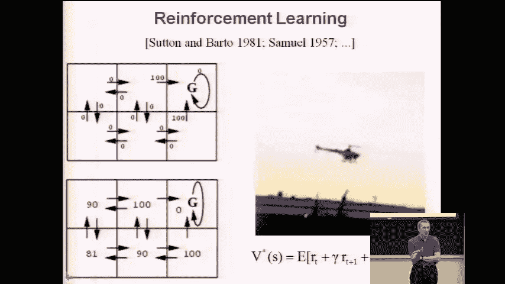
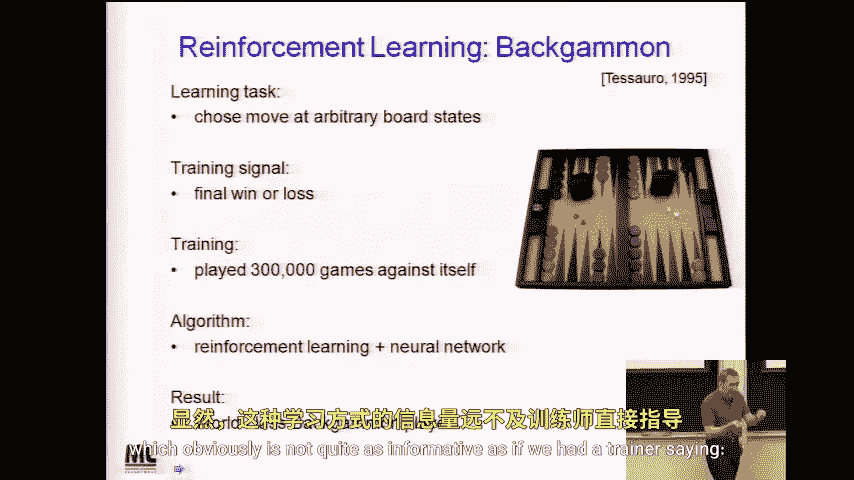
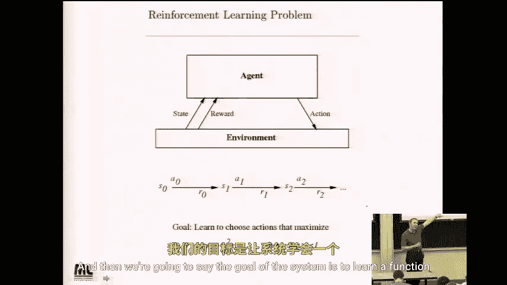

# 051：强化学习 I 🎮

在本节课中，我们将学习一种新的机器学习范式——强化学习。与之前讨论的函数逼近问题不同，强化学习关注的是智能体如何通过与环境的交互来学习最优的控制策略。我们将从形式化问题开始，介绍马尔可夫决策过程，并探讨如何从延迟的奖励信号中学习。

---

## 问题框架的转变

到目前为止，课程中我们主要关注的是函数逼近问题，即根据给定的输入输出示例，估计一个从 **X** 到 **Y** 的函数。

然而，今天我们将探讨一种被称为控制学习的问题。例如，想象一个机器人（如直升机）或一个在网格世界中漫游的模拟机器人。它的目标是从其可用的动作集合中，根据当前所处的状态，学习一个选择动作的控制策略。

为了使问题定义明确，我们必须明确其目标以及这些动作预期要达成的效果。这就是我们今天要讨论的场景，也是机器学习中一个活跃的研究领域。关于强化学习和马尔可夫决策过程有专门的教科书，在机器学习会议上也有相关的专题讨论。

---

## 强化学习的实际应用

强化学习在实践中确实有效。一个有趣的例子来自一位曾在本课程学习的本科生——吴恩达。他目前在斯坦福大学任教，在其博士论文工作中，他研究了强化学习，并开发了可能是目前最令人印象深刻的直升机控制算法。在YouTube上搜索相关关键词，可以看到该算法执行惊人特技飞行的视频。

另一个众所周知的例子是游戏玩法。例如，在下棋或西洋双陆棋等游戏中，你面临的问题是：给定游戏的当前状态，我应该采取什么行动来最大化获胜的机会？事实上，在许多游戏中，包括国际象棋和西洋双陆棋，已知的最佳方法都基于机器学习以及我们今天将要讨论的技术——时序差分学习。

一个著名的例子是IBM的杰拉尔德·特索罗开发的程序，他也是沃森项目的参与者。在此之前，他开发了第一个世界级的西洋双陆棋程序。他使用的方法正是我们今天要讨论的强化学习技术。他的训练信号是计算机最终是赢还是输，训练经验来自计算机与不同版本的自己对弈的数十万局游戏。最终，程序学会了根据当前棋盘状态（包括棋子位置和骰子状态）选择正确动作的良好控制策略。

---

## 延迟奖励的学习挑战

现在，如果你思考这个学习问题，会发现我们学习的训练经验类型确实有所不同。如果训练示例是“给定一个棋盘状态，这是正确的动作”，那么这是一个标准的函数逼近问题，我们有很多方法可以解决。

但如果我们无法提供这样的示例，训练经验只是智能体与自己下棋的过程，那么你永远不会得到“状态-正确动作”这样的训练对。你得到的训练数据形式是：**状态序列、动作序列、最终结果**。

因此，我们称之为**延迟奖励**。显然，这种信号不如训练师直接告诉你“在这个位置，你应该走这步棋”那么信息丰富。进行这类控制学习或强化学习的关键技术挑战在于：如何设计能够从这种延迟奖励中有效学习的机器学习算法？这实际上是我们面临的核心问题。

---

## 形式化问题：马尔可夫决策过程

为了形式化这个从延迟奖励中学习的问题，我们引入一个称为**马尔可夫决策过程**的框架。这与隐马尔可夫模型和一般的马尔可夫模型有有趣的对应关系。

在抽象层面，我们这样思考问题：
*   我们有一个需要学习控制策略的**智能体**。
*   它处于某个**环境**中。
*   它有一些传感器来感知它和环境所处的**状态**。
*   它会获得一些**奖励信号**。例如，在下棋的例子中，奖励信号在游戏过程中通常为零，只有在最终状态：赢了可能得+100分，输了得-100分。
*   它可以从一组**动作**中进行选择（例如，游戏中的合法走法）。

智能体会生成一个序列：观察到状态 **S0**，选择一个动作 **A0**，然后观察到该状态-动作对带来的奖励 **R0**，并发现自己进入了一个新状态 **S1**。然后它选择另一个动作 **A1**，获得奖励 **R1**，依此类推。

系统的目标是学习一个函数，我们称之为**策略**，它能够根据当前状态选择最佳动作，以最大化长期累积奖励。

---

## 总结

本节课我们一起学习了强化学习的基本概念。我们了解到，强化学习是一种不同于监督学习的范式，它关注智能体如何通过与环境交互并从延迟的奖励中学习最优行为策略。我们通过直升机控制和游戏AI的例子看到了其实际应用，并指出了从延迟奖励中学习的主要挑战。最后，我们引入了马尔可夫决策过程作为形式化此问题的框架，为后续深入探讨具体算法奠定了基础。