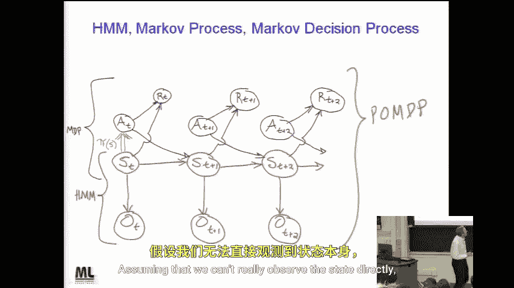
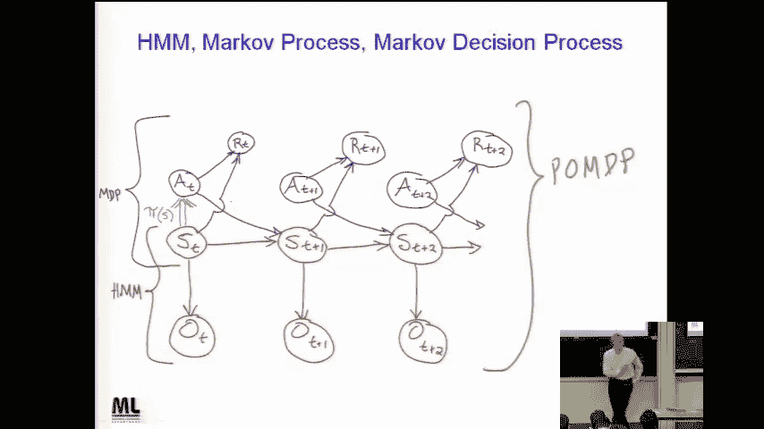
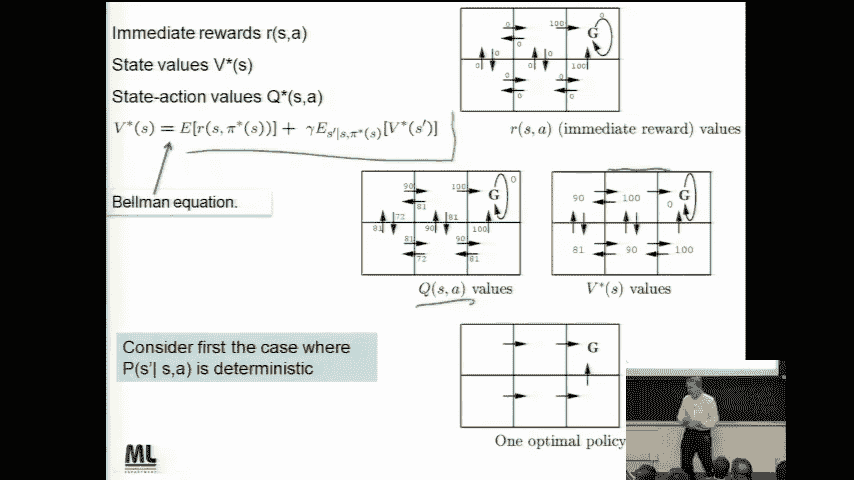
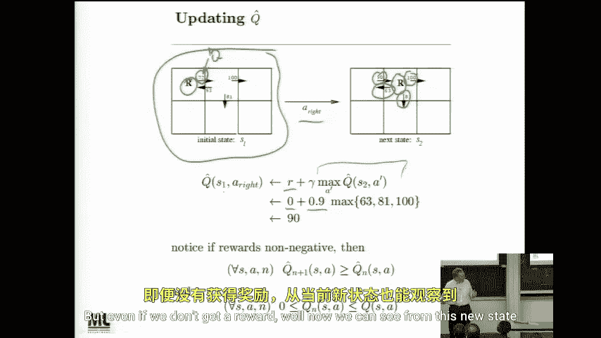

# 052：强化学习（二）🎮

在本节课中，我们将完成对马尔可夫决策过程的讨论，并学习如何通过采样和更新规则来学习价值函数。课程内容将涵盖V函数与Q函数的区别，以及Q学习算法的核心思想。

---

## 课程概述与安排 📅

欢迎来到最后一节课。课程结束后，海报展示环节将在周二进行，期末考试则安排在下周五。请查阅课程网站以确认具体时间和地点。

期末考试与期中考试形式相同：开卷、允许使用笔记、禁止使用电脑和手机。据我所知，考试不需要计算器，但需要你充分理解课程内容并运用大脑。

关于海报展示，请参考网站上的说明。如果你不知道如何打印大幅面海报，使用A4纸打印并装订也是完全可以接受的，不会因此扣分。

此外，提交期末项目报告时，请同时提交纸质版和发送电子邮件副本，这将使评分工作更加便捷。如果有同学届时不在本地，只需在邮件标题中注明“本人外出，请打印此文件”即可。

---

## 回顾马尔可夫决策过程 🔄

上一节我们介绍了马尔可夫决策过程。让我们通过一张图来回顾其核心结构。

图中的红色部分是我们熟悉的隐马尔可夫模型。蓝色部分则构成了一个**部分可观测马尔可夫决策过程**。其假设是我们无法直接观测状态，只能像在隐马尔可夫模型中一样观测输出。

如果我们**能够直接观测状态**，那么图中对应的部分就简化为一个**马尔可夫决策过程**。

我们的核心问题是学习一个**策略函数 π**（图中绿色部分）。这个函数观察当前状态，并选择一个动作。我们期望选择的动作能够**最大化未来奖励的期望总和**，并且未来的奖励会按指数进行折扣。

其目标公式可以表示为：
**最大化 E[ Σ γ^t * R_t ]**，其中 γ 是折扣因子，R_t 是时刻 t 获得的奖励。

---

## 价值函数 V* 与 Q 函数 💡

上一节我们提到，可以将未来折扣奖励的期望总和定义为某个**评估函数 V*** 的值。**V*(s)** 表示从状态 s 开始，执行最优动作序列所能获得的期望折扣奖励总和。它直观地衡量了处于某个状态的“好坏”程度。

如果我们已知状态转移函数（即能预测执行某个动作后会进入什么状态），那么结合 V* 函数，我们就可以通过“向前看一步”来选择动作：比较执行不同动作后可能进入的状态的 V* 值。

然而，在现实中（例如机器人场景），我们往往**无法完美预测**执行动作后的下一个状态。因此，仅靠 V* 函数和一步前瞻是不够的。

为了解决这个问题，我们引入了 **Q 函数**。Q(s, a) 评估的是在状态 s 下执行动作 a 的“价值”。它的优势在于，我们**不需要进行一步前瞻模拟**。在选择动作时，只需查看当前状态 s，然后比较不同动作 a 对应的 Q(s, a) 值，选择值最高的动作即可。

其更新逻辑的核心区别在于：
*   使用 **V***：需要模型来预测 `下一步状态 s'`，然后比较 `V*(s')`。
*   使用 **Q**：直接比较 `Q(s, a)`，无需模型预测。

---

## 学习算法：动态规划与采样 🔁

我们讨论了学习 V 函数和 Q 函数的算法，它们的思想非常相似。

首先，在理想情况下，如果我们完全了解环境模型（状态转移和奖励），可以直接使用**动态规划**方法，从有即时奖励的状态开始，反向迭代计算出每个状态的 V* 值。

但在更普遍的情况下，我们无法获得完整模型。此时，我们可以通过**采样**来学习。智能体通过与环境交互，随机经历不同的“状态-动作”对，并应用一个简单的更新规则。只要采样足够多次，最终也能达到与动态规划相似的效果。

其核心思想是：每当我们有一个对 V 或 Q 的估计值时，每采取一个步骤，我们都可以利用新获得的信息（例如进入新状态、获得奖励）来改进对**刚刚离开的那个状态（或状态-动作对）** 的估计。

---

## Q学习算法更新规则 ⚙️

让我们聚焦于 Q 学习算法的具体更新规则。假设一个智能体处于状态 s，决定执行动作 a，这使它进入新状态 s'，并立即获得奖励 r。

这样，智能体就采样了一个“状态-动作”对 (s, a)。Q 学习算法据此更新其对 Q 值的估计。

设 `Q_hat(s, a)` 是我们对真实 Q(s, a) 的当前估计。在采样之后，我们可以用一个更好的估计来更新它。

更好的估计如何获得？它基于我们实际观察到的结果：
1.  立即获得的奖励 `r`。
2.  进入新状态 `s‘` 后，从该状态出发所有可能动作中能带来的最大期望未来价值。这实际上就是状态 `s’` 的 **V* 函数值**。而在 Q 学习框架下，我们通过 `max_{a'} Q_hat(s', a')` 来近似这个值。

因此，Q 学习的更新规则公式为：
**Q_hat(s, a) ← r + γ * max_{a'} Q_hat(s', a')**

其中 γ 是折扣因子。这个规则不断用新的经验来修正旧的估计。

---

## 价值迭代与Q学习的统一视角 👁️

通过比较可以发现，学习 V 函数的**价值迭代**和学习 Q 函数的 **Q 学习**，本质上运用了相同的思想。

无论是 V 还是 Q，算法都遵循一个模式：基于当前估计，通过实际交互采样获得新数据（新状态和奖励），然后利用这些新信息回溯更新对先前状态或决策的价值评估。通过无数次这样的“体验-更新”循环，智能体最终能学习到趋近于最优的策略。

---

## 总结 📝

本节课中，我们一起学习了强化学习的关键进阶内容：
1.  **区分了 V* 函数与 Q 函数**：V* 评估状态价值，需要模型进行一步前瞻来选择动作；Q 函数直接评估“状态-动作”对的价值，无需模型，更适合无模型学习。
2.  **理解了学习途径**：从已知模型的动态规划，过渡到更通用的、基于环境交互采样的学习方法。
3.  **掌握了 Q 学习核心**：Q 学习通过采样“状态-动作-奖励-新状态”序列，并应用 **`Q(s,a) ← r + γ * max Q(s', a')`** 的更新规则，逐步逼近最优 Q 函数，从而得到最优策略。

这两种方法都体现了强化学习“通过试错进行学习”的核心原则，即利用实际经验来迭代改进对世界的认知和决策能力。