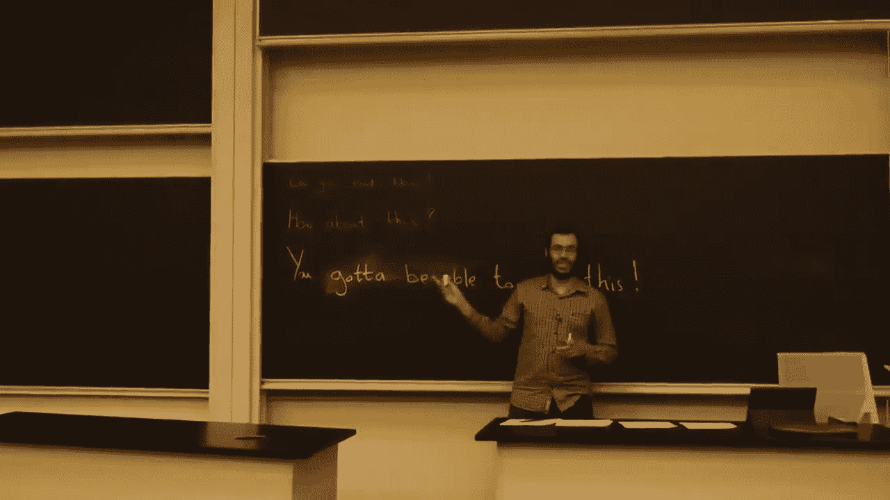
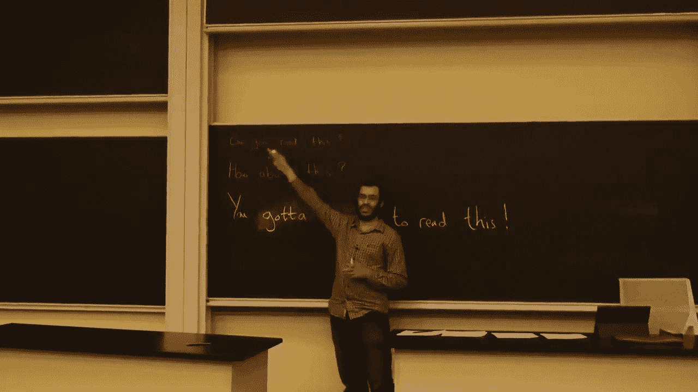
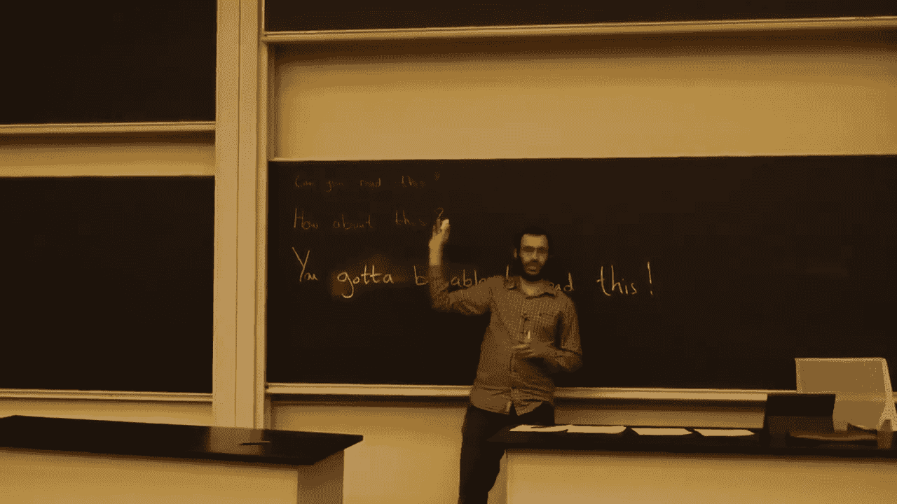
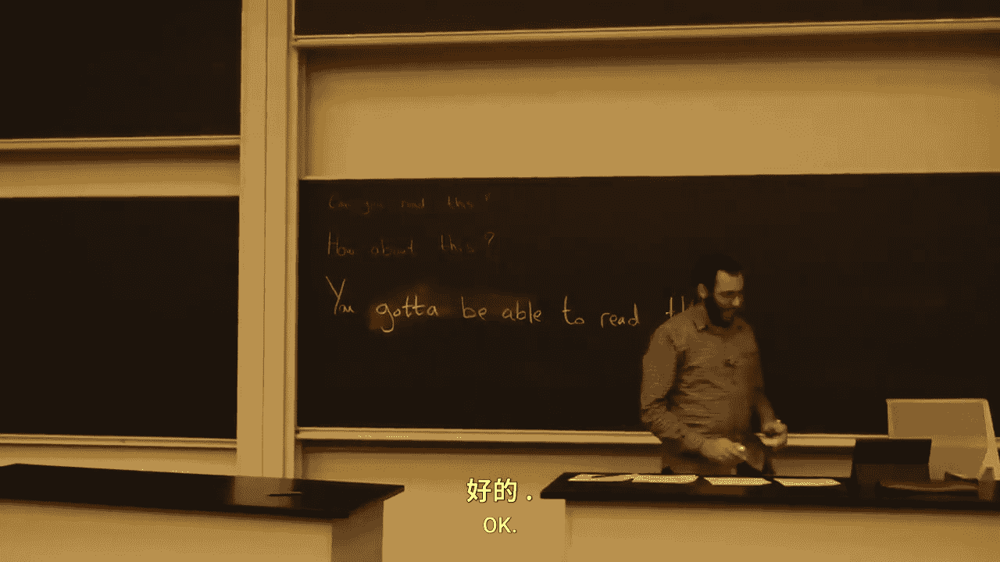
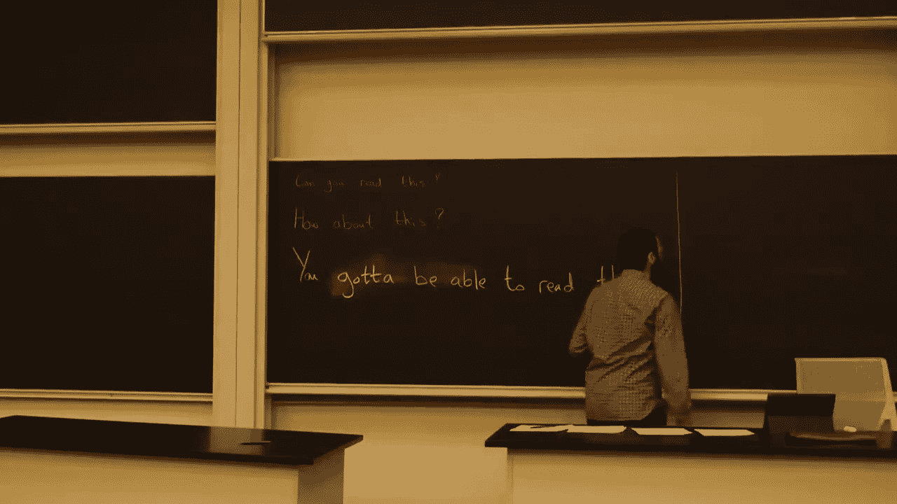
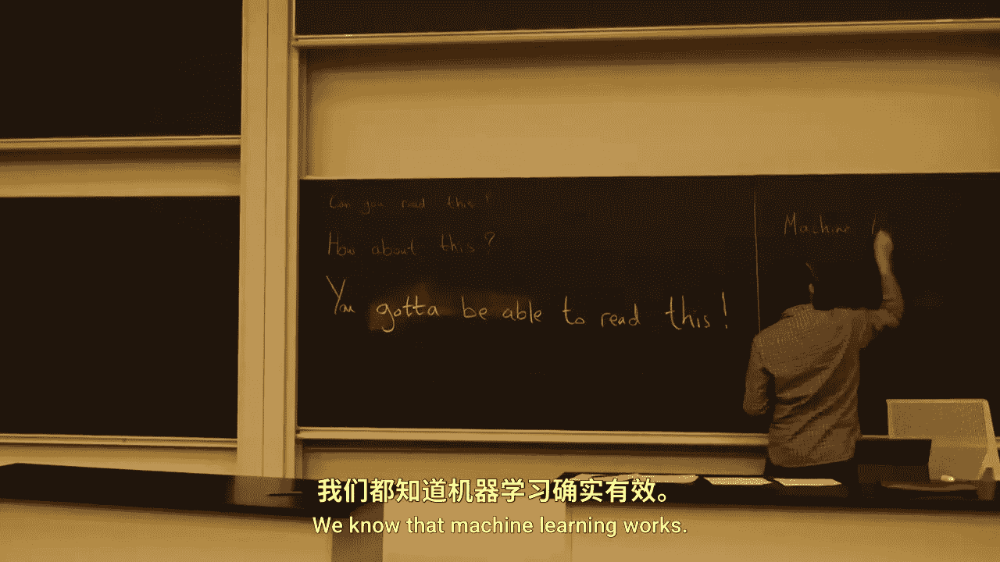

# 056：学习理论 🧠

在本节课中，我们将要学习机器学习理论的基础知识。学习理论研究机器学习算法何时、为何以及如何能够保证有效工作。这是一个非常深入的领域，本课程仅作简要介绍，让大家对其有一个初步的了解。

## 概述

我们首先回顾一下机器学习的整体框架。我们有一个数据总体，例如所有已发送和将要发送的电子邮件。这些数据可以根据某个标准或概念（我们称之为**目标概念**）被划分为“非垃圾邮件”和“垃圾邮件”两类。然而，我们无法观测到所有数据，我们只能访问一组有限的样本（即训练数据）。我们的目标是学习一个方法，能够对未见过的数据进行分类。

为了实现这个目标，我们从一个**假设类**开始。这个假设类包含了我们认为所有可能对数据进行划分的合理方式。例如，我们可以考虑所有通过椭圆来划分数据的方式：椭圆内的点被分类为负类，椭圆外的点被分类为正类。这就是一个假设类。

## 假设与误差

假设类中的每一个具体假设，都会对数据产生一种特定的划分。有些假设可能在已有的训练样本上表现良好（即分类正确），但在我们没有样本的区域可能与真实情况不符。

我们通过**经验误差**来评估一个假设。如果我们有 `m` 个训练样本，经验误差 `L_S(h)` 就是被假设 `h` 错误分类的样本比例。然而，我们训练分类器的最终目的是为了在实际应用中对未见过的数据进行预测。因此，我们真正关心的是假设在**整个数据总体**上的表现，即**泛化误差** `L_D(h)`。

学习理论的核心问题是：给定假设在训练集上的经验误差 `L_S(h)`，我们能否对它在总体上的泛化误差 `L_D(h)` 做出某种保证？例如，如果 `L_S(h) = 30%`，我们能否断定 `L_D(h)` 也是 30%？

答案是：不能直接断定。但我们通常可以说，泛化误差 `L_D(h)` 会落在以经验误差为中心的某个区间内。例如，它可能位于 `30% ± ε` 的范围内，其中 `ε` 是一个与样本数量、假设类复杂度等因素相关的量。

## 总结

本节课我们一起学习了机器学习理论的基本概念。我们了解到，学习理论旨在分析机器学习算法成功（即泛化良好）的条件和原因。我们定义了**目标概念**、**假设类**、**经验误差**和**泛化误差**等核心概念。最重要的是，我们认识到不能仅凭在训练集上的低误差来保证模型在未知数据上的表现，但理论可以为我们提供关于泛化误差范围的概率性保证。