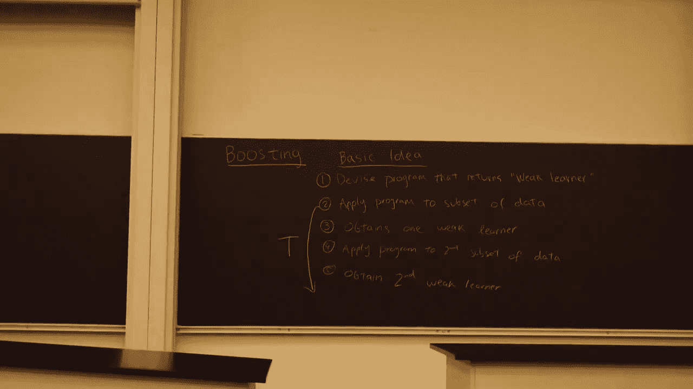
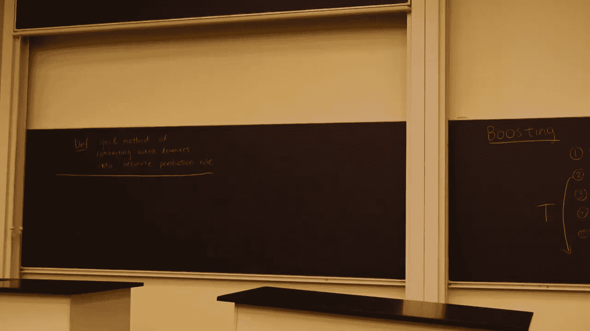

# 060：Boosting 算法详解 🚀

在本节课中，我们将学习 Boosting 算法的核心概念、工作原理及其应用。Boosting 是一种将多个弱学习器组合成一个强预测模型的技术。

## 概述

Boosting 是一种通用的方法，用于将弱学习器转化为高精度的预测规则。其基本思想是通过迭代训练一系列弱学习器，并重点关注之前被错误分类的样本，最终将这些弱学习器的预测结果进行加权组合，形成一个强大的最终模型。

## Boosting 的基本思想

我们可以将 Boosting 的基本思想概括为五个步骤。

以下是 Boosting 算法的五个核心步骤：

1.  **设计一个程序**：该程序能够学习或创建一个用于二元分类的基本规则（即弱学习器）。
2.  **获取第一个弱学习器**：将上述程序应用于数据集的某个子集或加权数据集，得到第一个弱学习器。
3.  **获取第二个弱学习器**：选取另一个数据子集，再次应用程序，得到第二个弱学习器。
4.  **重复迭代**：持续循环上述步骤，每次选择（或加权）一个数据子集，并应用程序生成一个新的弱学习器。
5.  **组合弱学习器**：将迭代过程中获得的所有弱学习器组合起来，形成最终的预测规则。

这个过程会重复进行 **T** 次，其中 **T** 是算法的一个重要参数。

## 定义 Boosting 算法

在定义一个具体的 Boosting 算法时，需要明确两个关键点。

以下是定义 Boosting 算法时必须指定的两个核心机制：

1.  **数据选择/加权机制**：在每一轮迭代中，如何选择数据子集或如何对数据进行加权。通常的策略是**聚焦于最困难的样本**，即那些被之前弱学习器最频繁错误分类的样本，它们会在后续迭代中被赋予更高的权重或被选中的概率。
2.  **弱学习器组合机制**：在算法结束时，如何将所有弱学习器（即规则）组合成一个最终的预测规则。标准做法是采用**加权多数投票**：对于每个测试点，综合所有弱学习器的预测结果（考虑各自的权重），以决定将其分类为正例还是负例。

更正式地，我们可以将 Boosting 定义为：

> Boosting 是一种将弱学习器转化为高精度预测规则的通用方法。

## 弱学习器的定义

我们频繁提到了“弱学习器”这个术语，它需要一个更技术性的定义。直观上，弱学习算法是一种能够持续找到比随机猜测略好的分类器的程序。例如，其准确率可能只比 50% 稍高，比如 55%。

只要有足够的数据，Boosting 可以证明能够构建出一个准确率非常高（例如 99%）的单一分类器，即使你只有一系列准确率仅为 55% 的弱学习器。

## Boosting 的历史与分析背景

Boosting 的根源在于 **PAC（Probably Approximately Correct，概率近似正确）** 学习理论。这是一个由 Leslie Valiant 在 1984 年左右提出的学习框架，用于分析机器学习算法。

PAC 学习的目标设定如下：假设一个学习器从某个分布 **D** 中接收样本，然后它必须从某个假设函数集合中选择一个泛化函数（即假设 **H**）。这可以看作是对监督式机器学习算法的一种抽象视图：算法接收数据并返回一个用于分类的假设。

PAC 学习的目标是，以高概率选择一个具有低泛化误差的假设。

## 总结

本节课我们一起学习了 Boosting 算法的核心思想。我们了解到 Boosting 通过迭代训练一系列只比随机猜测略好的“弱学习器”，并在每一轮中调整数据权重以聚焦于难分类的样本，最后通过加权投票的方式将这些弱学习器集成为一个强大的“强学习器”。我们还简要介绍了其理论基础 PAC 学习框架。理解这些概念是掌握 AdaBoost 等具体 Boosting 算法的重要基础。