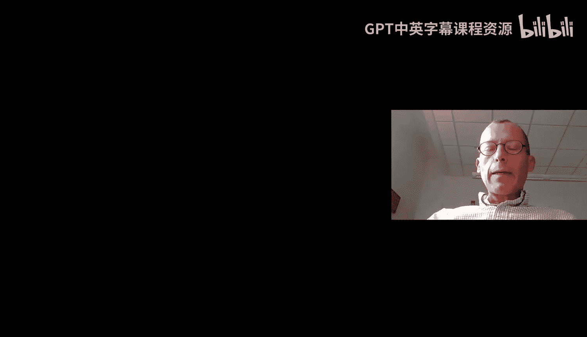
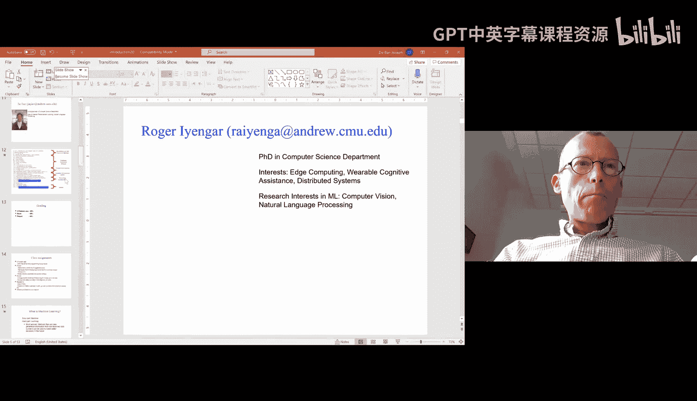
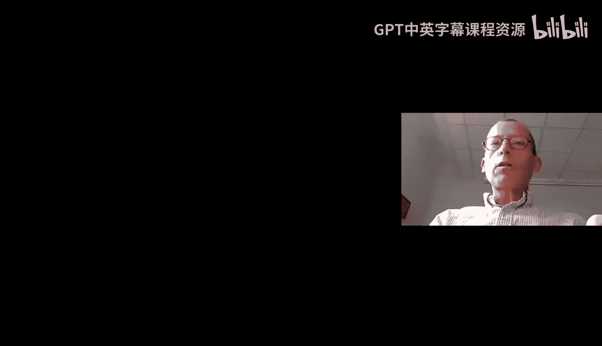
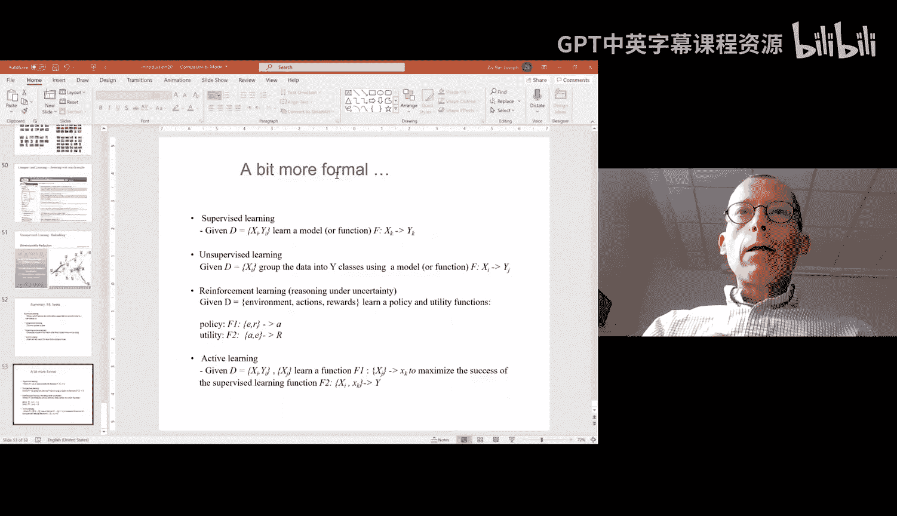

# 01：课程介绍与机器学习概述 🎓

在本节课中，我们将学习卡内基梅隆大学（CMU）研究生课程《机器学习导论（10-701）》的第一讲内容。课程将介绍机器学习的基本概念、课程安排，并通过实例展示机器学习的广泛应用。

---

## 课程概述与安排 📅

欢迎来到10-701课程。这是研究生级别的机器学习导论课程，旨在为没有机器学习背景的同学提供全面的入门知识，也为已有基础的同学介绍新的概念和方向。

### 教学团队与课程组织

课程由两位教授共同授课，并配备了一支庞大的助教团队以支持教学。课程的组织方式如下：

*   **授课时间**：每周一和周三上午11:40。
*   **复习课**：每周五上午11:40至下午1点，所有学生均需参加。
*   **办公时间**：分为线上和线下两种形式。线下办公时间需按指定时段预约参加，线上办公时间将通过邮件预约进行。
*   **课程材料**：所有讲义幻灯片将在课前发布，学生无需在课上抄写笔记。

### 课程内容与考核

课程内容涵盖机器学习的多个核心领域，考核方式包括作业、项目和考试。

以下是课程的核心模块：
1.  **监督学习**：课程的前三分之一将重点介绍。
2.  **无监督学习**：学习如何从无标签数据中发现模式。
3.  **概率图模型**：用于建模不确定性和复杂关系。
4.  **强化学习**：学习智能体如何通过与环境交互来做出决策。

课程考核由三部分组成：
*   **作业**：共5次，占总成绩的40%，包含理论和编程题目。
*   **项目**：占总成绩的30%，需以3人小组形式完成，包括海报展示和书面报告。
*   **考试**：一次期中考试，占总成绩的30%，将在11月下旬的课程时间内在线进行。

---

## 什么是机器学习？🤖

上一节我们介绍了课程安排，本节中我们来看看机器学习的核心定义。机器学习的目标是让计算机能够从数据中自动学习并做出决策或预测，而无需进行明确的编程。

机器学习包含两个关键部分：“机器”代表自动化计算，“学习”则代表从数据中归纳出能够推广到新情况的知识或模式的能力。其核心流程可以概括为：**数据 -> 学习算法 -> 模型 -> 新知识**。

### 机器学习与其他领域的区别

机器学习与统计学、人工智能等领域有重叠，但也有其独特之处。

以下是机器学习与其他相关领域的主要区别：
*   **统计学**：更侧重于描述数据和验证假设，而机器学习更侧重于预测和从数据中获取可操作的见解。
*   **人工智能**：目标是创造能模仿人类智能的系统。机器学习是实现AI的一种强大工具，但并非所有机器学习方法都旨在模仿生物智能（例如支持向量机）。
*   **数据挖掘**：侧重于从大型数据集中发现模式，而机器学习更侧重于利用这些模式构建可预测的模型。
*   **数据科学**：是一个更广泛的领域，可能包含数据工程、统计分析和机器学习等多个方面。

---

## 机器学习的应用实例 🌍

理解了机器学习的定义后，我们通过一些实例来看看它是如何改变世界的。机器学习的应用已经渗透到我们生活的方方面面。

以下是机器学习在不同领域的具体应用：
*   **神经科学**：通过脑部扫描预测人的思维活动，甚至用于评估广告效果。
*   **金融**：使用回归模型预测股票市场走势。
*   **互联网服务**：谷歌新闻使用聚类算法自动对新闻故事进行分类；垃圾邮件过滤器使用分类算法识别垃圾邮件。
*   **自然语言处理**：谷歌翻译等工具利用神经网络实现高质量的自动翻译。
*   **自动驾驶**：结合计算机视觉、传感器融合和强化学习，使车辆能够自主导航。
*   **生物学**：分析DNA序列，识别基因和调控区域。
*   **机器人学**：通过强化学习，直升机可以在模拟器中学会高难度飞行动作，然后应用于实体。
*   **推荐系统**：社交媒体和视频平台的广告与内容推荐都依赖于机器学习模型。

---

## 机器学习的核心要素 🔑

看过了丰富的应用，我们来剖析一下构成机器学习系统的三个核心要素：数据、算法和任务。本课程将主要聚焦于**算法**部分。

### 数据

数据是机器学习的基础。数据的质量、类型和规模直接影响模型的效果。

以下是关于数据的几个关键点：
*   **数据预处理**（如清洗、转换）通常比选择算法更重要，但这部分知识高度依赖于具体领域。
*   数据可以是**完全观测**的，也可以是**部分观测**（存在缺失值）的。
*   数据可以是**离散的**、**连续的**或**类别型的**。

### 算法

算法是从数据中学习模型的数学工具。我们可以从多个维度对算法进行分类。

以下是算法的主要分类方式：
*   **参数化 vs. 非参数化**：
    *   **参数化模型**（如线性回归）：模型复杂度固定，不随数据量增长。公式可表示为 `y = w*x + b`，其中 `w` 和 `b` 是参数。
    *   **非参数化模型**（如K近邻）：模型复杂度随数据量增长，它直接使用所有训练数据进行预测。
*   **判别式 vs. 生成式**：
    *   **判别式模型**：直接学习输入 `X` 到输出 `Y` 的映射关系（如找到一条分类边界），不关心数据是如何生成的。
    *   **生成式模型**：尝试对数据的联合概率分布 `P(X, Y)` 进行建模，不仅可以进行分类，还能生成新的数据样本。

### 任务

任务定义了机器学习模型的目标。同一算法有时可以应用于不同的任务。

以下是机器学习的四大主要任务：
1.  **监督学习**：给定带有标签的训练数据 `(X, Y)`，学习一个从输入 `X` 预测输出 `Y` 的函数 `f`。主要包括：
    *   **分类**：预测离散标签（如猫/狗）。
    *   **回归**：预测连续值（如股价）。
2.  **无监督学习**：只有输入数据 `X`，没有标签 `Y`。目标是从数据中发现内在结构。主要包括：
    *   **密度估计**：估计数据的概率分布 `P(X)`。
    *   **聚类**：将相似的数据点分组。
    *   **降维**：将高维数据投影到低维空间以便可视化或处理。
3.  **强化学习**：智能体通过与环境交互来学习。其目标是学习一个**策略** `π`，该策略能根据当前**状态** `s` 和获得的**奖励** `r` 来选择最佳**动作** `a`，以最大化长期累积奖励。
4.  **主动学习**：算法可以主动选择最有价值的数据点，请求专家为其标注，以用更少的标注数据达到更好的学习效果。

---

## 总结 📝

本节课中我们一起学习了CMU 10-701课程的初步安排，并深入探讨了机器学习的核心概念。我们明确了机器学习的定义，即从数据中自动归纳知识的能力；了解了其广泛的应用场景；并系统性地认识了机器学习的三大支柱：数据、算法和任务。我们从参数/非参数、判别/生成等角度对算法进行了分类，并区分了监督学习、无监督学习、强化学习和主动学习等主要任务类型。从下一节课开始，我们将正式进入监督学习的具体算法学习。