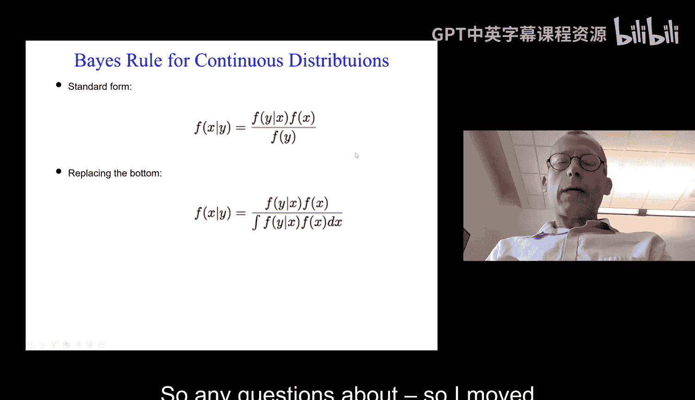
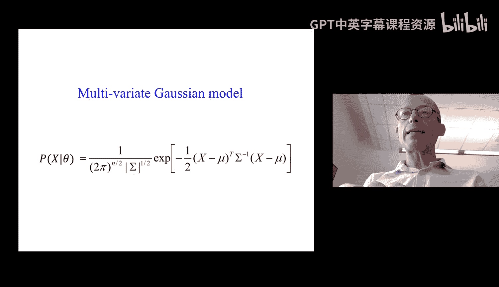
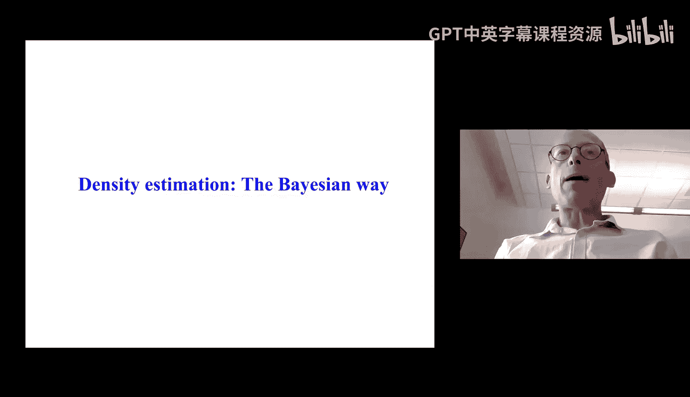
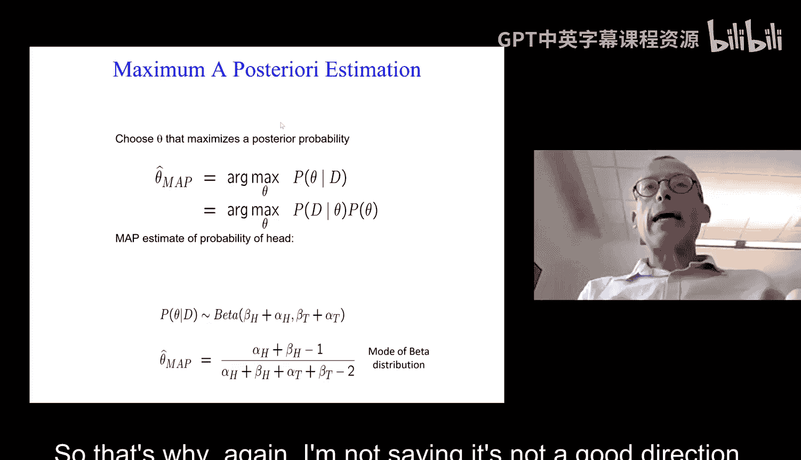
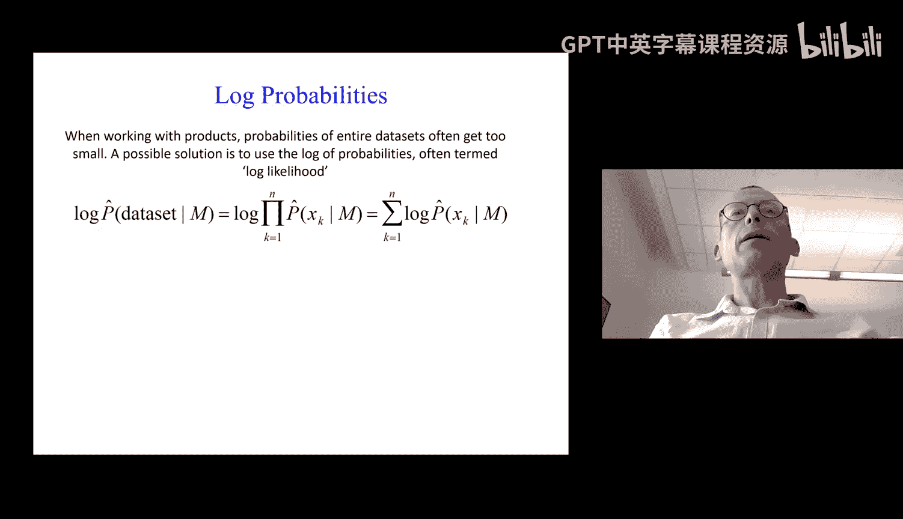

# 02：概率、MLE与MAP 🎲

在本节课中，我们将学习概率论的基础概念，并探讨两种核心的参数估计方法：最大似然估计和最大后验估计。这些是构建许多机器学习算法的基石。

## 概率论基础回顾

上一节我们介绍了课程概览，本节中我们来看看概率论的基本术语和规则，为后续学习参数估计做准备。

随机变量是指结果未知的事件。其取值来自定义域，定义域可以是二元、离散或连续的。

概率遵循三个基本公理：
*   概率值非负，且在0到1之间。
*   必然事件的概率为1，不可能事件的概率为0。
*   对于两个事件A和B，其并集的概率为：**P(A ∪ B) = P(A) + P(B) - P(A ∩ B)**

先验概率是在没有任何额外信息的情况下，对事件结果的信念。例如，明天下雨的先验概率可能是20%。

条件概率是在已知其他事件发生的情况下，对某事件发生的信念。例如，已知今天下雨，明天下雨的概率。

联合概率是指两个事件同时发生的概率，记作 **P(A, B)**。

如果两个随机变量A和B相互独立，则联合概率等于边缘概率的乘积：**P(A, B) = P(A) * P(B)**。然而，现实中变量通常不独立。

链式法则将联合概率与条件概率联系起来，适用于所有随机变量：**P(A, B) = P(A|B) * P(B)**。

基于链式法则，我们可以推导出贝叶斯规则，它允许我们通过一种条件概率计算另一种条件概率：
**P(A|B) = [P(B|A) * P(A)] / P(B)**

有时直接计算P(B)很困难，我们可以使用求和规则，通过对另一个变量的所有可能值求和来计算：
**P(B) = Σ_a P(B|A=a) * P(A=a)**

以上所有概念同样适用于连续分布。

## 贝叶斯规则应用示例 🧪

理解了基本概念后，我们通过一个医学检测的例子来看看贝叶斯规则的实际应用。

假设一种疾病的感染率是0.1%。现有一种检测方法，对感染者检测结果100%为阳性（无假阴性），但对健康者有1%的误报率（假阳性）。

问题是：如果一个人的检测结果为阳性，他真正感染的概率是多少？

我们使用贝叶斯规则计算：
*   设A=1为感染，T=1为检测阳性。
*   已知：P(A=1)=0.001， P(T=1|A=1)=1， P(T=1|A=0)=0.01。
*   根据贝叶斯公式：**P(A=1|T=1) = [P(T=1|A=1) * P(A=1)] / P(T=1)**
*   其中，**P(T=1) = P(T=1|A=1)P(A=1) + P(T=1|A=0)P(A=0) = 1*0.001 + 0.01*0.999 = 0.01099**
*   因此，**P(A=1|T=1) = (1 * 0.001) / 0.01099 ≈ 0.09**

计算表明，即使检测结果为阳性，真正感染的概率也只有约9%。这是因为疾病的基础感染率很低，假阳性的数量会超过真阳性。这个例子说明了理解基础概率和条件概率的重要性。

## 密度估计与参数学习 📊

现在我们从纯概率论转向机器学习中的核心问题：如何从数据中学习概率分布的参数？这个过程称为密度估计。

我们通常假设已知分布的类型（如伯努利分布、高斯分布），目标是估计其参数（如硬币正面朝上的概率、高斯分布的均值）。

为此，我们首先需要收集数据样本。接着，主要有两种参数估计思路：
1.  **最大后验估计**：一种贝叶斯方法，结合先验知识和观测数据。
2.  **最大似然估计**：更常用的方法，仅基于观测数据。

我们先讨论MAP估计。

## 最大后验估计 🧠

MAP估计采用贝叶斯方法，将参数θ本身视为随机变量。其核心思想是结合我们对参数的先验信念和观测到的数据，来更新对参数的认识。

根据贝叶斯规则，参数的后验分布与似然和先验的乘积成正比：
**P(θ|Data) ∝ P(Data|θ) * P(θ)**

为了使计算和更新简便，我们常使用共轭先验。共轭先验的特性是，后验分布与先验分布属于同一家族。

以估计硬币正面概率θ为例：
*   **似然**（数据给定参数）：如果抛掷n次，观察到n1次正面，n2次反面，且每次独立，则似然为 **P(Data|θ) = θ^{n1} * (1-θ)^{n2}**。
*   **先验**：我们选择Beta分布作为θ的先验：**P(θ) ∝ θ^{β_h-1} * (1-θ)^{β_t-1}**。参数β_h和β_t反映了我们先验的信念（例如，认为硬币公平且置信度高，则设较大的相等值）。
*   **后验**：由于Beta分布是伯努利分布的共轭先验，后验也是Beta分布：**P(θ|Data) ∝ θ^{(β_h + n1) -1} * (1-θ)^{(β_t + n2)-1}**。先验参数被观测数据“更新”了。

得到后验分布后，我们通常取该分布的众数（最高点）作为参数θ的点估计，这就是最大后验估计。

MAP估计的优点是能利用先验知识，在数据量少时尤其有用。但其主要缺点是需要人工选择先验分布及其参数，这通常很困难且可能引入主观偏差。

## 最大似然估计 ⚖️

由于指定先验存在挑战，机器学习中更常使用的是最大似然估计方法。MLE完全依赖于观测数据，其原理直观而强大。

MLE的目标是：找到能使观测数据出现概率最大的参数值。

我们首先定义**似然函数**，即数据在给定参数下的概率。对于独立同分布的观测数据 **D = {x1, x2, ..., xn}**，似然函数是每个数据点概率的乘积：
**L(θ; D) = P(D|θ) = Π_i P(x_i|θ)**

**最大似然估计原理**即寻找参数θ，使得这个似然函数最大化：
**θ_MLE = argmax_θ P(D|θ)**

回到硬币例子，似然函数为 **L(q; D) = q^{n1} * (1-q)^{n2}**。为了找到最大化此函数的q，我们对其取对数（常称为对数似然，因为乘积取对数后变为求和，更易处理），然后求导并令导数为零。

通过求解 **d/dq [log(L(q; D))] = 0**，我们可以得到：
**q_MLE = n1 / (n1 + n2)**

这正是“计数并计算比例”的数学证明。对于多项分布（如骰子），MLE解同样是每个结果的观测次数除以总次数。

MLE思想可以扩展到连续分布（如高斯分布）以及其他更复杂的模型，是许多监督学习和无监督学习算法的基础。

---

本节课中我们一起学习了概率论的核心概念，包括先验、条件概率、联合概率以及重要的贝叶斯规则。我们深入探讨了两种基本的参数估计方法：最大后验估计和最大似然估计。MAP估计融合了先验知识与观测数据，而MLE则纯粹致力于寻找最能解释观测数据的参数。理解这些原理是进入后续具体机器学习算法世界的关键第一步。