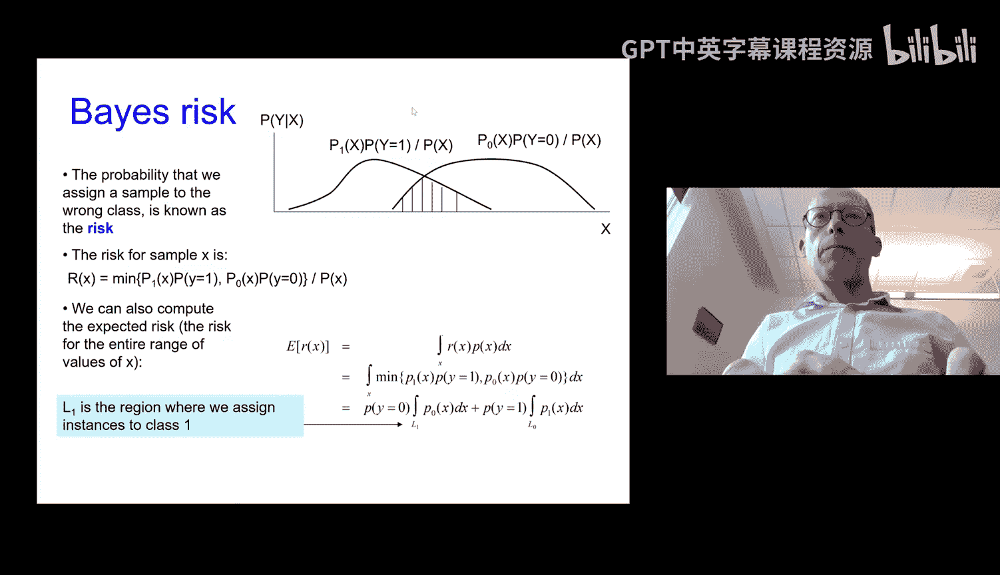
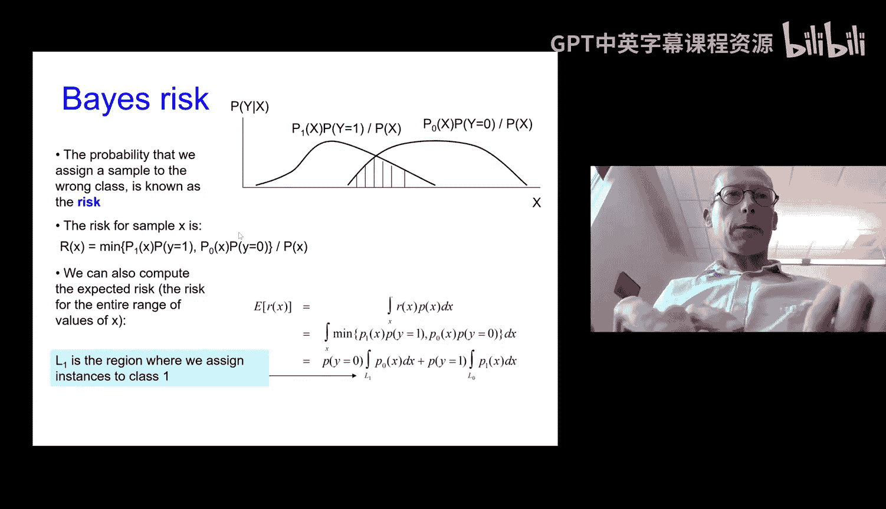
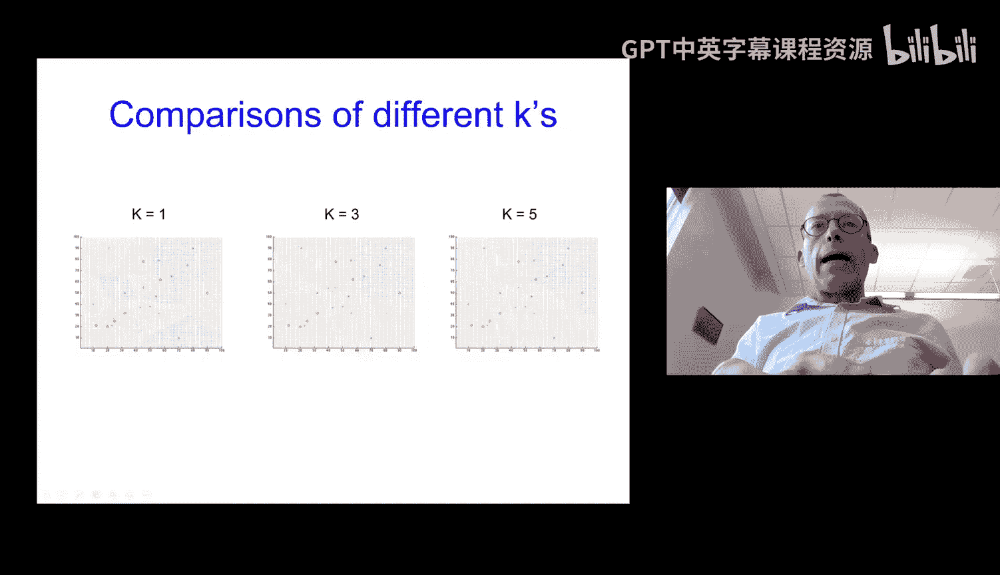
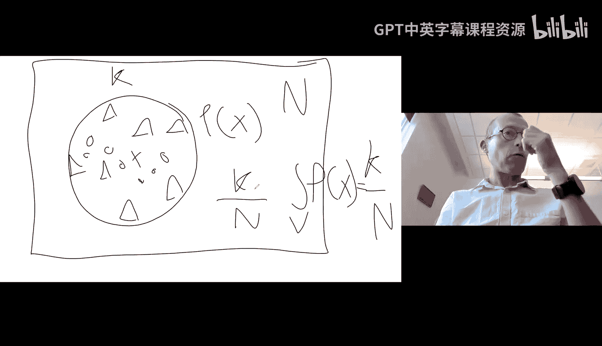
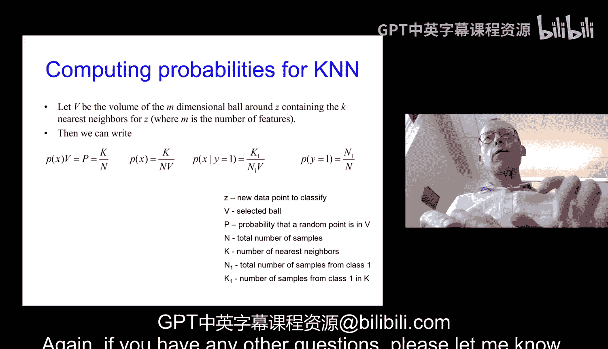

# 03：最大似然估计与监督学习入门

在本节课中，我们将要学习最大似然估计的收尾内容，并正式进入监督学习领域，特别是分类问题。我们将介绍贝叶斯决策规则的理论基础，并学习第一个具体的分类算法——K近邻算法。

## 最大似然估计回顾

上一节我们介绍了密度估计，并讨论了最大后验估计和最大似然估计。本节中，我们来看看最大似然估计的更多细节。

最大似然估计的核心思想是，将数据在给定模型下的似然表示为模型参数的函数，然后寻找能使该似然值最大化的参数值。其公式表示为：

**θ_MLE = argmax_θ P(D | θ)**

对于抛硬币的例子，我们推导出正面朝上概率的最大似然估计为：

**θ_heads = N_heads / (N_heads + N_tails)**

### 对数似然

在许多情况下，直接最大化似然函数可能比较困难，转而最大化对数似然更为方便。由于对数函数在0到1区间内是单调递增的，因此最大化似然与最大化对数似然会得到相同的参数估计结果。对数似然的优势在于能将连乘转换为求和，简化计算。

**log P(D | θ)**

## 从理论到实践：监督学习

在掌握了参数估计的基本方法后，我们现在将目光转向机器学习的主要部分——监督学习。监督学习意味着我们拥有带有标签的数据集，目标是学习一个从输入到输出的映射函数。

监督学习主要分为两类：
1.  **分类**：输出是离散的类别标签（例如：猫/狗）。
2.  **回归**：输出是连续的实数值（例如：房价）。

本节课我们重点讨论分类问题。

### 贝叶斯决策规则

理论上，如果我们能准确知道数据的概率分布，那么最优的分类器是贝叶斯分类器。它根据后验概率做出决策：

**y* = argmax_y P(y | x) = argmax_y P(x | y) P(y)**

其中，`P(y | x)` 是给定特征 `x` 时类别 `y` 的后验概率。我们选择后验概率最大的类别作为预测结果。

使用概率模型进行分类的优势在于，我们不仅能得到预测类别，还能获得关于预测置信度的信息。然而，其核心挑战在于，在实际问题中准确估计 `P(x | y)` 和 `P(y)` 通常非常困难。

### 分类器的主要类型

以下是三种主要的分类器设计思路：

1.  **基于实例的分类器**：不显式学习模型，直接使用存储的训练样本进行预测（例如K近邻）。
2.  **生成式分类器**：尝试对每个类别的数据分布 `P(x | y)` 进行建模，然后应用贝叶斯规则。这需要较强的分布假设。
3.  **判别式分类器**：直接学习一个决策边界或函数 `f(x)` 来区分不同类别，而不对数据的生成过程建模。这是目前最主流、最成功的方法。

## 第一个分类算法：K近邻

本节我们将学习第一个具体的分类算法——K近邻算法。它是一种典型的基于实例的分类器。

K近邻算法的思想非常简单直观：对于一个待分类的新样本，查看其在特征空间中距离最近的K个训练样本，并以这K个样本中多数所属的类别作为预测结果。

**算法步骤**：
1.  选择参数K（例如1, 3, 5）。
2.  给定一个新样本点。
3.  计算该点到训练集中所有点的距离（通常使用欧氏距离）。
4.  找出距离最近的K个点。
5.  统计这K个点中各个类别的数量。
6.  将数量最多的类别作为预测结果。

### K值的影响与选择

参数K对分类结果有显著影响：
*   **K值较小**（如K=1）：模型对局部噪声更敏感，决策边界更复杂、更不平滑。
*   **K值较大**：模型更稳定，决策边界更平滑，但可能忽略一些有用的局部模式。

如何选择合适的K值呢？以下是常用方法：

**交叉验证**：这是一种评估模型超参数（如K值）的通用技术。
1.  将训练数据分成若干份（例如10份）。
2.  依次将其中一份作为验证集，其余作为训练集。
3.  对于每个候选K值，用训练集训练模型（对于KNN，即存储数据），并在验证集上测试性能。
4.  重复以上步骤，对每个K值计算平均性能。
5.  选择平均性能最好的K值。

### K近邻与贝叶斯决策的联系

K近邻算法可以被视为贝叶斯决策规则的一种近似实现。其核心思想是：在待预测点 `x` 周围定义一个包含其K个最近邻的区域（一个“球”）。在这个局部区域内，我们近似地估计概率：
*   样本落入该区域的概率约为 `K/N`（N为总样本数）。
*   如果我们假设该区域内样本分布均匀，则可以推导出，基于该区域内样本类别的多数投票，等价于在该局部区域应用贝叶斯决策规则（选择后验概率最大的类别）。

因此，KNN通过局部概率估计，间接实现了贝叶斯最优分类的思想。

## 构建分类器的通用流程

在应用任何分类算法之前，通常需要经历以下几个关键步骤，它们对最终性能至关重要：

1.  **特征转换**：将原始数据（如图像像素、文本）转换为分类器能够处理的数值特征向量。这一步的表示方式对结果影响巨大。
2.  **模型选择与设定**：选择具体的分类算法（如KNN、决策树、神经网络），并确定其超参数（如KNN中的K，神经网络中的层数）。
3.  **参数估计**：对于选定的模型，使用训练数据来学习模型内部的参数（对于KNN，这一步是隐式的，即存储数据；对于其他模型如逻辑回归，则需要显式优化参数）。
4.  **特征选择（可选）**：从所有特征中选择一个子集，用于训练模型，以降低复杂度、防止过拟合并可能提升性能。

## 总结

本节课中我们一起学习了：
1.  完成了对最大似然估计的讨论，并理解了使用对数似然的便利性。
2.  引入了监督学习，特别是分类问题的基本框架。
3.  了解了理论上最优的贝叶斯决策规则及其在实际应用中的挑战。
4.  学习了第一个实用的分类算法——K近邻，理解了其原理、K值的影响与选择方法（交叉验证），以及它与贝叶斯决策的理论联系。
5.  认识了构建分类器所涉及的通用流程，包括特征转换、模型选择、参数估计和特征选择。

K近邻是一个简单而有效的基准方法，它为我们理解更复杂的分类算法奠定了基础。在接下来的课程中，我们将深入探讨更多强大且常用的分类与回归模型。