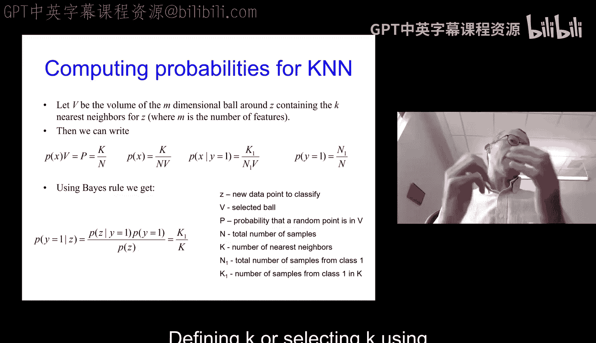
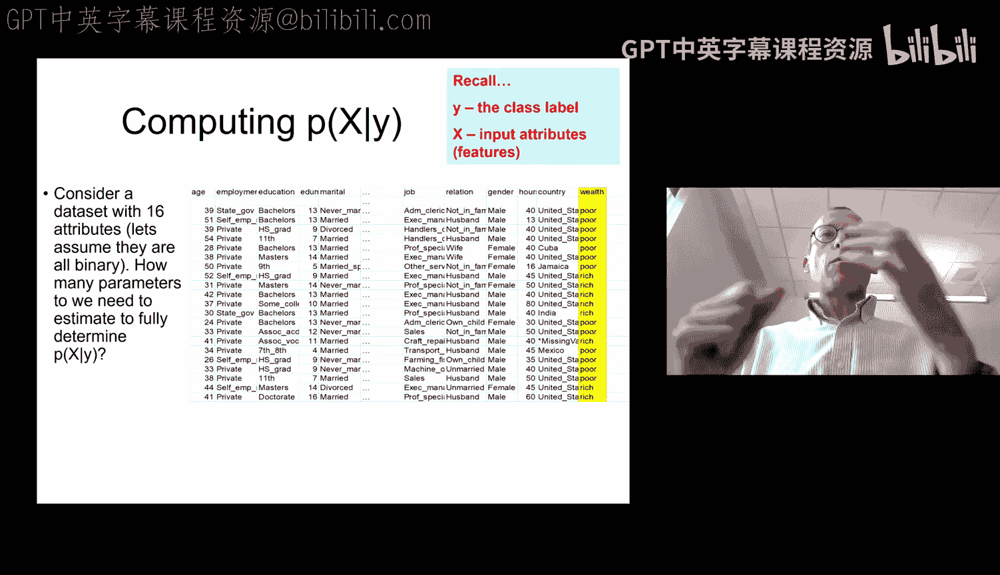
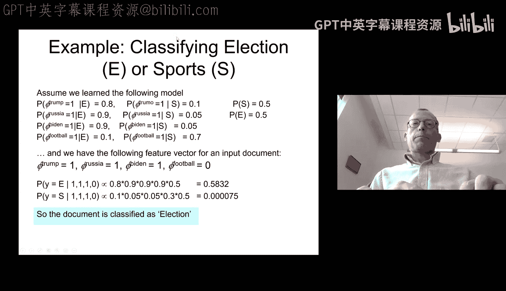

# 04：KNN 续篇与朴素贝叶斯

在本节课中，我们将要完成对 K 最近邻算法的讨论，并学习另一种重要的分类方法——朴素贝叶斯分类器。我们将探讨它们如何工作、各自的优缺点，以及在实际问题中的应用。

## K 最近邻算法的理论解释

上一节我们介绍了 K 最近邻算法的基本思想，本节中我们来看看如何从理论上解释它。K 最近邻是一种基于实例的分类器，它不学习显式的概率模型，但可以将其解释为一种对贝叶斯决策规则的局部近似。

具体来说，对于一个待分类的新点 `z`，我们以其为中心定义一个“球”，使得该球内恰好包含 `K` 个训练样本。我们可以计算在这个局部区域内，样本属于某个类别的概率。

设：
*   `N` 为总样本数。
*   `K` 为球内的样本数。
*   `N1` 为属于类别 1 的总样本数。
*   `K1` 为球内属于类别 1 的样本数。
*   `V` 为球的体积。

根据定义，在球内任意位置观察到样本的边际概率 `P(x)` 为 `K/(N*V)`。类似地，给定类别 `y=1` 时，在球内观察到样本的条件概率 `P(x|y=1)` 为 `K1/(N1*V)`。类别先验 `P(y=1)` 为 `N1/N`。

现在，对于一个新点 `z`，我们可以应用贝叶斯公式计算其后验概率：
`P(y=1|z) = [P(z|y=1) * P(y=1)] / P(z) = [(K1/(N1*V)) * (N1/N)] / (K/(N*V)) = K1/K`

因此，`P(y=1|z)` 简化为球内属于类别 1 的样本比例 `K1/K`。这正是 K 最近邻所做的决策：选择在 `K` 个最近邻中占多数的类别。这为 KNN 提供了一种概率论上的解释，表明它试图在局部区域内近似贝叶斯最优决策规则。

## 朴素贝叶斯分类器

现在，我们转向另一种分类方法——朴素贝叶斯。与 KNN 类似，朴素贝叶斯也试图近似贝叶斯决策规则，但它采用了一种完全不同的、基于全局概率模型的方法。

### 动机与核心思想

贝叶斯决策规则要求我们计算 `P(x|y)`，即给定类别下观测到特征向量 `x` 的概率。然而，当特征数量很多时，直接估计完整的联合概率分布 `P(x1, x2, ..., xd | y)` 非常困难，因为可能的特征组合数量是指数级增长的，我们需要海量数据才能可靠地估计。

朴素贝叶斯通过一个强假设来简化这个问题：**在给定类别标签的条件下，所有特征都是相互独立的**。这就是“朴素”一词的由来。基于这个条件独立性假设，联合条件概率可以分解为各个特征条件概率的乘积：
`P(x1, x2, ..., xd | y) = ∏ P(xj | y)`

这样，我们就不再需要估计复杂的联合分布，而只需为每个特征 `xj` 在每个类别 `y` 下估计一个简单的概率分布 `P(xj | y)`。这极大地减少了需要估计的参数数量。

### 模型与参数估计

朴素贝叶斯分类器的决策规则是：对于一个新样本 `x`，选择使后验概率 `P(y|x)` 最大的类别 `y`。根据贝叶斯定理并忽略与 `y` 无关的分母 `P(x)`，我们有：
`y* = argmax_y [P(y) * ∏ P(xj | y)]`

以下是需要估计的参数：
1.  **类别先验 `P(y)`**：通常使用训练集中各类别样本的比例来估计（最大似然估计）。
2.  **特征条件概率 `P(xj | y)`**：这取决于特征的类型。
    *   **对于离散特征（如文本分类中的词是否出现）**：使用多项式或伯努利分布。通过统计训练集中属于类别 `y` 的样本里，特征 `xj` 取某个值的频率来估计。例如，`P(单词“选举”=1 | y=政治类) = (政治类文档中出现“选举”的文档数) / (政治类文档总数)`。
    *   **对于连续特征**：通常假设其服从高斯分布。需要为每个特征在每个类别下估计一个均值 `μ` 和方差 `σ^2`。例如，在生物信息学中，可以用高斯朴素贝叶斯根据基因表达水平对细胞样本进行分类。

### 文本分类示例

朴素贝叶斯在文本分类中应用广泛。首先，我们需要将文档转化为特征向量，常用方法是**词袋模型**。

以下是构建词袋模型和训练朴素贝叶斯分类器的步骤：

1.  **构建词典**：从训练语料库中选取最常见的 `V` 个词（如 `V=10000`），构成一个固定词典。
2.  **文档向量化**：对于每一篇文档，创建一个长度为 `V` 的向量。向量中每个位置对应词典中的一个词。常用两种表示：
    *   **二进制表示**：如果词出现在文档中，对应位置为 1，否则为 0。
    *   **计数表示**：记录词在文档中出现的次数。
3.  **训练分类器**：对于每个类别（如“体育”、“政治”），使用属于该类别的所有文档向量来估计参数。
    *   估计先验 `P(类别)`。
    *   对于词典中的每个词 `w`，估计 `P(w出现=1 | 类别)`。
4.  **预测新文档**：将新文档转化为相同的向量表示，然后计算它属于每个类别的“得分”（即 `P(y) * ∏ P(xj | y)`），选择得分最高的类别。

### 注意事项与总结

尽管朴素贝叶斯的条件独立性假设在现实中很少完全成立，但它仍然在许多任务中表现良好，尤其是在文本分类领域。其优点包括训练和预测速度快、对缺失数据不敏感、所需训练数据量相对较少。

然而，也需要注意其局限性：
*   **特征相关性**：如果特征之间存在强相关性，朴素贝叶斯的性能可能会下降。复制一个特征（即引入完全相关的冗余特征）会改变模型的预测，因为它违反了独立性假设。
*   **零概率问题**：如果某个特征-类别组合在训练集中从未出现，其条件概率会被估计为 0，导致整个连乘积为 0。解决方案是使用**平滑技术**（如拉普拉斯平滑），即在计数时加一个小的伪计数，确保没有概率为 0。

本节课中我们一起学习了 K 最近邻算法的理论解释，并深入探讨了朴素贝叶斯分类器。我们了解了朴素贝叶斯如何通过强独立性假设来近似贝叶斯规则，学习了如何为离散和连续特征估计参数，并通过文本分类的例子看到了它的实际应用。理解这些基础分类器为我们学习更复杂的模型奠定了坚实的基础。