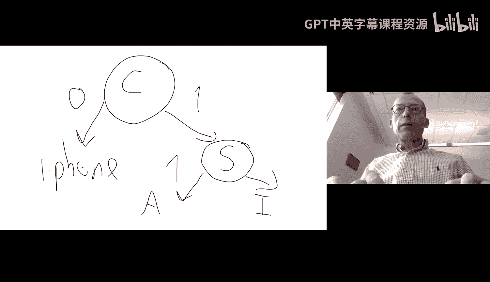
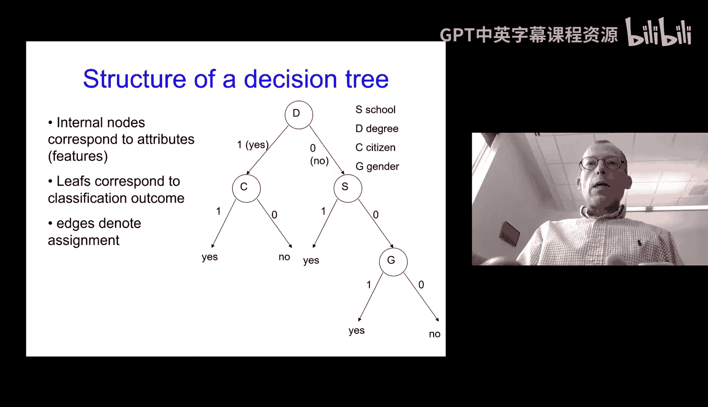
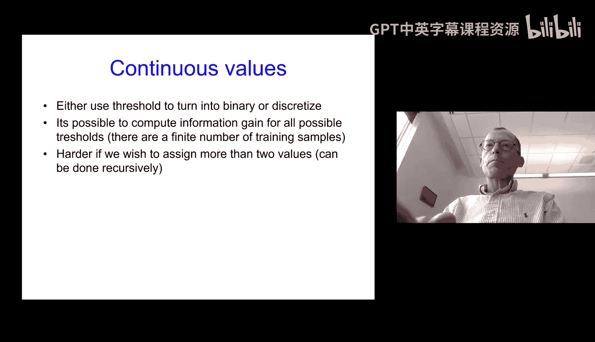
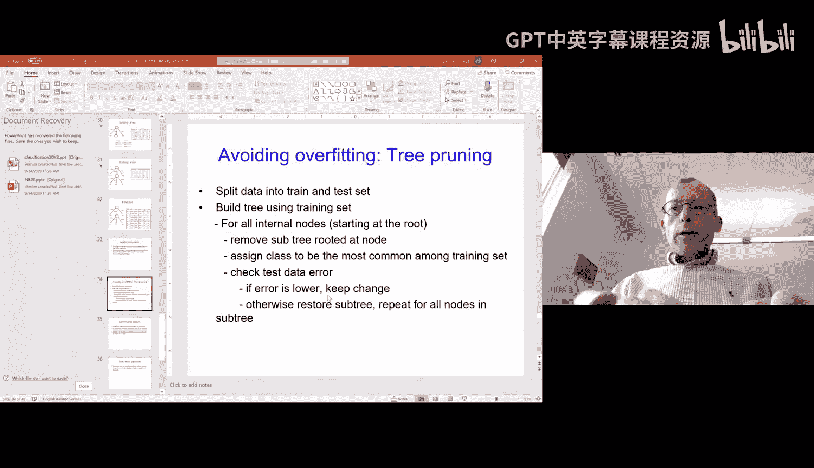
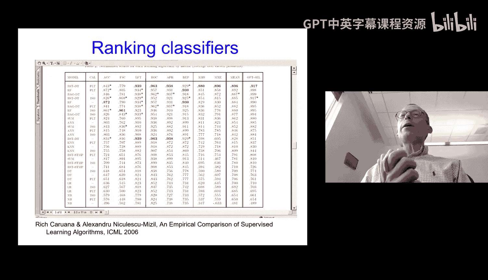

# 05：决策树 🌳


在本节课中，我们将要学习一种非常直观且强大的监督学习方法——决策树。我们将从基本概念开始，逐步了解其工作原理、构建算法、优缺点以及如何避免过拟合。

---

## 决策树简介




上一节我们介绍了朴素贝叶斯等生成式分类器。本节中，我们来看看一种判别式分类器——决策树。决策树是一种非常直观的分类方法，其结构类似于流程图，通过一系列问题对数据进行分类。

决策树由节点和边组成：
*   **内部节点**：对应一个关于某个特征（属性）的测试或问题。
*   **边**：代表对内部节点问题的回答，引导数据流向不同的分支。
*   **叶节点**：代表最终的分类决策或输出。




构建决策树的核心挑战在于：如何选择最佳的属性进行提问，以及如何确定提问的顺序。


---

## 决策树学习算法

决策树的构建通常采用一种**贪心**的递归算法。该算法并不保证找到全局最优的树，但在实践中效果良好。

以下是构建决策树的核心递归算法伪代码：

```python
function BuildTree(样本集 D, 属性集 A):
    # 创建节点 node
    if D 中所有样本都属于同一类别 C:
        将 node 标记为 C 类叶节点
        return
    if A 为空集 或 D 中样本在所有属性上取值相同:
        将 node 标记为 D 中样本数最多的类别的叶节点
        return

    # 选择最优划分属性 a*
    a* = 从 A 中选择最优划分属性
    for a* 的每一个可能取值 v:
        为 node 生成一个分支，对应 Dv = D 中在 a* 上取值为 v 的样本子集
        if Dv 为空:
            将分支节点标记为 D 中样本数最多的类别的叶节点
        else:
            以 BuildTree(Dv, A \ {a*}) 为分支节点
    return node
```

该算法的关键在于 **“从 A 中选择最优划分属性”**。我们需要一个标准来衡量哪个属性能最好地将数据分开。

---

## 选择最佳划分属性：信息增益

为了量化一个属性对分类的贡献，我们引入信息论中的概念。

**熵** 度量了随机变量的不确定性。对于类别标签 Y，其熵定义为：
`H(Y) = - Σ_{y∈Y} P(y) log₂ P(y)`
熵越高，不确定性越大。

**条件熵** 是在已知某个属性 X 的条件下，类别 Y 的不确定性：
`H(Y|X) = Σ_{x∈X} P(x) H(Y|X=x)`

**信息增益** 是知道属性 X 的信息后，类别 Y 的不确定性减少的量：
`IG(Y, X) = H(Y) - H(Y|X)`
信息增益越大，意味着使用属性 X 进行划分所获得的“纯度提升”越大。

在决策树算法中，我们选择能使信息增益最大化的属性作为当前节点的划分属性。

以下是计算信息增益以选择属性的步骤：
1.  计算数据集中类别标签的熵 `H(Y)`。
2.  对于每个候选属性 `X`，计算条件熵 `H(Y|X)`。
3.  计算每个属性的信息增益 `IG(Y, X) = H(Y) - H(Y|X)`。
4.  选择信息增益最大的属性进行划分。

---

## 处理连续值与过拟合

### 连续值处理
对于连续值属性（如身高），不能直接使用离散的问答。常用的方法是：
*   将连续值排序。
*   考虑相邻值的中点作为候选划分点。
*   计算以每个候选点为阈值（如“身高 > 1.75m?”）进行二元划分时的信息增益。
*   选择信息增益最大的划分点。**注意**：连续属性可以被多次使用于树的不同分支。

### 过拟合与剪枝
决策树可能对训练数据学得“太好”，以至于学习了噪声和不必要的细节，导致在未见数据上性能下降，这就是**过拟合**。

**剪枝** 是解决决策树过拟合的主要技术，其基本思想是主动去掉一些分支（子树）。主要方法有：
*   **预剪枝**：在树完全生成之前就停止生长，例如设定树的最大深度、或当节点样本数少于某个阈值时停止划分。
*   **后剪枝**：先生成一棵完整的树，然后自底向上考察非叶节点，若将其替换为叶节点能提升模型在**验证集**上的性能，则进行剪枝。



---

## 决策树的集成方法

单一的决策树可能不稳定且容易过拟合。通过组合多个决策树可以显著提升模型的性能和鲁棒性，这类方法称为**集成学习**。



以下是三种主流的决策树集成方法：
*   **Bagging**：通过**自助采样法**从原始数据集中有放回地抽取多个子集，对每个子集独立训练一棵决策树，最终通过投票（分类）或平均（回归）结合预测结果。**随机森林** 是Bagging的扩展，它在每次构建树时，不仅对样本采样，还对特征进行随机采样。
*   **Boosting**：以一种**顺序**的方式训练一系列“弱”决策树。每一棵树都试图纠正前一棵树的错误。训练过程中，被前序树错误分类的样本会获得更高的权重。最终通过加权投票结合所有树的预测。例如AdaBoost和Gradient Boosting。
*   **Stacking**：训练多个不同的基学习器（可以是决策树、SVM等），然后使用另一个“元学习器”来结合基学习器的预测结果。

集成方法通常能获得比单一模型更优的泛化性能。

---



## 总结

本节课中我们一起学习了决策树。
*   我们了解了决策树是一种直观、可解释性强的判别式分类模型。
*   我们学习了使用**贪心递归算法**和**信息增益**准则来构建决策树。
*   我们探讨了如何处理**连续值属性**以及通过**剪枝**来对抗**过拟合**。
*   最后，我们认识到单一决策树的局限性，并介绍了通过**集成方法**（如Bagging、Boosting）来提升性能的强大策略。这些集成方法在实践中，尤其是在2010年代深度学习崛起之前，曾长期是许多机器学习任务中的首选工具。