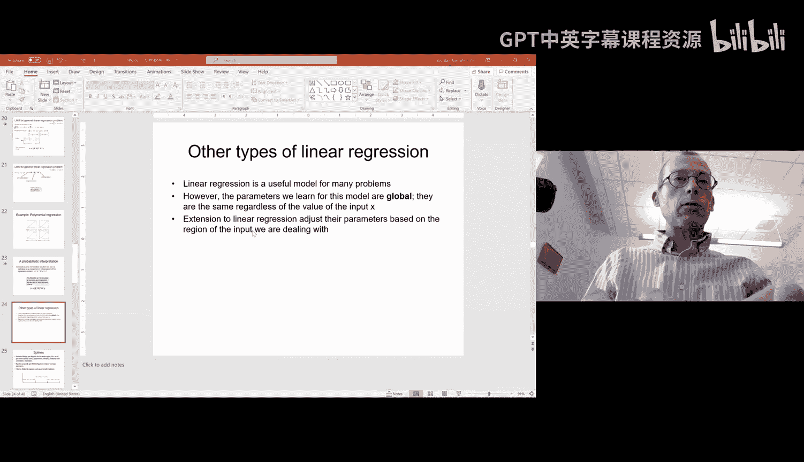
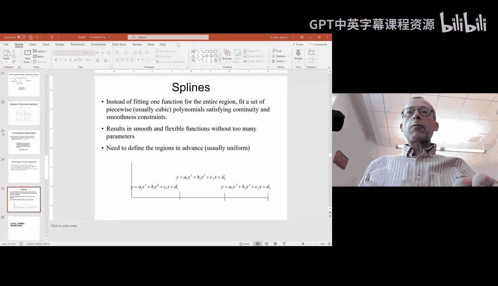
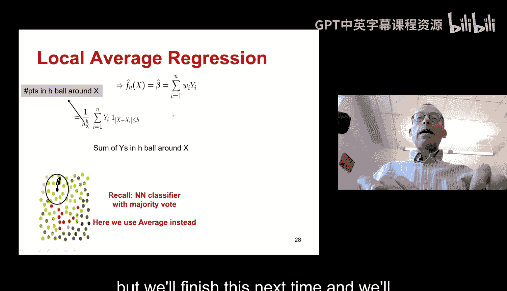

# 06：集成树方法：Bagging与随机森林 🌲

在本节课中，我们将继续讨论监督学习，并重点介绍如何通过组合多个决策树来构建更强大的分类器。我们将学习两种流行的集成方法：Bagging和随机森林。

---

## 决策树回顾 🌳

上一节我们介绍了决策树，这是一种用于分类的递归方法。它通过在每个节点选择一个问题（基于特征）来分割样本，直到满足停止条件或耗尽所有特征。

决策树本身是一个确定性算法。这意味着，如果使用相同的数据和算法多次训练，总会得到完全相同的树。因此，仅仅重复训练过程无法得到不同的树进行组合。

那么，如何获得不同的树并进行组合呢？主要有以下几种方法，本节课我们将讨论其中两种：Bagging决策树和随机森林。

---

## Bagging决策树 🛍️

Bagging是一种利用自助法（Bootstrap）来生成不同决策树的方法。其核心思想是：每次训练树时，不使用全部样本，而是从原始样本中**有放回地随机抽取一个子集**（例如80%或90%的样本）进行训练。

由于每次训练使用的样本子集不同，即使算法是确定性的，最终生成的决策树也会有所不同。

以下是Bagging的主要步骤：

1.  **自助采样**：从原始训练数据中，有放回地随机抽取多个样本子集。
2.  **独立训练**：使用每个样本子集独立地训练一棵决策树。
3.  **组合预测**：对于一个新的样本，让它通过所有训练好的决策树。每棵树都会给出一个分类结果（例如“是”或“否”）。
4.  **集成决策**：通过**多数投票**的方式，将所有树的预测结果进行汇总，得出最终的分类。我们也可以计算投票给某个类别的树的比例，作为一种“置信度”的度量。

Bagging通过在样本层面引入随机性，成功创建了多样化的决策树集合，从而提升了模型的整体性能。

---

## 随机森林 🌲🌳🌴

随机森林是另一种集成树的方法，它与Bagging类似，但随机性的来源不同。

在随机森林中，我们不是对**样本**进行随机抽样，而是对**特征**进行随机抽样。具体来说，在构建每棵决策树的每个节点时，我们并不从所有特征中选择最佳分割点，而是从一个**随机选择的特征子集**中选择最佳分割点。

例如，如果我们有1000个基因特征，在构建每棵树时，我们可能只随机选择其中的100个特征作为候选问题集。

以下是随机森林的关键点：

*   **特征子集**：可以为整棵树预先选定一个特征子集，也可以在树的每个节点动态随机选择特征子集。
*   **生成多样性**：由于每棵树可用的特征集不同，即使使用相同的样本，也会生成结构不同的决策树。
*   **最终决策**：与Bagging一样，对于新样本，让所有树进行预测，然后通过多数投票得出最终结果。

随机森林通过在特征层面注入随机性，进一步增加了树与树之间的差异性，这通常能带来比Bagging更好的效果。

---

## 实践细节与总结 📝

上一节我们介绍了Bagging和随机森林的基本原理，本节我们来看看一些实践中的细节和总结。

**关于参数选择的经验法则：**

*   **Bagging**：通常从原始样本中随机抽取 **80%** 到 **90%** 的样本用于训练每棵树。比例太低会导致单棵树性能下降，比例太高则树之间会过于相似。
*   **随机森林**：对于每棵树或每个节点，通常随机选择特征总数的**平方根**个特征。例如，如果有100个特征，则每次选择10个左右。这是一个经验值，并非理论最优。

**集成方法的优势：**

集成树方法（如Bagging和随机森林）几乎总是比单棵决策树表现更好。更重要的是，它们在许多领域仍然是具有竞争力的先进方法，甚至可以与神经网络媲美。

同时，它们保留了决策树的核心优势——**可解释性**。虽然分析一片“森林”比分析一棵树更复杂，但我们仍然可以分析所有树，找出最重要的特征和问题，从而向用户解释模型是如何做出决策的。这一点对于支持向量机或神经网络来说通常非常困难。

**总结：**

本节课我们一起学习了两种基于决策树的集成方法：Bagging和随机森林。
*   **Bagging**通过对训练样本进行自助采样来创造多样性。
*   **随机森林**通过对特征进行随机采样来创造多样性。
两者最终都通过组合多棵树的预测（多数投票）来获得更鲁棒、更准确的分类模型。这些方法在实践中被广泛使用，因为它们既强大又在一定程度上保持了模型的可解释性。

---

接下来，我们将进入一种新的监督学习任务——回归分析。