# 07：局部核回归与逻辑回归

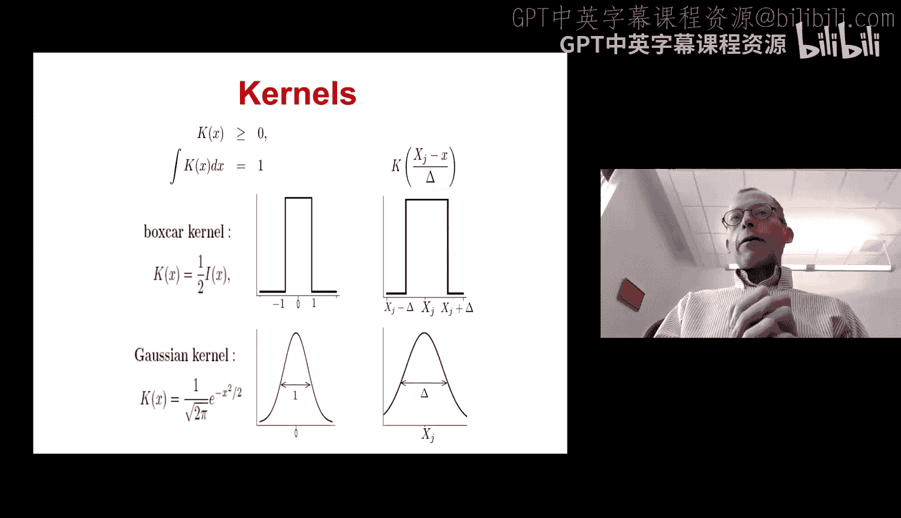

在本节课中，我们将要学习两种重要的机器学习方法：局部核回归和逻辑回归。我们将首先探讨如何利用核函数进行局部回归，然后深入理解逻辑回归的原理及其参数优化方法。


## 局部核回归

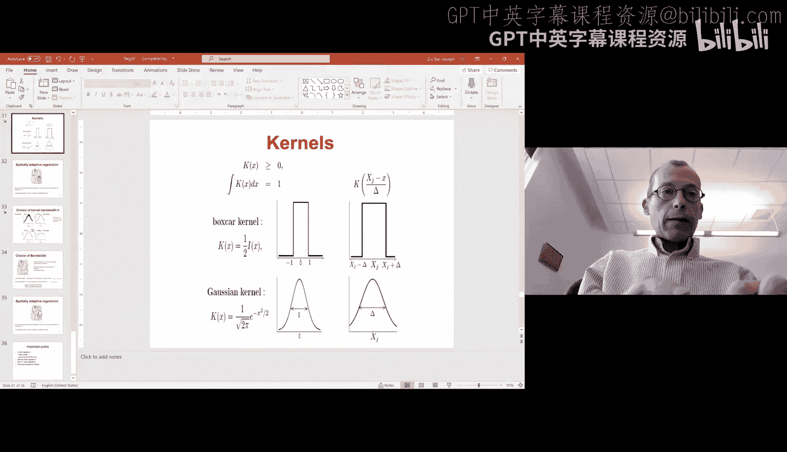

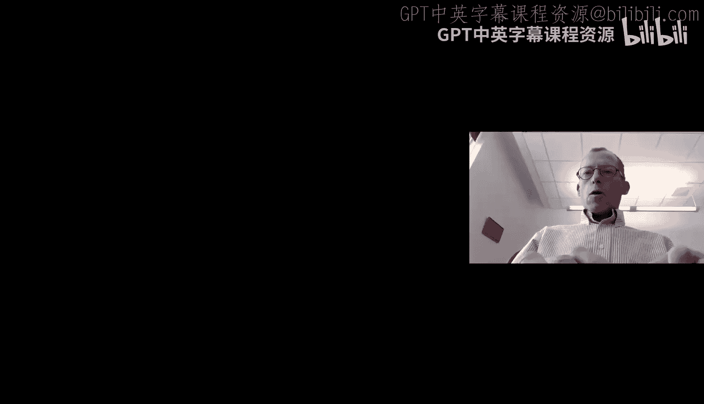

上一节我们介绍了线性回归，本节中我们来看看如何利用局部信息进行回归分析。局部核回归的核心思想是，在进行预测时，我们只关心目标点附近区域内的数据点，而不是使用全部数据。

### 核函数的概念

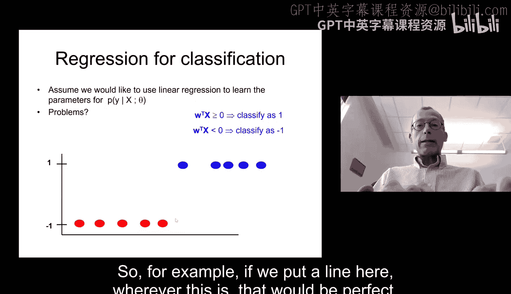

核函数本质上是一个权重函数，它决定了每个数据点对预测值的贡献大小。核函数的形式多种多样，以下是几种常见的核函数：


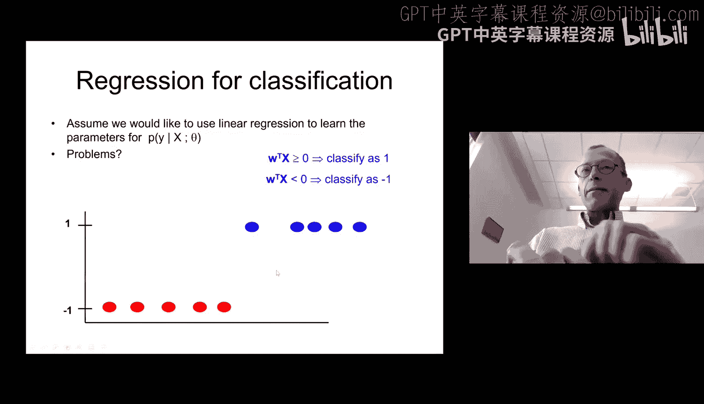


*   **箱型核函数**：对于距离目标点在一定范围内的所有点赋予相同的权重（例如1或1/n），范围外的点权重为0。其公式可表示为：
    ```
    K(x, x_i) = 1 如果 ||x - x_i|| <= h，否则为 0
    ```
*   **K近邻核函数**：根据数据点的分布动态确定邻域大小，选择最近的K个点，并赋予它们权重。
*   **高斯核函数**：为所有点赋予权重，但权重随距离的增加而呈指数衰减。其公式为：
    ```
    K(x, x_i) = exp(-||x - x_i||^2 / (2 * h^2))
    ```


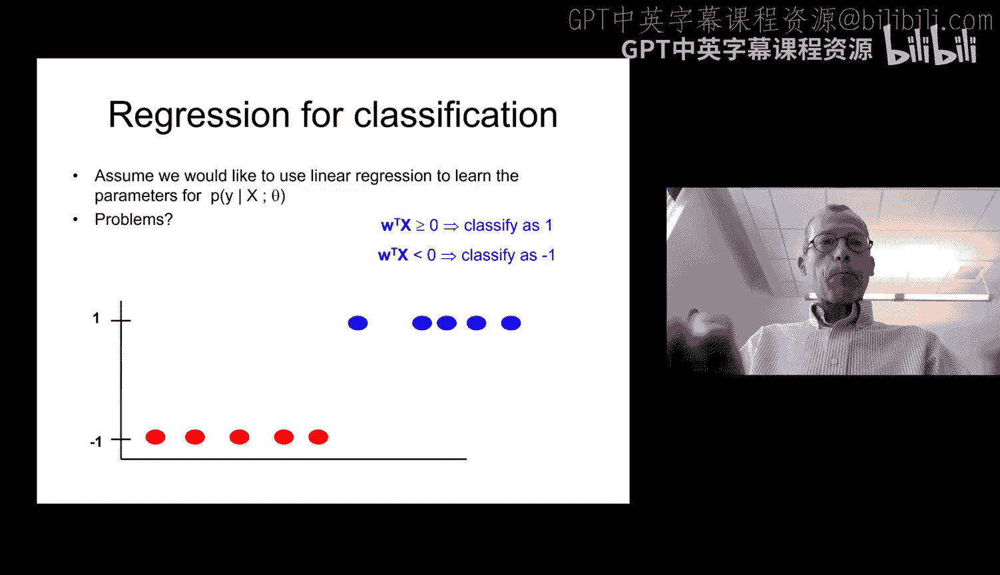


### 带宽选择的重要性

核函数的带宽（例如箱型核的半径h或高斯核的方差）对回归结果有巨大影响。带宽过小会导致模型对噪声敏感，产生不稳定的预测；带宽过大会使模型过于平滑，丢失局部细节信息。因此，选择合适的带宽是局部核回归的关键。

## 从回归到分类：逻辑回归

上一节我们讨论了局部回归，本节中我们来看看如何将回归的思想应用于分类问题，即逻辑回归。

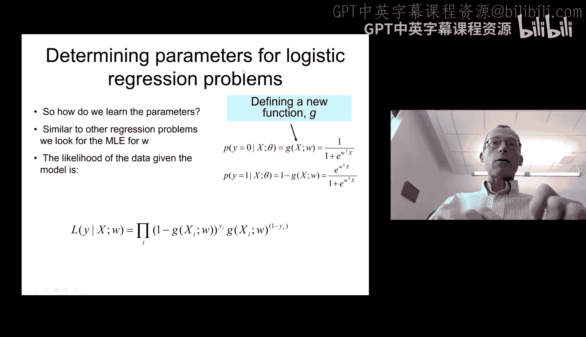


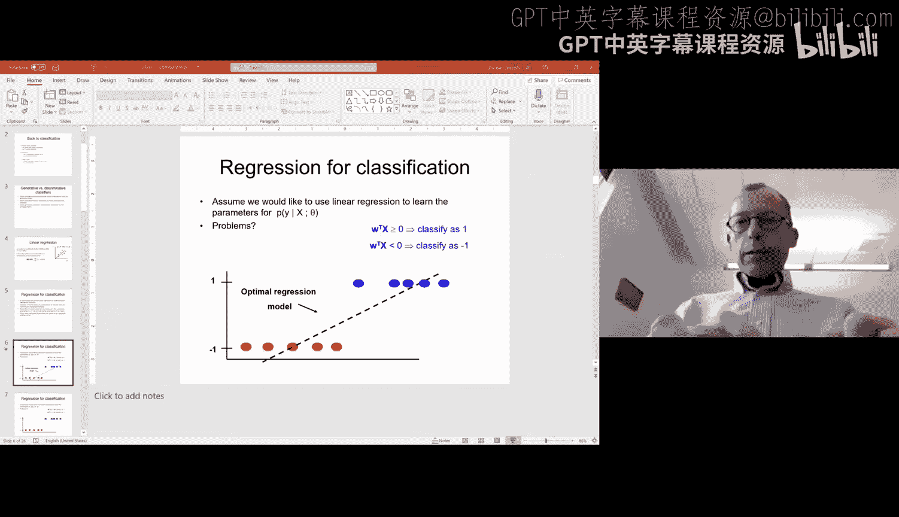

### 线性回归用于分类的局限性


我们首先尝试直接用线性回归解决二分类问题（例如，将类别标签设为-1和1）。然而，通过最小化平方误差得到的最优回归线，在分类任务上可能表现很差，因为它追求的是所有数据点到直线的垂直距离最小，而不是追求最佳的分类边界。

### 逻辑回归模型

为了解决上述问题，我们引入了逻辑回归。它使用Sigmoid函数将线性组合 `w^T x` 映射到(0, 1)区间，并将其解释为样本属于正类的概率。Sigmoid函数公式如下：
```
σ(z) = 1 / (1 + e^{-z})
```
其中 `z = w^T x`。因此，逻辑回归模型为：
```
P(y=1 | x; w) = σ(w^T x) = 1 / (1 + e^{-w^T x})
P(y=0 | x; w) = 1 - P(y=1 | x; w)
```

### 模型参数估计：最大似然与梯度上升

逻辑回归是一个概率判别式模型。我们通过最大化训练数据的似然函数来估计参数 `w`。对于二分类问题，其对数似然函数为：
```
LL(w) = Σ_i [y_i * log(σ(w^T x_i)) + (1 - y_i) * log(1 - σ(w^T x_i))]
```
由于该函数关于 `w` 没有闭合形式的解，我们采用迭代优化算法——梯度上升法来寻找最优参数。

以下是梯度上升法的核心步骤：

1.  **初始化参数**：随机初始化或全零初始化参数向量 `w`。
2.  **计算梯度**：计算对数似然函数关于 `w` 的梯度。梯度方向指示了函数值增长最快的方向。
3.  **更新参数**：沿梯度方向以一定的步长（学习率 `ε`）更新参数：
    ```
    w_new = w_old + ε * ∇LL(w)
    ```
4.  **迭代**：重复步骤2和3，直到对数似然函数收敛（变化很小）或达到预设的迭代次数。

### 正则化

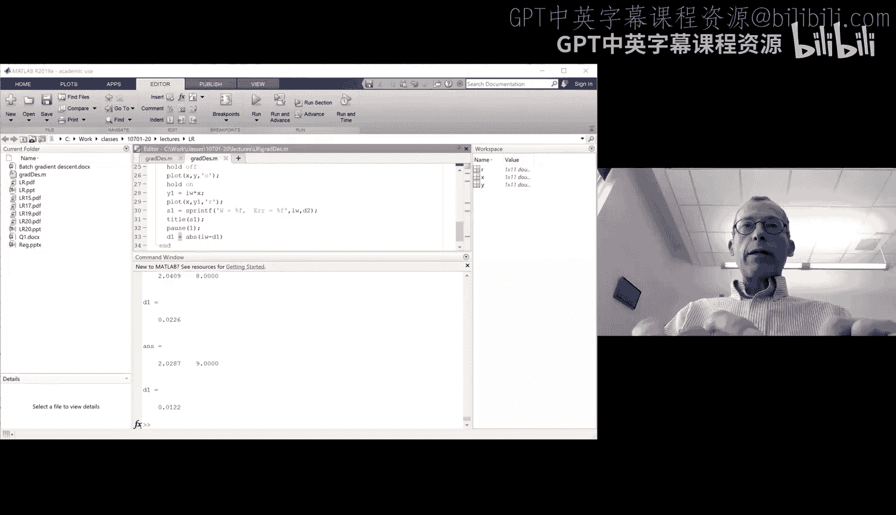

为了防止过拟合，我们可以在目标函数中加入正则化项，对参数的大小进行约束。这相当于在最大似然估计的基础上引入了参数的先验分布（最大后验估计，MAP）。常见的正则化方法有：


*   **L2正则化**：在目标函数中添加参数平方和项 `λ * ||w||^2`，倾向于产生数值较小且分布均匀的参数。
*   **L1正则化**：在目标函数中添加参数绝对值和项 `λ * |w|`，倾向于产生稀疏参数，即让许多参数变为0。

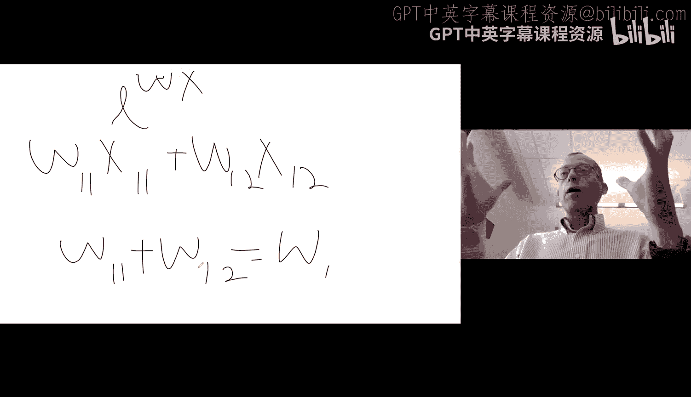


加入L2正则化后，参数更新规则变为：
```
w_new = w_old + ε * (∇LL(w) - 2λ w)
```

## 总结

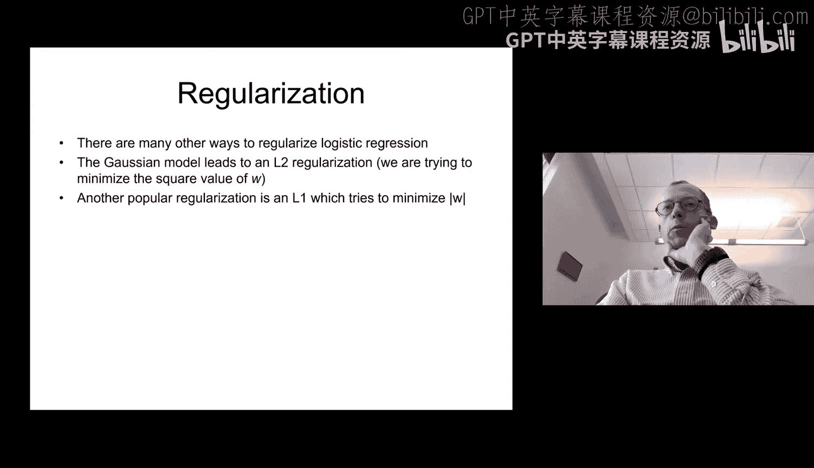

本节课中我们一起学习了局部核回归和逻辑回归。我们了解到，核回归通过赋予邻近数据点不同权重来进行局部预测，其效果受核函数和带宽选择的影响。接着，我们深入探讨了逻辑回归，它通过Sigmoid函数将线性回归的输出转化为概率，并用于分类任务。我们使用最大似然估计来拟合模型，并采用梯度上升法求解最优参数。最后，我们介绍了正则化技术，它通过约束参数大小来提升模型的泛化能力，防止过拟合。