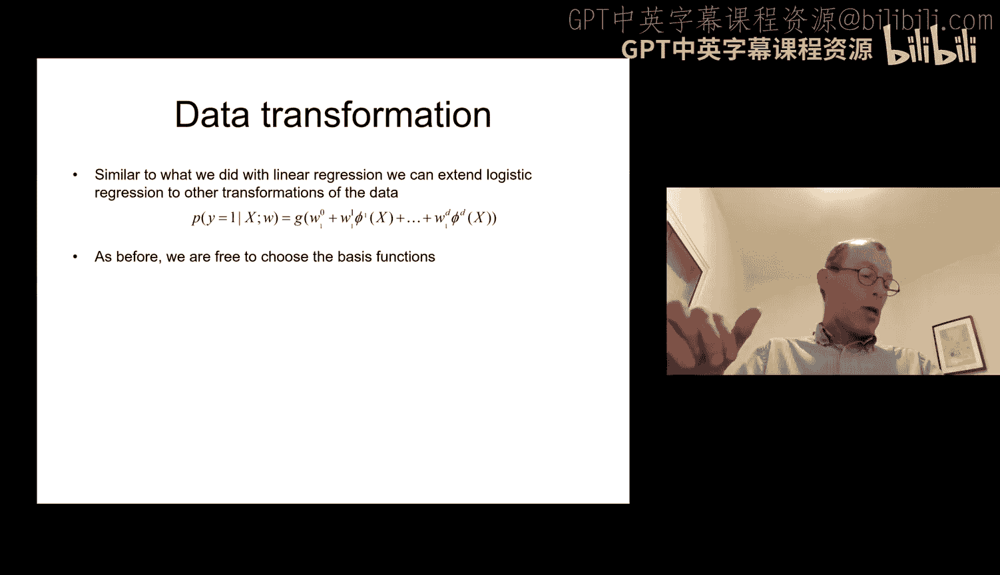
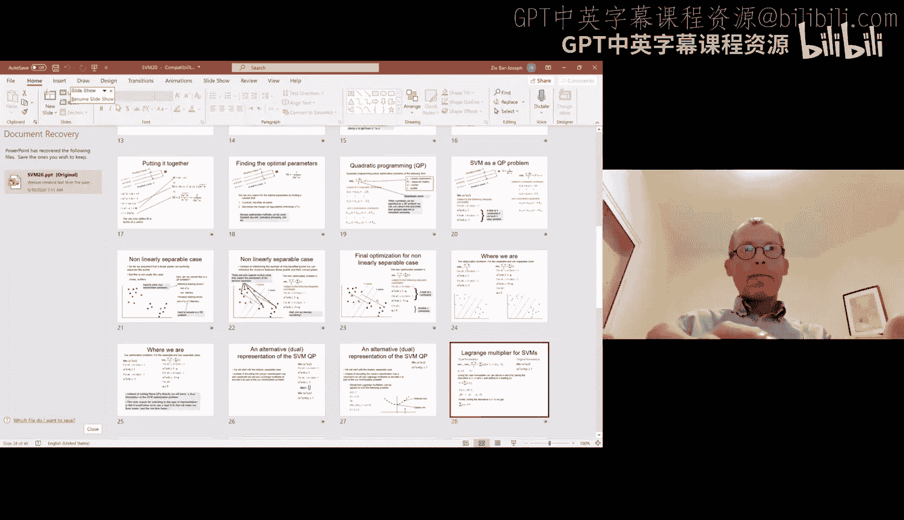
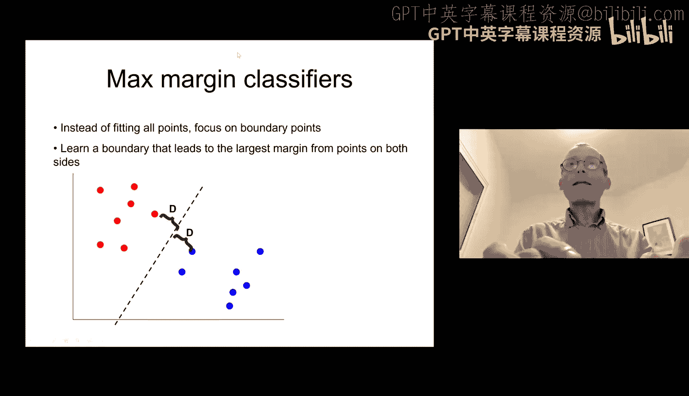
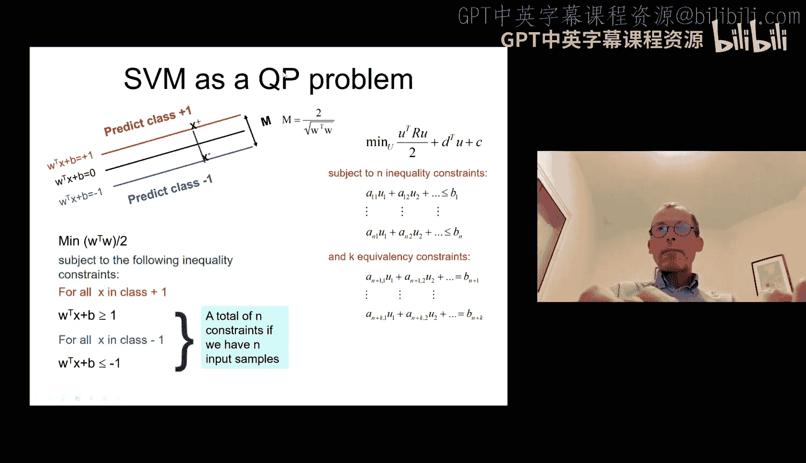
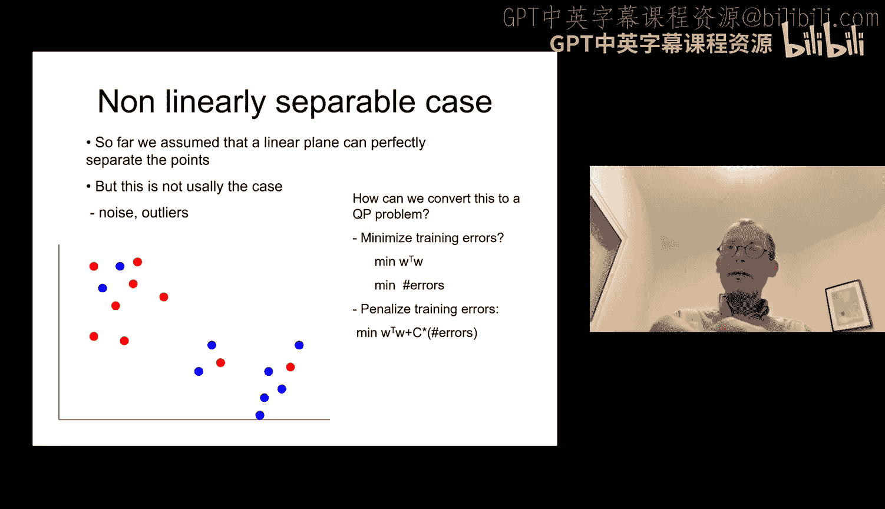
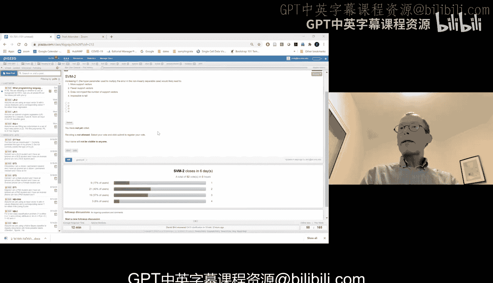

# 08：多类逻辑回归与支持向量机 🎓

在本节课中，我们将要学习如何将逻辑回归扩展到多类别分类问题，并介绍一种强大的分类方法——支持向量机。我们将从多类逻辑回归的定义和参数学习方法开始，然后深入探讨支持向量机的核心思想、优化目标以及如何处理线性不可分的情况。

---

## 多类逻辑回归 📊

上一节我们介绍了用于二分类的逻辑回归。本节中，我们来看看如何将其扩展到处理两个以上类别的问题。

### 概率模型定义

对于具有 K 个类别的多分类问题，我们可以定义样本 x 属于第 i 类（i < K）的概率为：

**P(y = i | x) = exp(w_i^T x) / (1 + Σ_{j=1}^{K-1} exp(w_j^T x))**

对于最后一个类别 K，其概率定义为：

**P(y = K | x) = 1 - Σ_{i=1}^{K-1} P(y = i | x)**

这种定义保证了所有类别的概率之和为 1，并且每个概率值都在 0 到 1 之间。二分类逻辑回归是当 K=2 时的一个特例。

### 参数学习

与二分类情况类似，我们需要学习参数集 {w_1, w_2, ..., w_{K-1}}。参数的数量随着类别数线性增长。

我们可以通过最大化似然函数来学习这些参数，并使用梯度上升法进行优化。对于属于类别 m 的样本 i，其关于参数 w_m 的梯度为：

**∇ L(w_m) = [δ(y_i = m) - P(y = m | x_i)] * x_i**

其中，δ(y_i = m) 是指示函数，当样本 i 确实属于类别 m 时为 1，否则为 0。这个公式与二分类情况在形式上是一致的。

### 特征变换

关于输入特征变换的讨论同样适用于多类逻辑回归。我们可以对原始特征应用任何确定的函数变换（如多项式展开），将其作为新的特征输入模型。但需要注意，过多的变换可能导致参数增多，需要更多数据来防止过拟合。

---

## 支持向量机介绍 ⚔️

在完成了对逻辑回归的讨论后，我们转向另一种监督分类方法——支持向量机。它同样利用了回归的思想进行分类，但其优化目标截然不同。

### 核心思想：最大间隔

支持向量机是一种判别式方法，其核心思想是寻找一个决策边界（超平面），使得两个类别之间的“间隔”最大化。

*   **间隔**：定义为决策边界到最近样本点的最小距离。支持向量机的目标是找到能使这个间隔最大的边界。
*   **支持向量**：那些距离决策边界最近、从而“支撑”起这个间隔的样本点。只有这些点会直接影响最终边界的位置。

### 线性可分情况下的优化问题

首先，我们假设数据是线性可分的，即存在一个超平面能完美区分两类样本。

我们定义决策边界为 **w^T x + b = 0**。对于正类样本，我们希望 **w^T x + b ≥ 1**；对于负类样本，我们希望 **w^T x + b ≤ -1**。这里的“1”和“-1”是任意选择的标准化值，不影响优化结果。

可以推导出，两类支持平面之间的间隔 **M** 与参数 **w** 的关系为：

**M = 2 / ||w||**

因此，最大化间隔 **M** 等价于最小化 **||w||**（或 **w^T w**）。

于是，线性支持向量机的优化问题可以表述为：

**最小化： (1/2) w^T w**
**约束条件：**
*   对于所有正类样本 i: **y_i (w^T x_i + b) ≥ 1**
*   对于所有负类样本 i: **y_i (w^T x_i + b) ≥ 1** （通常统一写作此形式，其中 y_i ∈ {+1, -1}）

### 求解：二次规划

上述优化问题是一个带有线性约束的二次规划问题。我们可以使用专门的二次规划求解器来高效地找到最优的 **w** 和 **b**。

---

## 处理线性不可分情况 🛡️

在实际问题中，数据往往是线性不可分的。为此，我们需要修改优化目标，在最大化间隔和容忍分类错误之间进行权衡。

### 引入松弛变量

我们为每个样本 i 引入一个松弛变量 **ξ_i ≥ 0**。它代表了该样本违反间隔约束的程度。
*   如果 **ξ_i = 0**，样本被正确分类且在间隔之外。
*   如果 **0 < ξ_i < 1**，样本被正确分类但在间隔之内。
*   如果 **ξ_i ≥ 1**，样本被错误分类。

优化目标修改为：

**最小化： (1/2) w^T w + C * Σ_i ξ_i**
**约束条件：**
*   对于所有样本 i: **y_i (w^T x_i + b) ≥ 1 - ξ_i**
*   对于所有样本 i: **ξ_i ≥ 0**

### 参数 C 的作用

这里的 **C** 是一个超参数，它控制着对分类错误的惩罚力度：
*   **C 值很大**：意味着我们非常重视减少分类错误，可能会选择一个间隔较小但分类更准确的边界。支持向量的数量可能会减少。
*   **C 值很小**：意味着我们更看重最大化间隔，允许存在更多的分类错误或落入间隔内的点。支持向量的数量可能会增加。

这个修改后的问题仍然是一个二次规划问题，只是优化变量和约束条件有所增加。

---

## 总结 📝

本节课中我们一起学习了：
1.  **多类逻辑回归**：通过为每个类别（除最后一个外）定义独立的参数向量，并将概率归一化，成功地将逻辑回归推广到多分类场景。其参数学习仍可通过梯度方法进行。
2.  **支持向量机基础**：介绍了支持向量机作为一种最大间隔分类器的核心思想。其目标是找到能最大化类别间间隔的决策边界，并且只有少数“支持向量”样本直接影响这个边界。
3.  **优化形式**：在线性可分情况下，SVM的优化问题可以表述为一个二次规划问题，旨在最小化 **||w||** 同时满足所有样本的分类约束。
4.  **线性不可分处理**：通过引入松弛变量 **ξ_i** 和惩罚参数 **C**，使SVM能够处理线性不可分的数据，在间隔最大化和错误最小化之间取得平衡。

下一讲我们将继续探讨支持向量机，介绍一种更强大的求解和扩展方式——核方法。