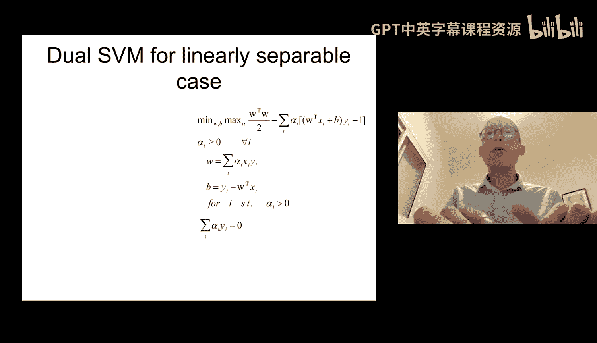
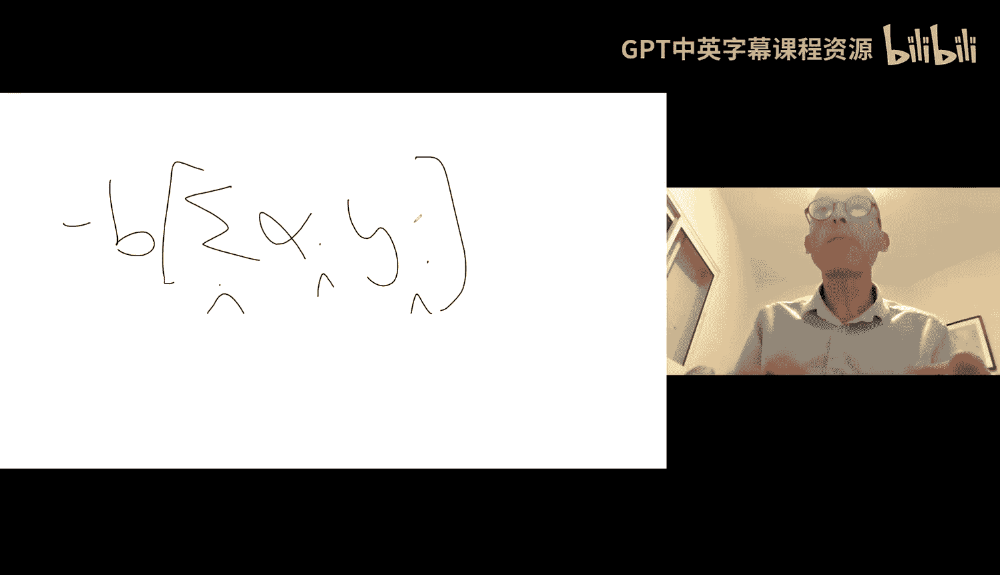
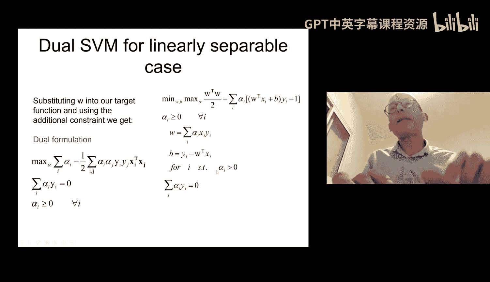
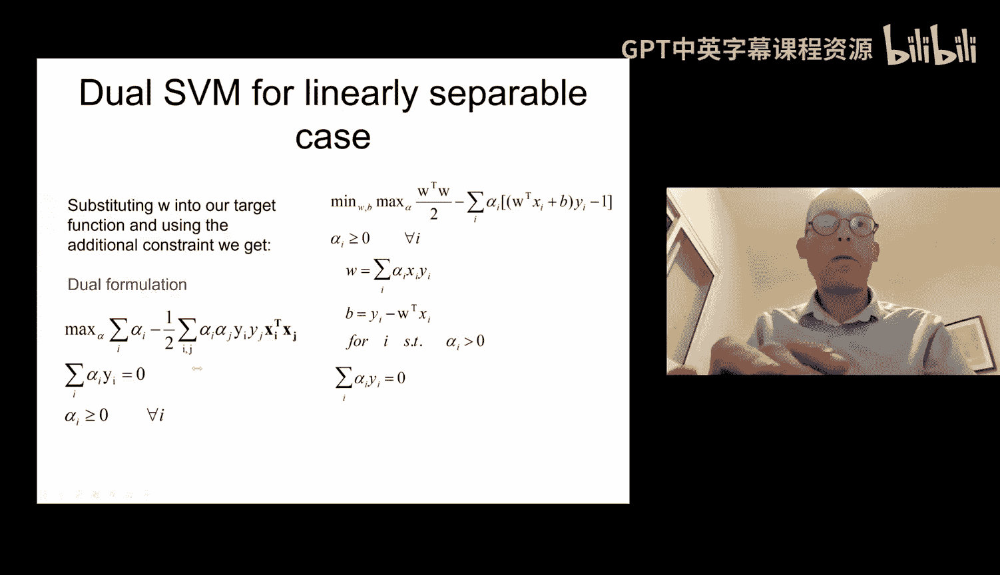
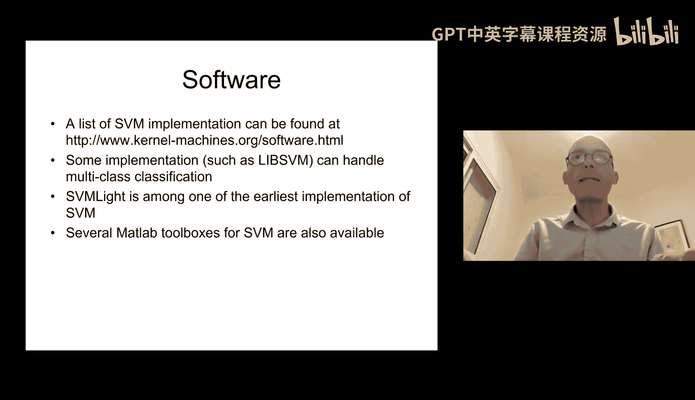
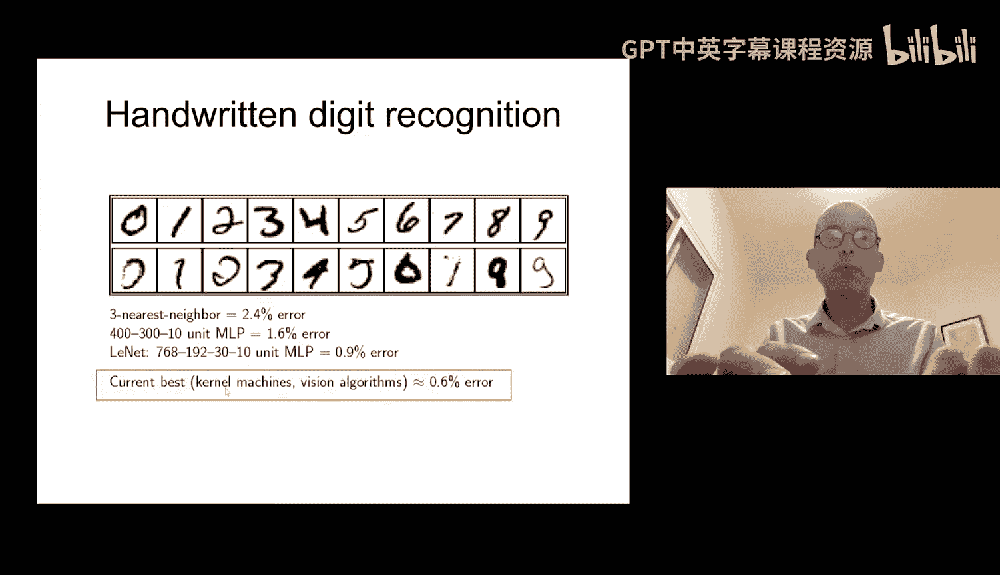

# 09：支持向量机的对偶形式与核函数

在本节课中，我们将学习支持向量机的另一种重要形式——对偶形式，并探讨核函数这一强大工具。我们将看到，通过转换视角，可以将优化问题从特征空间转换到样本空间，并利用核技巧高效地处理高维甚至无限维的特征空间。

上一节我们介绍了支持向量机的基本原理和原始形式的优化问题。本节中，我们来看看如何将其转化为对偶形式，并理解核函数的作用。

## 对偶形式的推导

支持向量机的原始优化问题如下：
*   目标：最小化 `(1/2) * w^T * w`
*   约束：对于所有样本 `i`，满足 `y_i * (w^T * x_i + b) >= 1`

这是一个带约束的优化问题。为了将其转化为无约束问题（便于求导求解），我们引入拉格朗日乘子法。

### 拉格朗日乘子法简介

拉格朗日乘子法是一种将带约束的优化问题转化为无约束问题的方法。其核心思想是，对于最小化 `f(x)` 且满足 `g(x) >= 0` 的问题，可以构造拉格朗日函数 `L(x, α) = f(x) - α * g(x)`，其中 `α >= 0`。然后通过求解 `min_x max_α L(x, α)` 来找到原问题的最优解。

### 构建支持向量机的拉格朗日函数

对于支持向量机问题，我们为每个样本 `i` 引入一个拉格朗日乘子 `α_i >= 0`。拉格朗日函数构造如下：
`L(w, b, α) = (1/2) * w^T * w - Σ_i α_i * [y_i * (w^T * x_i + b) - 1]`

我们的目标转化为求解 `min_{w,b} max_{α>=0} L(w, b, α)`。

### 求解对偶问题

为了求解上述最小最大问题，我们首先对 `w` 和 `b` 求偏导并令其为零。

以下是求导结果：
1.  对 `w` 求偏导：`∂L/∂w = 0 => w = Σ_i α_i * y_i * x_i`
2.  对 `b` 求偏导：`∂L/∂b = 0 => Σ_i α_i * y_i = 0`

将这两个结果代回拉格朗日函数 `L(w, b, α)` 中，可以消去 `w` 和 `b`，得到仅关于 `α` 的函数。

经过代换和化简，我们得到对偶优化问题：
*   目标：最大化 `Σ_i α_i - (1/2) * Σ_i Σ_j α_i * α_j * y_i * y_j * (x_i^T * x_j)`
*   约束：
    *   `α_i >= 0` （对所有 `i`）
    *   `Σ_i α_i * y_i = 0`

## 对偶形式的优势与支持向量

对偶形式带来了几个关键优势：
1.  **参数空间转换**：优化变量从特征空间的 `w` 和 `b`，变成了样本空间的 `α`。参数数量等于样本数 `N`，而与原始特征维度 `D` 无关。
2.  **问题结构**：目标函数和约束条件仅依赖于样本之间的**点积** `x_i^T * x_j`。
3.  **支持向量的识别**：在最优解中，大部分 `α_i` 会为 0。只有那些 `α_i > 0` 对应的样本 `x_i` 才对定义决策边界（即 `w`）有贡献，这些样本就是**支持向量**。决策边界 `w` 可以表示为：`w = Σ_{i ∈ SV} α_i * y_i * x_i`，其中 `SV` 代表支持向量集合。

## 核函数：通往高维空间的钥匙

对偶形式的核心是样本间的点积 `x_i^T * x_j`。这启发我们使用**核技巧**。

### 动机：线性不可分问题

许多数据在原始特征空间中是线性不可分的。一个常见的思路是将数据映射到一个更高维的特征空间，在这个新空间中数据可能变得线性可分。例如，对于二维不可分数据，映射到三维空间后可能找到一个分离平面。

然而，直接进行高维映射的计算和存储成本极高。核技巧的精妙之处在于，它允许我们在高维空间中**隐式地**进行计算。

### 核函数的定义与例子

核函数 `K(x, z)` 被定义为高维特征空间中的点积：`K(x, z) = φ(x)^T * φ(z)`，其中 `φ` 是映射函数。

关键在于，我们无需知道映射 `φ` 的具体形式，也无需计算高维向量 `φ(x)` 和 `φ(z)`，只要我们能高效地计算核函数 `K(x, z)` 即可。

以下是几个常用核函数的例子：
*   **线性核**：`K(x, z) = x^T * z`。这对应于原始特征空间，即没有映射。
*   **多项式核**：`K(x, z) = (x^T * z + c)^d`。这相当于将数据映射到所有最高 `d` 次项组合成的特征空间。
*   **径向基函数核**：`K(x, z) = exp(-γ * ||x - z||^2)`。这是一个非常强大的核，对应一个无限维的特征空间。

### 核函数在支持向量机中的应用

将对偶形式中的点积 `x_i^T * x_j` 替换为核函数 `K(x_i, x_j)`，我们就得到了**核支持向量机**。

优化问题变为：
*   目标：最大化 `Σ_i α_i - (1/2) * Σ_i Σ_j α_i * α_j * y_i * y_j * K(x_i, x_j)`

分类决策函数变为：
`f(x) = sign( Σ_{i ∈ SV} α_i * y_i * K(x_i, x) + b )`

通过使用核函数，我们实际上是在一个非常高维（甚至是无限维）的特征空间中寻找最大间隔超平面，但所有计算都只在原始特征维度上进行，巧妙地避免了“维数灾难”。

## 扩展到多类分类与总结

标准的支持向量机是为二分类设计的。将其扩展到多类分类的常用方法是**一对多**策略：
*   为每个类别训练一个二分类支持向量机，将该类样本作为正例，其余所有样本作为负例。
*   对于一个新样本，用所有分类器进行预测。通常选择**决策函数输出值最大**（即最确信）的分类器所对应的类别。

本节课中我们一起学习了支持向量机的对偶形式推导、其优势以及核函数这一核心概念。对偶形式将问题重心转移到样本空间，并通过核函数使我们能够高效地在高维特征空间中构建复杂的非线性决策边界，这是支持向量机强大泛化能力的重要来源。