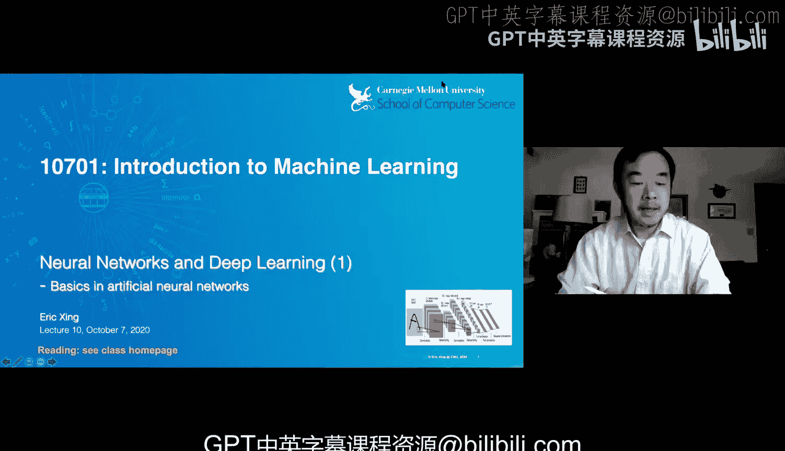
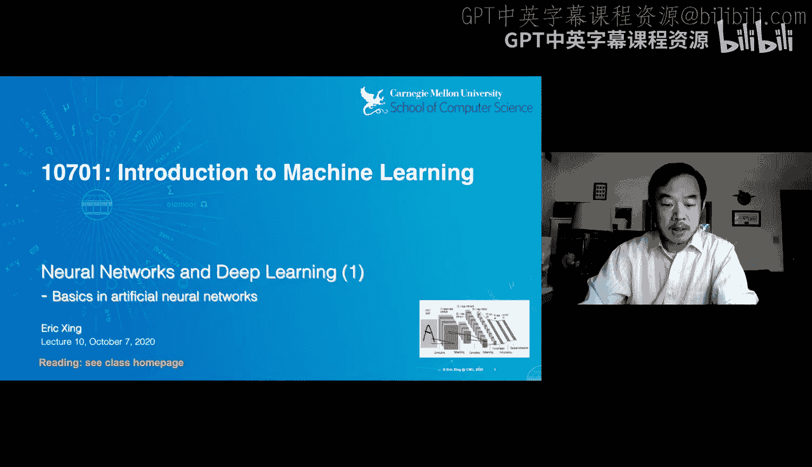
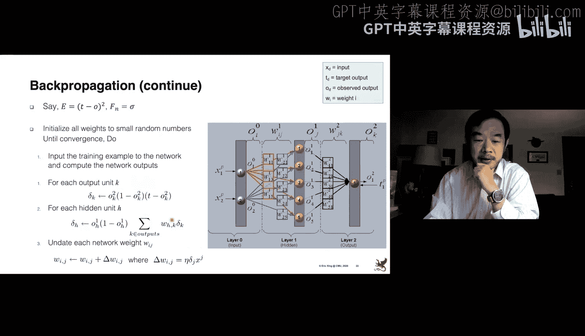
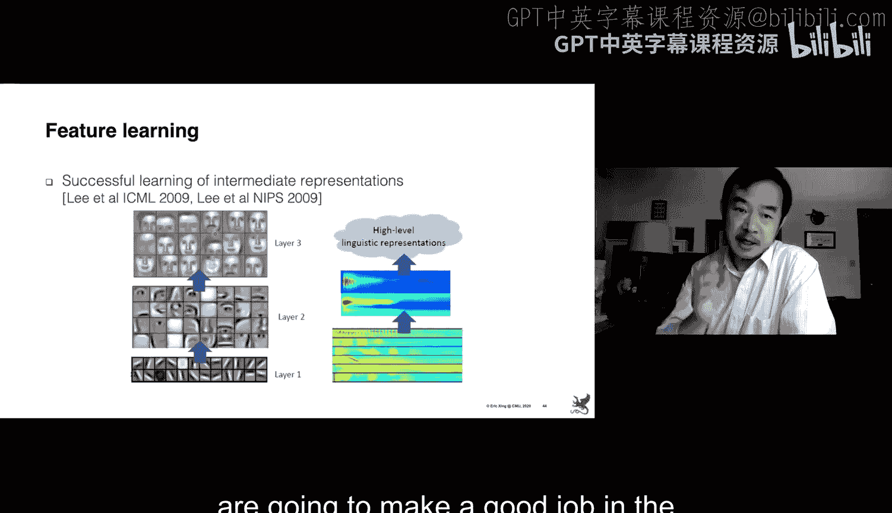
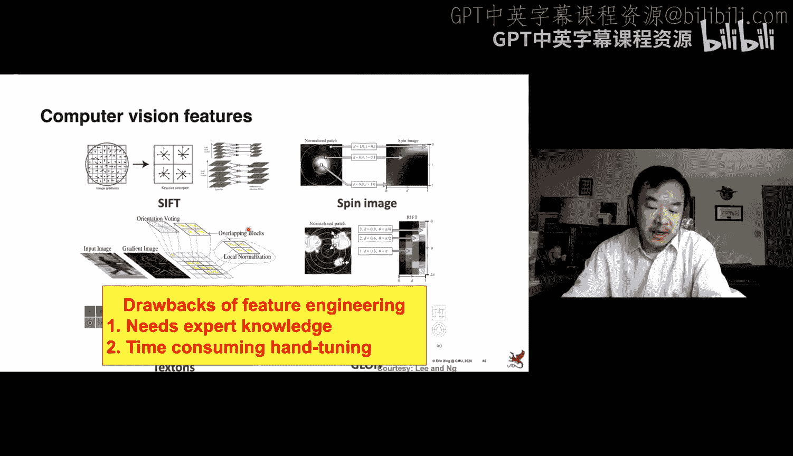
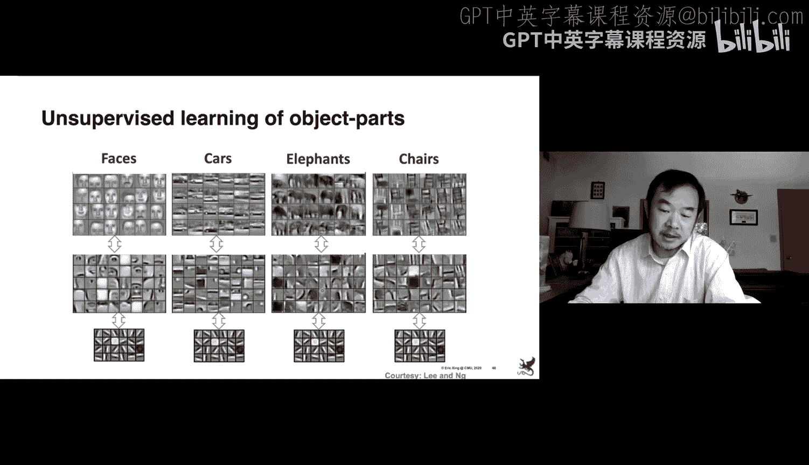
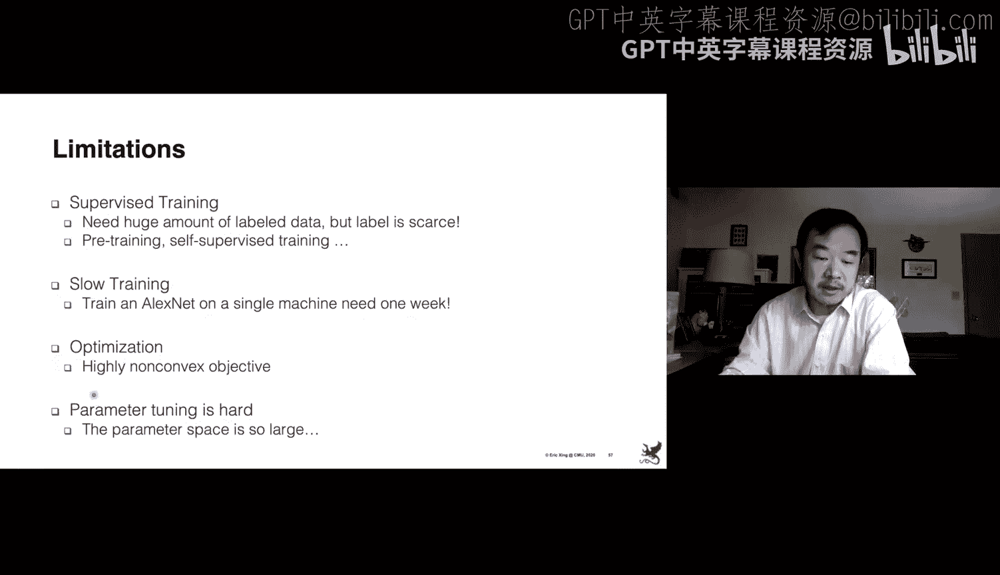
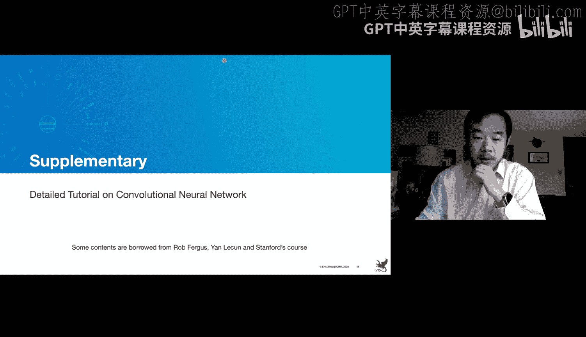

# 10：神经网络与深度学习基础 🧠

在本节课中，我们将学习神经网络与深度学习的基础知识。我们将从历史背景出发，了解感知机等早期模型，并深入探讨反向传播等核心训练算法。这些概念是现代深度学习的基石。

## 历史背景与动机 📜

上一节我们介绍了课程概述，本节中我们来看看神经网络发展的历史背景和核心动机。

机器学习的主要目标之一是找到一个从输入 X 到输出 Y 的映射函数。在许多已学过的模型中，如逻辑回归、线性回归和支持向量机，我们寻找的都是线性决策边界。

然而，现实世界中的许多问题无法用线性函数解决。例如，异或（XOR）问题中，数据点无法被一个线性平面正确分离。在语音识别等实际问题中，不同类别的数据在特征空间中形成的也是复杂的非线性簇。

## 从生物神经元到人工神经元 🧬

上一节我们提到了非线性问题的挑战，本节中我们来看看解决这些问题的灵感来源——生物神经元。

早期神经网络的核心组件之一是感知机，其灵感来源于生物神经元。McCulloch和Pitts在1943年的开创性论文中，建立了生物神经元的数学模型。

一个生物神经元具有树突、细胞体和轴突。它接收来自其他神经元的电信号，当累积的信号超过某个阈值时，会触发动作电位，通过轴突将信号传递给其他神经元。

McCulloch-Pitts模型，即人工神经元或感知机，捕捉了这一过程。它接收输入 `x`，通过权重 `w` 进行线性组合，然后经过一个激活函数（如阈值函数）产生输出。其数学形式可表示为：
`输出 = 激活函数(∑(w_i * x_i) + 偏置)`

单个感知机对应一个神经元，其激活函数通常产生一个线性决策面，类似于SVM或逻辑回归。

## 神经网络：连接的力量 🔗

上一节我们介绍了单个神经元，本节中我们来看看如何将它们连接成网络。

神经网络由许多相互连接的感知机构成，形成图结构，这模仿了生物神经网络。数学上，我们将感知机组织成不同的层。

将生物神经元和人工神经元进行对比很有趣。人类大脑拥有约100亿个神经元，每个神经元可能与多达上万个其他神经元连接。尽管单个神经元的切换速度（约1毫秒）远低于硅晶体管，但整体识别速度却非常快（例如，识别图像仅需约0.1秒）。这表明并行处理和网络结构是高效计算的关键。

在术语上，神经网络的构建块与统计学中的概念有深刻联系。例如，独立变量、因变量、系数和估计值在神经网络中分别被称为输入、输出、权重和目标。

## 感知机学习 vs. 逻辑回归 📊

上一节我们了解了网络结构，本节中我们来比较两种核心的学习算法。

逻辑回归和感知机在结构上相似，都有输入、权重和激活函数（如Sigmoid函数）。但它们的学习目标不同。

逻辑回归最大化给定输入 `X` 时输出 `Y` 的条件概率的对数似然。其损失函数基于逻辑损失。

感知机学习算法则最小化真实输出 `Y` 与感知机预测输出之间的平方误差。其损失函数是平方损失。

两者的关键区别在于：逻辑回归优化基于条件概率的损失函数，而感知机优化基于预测值直接误差的平方损失函数。

## 训练感知机：梯度下降法 ⬇️

上一节我们区分了两种算法，本节中我们来看看如何训练一个感知机。

我们使用梯度下降法来优化感知机的权重 `W`。对平方损失函数关于权重求导，经过代数运算，可以得到梯度的更新公式。

梯度更新包含三个部分：
1.  `(目标值 - 输出值)`：损失函数关于其输入的导数。
2.  `输出值 * (1 - 输出值)`：Sigmoid激活函数关于其输入的导数（如果使用Sigmoid）。
3.  `输入值 x`：加权和关于权重的导数。

最终的权重更新公式为：
`Δw = 学习率 * ∑[ (目标值 - 输出值) * 输出值*(1-输出值) * 输入值 ]`
求和是针对所有数据点的。

对于顺序到达的数据，可以使用随机版本，每次只用一个数据点进行更新，去掉求和符号。

## 线性不可分问题与XOR门 🚧

上一节我们学会了训练线性分类器，本节中我们来看一个它无法解决的问题。

对于线性可分的数据（如四个点构成的两个类别），感知机可以找到无数个有效的权重对 `(w1, w2)` 来完美分类。

然而，对于异或（XOR）问题，数据点无法被任何单个线性决策面正确分类。这是一个非线性可分问题。

解决XOR问题需要构建一个两层网络（或称XOR门）。第一层使用两个线性决策面进行初步转换，第二层再对第一层的输出进行组合，最终形成非线性的决策边界。这需要六个权重参数，而不再是两个。

现实世界中存在许多类似XOR的非线性问题。例如，医疗诊断中，医生可能根据咳嗽和头痛两种症状的组合，做出非线性的治疗决策。

## 训练多层网络：反向传播算法 🔄

上一节我们看到了多层网络可以解决非线性问题，本节中我们来看看如何训练这样的网络。

训练神经网络意味着找到所有权重值。推理时，只需进行信号组合和传递，速度很快。但训练变得困难，因为我们需要计算损失函数关于所有权重的梯度。

对于隐藏层，我们没有真实的“目标输出”来计算误差。这导致了反向传播算法的诞生，它是神经网络历史上的重大创新。

反向传播算法建立在微积分链式法则的基础上。它从输出层开始，向后逐层计算损失函数关于每一层输入的梯度，并利用这些梯度来更新该层的权重。

具体来说，对于最后一层，我们可以直接计算损失 `E` 关于输出 `X_N` 的梯度，以及激活函数 `F` 关于其输入（即权重）的梯度。

对于更早的层（如第 `L` 层），我们需要计算损失 `E` 关于该层输出 `X_L` 的梯度。通过链式法则，这等于 `(∂E/∂X_{L+1}) * (∂X_{L+1}/∂X_L)`。其中第一项来自后一层已计算好的梯度，第二项是当前层激活函数关于其输入的导数。

因此，反向传播是一个从后向前的递归过程，每一步都利用上一步的计算结果。现代框架（如TensorFlow）可以自动完成这种求导。

## 挑战与改进策略 🛠️

上一节我们学习了核心训练算法，本节中我们来看看训练神经网络时面临的挑战及其改进策略。

反向传播算法存在一些缺点：
1.  **速度慢**：由于前向和反向传递是顺序的，难以并行化，对于深度网络尤其耗时。
2.  **局部极小值**：神经网络的损失函数地形复杂，存在许多局部最优点。梯度下降法可能陷入局部最优而无法找到全局最优。
3.  **过拟合**：神经网络是强大的函数逼近器，可能过度记忆训练数据细节，导致在新数据上泛化能力差。

以下是应对这些挑战的常用技巧：

**应对局部极小值和加速收敛：**
*   **动量（Momentum）**：在权重更新时，不仅考虑当前梯度，还加入前一步更新的一部分，使其具有“惯性”，有助于冲出平坦区域或局部极小点。更新公式类似：`Δw_{t} = 动量系数 * Δw_{t-1} + 学习率 * 当前梯度`。

**应对过拟合：**
*   **正则化（如L2正则化）**：在损失函数中加入权重大小的惩罚项（如权重的平方和），鼓励模型使用较小的权重，降低模型复杂度。
*   **权重共享**：强制网络不同部分的权重相同，减少模型自由度。
*   **早停（Early Stopping）**：监控验证集误差，当验证误差不再下降反而开始上升时停止训练。

## 预训练与自监督学习 🎯

上一节讨论了通用挑战，本节中我们来看一个在标签数据不足时特别有用的技术。

深度学习通常需要大量标注数据，但标注成本高昂。预训练技术可以帮助我们在少量标注数据上也能训练出好模型。

一种重要的预训练方法是使用自编码器或受限玻尔兹曼机进行无监督预训练。其核心思想是“自监督学习”：让模型学习重构其输入本身，从而提取有用的特征。

具体步骤（以栈式自编码器为例）：
1.  训练第一个隐藏层，使其能根据输入重构出输入本身。
2.  将第一个隐藏层的输出作为“可见”输入，训练第二个隐藏层进行同样的重构任务。
3.  重复此过程，逐层预训练多个隐藏层。
4.  完成无监督预训练后，网络权重已经初始化为能捕捉数据特征的较好值。然后，我们可以在顶层添加输出层，并使用有限的标注数据对整个网络进行微调。

这相当于让模型在没有老师（标签）的情况下，先通过“自学”掌握了数据的基本结构。

## 神经网络的表达能力与特征学习 💪

上一节我们了解了如何让网络自己学习特征，本节中我们深入探讨神经网络为什么能学习以及能学到什么。

通过巧妙的设计，神经网络能够自动发现输入数据的有意义表示。例如，一个具有3个隐藏单元、8个输入和8个输出的自编码器，在训练后，其3个隐藏单元的值自动学习到了表示8个输入位置的二进制编码。这表明网络内部形成了对输入的有效压缩表示。

更一般地，人工神经网络是一个极其丰富的函数族，适用于非线性函数逼近。理论表明：
*   对于布尔函数（二进制输入），单层网络（但需要指数级数量的隐藏单元）可以表示任何函数。
*   对于有界连续函数，单隐藏层网络可以任意精度逼近。
*   对于任意函数，两个隐藏层网络就足够了。

在实践中，通过训练深度网络（如卷积神经网络）于大量图像上，并可视化其不同层的权重，可以发现：底层权重学习到的是边缘、线条等基础特征；中层权重学习到的是眼睛、鼻子、耳朵等器官部件；高层权重则可能对应整张人脸的模式。这证明了深度网络具备强大的分层特征学习能力。

## 现代架构示例：卷积神经网络 🖼️

上一节我们看到了神经网络强大的特征学习能力，本节中我们简要了解一个将其发挥到极致的现代架构——卷积神经网络。

CNN是深度学习在计算机视觉领域成功的关键推动力。它取代了传统手工设计特征（如SIFT、HOG）的繁琐流程。

CNN的核心操作包括：
1.  **卷积**：使用滤波器（小方块）在输入图像上滑动，计算局部区域的点积，生成特征图。这可以捕捉局部特征（如边缘）。
2.  **池化**（如最大池化）：对特征图进行下采样，聚合局部信息，提供平移不变性并减少参数。
3.  **堆叠**：将多个“卷积-池化”块堆叠起来，形成深度网络，从而学习从低级到高级的层次化特征。

经典的LeNet-5（1998年）就使用这种结构在手写数字识别上取得了突破。现代网络（如AlexNet、VGG、ResNet）则更深、更宽，参数量可达数千万甚至数亿。

## 总结与下节预告 📝

本节课中我们一起学习了神经网络与深度学习的基础知识。

我们回顾了从生物神经元到人工感知机的历史，理解了单层感知机的局限性以及多层网络解决非线性问题（如XOR）的能力。我们深入探讨了训练多层网络的核心算法——反向传播，并分析了其面临的挑战（如局部极小值、过拟合）和应对策略（如动量、正则化）。我们还了解了预训练和自监督学习如何帮助解决标注数据稀缺的问题，并探讨了神经网络强大的表达能力和特征学习特性。最后，我们简要介绍了现代深度学习的代表——卷积神经网络的基本思想。

下节课中，我们将更深入地探讨现代深度学习的具体构建模块，如各种网络架构、激活函数、优化器等，并了解它们在实际问题中的应用。

---
**核心概念公式/代码摘要：**

*   **感知机/神经元输出**：`output = activation_function(∑(w_i * x_i) + bias)`
*   **Sigmoid激活函数**：`σ(z) = 1 / (1 + e^{-z})`，其导数：`σ'(z) = σ(z) * (1 - σ(z))`
*   **梯度下降更新（感知机，平方损失）**：`w_new = w_old + η * ∑[(target - output) * output*(1-output) * input]` （η为学习率）
*   **反向传播链式法则（核心）**：∂E/∂W_L = (∂E/∂X_{L+1}) * (∂X_{L+1}/∂Net_L) * (∂Net_L/∂W_L)，其中 `Net_L` 是第L层的加权和。
*   **带动量的梯度更新**：`v_t = γ * v_{t-1} + η * ∇J(w_t)`； `w_{t+1} = w_t - v_t` （γ为动量系数）