# 11：神经网络与深度学习

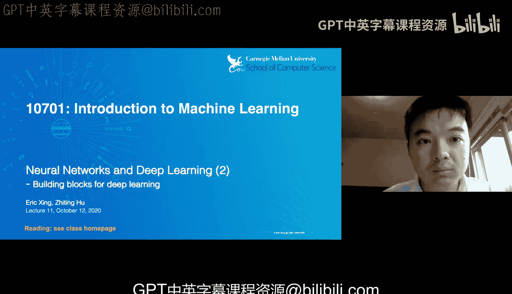

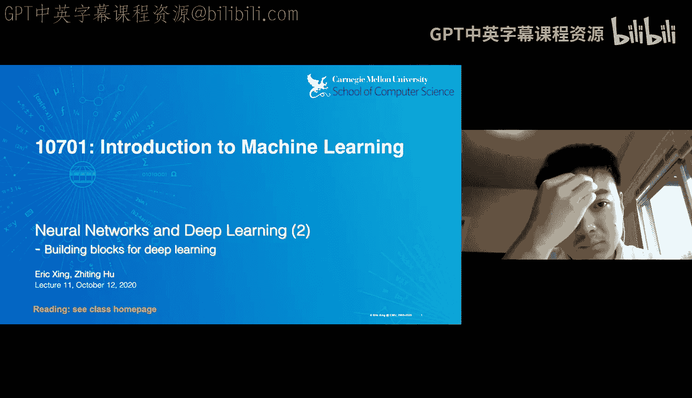

在本节课中，我们将继续探讨神经网络与深度学习。我们将学习构成现代深度学习模型的核心构建模块，包括卷积网络、循环网络、注意力机制以及Transformer。课程内容将力求简单直白，以便初学者理解。

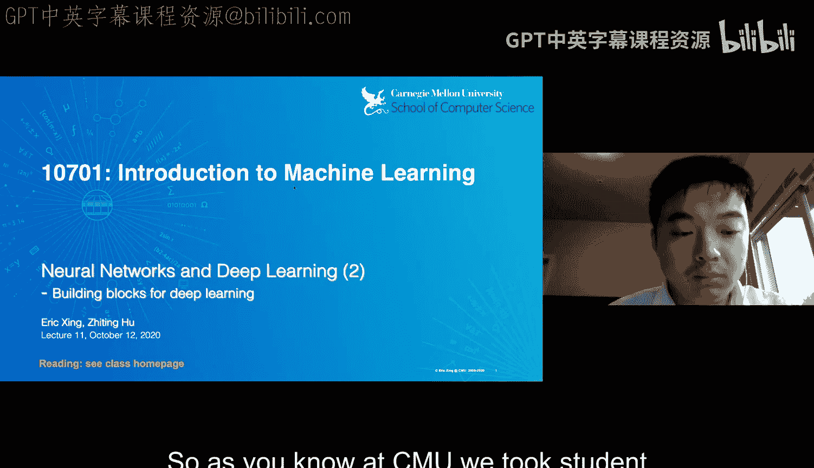

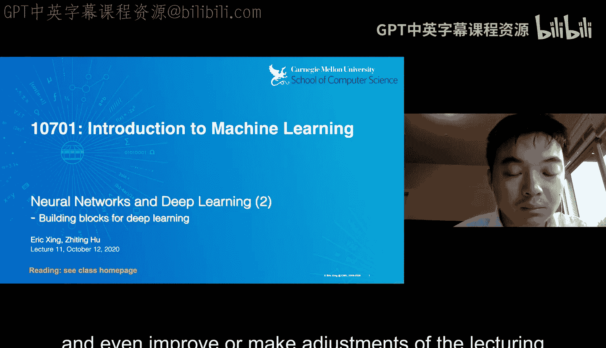

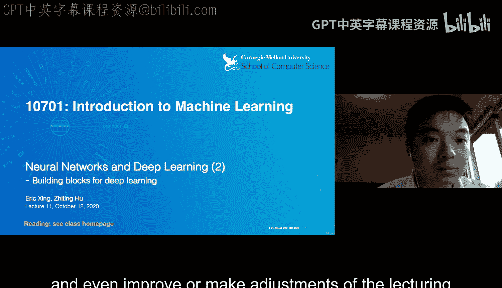

---

## 课程概述

大家好。今天我们将继续讨论神经网络与深度学习。

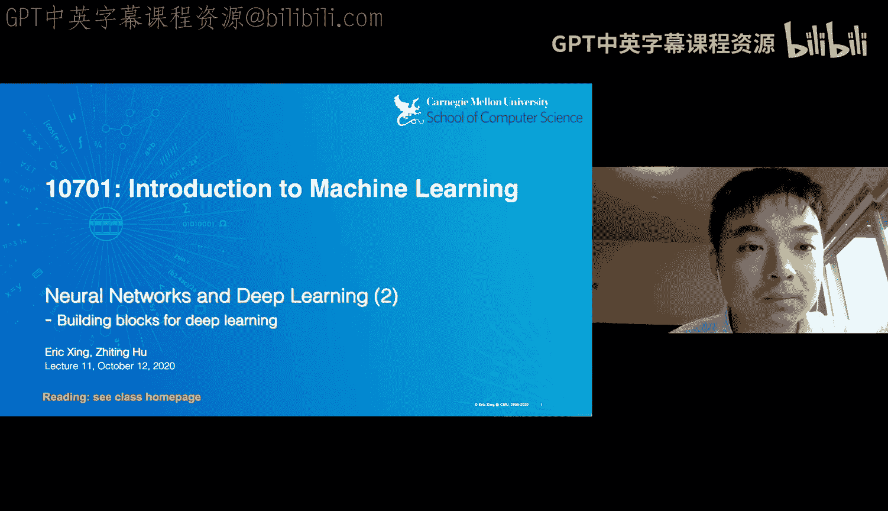

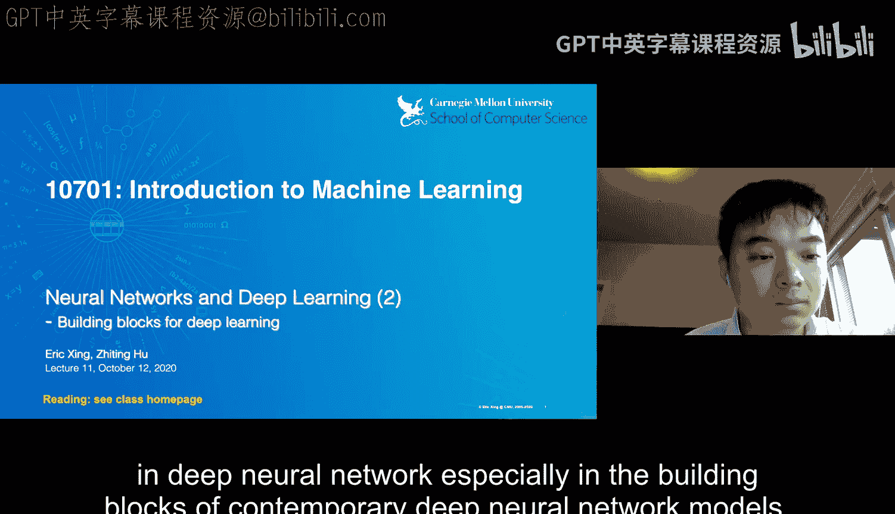

在开始之前，有一个重要通知。卡内基梅隆大学非常重视学生对课程的反馈。我们通常会在学期中进行几次课程调查，以便收集反馈，并根据大家的意见调整教学内容和节奏。这对我们在课程进行中获取真实的进度检查非常重要。

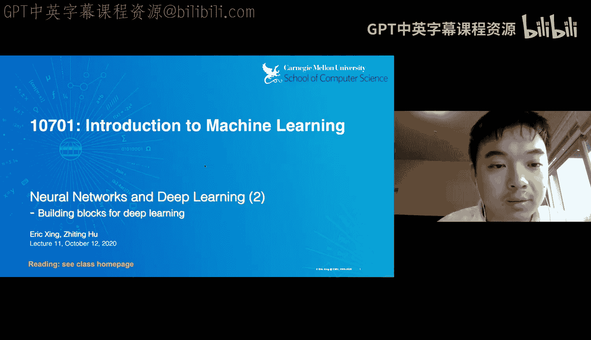

今天你们会在Piazza上看到一份期中课程调查，希望大家都能花几分钟时间填写。请尽可能坦诚地提供反馈，我们会认真对待，并根据需要做出调整。

现在回到正题。我原本计划讲授今天的课程，但在准备过程中，我认为邀请一位更合适的专家来讲解会更好。这位专家本身就是今天要讨论的许多深度学习材料，特别是当代深度神经网络模型构建模块的创建者和领导者。

我们有幸邀请到J Tinghu教授，他曾是我的学生，最近毕业，即将成为加州大学圣地亚哥分校的机器学习与计算机科学教授。他欣然同意就今天的主题进行客座讲座。他是多个领域的专家，特别是在使用逻辑规则进行深度神经网络学习、语言生成以及其他应用方面。

接下来，我将把讲台交给J Tinghu教授，由他来主持今天的讲座。

谢谢Eric。大家好。今天我们将讨论深度学习的构建模块。

---

## 人类大脑的启示

首先，让我们思考人类大脑是如何表示和理解世界的。我们知道，大脑能够以某种方式组合和重组简单的概念，以形成更复杂的思维。

例如，我们知道“CMU”这个概念，也知道“自己”这个概念。然后我们就能理解“我喜欢CMU”这个句子的含义。这种组合性是我们大脑的关键能力，尽管我们并不确切知道大脑是如何实现这种组合语义表示的。

类似地，在神经网络中，我们今天将看到一种非常相关的、类似的组合性视角。我们将看到，这些不同的、非常复杂的神经网络模型，实际上是由更简单的子组件构成的。

最终，我们会看到一种类似乐高积木的结构。不同的简单组件被组合成更复杂的模型。这就是组合式机器学习的概念。整个机器学习领域中不同的模型和学习方法，本质上都可以分解或拆分为简单的构建模块概念。

因此，我们得到了一份构建模块的目录。这些构建模块支持模块化编程。我们可以将数据结构、损失函数和学习算法组合在一起，形成相当复杂的机器学习功能。

在此基础上，我们可以获得一些直观的概念级API，用于编程和创建机器学习解决方案。我们还将看到一些真正实现这些概念的实际工具，使我们能够轻松地在算法之间切换，并可以插入或拔出模块，而无需更改其他不相关的部分。

这是本次讲座的总体概念和提纲。我们将讨论深度学习中的不同具体构建模块，主要包括卷积网络、循环网络、注意力机制，最后将讨论Transformer——一种在多项任务中达到最先进性能的特殊注意力机制。

讲座期间，如果大家有任何问题，请随时打断我，或者可以在聊天框中输入问题，我稍后会在每个部分结束后进行解答。

---

## 基本构建模块：神经元与层

我们从最基本的深度学习构建模块开始。我们在上一讲中已经见过这个，可以将其视为最基本的构建模块。

你有一些输入，例如 `x1, x2, ...`。你通过将 `x` 与参数 `W` 相乘来进行线性变换。然后，你将结果输入一个所谓的激活函数，以产生非线性效应。

例如，我们可以使用ReLU激活函数。这样，对于任何输入，你都会得到一些非线性效应。我们还有其他激活函数，如Sigmoid等不同选择。

尽管神经元本身很简单，但我们可以将这些神经元组合成更复杂的组件，称为神经层。这些层有不同的结构。

基本上，我们可以通过不同方式连接这些神经元来获得不同类型的层，例如全连接层，或者我们稍后将在本讲座中看到的带有池化的卷积层。循环网络中的循环层，基本上是一个神经元组件的序列，以便能够读取序列数据。

此外，像ResNet是卷积网络的一个特例。

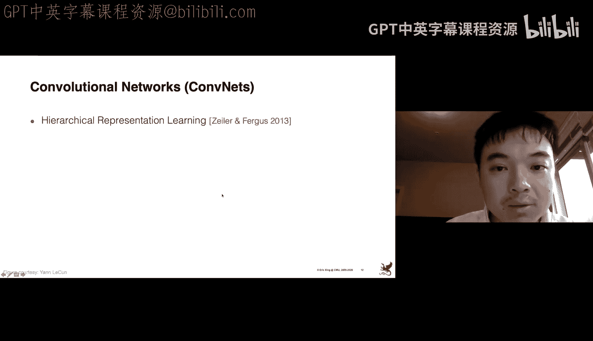

除了给定层的神经架构，另一个组件是所谓的损失函数。它驱动模型学习，以找到最佳参数值。

这些损失函数可以是不同类型，例如用于分类或语言生成的交叉熵损失，这是最常见的损失函数之一。当然，我们也可以有其他类型的损失函数，例如用于回归的均方误差。

将所有这些东西放在一起，我们可以构建一个相当复杂的模型。这是一个特定示例，展示了GoogleNet用于图像分类的部分架构。

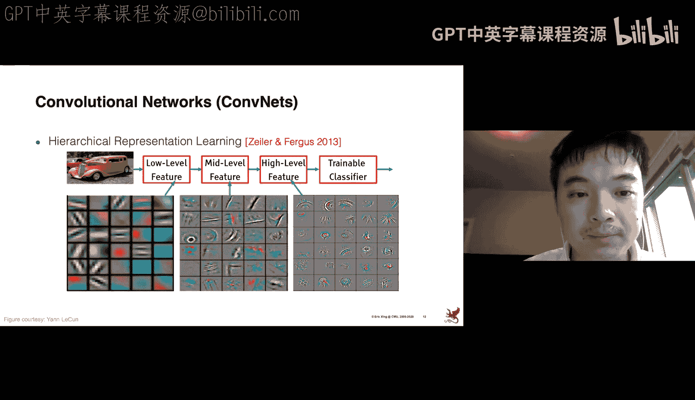

在这个非常复杂的架构中，网络的不同部分本质上就是不同的构建模块。这里我们有卷积块，我们使用池化（如平均池化或最大池化）来聚合来自前一层的信息。我们可能有全连接层来进行进一步的变换。

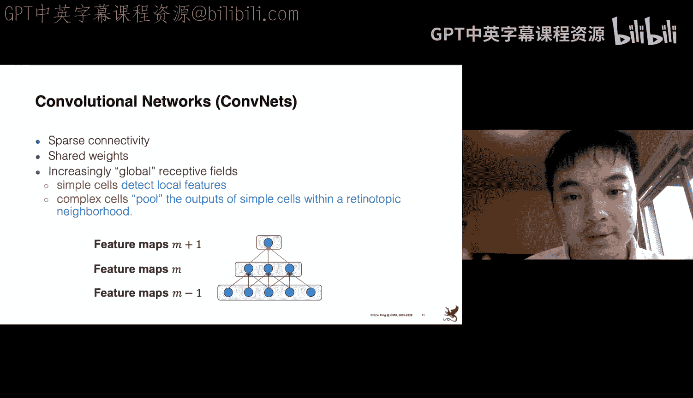

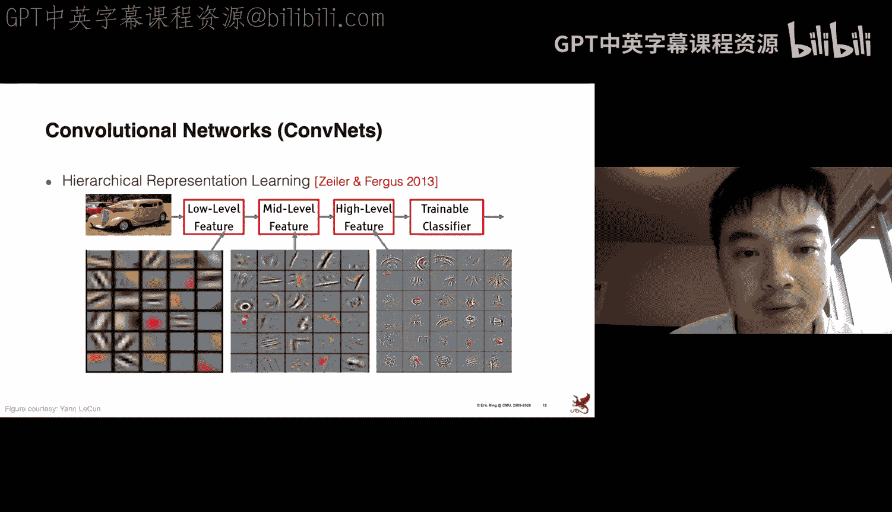

我们可能使用连接作为另一种整合信息的方式。在最后一层，我们应用激活函数以获得另一层非线性，并应用损失函数（如交叉熵损失）来定义当前模型状态的质量。然后我们通过最小化损失来进行训练。

我们可以看到，我们实际上可以组合这些基本构建模块，并在不同任务上应用不同的损失函数。只要有足够的数据，通过这些非常复杂的架构，我们通常可以获得令人印象深刻的结果，例如图像分类和机器翻译任务。

这些基本上是“白盒”模型。通过这些神经组件的构建模块，我们学习数据的表示。网络学习数据越来越抽象的表示，这些表示在某种程度上是解耦的，特别是在GoogleNet这个特定案例中。

所谓解耦，是指这些神经表示的维度易于进行线性分离。例如，你可以看到特征的某个特定维度代表了输入图像的特定概念，比如颜色或形状。

稍后我们将看到更多关于这些学习到的表示的例子。

有了这些非常通用的概念，现在让我们深入探讨更具体的模型。

---

## 卷积神经网络

首先是卷积网络。卷积网络或许是当前计算机视觉领域应用最广泛的神经模型。

卷积网络基本上是从生物学中获得的灵感，特别是来自我们的视觉皮层结构。这里有一些基本概念。

**感受野** 是核心概念之一。基本上，如果你了解视觉皮层的结构，这个皮层包含不同细胞的复杂排列。这些细胞对视觉场中的小子区域敏感。

卷积网络就是受此启发。给定细胞（神经元），至少有一个特定的神经元对输入的一个小子区域敏感。例如，对于这张原始图像，这个神经元对图像的特定区域敏感。这些子区域拼接起来覆盖整个视觉场。

基本上，这个网络利用了自然图像中存在的空间局部相关性。不同的神经元对不同的子区域敏感。在这张图片中，你可以看到这些局部特征。

此外，在我们的自然图像中，有一个很酷的特性，即所谓的**平移不变性**。例如，将这个人稍微向右移动，这张图像仍然是关于这个人的。这就是平移不变性。卷积网络的设计就是为了将这种平移不变性融入到模型架构中。

这些细胞在卷积网络中我们也称之为局部滤波器。基于我们刚刚看到的架构，卷积网络有几个关键特性。

它具有**空间连接性**。因为给定一个神经元只对输入特征的一个子区域敏感，所以这个特定的神经元只连接到前一层的一部分神经元，而不是前一层中的所有神经元。

我们进行**权重共享**。例如，图中相同颜色的连接基本上共享权重。这基本上就给了你平移不变性的概念。例如，一个人在这里，这个神经元可以捕捉到这个信号；当这个人平移到右边时，这个神经元仍然可以捕捉到这个概念。

通过这种堆叠，神经网络可以逐渐捕捉输入图像中的全局概念。因为在这里，这个神经元的感受野包括了前一层中的这三个神经元。如果我们再往上一层，至少那里的神经元可以从这三个神经元接收信号，而这三个神经元又从所有这些神经元获取信号。因此，我们可以逐渐获得全局感受野。

较低层的简单细胞将检测局部特征，而复杂细胞将聚合简单细胞在邻域内的输出，以获得更高层次的图像。

通过这种分层架构，模型可以捕捉这些越来越抽象和高级的特征。这是一个特定示例，给定这张输入图像。

卷积网络的较低层获得边缘和角落等概念。如果我们研究中间层学习到的特征，我们会得到一些更复杂的概念。如果我们进一步深入到更高层，我们会得到更高级的特征，比如这些更复杂的模式和概念。

我看到有人举手。请讲。

**提问**：我想问一下，这和传统的神经网络有什么区别？

**回答**：传统的神经网络是指多层感知机，基本上是全连接层，每一层都与前一层完全连接。这是最基本的神经网络。而对于卷积网络，它被设计成具有这种更特殊的架构，它不是完全连接的。我们有这些空间连接、共享权重等。通过这种方式，我们将平移不变性等归纳偏置编码到神经模型中。换句话说，这个模型保证了能够识别图像中的平移不变性。这是与之前MLP的关键区别。

有了卷积网络，我们可以学习分层表示。

这是最基本的卷积网络架构。AlexNet是第一个大规模卷积网络，在ImageNet图像分类任务上真正取得了令人印象深刻的、当时最先进的性能。

AlexNet由8个卷积层组成。后来，我们得到了更深更大的卷积网络，称为VGG，由19层组成。我们之前看到的GoogleNet甚至更深。

现在，最新、最先进的图像分类器是所谓的残差网络ResNet构建的。它比以前的版本要深得多，例如可以包含多达100层甚至1000层。

这些是卷积网络的更高级版本。基本上，你可以将它们视为卷积层的不同组合。

这是对卷积网络的非常简短快速的介绍。关键概念是关于感受野以及神经元之间的特殊连接，以实现编码平移不变性的归纳偏置。

---

## 循环神经网络

接下来是循环网络。从卷积网络到循环网络，其动机在于：卷积网络，正如我们刚刚看到的，更多的是关于空间建模。一个神经元负责输入图像的特定子区域。我们可以将其简化为这种单步模型：输入一张图像，输出是该图像的特征。这是一步建模。

那么，如果我们的输入是一个序列呢？例如视频，我们有一系列帧或图像序列。或者在语言建模中，输入是一个词元序列。在这些情况下，我们需要序列建模来处理序列数据。

其思想是，我们可以重复使用这个特定的架构来逐步读取序列数据。这基本上导致了所谓的循环网络。

如果我们为序列数据展开这种循环，我们就会得到这种架构。例如，在语言建模中，我们逐个输入词元。假设第一个词元，我们使用卷积网络或MLP来捕获特征。然后，基于第一步的特征，我们可以进一步输入句子中的第二个词元，并获得第二个词元的特征。这个过程继续进行，我们获得整个序列的特征。

因此，我们可以看到循环网络用于序列建模。

与卷积网络或单步MLP相比，在卷积网络中，给定输入，我们有固定数量的计算步骤，输入会经过所有预先指定的层，然后输出。在循环网络中，这种计算不是固定的，它实际上取决于你的句子长度，即句子中的词元数量。例如，如果句子中有10个词元，那么你将应用这个特定模块10次，以捕获所有词元的所有特征。

同样，在卷积网络中，我们有不同的变体，如ResNet或AlexNet；在循环网络中，我们也有针对不同任务的不同形式或架构。

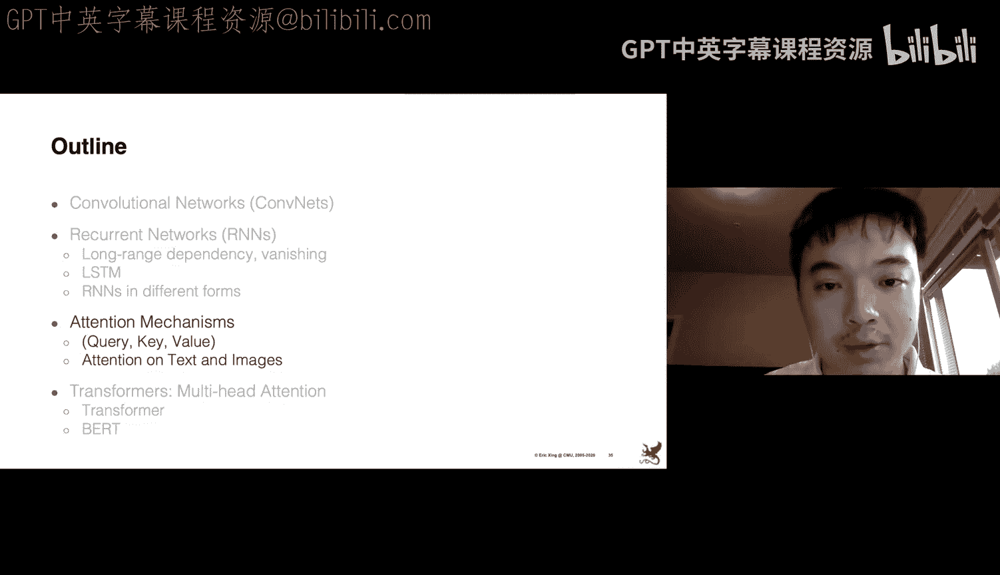

我们可以将图像分类视为循环网络的一个特例或退化情况，它是一种单步循环网络。输入是一张图像，输出是该图像的特征或类别。这是一对一映射。

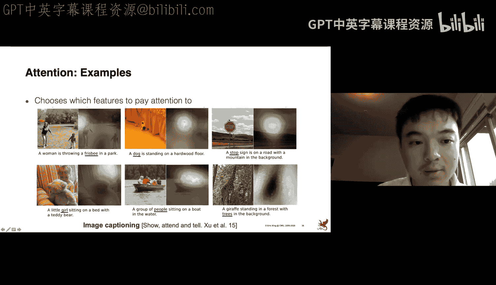

我们可以进行一对多映射，例如图像描述：给定一张图像，我们想要生成一系列词元，即图像的描述。所以输入是图像，输出是描述中的词元。这是一对多映射。

类似地，我们可以进行多对一映射，例如句子情感分类或视频识别：输入是一个序列，如词元序列或帧序列，输出是单个标签，例如句子的积极/消极情感或视频中的动作标签。

更进一步，我们可以进行多对多映射，例如机器翻译：输入可以是德语句子，输出可能是英语句子。我们将这类任务称为序列到序列，即将一个序列映射到另一个序列。

在多对多映射中，还有另一种情况，例如命名实体识别。输入是一个句子，对于句子中的每个词元，我们想预测一个标签，例如该词元是否属于某个特定实体。你可以看到这种多对多映射与那种多对多映射在架构上的区别：在这里，输出与输入的长度相同，我们对输出和输入词元进行一一映射；而在那里，映射方式更灵活，输出句子的长度可能与输入句子不同。

对于这种多对多映射，我们通常称之为序列标注任务。我们为输入句子中的每个词元打标签或标注。

我看到有人举手。

**提问**：关于一对多的RNN，我想知道如果我们没有输入序列，这和普通神经网络有什么区别？

**回答**：对于标准的卷积网络，输入是一张图像，一个单步输入，你得到一个输出，一个标签。而对于这种一对多映射，例如图像描述，情况非常相似。你并不知道输出的长度，你可能生成一个包含10个或100个词元的句子。所以在输出部分，你将使用循环网络生成一系列词元。你无法真正使用卷积网络来生成可变长度的序列。这回答了你的问题吗？

**提问者**：是的，有帮助。

这些是循环网络的基本常用形式。

在标准的循环网络中，存在一个瓶颈或训练神经网络的关键挑战。我们称这些挑战为梯度消失或梯度爆炸。

以下是更详细的说明。循环网络内部的计算是这样的：我们有一个词元序列。计算过程如下：我们有初始特征 `h0`。我们输入第一个词元，进行一些计算，得到第一步的特征。然后，这个特征会被馈送到下一步，以结合第二个词元，再次经过参数 `W` 的计算，进行激活，得到第二步的特征。这个过程会重复，直到我们读入句子中的所有词元。

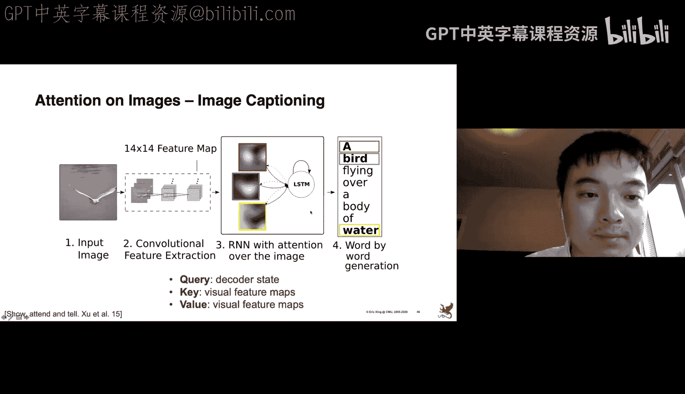

问题在于，假设在最后一步，我们计算损失，例如交叉熵损失。然后基于这个损失，我们想使用梯度反向传播来最小化损失，图中用红色箭头表示。

这里的问题是，经过这一长串计算，在反向传播时，要计算初始特征 `h0` 的梯度，会涉及许多 `W` 的因子，因为在这个计算链中，我们基本上一次又一次地乘以 `W`。在反向传播中，这个梯度也会涉及许多 `W` 的因子。

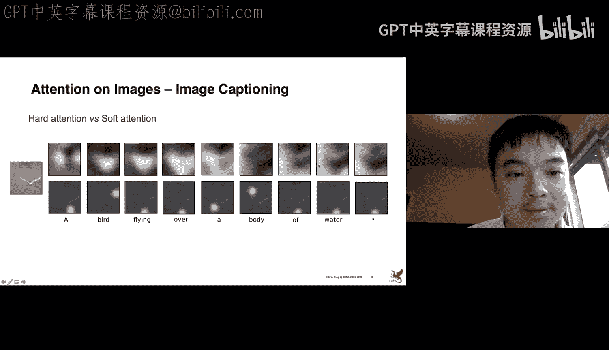

问题是，当参数 `W` 的最大奇异值大于1时，我们基本上会遇到梯度爆炸问题，因为我们一次又一次地应用 `W`，梯度的幅度会被反复放大，最终梯度会爆炸。

如果最大奇异值小于1，我们会遇到梯度消失问题，通过一次又一次地乘以 `W`，梯度会趋于零，使得训练非常低效。

对于梯度爆炸，我们可以有一些技巧，例如进行梯度裁剪：当梯度大于某个阈值时，我们强制裁剪梯度。但梯度消失问题则更难有类似的技巧来解决。更多细节，你可以参考这些论文进行理论分析。

有任何问题吗？我有个问题。

**提问**：等等，奇异值是什么？你取的是什么的奇异值？

**回答**：对于任何矩阵，你都可以通过SVD分解计算其奇异值。这是线性代数中的概念。

**提问**：你是取矩阵 `W` 的奇异值吗？

**回答**：是的，参数矩阵 `W` 的奇异值。

**提问者**：好的，明白了。

由于这个计算问题，导致了另一个挑战，我们称之为长期依赖问题。例如，要对一个序列建模，假设句子是“I live in France and I know ___”。任务是预测下一个词元，答案是“French”。我们怎么知道？因为我们知道句子中的这个特定词元，以及空白处之前的几个词元。在这种情况下，这个预测可能很容易。

但是，如果句子更长呢？“I like France, a beautiful country, and I know ___ and pretty this blank.” 这个线索词离这个空白处相当远。那么如何建模这种更长的上下文或依赖关系就变得困难得多，因为梯度消失和爆炸问题。但我们确实需要训练模型来有效地捕捉这种长期依赖。

这就引出了一个解决方案，一个更系统化、更原则性的解决方案，来解决梯度消失/爆炸和长期依赖问题。这个模型称为LSTM，是循环网络的一种变体。

标准的循环网络在每个步骤内部有简单的计算。而LSTM则是一种不同的、更复杂的架构。在每个单元中，我们有多步计算。

以下是更详细的计算过程。你并不需要记住所有这些计算细节。我只是给你一个关于这个特定模型设计的一般性直觉。

LSTM设计了一些门函数来决定读取、写入和重置信息。它包括几个门函数：遗忘门、输入门和输出门。

遗忘门决定我们是否要擦除从前一个单元来的信息。输入门决定我们应该从输入中读取多少信息。输出门决定我们应该向下一步输出多少信息。

遗忘门通过这个计算决定我们想从上一步移除多少信息。这里的 `σ` 是激活函数，捕捉了我们想要移除的信息量。

聊天区有人提问：CT 是什么？我想是在上一张幻灯片上，CT 是什么？

**回答**：在LSTM中，我们有每个步骤的特征表示。`Ct` 和 `Ht` 都是特征。你可以看到，在LSTM中，`Ct` 和 `Ht` 都是每个步骤的特征。

**提问者**：明白了，谢谢。

输入门决定在单元中存储什么新信息，通过这个计算。同样，你不需要知道为什么这样设计，这更多是基于启发式。关键直觉是，我们有一个特征变换，通过这个矩阵和偏置，然后应用激活函数来捕捉我们想要纳入单元的信息比例。

然后，我们通过结合上一步的状态（由遗忘门缩放）和当前步骤的输入信息（由输入门缩放）来更新单元状态。

输出门决定我们想要向下一步或输出输出多少信息。同样，使用相同的机制，即门函数或激活函数。

通过这种架构，我们可以看到LSTM基本上构建了一条路径，用于反向传播梯度，例如从最后一步到第一步。我们有一个所谓的无间断梯度流。在这个路径中，反向传播时并不涉及与矩阵 `W` 的乘法，这本质上缓解了梯度消失或爆炸的问题。

我们已经看到了循环网络以及LSTM作为循环网络的一个特例。LSTM广泛用于语言建模，用于建模长序列。

接下来，让我们看看循环网络的更多应用。基本上，每个应用都属于这里的一个类别。

我们还可以进行双向序列建模。我们可以从左到右建模一个句子，也可以从右到左建模，以捕捉句子中不同词元之间的依赖关系。在这里，我们可以通过双向循环网络将两个方向结合起来。

我们还可以捕捉更灵活的数据结构。例如，如果输入是一棵树，比如句子的解析树，我们也可以以树形结构组织循环网络。LSTM单元的输入包括树中所有子节点的特征。

类似地，我们可以对二维序列建模。例如，对于一张图像，这基本上是一个二维矩阵，每个节点是原始图像中的一个像素。我们可以使用卷积网络来捕捉图像，也可以使用循环网络来捕捉这些数据，通过定义编码这些不同像素单元的特定顺序。例如，对于这个LSTM单元，输入包括至少世界的信息以及前一个数据库的信息。

或者，我们可以以不同的结构组织，以捕捉这种特定的依赖顺序。

那么，我们如何决定给定结构呢？这更多是基于你自己的直觉或启发式思考，即你希望如何捕捉图像中不同像素之间的依赖关系。

类似地，我们可以启用最通用的结构，即图结构。例如，首先将图像分割成不同的区域，对于每个区域，我们可以应用LSTM单元来捕捉该区域的信息，然后将不同的节点单元连接起来以建模整个图像。

我们已经看到了卷积网络和循环网络。在第三部分，我们将探讨注意力机制，这是现代神经网络中最重要的组件之一，用于真正捕捉更长的长期依赖关系，并确保提高建模、分类和预测的性能。

---

## 注意力机制

首先，让我举一个注意力的例子。这里的任务是图像描述：给定一张图像，我们想生成一个句子来描述它。

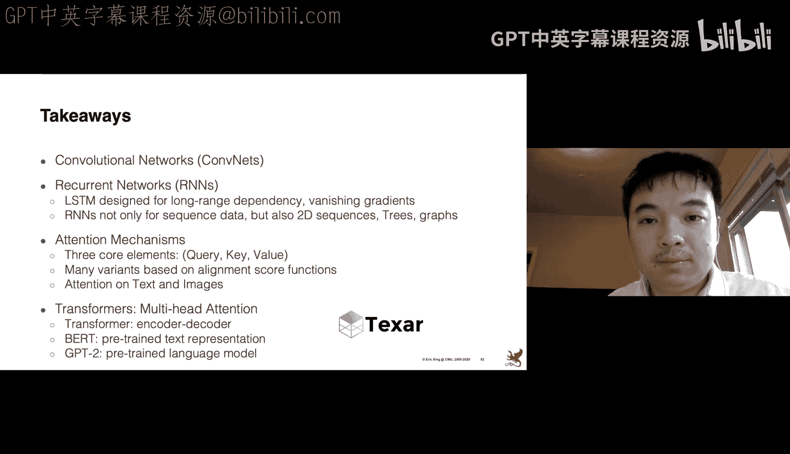

对于这张图像，当我们生成词元“stop”时，作为人类，