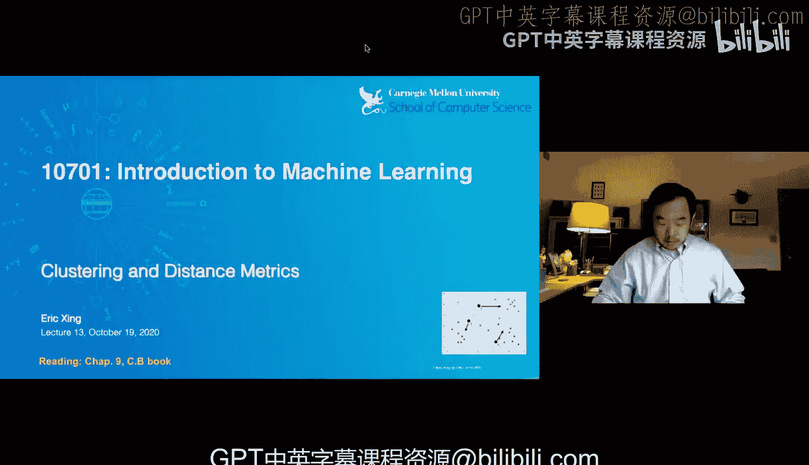
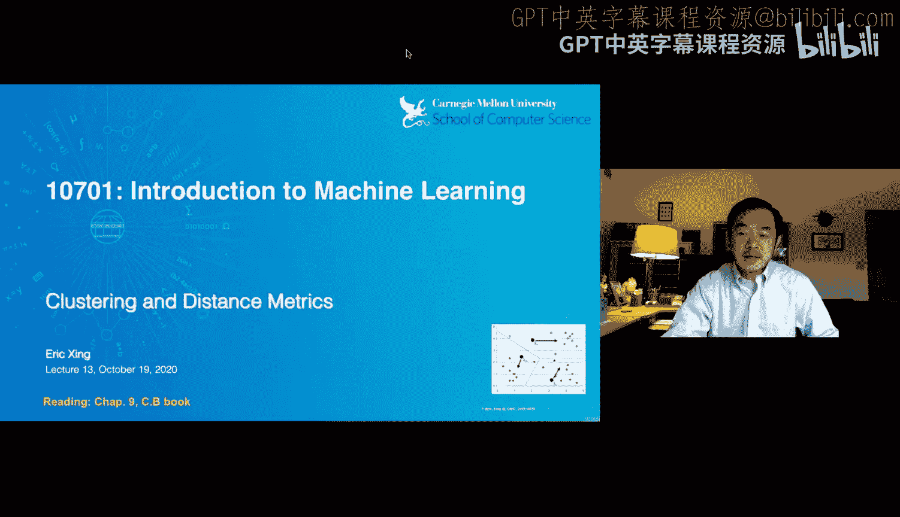
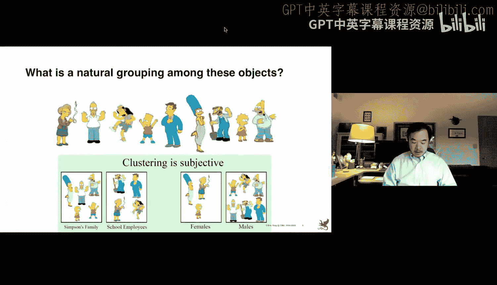
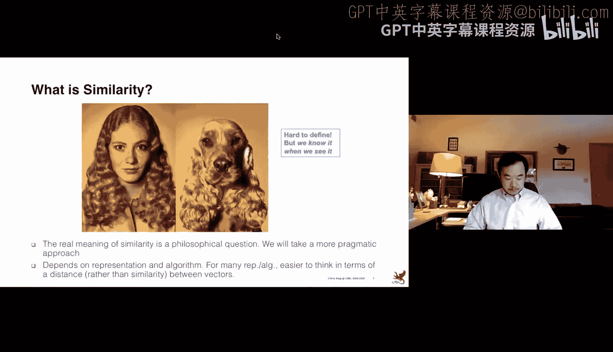
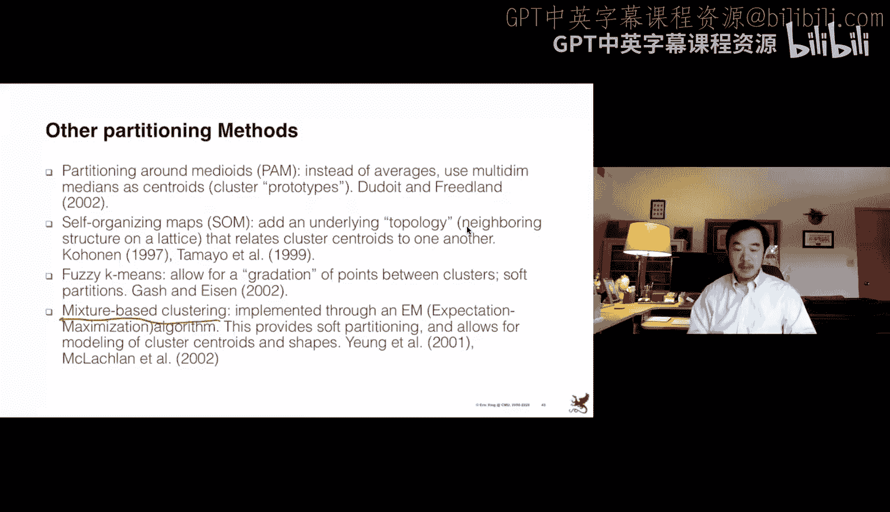
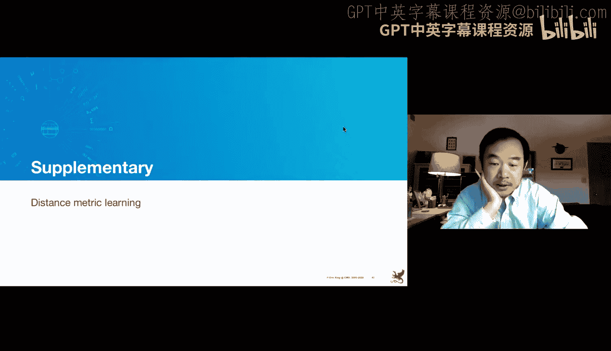
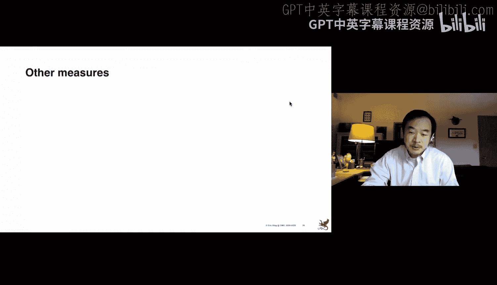
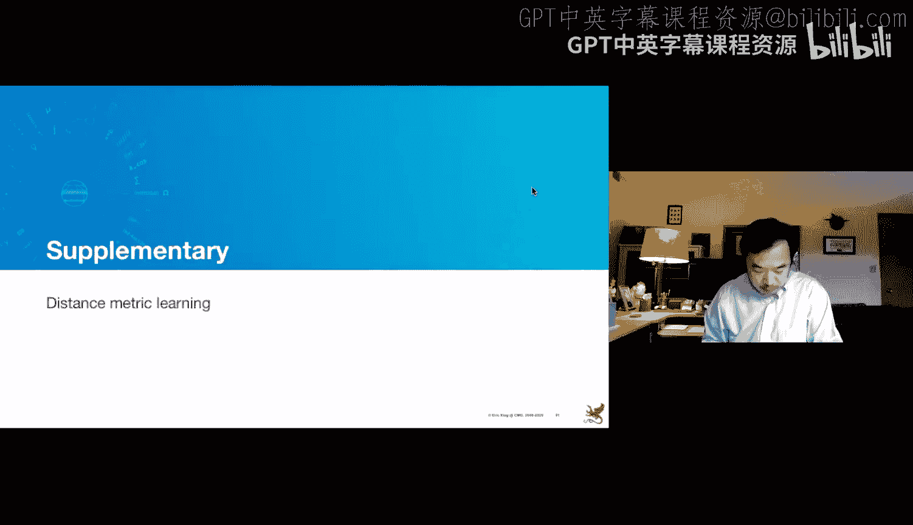
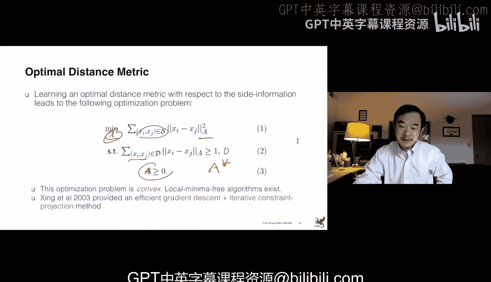

# 13：聚类与距离度量 📊

在本节课中，我们将要学习一种新的机器学习技术——聚类。我们将从监督学习领域转向无监督学习领域，探讨如何在没有标签的情况下对数据进行分组，并深入理解距离度量这一核心概念。

## 概述

聚类是一种无监督学习技术，其目标是将数据点分组，使得组内数据点相似，而组间数据点相异。与监督学习不同，聚类任务的数据仅包含特征 `X`，而没有对应的标签 `y`。本节课我们将学习聚类的核心思想、距离度量方法以及经典的聚类算法。

## 什么是聚类？

在监督学习中，我们处理的是带有标签 `(X, y)` 的数据，目标是学习一个函数 `f(X)` 来预测 `y`。而在聚类问题中，我们只有数据点 `X`，目标是回答以下问题：如何将这些数据点分组？有多少个组？用什么算法来找到这些组？

例如，对于一个二维数据集，我们可以直观地将其分为两个或三个簇。然而，当数据维度很高（如图像像素）或数据量很大时，可视化变得不可能，我们需要算法化的方法来解决聚类问题。

## 聚类的核心目标

聚类过程的核心是：**最大化组内相似性，最小化组间相似性**。这需要在没有任何监督信息的情况下实现。聚类在科学研究中非常常见，例如在天文学中，科学家可能使用聚类算法从未知的宇宙图像中发现恒星系统的模式。

然而，定义“组”本身就是一个挑战。接下来，我们将从数学上形式化相似性和相异性的概念。

## 距离度量

为了比较聚类算法，我们首先需要就“相似性”的定义达成一致。相似性通常通过距离度量来量化。一个合格的距离度量应具备以下关键属性：

1.  **对称性**：`d(x, y) = d(y, x)`。距离的测量不应依赖于点的顺序。
2.  **自相似性**：`d(x, x) = 0`。一个点与自身的距离应为零。
3.  **正定性**：`d(x, y) = 0` 当且仅当 `x = y`。距离为零意味着两个点相同。
4.  **三角不等式**：`d(x, z) ≤ d(x, y) + d(y, z)`。两点间的直接距离不大于经过第三点的距离。

违反这些属性会导致矛盾的结论，例如“Alex看起来像Bob，但Bob看起来不像Alex”。

### 常见的距离度量

假设数据点 `x` 和 `y` 是 `p` 维向量，常见的距离度量包括闵可夫斯基距离族：

**闵可夫斯基距离公式**：
`d(x, y) = ( Σ_{i=1}^{p} |x_i - y_i|^r )^{1/r}`

通过设置不同的 `r` 值，我们可以得到不同的距离：
*   **欧几里得距离** (`r=2`)：`d(x, y) = sqrt( Σ (x_i - y_i)^2 )`。即两点间的直线距离。
*   **曼哈顿距离** (`r=1`)：`d(x, y) = Σ |x_i - y_i|`。想象在网格状街道上行走的距离。
*   **切比雪夫距离** (`r→∞`)：`d(x, y) = max_i |x_i - y_i|`。各维度最大差值。

在信息论中，对于二进制特征，常用**汉明距离**（即曼哈顿距离在二进制情况下的特例）来衡量差异。

### 何时需要其他度量？

上述距离度量的是维度间的绝对差异。但在某些情况下，我们更关心模式而非幅度。例如，比较两条基因随时间变化的表达曲线，我们可能更关注它们的相关性而非绝对位置差。

这时，我们可以使用**皮尔逊相关系数**来衡量相似性。对于已中心化（均值为零）的数据，皮尔逊相关可以简化为**余弦距离**，它衡量的是两个向量方向上的差异，而忽略其长度。

**余弦距离公式**：
`cosine_similarity(x, y) = (x·y) / (||x|| * ||y||)`

另一种有趣的度量是**编辑距离**，它衡量的是将一个对象转换为另一个对象所需的最小操作步骤数（如更改颜色、发型）。这在处理离散数据（如文本）时很有用。

## 聚类算法

有了距离函数，我们如何对项目进行分组呢？这引出了聚类算法。主要分为两大类：**划分算法**和**层次算法**。

### 层次聚类算法

层次算法通过自底向上（聚合）或自顶向下（分裂）的方式构建一个树状结构（系统树图），显式地展示所有数据点之间的关系。例如，在生物分类学中，系统树图可以展示物种间的进化关系。

然而，层次聚类算法通常计算成本高昂。它需要计算所有数据点对之间的距离，这是一个 `O(n²)` 的操作。对于大规模数据集，这可能变得不可行。

在合并簇时，我们需要定义簇间距离。常见策略有：
*   **单连接**：取两个簇中最近点对的距离。
*   **全连接**：取两个簇中最远点对的距离。
*   **质心法**：计算两个簇质心间的距离。
*   **平均连接**：计算两个簇所有点对间的平均距离。

不同的连接方式会导致不同的聚类结果和系统树图。

### 划分聚类算法：K-Means

由于层次聚类的计算复杂度，划分算法更受青睐，其中最著名的是 **K-Means 算法**。该算法假设我们将 `N` 个数据点划分到 `K` 个簇中，并试图找到最佳划分方式。

以下是 K-Means 算法的步骤：

1.  **输入**：数据点 `{x_i}, i=1 to N`，簇数量 `K`。
2.  **初始化**：随机选择 `K` 个点作为初始簇中心。
3.  **迭代直至收敛**：
    a.  **分配步骤**：对于每个数据点 `x_i`，计算其到所有 `K` 个中心的距离（通常使用欧氏距离），并将其分配给距离最近的簇。
    b.  **更新步骤**：对于每个簇，重新计算其中心（即该簇所有数据点的均值）。
4.  **输出**：最终的 `K` 个簇中心以及每个数据点的簇标签。

K-Means 试图最小化一个目标函数，即所有数据点到其所属簇中心的距离平方和（簇内距离和）。

**K-Means 目标函数**：
`J = Σ_{k=1}^{K} Σ_{x_i in C_k} ||x_i - μ_k||²`
其中 `C_k` 是第 `k` 个簇，`μ_k` 是其中心。

#### K-Means 的特性与挑战

*   **收敛性**：算法保证收敛，因为每一步的重新分配和中心更新都会单调减少目标函数 `J`。
*   **局部最优**：K-Means 可能收敛到局部最优解，而非全局最优。结果高度依赖于初始中心的选择。
*   **应对策略**：常见的做法是进行**多次随机初始化**，运行算法，然后选择目标函数 `J` 最小的那次结果。
*   **计算复杂度**：每次迭代的计算成本约为 `O(N * K * d)`，其中 `d` 是维度。通常迭代次数 `L` 远小于 `N`，因此总体效率高于层次聚类。

## 如何选择簇的数量 K？

确定最佳簇数量 `K` 是一个难题。以下是一些实用方法：
1.  **肘部法则**：绘制不同 `K` 值对应的簇内距离和 `J`。`J` 会随着 `K` 增大而减小。选择 `J` 下降速度突然变缓的点（像肘部），作为 `K`。
2.  **领域知识**：根据实际问题背景选择有意义的 `K`。
3.  **实用性方法**：从一个较大的 `K` 开始，运行聚类后，检查是否有簇非常稀疏（包含极少数据点）。如果有，则减少 `K` 并重试。
4.  **高级方法**：在贝叶斯非参数推断（如狄利克雷过程混合模型）中，将 `K` 视为一个可以从数据中推断的随机变量。

## 评估聚类结果

如何评估聚类的好坏？除了算法自身的最小化目标（如 K-Means 的 `J`），我们还可以使用外部标准：
*   **纯度**：对于每个算法生成的簇，找出其包含最多的那个真实类别标签的样本数，除以簇大小，得到该簇的纯度。然后对所有簇的纯度求平均。纯度越高，说明聚类结果与真实类别越吻合。
*   **标准化互信息**：一种更复杂的度量，利用信息熵来衡量聚类结果与真实标签之间的一致性。

## 度量学习

有时，标准的距离度量（如欧氏距离）并不适合特定的聚类任务。例如，对于高速公路上的车辆 GPS 点，我们可能希望按车道聚类，而不是按空间近邻聚类。

**度量学习** 允许我们利用一些**侧信息**来自动学习一个合适的距离度量。侧信息通常以“约束对”的形式给出：
*   **必须连接约束**：指明某些点对是相似的。
*   **不能连接约束**：指明某些点对是不相似的。

算法目标是学习一个马氏距离矩阵 `A`：

**马氏距离公式**：
`d_A(x, y) = sqrt( (x - y)^T A (x - y) )`

通过学习矩阵 `A`，算法可以自动放大相关维度、缩小不相关维度，从而在变换后的空间中，使用常规聚类算法（如 K-Means）就能得到期望的结果。这是一个凸优化问题，可以高效求解。

## 总结

本节课我们一起学习了无监督学习中的核心技术——聚类。
*   我们首先理解了聚类的目标：在无标签数据中发现内在分组结构。
*   接着，我们学习了距离度量的重要性及其数学属性，包括欧氏距离、曼哈顿距离、余弦距离等。
*   然后，我们探讨了两种主要的聚类算法：计算成本高但能揭示层次结构的层次聚类，以及高效实用但可能陷入局部最优的 K-Means 划分聚类。
*   我们还讨论了选择簇数量 `K` 的挑战以及评估聚类结果的方法。
*   最后，我们简要介绍了度量学习，它允许算法从少量侧信息中自动学习更适合特定任务的距離度量。

聚类是一个广阔而深入的领域，本节课提供了基础概览。在接下来的课程中，我们将深入探讨 K-Means 的一般化形式——期望最大化算法。