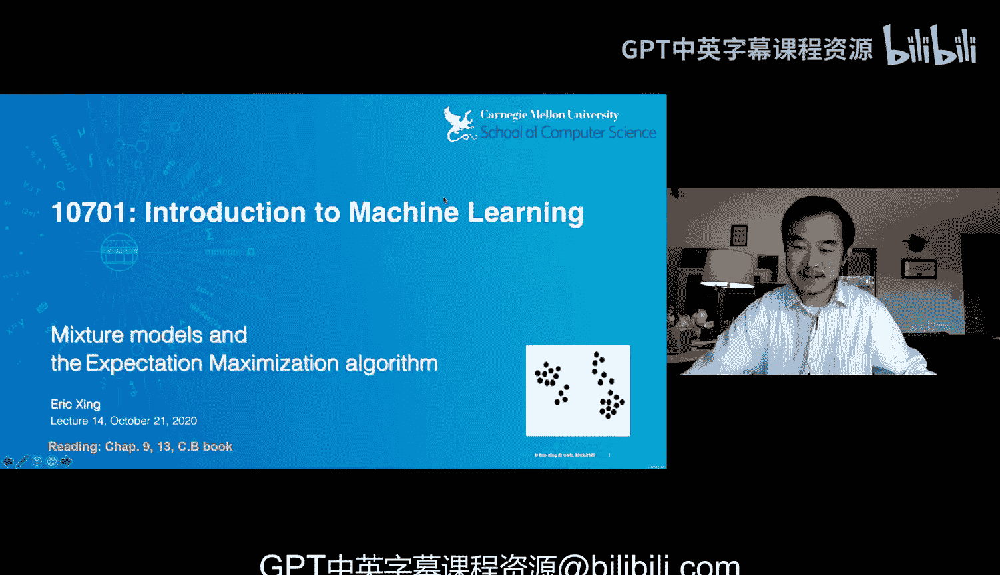
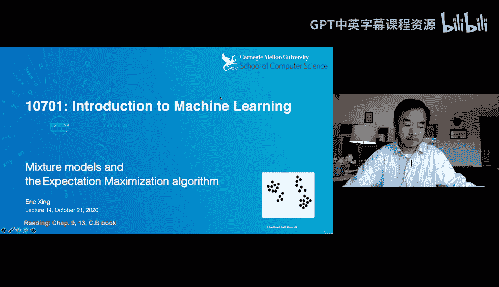

# 14：混合模型与期望最大化算法

在本节课中，我们将学习混合模型以及用于参数估计的期望最大化算法。这是对上一讲聚类问题的延续，我们将从更理论化的视角，深入理解K均值算法背后的原理，并学习其更通用的版本——期望最大化算法。

## 关键概念回顾

在推导公式之前，我们先快速回顾一些将要用到的核心统计概念。

**伯努利分布**用于描述二元随机变量的概率分布。例如，抛一枚硬币，结果X为1（正面）或0（反面），概率为P。其概率质量函数可写为：
`P(X=x) = p^x * (1-p)^(1-x)`
其中x为0或1。

**多项分布**用于描述具有多个可能结果的离散事件，例如掷骰子。我们通常使用**独热编码**或**指示变量**表示法。设可能结果有K种，则随机变量Z是一个K维向量，其中只有一个维度为1，其余为0。第k个结果出现的概率为θ_k。其概率可写为：
`P(Z=z) = ∏_{k=1}^{K} θ_k^{z_k}`
由于独热性质，实际上只有对应结果k的θ_k项会被保留。

对于离散分布，给定n次独立观测后，参数θ_k的**最大似然估计**很直观，就是该事件发生的频率：
`θ_k_hat = (事件k发生的次数) / n`

对于连续变量，最常用的是**高斯分布**。一维高斯分布的概率密度函数为：
`N(x | μ, σ^2) = (1/√(2πσ^2)) * exp(-(x-μ)^2/(2σ^2))`
多维高斯分布的概率密度函数为：
`N(x | μ, Σ) = (1/((2π)^{D/2}|Σ|^{1/2})) * exp(-1/2 (x-μ)^T Σ^{-1} (x-μ))`
其中D是维度，μ是均值向量，Σ是协方差矩阵。

其参数的最大似然估计同样直观：均值μ的估计是样本均值，协方差矩阵Σ的估计是样本协方差矩阵。

**条件高斯分布**描述了一种现象：观测数据X可能来自多个高斯分布之一，而具体来自哪一个由另一个离散变量Y（例如类别标签）指示。其似然函数可以写为：
`P(X=x | Y=k) = N(x | μ_k, Σ_k)`
如果我们不知道Y的具体值，但想容纳所有可能，可以写成一个更通用的形式。

上一节我们回顾了基础的概率分布。本节中，我们将回到课堂聚类问题，并引入一种新的概率模型。

## 混合模型

在课堂聚类问题中，我们只观测到数据点X，而没有观测到它们的类别标签Y。为了给这类数据建立似然模型，我们引入**混合模型**。

混合模型可以可视化为多个概率分布（例如高斯分布）的叠加。整个密度函数会呈现多峰形态，而不再是单一高斯那样的单峰形状。更准确地说，混合模型假设每个数据点都来自多个**成分分布**中的一个，并由一个**隐变量**Z来指示它具体来自哪一个成分。

隐变量Z之所以称为“隐”，是因为我们无法直接观测到它。引入Z是为了让数学推导和推断过程更直观、更容易。在实际问题中，隐变量可能代表真实存在但无法直接测量的物理量（如恒星温度），也可能是为了建模方便而引入的概念性变量（如聚类归属）。

混合模型主要分为两类：隐变量为离散的（如聚类归属）和隐变量为连续的（如信号强度）。在深度学习中，中间层的表示也可以看作是一种连续的隐变量。

现在，我们来看一种具体的混合模型——**高斯混合模型**。

## 高斯混合模型

高斯混合模型假设数据X来自K个高斯分布的加权混合。其概率密度函数为：
`P(X=x) = ∑_{k=1}^{K} π_k * N(x | μ_k, Σ_k)`
其中，π_k是混合权重，满足∑π_k = 1且π_k ≥ 0；N(x | μ_k, Σ_k)是第k个高斯成分。

这可以形象地理解为：每个数据点以概率π_k选择第k个高斯成分，然后从这个成分中生成数据x。高斯混合模型非常适合用来对我们的课堂聚类数据进行建模，每个簇可以被一个高斯分布近似。

接下来，我们深入探讨高斯混合模型的数学描述。

## 高斯混合模型的数学描述

在高斯混合模型中，我们有两个随机变量：观测变量X和隐变量Z（表示成分归属）。我们需要为Z指定一个先验分布，通常是一个多项分布：`P(Z=k) = π_k`。

给定Z=k后，X的条件分布就是第k个高斯成分：`P(X=x | Z=k) = N(x | μ_k, Σ_k)`。

因此，一个数据点(x, z)的**联合概率**可以写为：
`P(X=x, Z=k) = P(Z=k) * P(X=x | Z=k) = π_k * N(x | μ_k, Σ_k)`

然而，在实际数据中，我们只观测到X，没有Z。为了得到仅关于X的**边际似然**，我们需要对Z的所有可能取值求和（即**边际化**）：
`P(X=x) = ∑_{k=1}^{K} P(X=x, Z=k) = ∑_{k=1}^{K} π_k * N(x | μ_k, Σ_k)`
这正是我们之前看到的高斯混合模型表达式。

在这个模型中，π_k被称为**混合比例**或**混合权重**，`N(x | μ_k, Σ_k)`被称为**混合成分**。虽然这里成分是高斯分布，但理论上可以是任意分布。

现在我们有了数据的似然函数。机器学习任务就是估计模型参数：所有的`{π_k, μ_k, Σ_k}`。最直接的方法是**最大似然估计**，即找到使似然函数最大的参数。

对于简单的分布（如单一高斯），我们可以通过求导数为零得到解析解（闭式解）。但对于混合模型，其对数似然函数形式为`log(∑(...))`，求导后表达式非常复杂，参数相互耦合，且难以保证约束条件（如π_k求和为1，Σ_k正定）。直接使用梯度下降等算法会遇到困难。

那么，如何解决这个问题呢？期望最大化算法提供了一种巧妙的思路。

## 期望最大化算法：直观理解

EM算法的核心思想是：虽然我们不知道隐变量Z的真实值，但我们可以“假装”知道，然后迭代地改进我们的估计。

回忆一下，如果Z是已知的（完全观测数据），那么参数估计就非常简单：
*   π_k的估计是Z=k的样本比例。
*   μ_k的估计是属于第k类的所有X的样本均值。
*   Σ_k的估计是属于第k类的所有X的样本协方差。

当Z未知时，EM算法用Z的**后验概率** `P(Z=k | X=x)` 来代替其真实指示值。这个后验概率表示，在给定当前参数和观测数据x的条件下，x属于第k个成分的概率。计算方式很直观：
`P(Z=k | X=x) = (π_k * N(x | μ_k, Σ_k)) / (∑_{j=1}^{K} π_j * N(x | μ_j, Σ_j))`

**EM算法步骤如下：**
1.  **初始化**：随机猜测K个高斯成分的参数 `{π_k, μ_k, Σ_k}`。
2.  **E步（期望步）**：固定当前参数，为每个数据点x_n计算它属于每个成分k的后验概率 `τ_{nk} = P(Z_n=k | X=x_n)`。这相当于进行“软分配”，每个点以一定概率属于各个簇，而不是像K均值那样的“硬分配”。
3.  **M步（最大化步）**：固定后验概率 `τ_{nk}`，像处理“完全观测”数据一样重新估计参数。但此时，每个数据点x_n对第k个成分的贡献是加权的，权重就是 `τ_{nk}`。
    *   `π_k_new = (1/N) * ∑_{n=1}^{N} τ_{nk}`
    *   `μ_k_new = (∑_{n=1}^{N} τ_{nk} * x_n) / (∑_{n=1}^{N} τ_{nk})`
    *   `Σ_k_new = (∑_{n=1}^{N} τ_{nk} * (x_n - μ_k_new)(x_n - μ_k_new)^T) / (∑_{n=1}^{N} τ_{nk})`
4.  **重复**：用新的参数回到E步，重新计算后验概率，如此迭代直至收敛（参数变化很小）。

由于似然函数非凸，EM算法的结果依赖于初始化，可能收敛到局部最优。实践中常采用多次随机初始化并选择似然最高的结果。

我们已经从直观上了解了EM算法。接下来，我们从优化理论的角度来审视它，理解其背后的原理。

## 期望最大化算法：理论推导

EM算法并不是一个随意的启发式方法，它可以通过优化一个称为**完整数据对数似然**的期望来严格推导。

定义**完整数据**为 (X, Z)，即包含隐变量。其对数似然为：
`log P(X, Z | θ) = log [P(Z | θ_z) * P(X | Z, θ_x)]`
如果Z已知，这个式子关于参数θ_z（即π）和θ_x（即μ, Σ）是解耦的，很容易优化。

但Z未知，`log P(X, Z | θ)` 本身是一个随机变量（因为Z随机）。我们考虑它的期望，以消除随机性。我们计算该对数似然关于隐变量后验分布 `Q(Z) = P(Z | X, θ^{old})` 的期望：
`E_{Z~Q}[log P(X, Z | θ)]`
这个期望值被称为**Q函数**。

可以证明，数据的对数边际似然 `log P(X | θ)` 可以分解为：
`log P(X | θ) = E_{Z~Q}[log P(X, Z | θ)] + H(Q) + KL(Q || P(Z|X,θ))`
其中H(Q)是分布Q的熵，KL散度衡量Q与真实后验P(Z|X,θ)的差异，且KL散度非负。

因此，我们有：
`log P(X | θ) ≥ E_{Z~Q}[log P(X, Z | θ)] + H(Q)`
不等式右边是 `log P(X | θ)` 的一个**下界**，记作 `F(Q, θ)`。

EM算法可以看作是在交替最大化这个下界 `F(Q, θ)`：
*   **E步**：固定参数θ，寻找使下界F最大的Q。可以证明，当 `Q(Z) = P(Z | X, θ^{old})` 时，KL散度为零，下界F恰好等于对数似然 `log P(X | θ^{old})`。这意味着我们找到了在当前参数下最紧的下界。这一步对应计算后验概率 `τ_{nk}`。
*   **M步**：固定分布Q（即固定 `τ_{nk}`），寻找使下界F最大的参数θ。由于H(Q)与θ无关，这等价于最大化Q函数 `E_{Z~Q}[log P(X, Z | θ)]`。对于高斯混合模型，这正好导出了我们在直观M步中给出的参数更新公式。

因此，EM算法是一种**坐标上升法**：在Q空间和θ空间交替最大化目标下界 `F(Q, θ)`，从而间接地提升我们真正关心的对数似然 `log P(X | θ)`。

## 总结

本节课我们一起学习了混合模型与期望最大化算法。

1.  我们首先回顾了伯努利分布、多项分布和高斯分布等基础概念。
2.  接着，我们引入了**混合模型**来解决含有隐变量的数据建模问题，并重点介绍了**高斯混合模型**。
3.  然后，我们从直观上讲解了**期望最大化算法**，它通过E步计算隐变量的后验概率（软分配），在M步基于此更新模型参数，迭代进行。
4.  最后，我们从理论层面推导了EM算法，揭示它本质上是通过交替最大化对数似然的一个下界来进行的优化过程，从而为这一启发式算法提供了坚实的理论基础。

EM算法是一个通用框架，其思想广泛应用于隐马尔可夫模型、因子分析等许多含有隐变量的概率模型参数估计中。