# 15：降维与子空间分析 📉

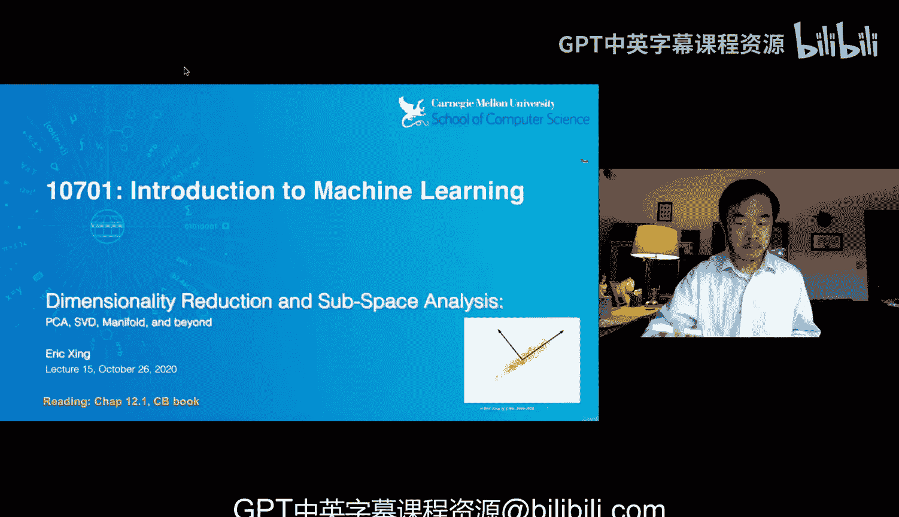

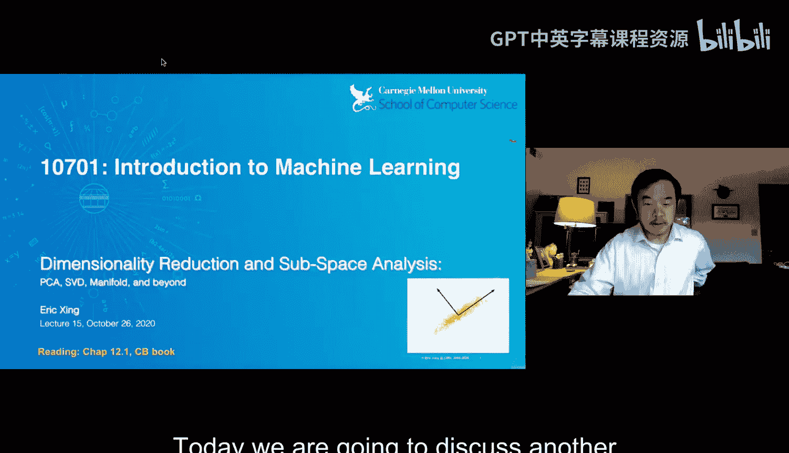

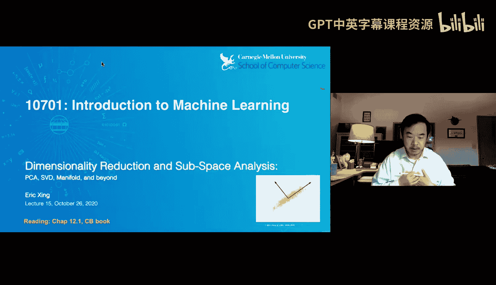

在本节课中，我们将要学习无监督学习中的另一个重要主题：降维与子空间分析。我们将探讨如何将高维数据（如文档或图像）投影到更低维度的空间中，同时保留其核心信息与结构。这有助于我们理解数据、发现潜在模式，并简化后续的计算任务。

---

## 动机：从词袋模型到概念空间

我们首先从一个经典问题出发：文档检索与分类。一种直观的文档表示方法是“词袋”模型。它将每个文档表示为一个长向量，向量的每个维度对应词典中的一个词，其值为该词在文档中出现的次数。

然而，这种表示方法存在几个明显问题：
*   **维度灾难**：词典可能包含数百万个词，导致向量维度极高。
*   **同义词问题**：例如，“汽车”和“轿车”含义相似，但在词袋模型中会被视为两个完全不同的维度，从而低估了包含这两个词的文档之间的相似性。
*   **多义词问题**：例如，“苹果”一词可能指水果或公司。仅凭词频会高估谈论不同“苹果”的文档之间的相似性。

核心问题在于，词袋模型基于表面的“词”进行表示，而非更深层的“概念”。我们希望能将数据投影到一个由“概念”或“主题”定义的新空间中，从而获得更具语义的表示。这引出了降维与子空间分析的任务。

---

## 主成分分析：寻找最大方差方向 🧭

上一节我们讨论了从词空间转换到概念空间的必要性。本节中，我们来看看如何通过数学方法找到这些关键的“概念”方向，即主成分分析。

其核心思想是：在数据点云中，找到那些数据投影后**方差最大**的方向。方差大的方向意味着数据在该方向上 spread out（分散），可能包含更多信息。相反，方差小的方向信息量较少。

假设我们有一个数据中心化（均值为零）的数据矩阵 **X**。我们希望找到一个单位方向向量 **μ**，使得所有数据点投影到该方向后的方差最大。数据点 **x** 在方向 **μ** 上的投影是 **μᵀx**。投影值的方差可以表示为：
**方差 = μᵀ (X Xᵀ) μ**
其中 **C = X Xᵀ** 是数据的协方差矩阵。

因此，我们的优化问题是：
**最大化 μᵀ C μ**
**约束条件为 μᵀ μ = 1** （保证 **μ** 是单位向量）

这是一个带约束的优化问题，可以通过拉格朗日乘子法求解。最终，我们发现最优解 **μ** 满足：
**C μ = λ μ**
这正是协方差矩阵 **C** 的**特征向量**方程。其中 **λ** 是对应的特征值，其大小代表了数据在该特征向量方向上的方差。

---

### 特征值与特征向量的关键性质

在深入PCA之前，我们需要回顾一些线性代数中关于特征值与特征向量的关键概念。

以下是特征值/向量的定义和重要性质：
*   **定义**：对于方阵 **A**，若存在非零向量 **v** 和标量 **λ**，使得 **A v = λ v**，则 **λ** 是特征值，**v** 是对应的特征向量。
*   **数量**：一个 *n×n* 矩阵最多有 *n* 个线性无关的特征向量（与其秩有关）。
*   **正交性**：对于实对称矩阵（如协方差矩阵 **C**），不同的特征向量是相互**正交**的。
*   **实非负特征值**：如果矩阵还是**半正定**的，那么其特征值均为**非负实数**。

在PCA的语境下，协方差矩阵 **C** 的特征向量被称为**主成分**。特征值 **λ** 的大小对主成分进行排序：
*   第一主成分是特征值最大的特征向量，捕获了数据中最大的方差。
*   第二主成分是与第一主成分正交的方向中，捕获剩余方差最大的方向，依此类推。
*   主成分也可以被视为对数据的一系列**最小二乘拟合**。

---

## 奇异值分解：更通用的矩阵分解工具 🔧

上一节我们介绍了基于协方差矩阵的PCA。然而，在处理像“词-文档”矩阵这样的原始数据时，人们更倾向于直接对其进行操作。这就需要用到奇异值分解。

SVD可以将任意矩形矩阵 **A** （*m×n*）分解为三个矩阵的乘积：
**A = U Σ Vᵀ**
其中：
*   **U** 是一个 *m×m* 的正交矩阵，其列向量是 **A Aᵀ** 的特征向量。
*   **V** 是一个 *n×n* 的正交矩阵，其列向量是 **Aᵀ A** 的特征向量。
*   **Σ** 是一个 *m×n* 的对角矩阵（非对角元素为零），其对角线上的元素称为**奇异值**，它们是 **A Aᵀ** 或 **Aᵀ A** 的特征值的平方根。

SVD与PCA紧密相关。如果我们对数据矩阵 **X** 进行SVD，那么 **U** 的列向量（左奇异向量）就对应着PCA中的主成分方向。奇异值的平方（Σ²的对角线元素）则对应着PCA中的特征值（方差）。

通过SVD，我们可以方便地进行**低秩近似**。如果我们只保留前 *k* 个最大的奇异值及其对应的左右奇异向量，我们就能得到原矩阵 **A** 的一个秩为 *k* 的最佳近似（在Frobenius范数意义下）：
**A ≈ Uₖ Σₖ Vₖᵀ**
近似误差由被丢弃的奇异值平方和决定。

---

## 潜在语义索引：SVD在文本中的应用 📄

现在，让我们看一个SVD/PCA在文本分析中的具体应用——潜在语义索引。

我们从“词-文档”矩阵 **A** 开始，其中行代表词，列代表文档，元素是词频。对 **A** 进行SVD分解：**A = U Σ Vᵀ**。

在分析了奇异值谱后，我们决定只保留前 *k* 个主成分（例如*k=2*）。于是：
*   **降维表示**：矩阵 **Vₖᵀ** 的列（或经过缩放后的 **Σₖ Vₖᵀ**）给出了文档在*k*维新空间中的坐标。原本高维的文档向量被压缩为*k*维。
*   **主题发现**：矩阵 **Uₖ** 的列向量代表了*k*个“主题”。每个主题向量中，权重高的词揭示了该主题的语义（例如，一个主题中“细胞”、“血液”、“疾病”等词权重高，可能代表“血液疾病”主题）。
*   **可视化与聚类**：将文档投影到二维空间（*k=2*）后，可以绘制散点图。文档在图中聚集的模式可以直观地展示其主题关联性。
*   **查询处理**：对于一个新查询文档 **q**（词袋向量），我们可以将其投影到相同的主题空间：**q_proj = Σₖ⁻¹ Uₖᵀ q**。然后计算 **q_proj** 与所有已投影文档的相似度（如余弦相似度），来检索最相关的文档。

LSI通过将数据投影到“潜在”语义空间，同时实现了降维、去噪、发现语义主题和提升检索效果等多个目标。

---

## 子空间分析的统一视角与扩展 🌐

我们刚刚深入探讨了LSI和SVD。实际上，降维和子空间分析涵盖了一系列技术，它们可以从一个统一的矩阵分解视角来理解。

考虑一个通用的模型，试图将数据矩阵 **A** 近似分解为：
**A ≈ W Λ H**
其中 **W**、**Λ**、**H** 是待求矩阵，对它们施加不同的约束，就得到了不同的子空间分析方法：

以下是几种常见变体：
*   **潜在语义索引**：**W** 和 **H** 是正交矩阵，**Λ** 是对角矩阵。这就是SVD。
*   **K-均值聚类**：约束 **H** 为“one-hot”矩阵（每列只有一个1，其余为0），**W** 的列即为聚类中心。这等价于一种硬分配聚类。
*   **概率主题模型**：约束 **W** 和 **H** 为随机矩阵（行或列和为1），这就导向了如LDA等概率生成模型。
*   **稀疏编码**：在分解基础上，额外施加稀疏性约束（矩阵中有许多零元素），以获得更简洁、可解释的表示。

这个框架表明，聚类、主题建模等方法都可以视为子空间分析的特殊形式。

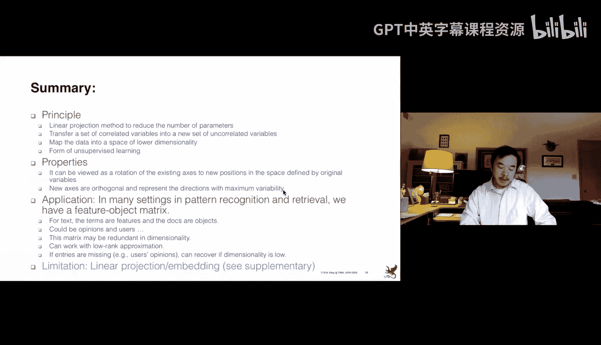

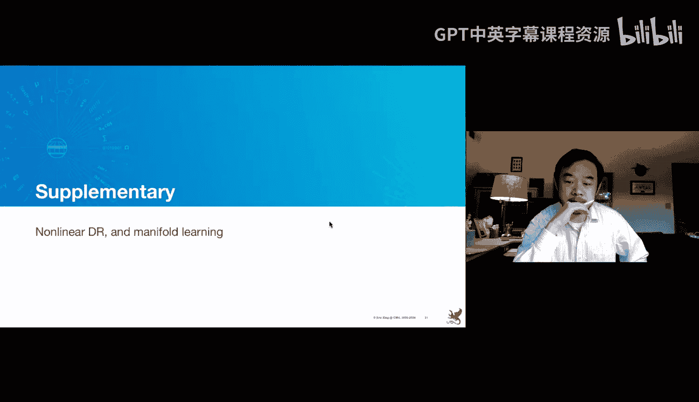

---

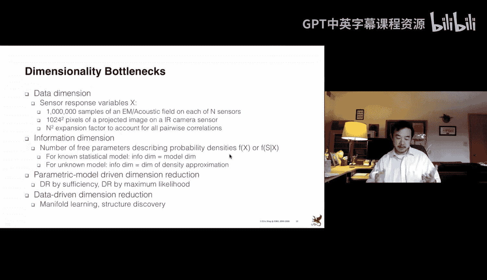

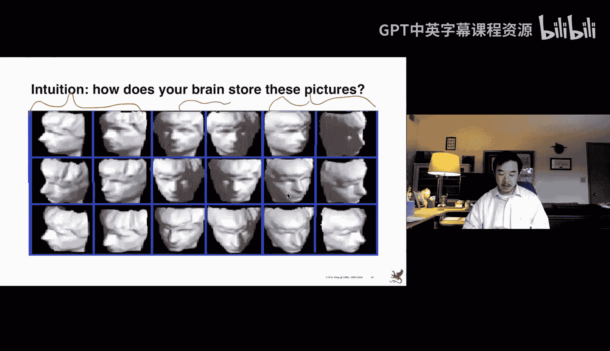

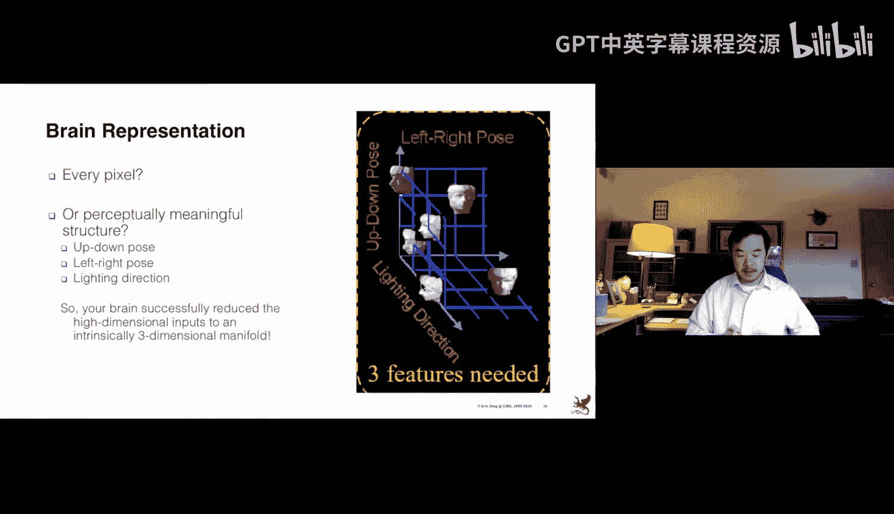

## 超越PCA：流形学习与保留特定结构 🗺️

PCA/SVD主要目标是最大化投影方差，但它不一定能保持数据点之间的局部几何关系。在某些应用中，我们希望在降维后保留数据的特定结构。

例如，考虑“瑞士卷”形状的数据。在三维空间中，A点和B点欧氏距离很近，但在数据实际分布的二维流形上，它们其实相距甚远。PCA可能会错误地将它们投影到邻近位置。

为了保持这种流形结构，我们需要改变构建相似性矩阵的方式：
*   **邻接图**：基于数据点间的欧氏距离，构建一个*k*-近邻图或ε-半径图。
*   **测地距离**：在邻接图上计算两点之间的最短路径长度，作为它们之间的“测地距离”，以反映流形上的真实距离。
*   **新的目标**：将测地距离（或其他能反映局部结构的度量）填入相似性矩阵，然后求解一个特征问题，从而得到能保持这些局部关系的低维嵌入。等距特征映射和拉普拉斯特征映射是此类方法的代表。

流形学习的核心思想是：数据可能分布在一个嵌入在高维空间中的低维流形上。降维的目标是发现这个内在的低维流形，并保持其局部几何特性，而不仅仅是全局方差。

---

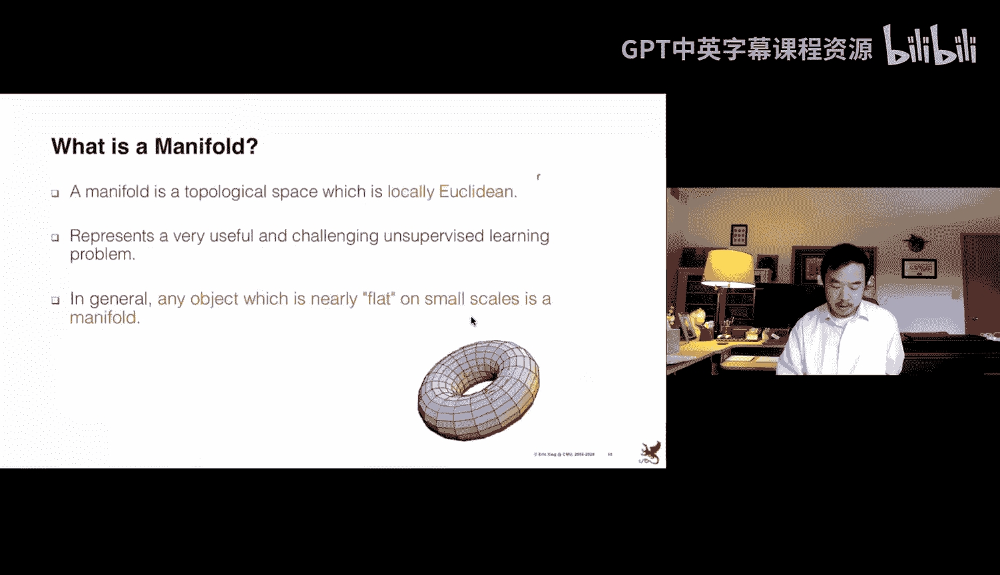

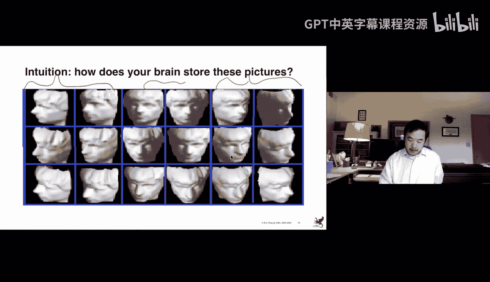

## 总结与展望

本节课中，我们一起学习了无监督学习中的降维与子空间分析。
*   我们从**词袋模型**的局限性出发，引出了学习**概念空间**的需求。
*   我们深入探讨了**主成分分析**的原理，它通过寻找数据**方差最大**的方向（即特征向量）来实现降维。
*   我们介绍了更通用的**奇异值分解**工具，并展示了其在**潜在语义索引**中的应用，用于文本的主题发现、降维和检索。
*   我们从统一的矩阵分解视角，看到了**聚类**、**主题模型**等都是子空间分析的特例。
*   最后，我们探讨了超越PCA的**流形学习**，其目标是在降维时保留数据点间的**局部几何结构**或**测地距离**。

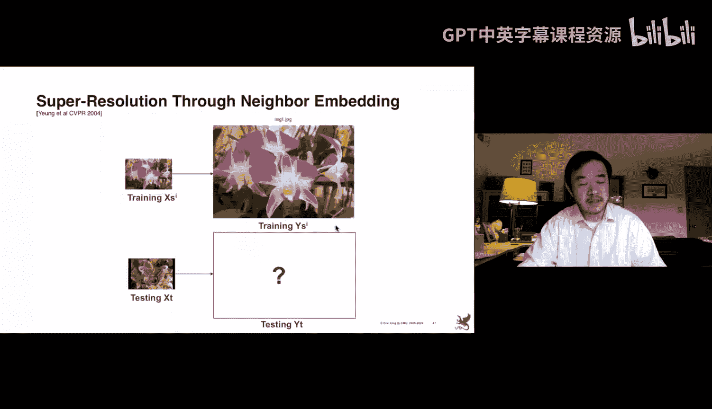

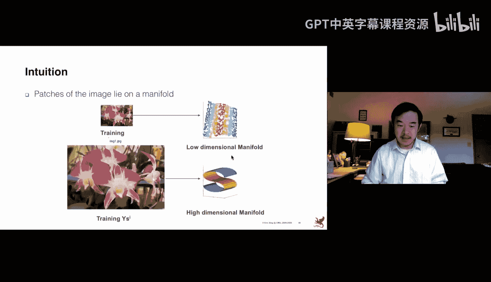

降维是理解高维数据、提取特征、加速计算和可视化的重要工具，其思想贯穿于机器学习的许多现代进展中。