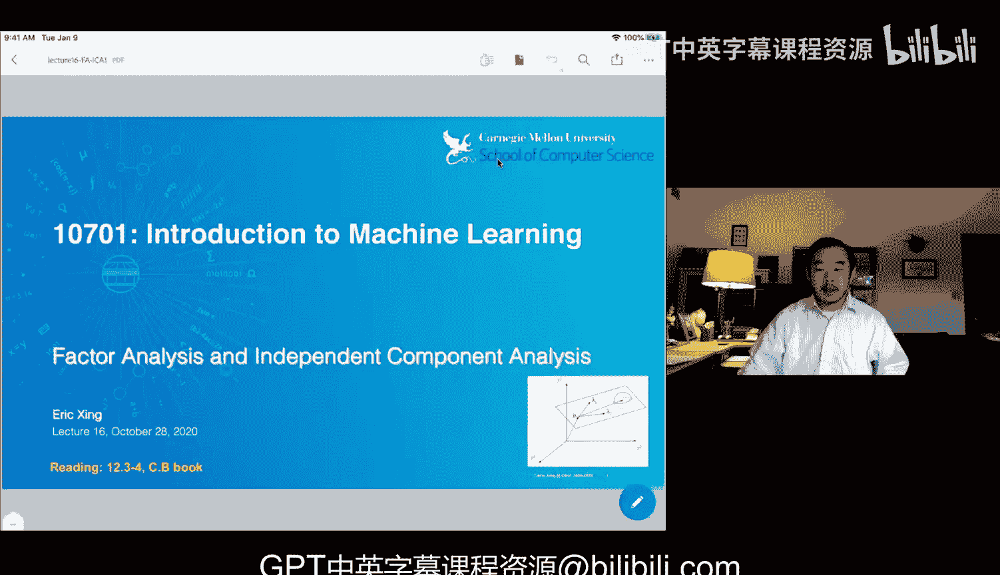
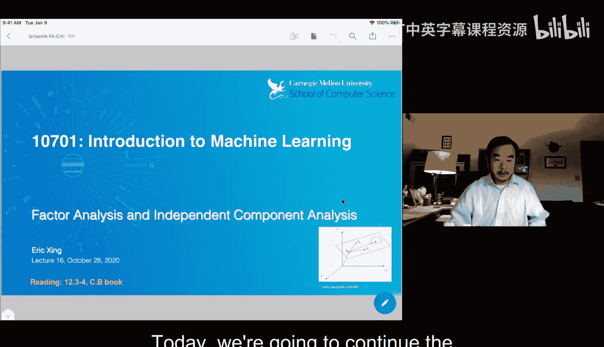
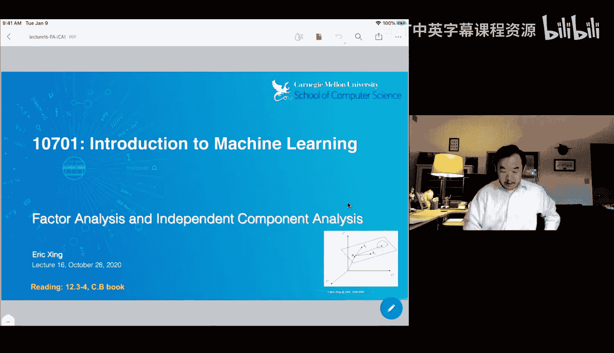
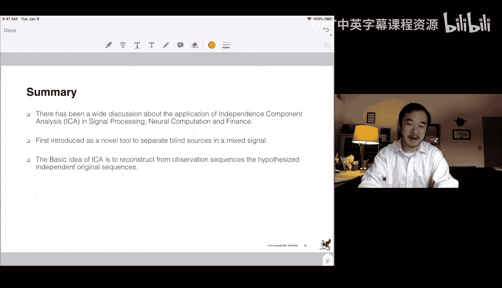

# 16：因子分析与独立成分分析

在本节课中，我们将继续讨论隐空间分析。首先，我们将快速回顾上次课程中介绍的主成分分析和奇异值分解。接着，我们将探讨两种新技术：因子分析和独立成分分析。

## 主成分分析与奇异值分解回顾

上一节我们介绍了主成分分析，本节中我们来看看其核心概念。主成分分析是一种寻找给定数据集主成分的技术。利用这些主成分定义一个新的空间，数据点可以投影到这个空间中。

主成分分析中主成分的特性是，它们依次捕获了数据方差最大的方向、次大的方向，依此类推。这为这些方向赋予了某种语义和几何意义。然后，你可以通过以下操作计算数据点在这个新空间中的投影：

**公式：** `z = U^T * (x - μ)`

其中 `U` 是特征向量矩阵，`μ` 是数据均值。这样，你就得到了数据 `X` 的一种新表示，其特性是在这个新表示中，不同维度之间是不相关的。

此外，你可以根据特征值选择主成分的数量，特征值对应于此处的重构误差。

以下是主成分分析的典型应用场景：
*   给定一个非常高维的数据，例如词文档或图像数据云，直接可视化数据点非常困难。
*   你可以使用，例如在本例中，三个主成分进行投影。
*   如果足够幸运，投影后你可能会看到数据点自然地聚类或聚集。

这是著名的鸢尾花数据集的投影，你可以看到三个簇被很好地分开了。

进行主成分分析前，通常需要对数据进行一些数学处理，例如中心化，并计算数据的协方差矩阵。

## 相关概念辨析

现在，我们转向新问题，同时也想回顾几个可能引起混淆的相关概念。主成分分析、奇异值分解以及特征值分解之间有何关系？

这部分再次描述了主成分分析。主成分分析内部有两个关键思想：
1.  首先，它是一种特征值分解技术，用于将一个方阵分解为三个矩阵的乘积。
2.  其次，这个方阵是数据的协方差矩阵。通过将其定义为数据的协方差矩阵，你实际上就是在进行主成分分析，得到的是数据的主成分。这就是主成分分析与特征值分解之间的关系。

奇异值分解也是一种矩阵分解，但它不是特征值分解。它被称为奇异值分解，结果得到三个矩阵：左奇异向量矩阵、右奇异向量矩阵以及中间的对角奇异值矩阵。

奇异值分解与主成分分析的区别在于，在奇异值分解中，如果你的输入矩阵 `X` 是主成分分析中使用的原始数据（而非协方差矩阵），那么左奇异向量矩阵与主成分分析中的特征向量矩阵相同。右奇异向量矩阵实际上是原始数据投影到该左奇异向量矩阵定义的空间后的新表示。奇异值实际上是特征值的平方根。

总结一下：
*   特征值分解是分解任何方阵的通用线性代数技术。
*   主成分分析是当该方阵为数据协方差矩阵时的特例。
*   奇异值分解是直接对数据矩阵进行分解，如果关注同一数据集，则与主成分分析相关，其特征向量和投影存在对应关系。

## 主成分分析的扩展：概率主成分分析

上一节我们回顾了标准的主成分分析，本节中我们来看看其扩展形式。这些扩展主要是计算投影矩阵的不同方法，以及对此操作的不同统计解释。

例如，概率主成分分析这种方法得到的结果与主成分分析非常相似。我们从一个线性依赖关系开始假设，采用更多的概率方法和变量依赖视角。

**公式：** `y = μ + Λ * x + ε`

其中，`y` 是你观察到的数据向量，`x` 是我们要计算但未观察到的投影（隐变量）。`Λ` 是一个变换矩阵（有时称为载荷矩阵）。然后加上一些噪声 `ε`，通常假设为高斯噪声。同时，我们假设隐维度的 `x` 本身遵循某个 `Q` 维高斯分布。

由于这种构造，`y` 也遵循一个高斯分布。一旦你有了从隐变量 `X` 生成 `Y` 的概率过程，你实际上可以写出主成分分析的最大似然解。

在概率主成分分析中，均值 `μ` 就是数据中心，这很简单。载荷矩阵 `Λ` 通常被理解为等同于主成分分析中的特征向量矩阵，实际上它与主成分的特征向量矩阵密切相关。

概率主成分分析在数学形式上与主成分分析非常相似。但另一方面，使用概率模型，正如稍后将看到的，在获得更好的计算便利性和效率方面有一些好处。在主成分分析中，我们讨论过矩阵求逆成本这个非常严重的问题。如果数据维度非常高，求逆可能非常昂贵。事实证明，使用概率方法，我们或许能够利用期望最大化算法的技巧来绕过这个昂贵的操作。

## 因子分析

介绍了概率主成分分析后，我们现在进入更通用的版本，即因子分析。因子分析采用的假设比概率主成分分析更通用。

同样，从一个隐变量 `X` 开始，假设其维度较低。`Y` 是你观察到的数据，维度较高。我们定义了一个概率生成过程。

**公式：**
*   `p(x) = N(0, I)` （零均值，单位协方差的低维高斯分布）
*   `p(y|x) = N(μ + Λx, Ψ)` （条件高斯分布）

其中，`Λ` 是载荷矩阵，`μ` 是数据中心，`Ψ` 是噪声协方差矩阵。

概率主成分分析与因子分析之间的依赖关系非常接近。在概率主成分分析中，我们假设噪声是各向同性的高斯分布。而在因子分析中，`Ψ` 矩阵不一定是对角阵，即使是对角阵，其对角线上的值也不必相同，因此不是各向同性的。

因子分析的学习问题是什么？我们需要计算 `μ`、`Λ` 和 `Ψ`。在主成分分析中，当你想要得到 `μ` 和 `Σ` 时，通常需要对原始的 `M×M` 矩阵进行完整的特征值分解。在这里，你将直接学习 `Λ`，你已经预先确定希望隐维度为 `Q`，原始维度为 `M`。因此，你只需要找出这个 `M×Q` 的矩阵，这可能比 `M×M` 矩阵小得多。这实际上可以节省计算量。

这是一个概率模型，我们有隐变量和观测变量。当我们遇到带有隐变量和观测变量的概率建模问题时，可以跳入脑海的算法是期望最大化算法。

## 因子分析的期望最大化算法推导

我们尝试推导一种算法来帮助我们估计 `μ`、`Λ` 和 `Ψ`。显然，如果你想运行期望最大化算法，目标是能够写出给定观测变量时隐随机变量的后验分布。

首先，当你有高斯分布时，通常不需要写出任何方程，因为高斯分布完全由均值和协方差表征。我们知道 `x` 的均值，但只有给定 `x` 时 `y` 的条件分布。这里有一个技巧，`y` 是来自此处的变换。取这些的期望，你可以很容易地看到 `y` 的期望也是 `μ`。`y` 的协方差可以通过协方差的定义粗略计算。

从这里，你已经可以看到 `y` 的边际分布的一些良好特性。它们由一个 `M` 维向量形式的附加分量 `μ` 定义，以及这个协方差矩阵。实际上，这不是我们通常理解的完整协方差矩阵。如果你的协方差矩阵是这样的，意味着它几乎是低秩的。也就是说，数据中只有少数几个维度携带信息，其他则不然，那些额外的、携带一些信息的维度可能来自噪声。这基本上就是因子分析试图逆向工程的内容。

在期望步骤中，在展示算法之前，我需要用一些数学细节来麻烦你，以便你知道方程的真正含义。这些数学细节在多元高斯的矩阵操作中非常标准。

从 `x` 开始，这是一个标准高斯。有一系列方法来操作包含 `x` 和 `y` 的联合高斯分布。联合高斯可以由两个子向量 `x1` 和 `x2` 的堆叠向量定义。它们的分布也可以由这个项定义，其中包含两个子均值的堆叠或连接均值，以及一个更大的协方差矩阵。

事实证明，有一种非常巧妙的机械方法来推断 `x1` 的边际、给定 `x2` 时 `x1` 的条件分布等，只需使用 `Σ` 的这些块和 `μ` 的向量即可。

例如，我们可以写出 `x2` 的边际分布。另一个更有趣的结果实际上是给定 `x2` 时 `x1` 的条件分布。这很有用，因为在因子分析中，这是我们想要估计的：我们想在因子分析中估计给定 `y` 时的 `x`。

我们知道，在联合高斯分布下，变量的任何子集的边际或给定另一个子集的任何子集的条件分布都是高斯分布。因此，要确定给定 `x2` 时 `x1` 的条件分布，你需要知道该条件分布的均值和协方差。这实际上可以通过遵循子矩阵操作的一些非常机械的规则轻松实现。

现在，让我们看看如何求解因子分析的期望最大化问题。重复一下，因子分析从遵循低维高斯分布的隐变量 `X` 开始，然后通过给定 `x` 时 `y` 的条件高斯分布进行变换。利用这两个方程，你实际上可以计算 `x` 和 `y` 的边际均值和协方差，以便填充联合分布中的相应块。你还可以使用它们的定义计算 `x` 和 `y` 之间的互协方差矩阵。

因此，在此处写下 `X` 和 `Y` 的联合分布实际上非常简单。你基本上只需插入所有这些矩阵构建块以及均值。现在你有了联合分布。接下来是进一步查看是否可以写出给定 `y` 时 `x` 的分布。我们已经找出了写出条件均值和条件协方差的规则，我们将使用这些规则。我们也有了这个矩阵，在此处已经为这个特定的因子分析问题计算好了。

接下来，我们将 `Σ11`、`Σ12`、`Σ21` 和 `Σ22` 代入，以便计算该后验分布的条件均值和条件方差。机械地代入，你得到这两个方程。这两个方程非常重要，因为它现在解决了你的后验推断问题：给定 `y` 时 `x` 的条件均值和条件分布基本上有了明确的定义。

我们可能很高兴从这里开始跳转到期望最大化算法，因为现在期望步骤已经解决。但事实证明，这并不十分令人满意。这里有一个非常棘手的问题：计算给定 `y` 时 `x` 的条件协方差矩阵的计算复杂度是多少？这是一个非常具有挑战性的问题。使用这个方程，`Ψ` 的维度与数据相同，是 `M` 维。因此，如果你有一个高维数据 `y`，这将是一个非常昂贵的操作，就像进行主成分分析一样昂贵。

但是，因为现在我们正在操作高斯分布并利用条件协方差矩阵的结构，你知道这个 `M×M` 矩阵不一定是满秩矩阵。事实上，有一个称为矩阵求逆引理的规则，虽然有点难记，但一旦将其应用于这两个方程，你就会得到条件均值和条件协方差的新表达式。

在条件协方差中，突然你有了 `Λ^T * Ψ^{-1} * Λ`，现在变成了一个 `Q×Q` 的小矩阵。`Λ` 的大小是 `M×Q`。关键技巧在于，突然之间，你的求逆问题变成了 `Q` 阶问题，而不是 `M` 阶问题。

## 算法比较与特性

现在，我们基本上准备好应用期望最大化推理来估计 `Λ`。我们只知道 `Λ` 是一个占位符，但还不知道它的具体值。在我们原始的数据似然问题中，我们知道如何写出 `y` 的边际分布。你实际上可以推导出似然函数，其中 `Λ` 和 `Ψ` 以复杂的方式交织在一起。因此，它们高度耦合。你并没有很大的希望推导出一个简洁的更新表达式。

在完全似然中，其中 `Y` 和 `X` 都给定，你会有一些良好的分离。例如，在这个项中，你只看到 `Ψ`。这里，`Λ` 和 `Ψ` 之间存在一种良好的线性关系，上面没有另一个求逆。这实际上使得两个参数之间的依赖性更容易处理。但请记住，这里的 `X` 是隐变量，没有观察到。它们是随机变量。

在我们的期望最大化技巧中，我们将用它们的期望替换这些随机变量。因此，期望完全似然可以通过用它们的期望替换这个项和这个项来轻松计算。这就是为什么我们之前计算的给定 `y` 时 `x` 的条件均值和方差变得非常有用。

一旦我们有了期望，我们就可以将其代入期望步骤，使得这个期望完全似然不再是一个随机变量。然后在最大化步骤中，我们将对这个函数关于我们想要估计的所有参数（包括 `Ψ` 和 `Λ` 等）求导。代数推导会很繁重，但如果你感兴趣，可以检查这些方程。

在因子分析中，你不是在进行主成分分析，而是进行一些低维矩阵求逆来启动期望最大化算法，该算法允许你迭代地估计载荷矩阵和噪声的协方差矩阵。

现在，让我们进行并排比较。在主成分分析中，你的观测数据被嵌入到一个低维空间中。两者之间的关系是特征向量矩阵 `U`。我们进行特征向量的变换，因此这个 `U` 矩阵也可以是低维的，但你需要从一个全维的 `U` 矩阵开始进行奇异值分解或特征值分解。

在这里，你有一个与主成分分析中非常相似的假设，介于隐嵌入和观测数据之间。但它们遵循概率变换，然后你可以使用这种矩阵求逆和矩阵条件类型的规则来计算它们的期望，这 arguably 更容易求逆和计算。

当然，如果我们的隐因子分析试图将数据从低维扩展到高维，那么你会失去所有优势，这是我们在其他问题中将面临的不同问题。

另一个重要的区别除了计算之外，是算法相对于数据变化的稳定性或质量。在主成分分析中，主成分分析的结果在旋转下是协变的。如果你的 `Y` 经历了一次旋转，你的主成分分析结果将会改变。在因子分析中，基本上，如果你的数据被缩放，你的载荷矩阵也会改变。但如果只是旋转，你可能会得到相同的 `Λ` 矩阵。这有好有坏。有时这是好的，因为它在数据扰动方面非常稳定，但也可能是不好的，因为这意味着即使数据被有意义地旋转，你也不能在你的载荷矩阵 `Λ` 中检测到它。

此外，在主成分分析中，有技术可以逐个增量地找到主成分，但通常你需要找到所有主成分。在这里，你可以预先确定你想要找到的隐因子数量。在这里，你必须找到所有主成分。就主成分而言，这不是一个增量算法，但整个算法仅依赖于低维矩阵求逆。

以下是一些示例。你从原始数据矩阵（词项-文档矩阵）开始。在主成分分析中，你有这个相关矩阵，它是一个方阵。但在因子分析中，你得到的是 `Λ` 矩阵，在你知道载荷之后，你实际上将能够看到你的数据可能将自己加载到非常不同的因子上。

回到模型不变性和可识别性问题。请记住，在我们估计 `Λ` 矩阵的方程中，你总是会发现 `Λ` 矩阵本身从未出现在似然函数或我们需要解决的优化问题中。它只出现在你已经推断出它并希望实现像这样的变换时。但当你计算似然时，因为你用一个高斯分布乘以数据向量及其转置，所以你看到的基本上总是一个外积。这实际上产生了一个称为旋转不变性的问题，因为如果你现在用 `Λ` 乘以 `Q`（其中 `Q` 是一个正交矩阵）来替换 `Λ`，那么无论你插入什么 `Q`，都会导致 `Λ` 和 `Λ^T` 的相同外积。这意味着，当你用 `Q` 旋转这个 `Λ` 矩阵时，你不会改变数据在我们因子分析模型下的似然。这实际上产生了一个问题，因为你可以想象，两个不同的 `Λ` 估计会给你相同的似然，因此你无法区分哪个是哪个。这就是所谓的可识别性问题。因此，在谈论这个载荷矩阵时，我提到它们是向量，实际上最好不要过多谈论这两个向量的物理意义。它只是一种将数据转换到某处的加载机制，但这些向量本身是否对应于特定的语义含义则不一定。

## 独立成分分析简介

我还有20分钟，也许我应该在这里暂停一下，在简要介绍另一种更高级的技术（称为独立成分分析）之前，先回答一些额外的问题。

独立成分分析。根据定义，它寻找独立的成分。在这里，我们得到一个 `Λ`，它给你几个向量。在主成分分析中，我们得到一个 `U` 矩阵，它也给你主成分。但是，这些成分在独立性方面不一定表现出很强的统计特性。

假设你想解决这个非常著名的问题，称为鸡尾酒会问题。例如，现在，我们正在通过 Zoom 互相交谈，想象这里有10个人在说话。你如何拥有一个简洁的算法，从你听到的声音中区分出谁在说什么？这就是鸡尾酒会问题，特别是当语音传输和编码质量不高时，或者当我们所有人同时说话时，对你来说尤其难以分辨。

所以，这是一个现实世界的例子。假设你有两个独立的源，一个是正弦波，另一个是方波。你在两个接收端观察到的可能是这样的。它们基本上是由这种线性或非线性变换产生的，一个接收器以不同的加权组合拾取两个信号。我们的动机是，给定这个，你想恢复那个。这是一个相当实际的问题，称为盲源分离。

这不仅仅是逆向工程这个混合矩阵 `A`。你的目标是揭示源的形式，这可以通过逆向工程 `A` 来实现，也可以通过使用一些独立的方法或其他方法来实现，只要你得到 `S` 正确。

这是盲源分离问题的示意图，以便我们现在可以在数学上明确我们的目标是什么。信号 `S` 通过 `A` 变换为观测 `X`。我们想找到一个 `W` 矩阵，它可能是 `A` 的逆矩阵，也可能不同，但它是一个矩阵。我们想要解混信号并得到一组 `u`。我们如何知道 `u` 被很好地解混了？这就要用到独立成分分析的概念。如果它们彼此最大程度地独立，我们就称 `u` 是好的。这就是我们想要实现的目标。

那么独立意味着什么？独立性通常意味着，如果你有一个 `u1` 和 `u2` 的联合分布，它们可以分解为这样的边际分布，这是一个相当不同的条件测试。如何甚至强制执行这个约束到一个变换模型解就更难了。

现在，让我们再次尝试看看，也许你会说，主成分分析不是已经实现了类似的功能吗？主成分分析不是试图找到一个方向上的噪声和另一个正交方向上的噪声吗？这是否意味着我已经实现了分离独立分离？事实上，在这个图中，也许这个结果就是主成分分析。这两个源是彼此正交的。但我真正想要的不一定是正交，我想要独立，更好地与原始源对齐。而这些独立性，你可能在主成分分析类算法中很难捕捉到，这些算法强烈假设数据的线性变换，并且没有高斯噪声，如果使用概率主成分分析，则更难深入探讨。

但在这里，我只想给你一个高层次的概念，说明为什么协方差或相关性以及独立性不一定是同一回事。例如，我们知道主成分分析大量使用计算协方差矩阵来计算主成分。但目标是，即使你的数据可能一开始就有完整的