# 18：贝叶斯网络与隐马尔可夫模型中的推理

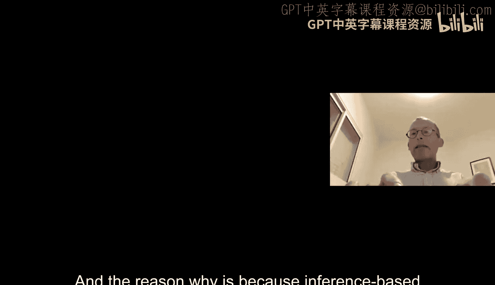

在本节课中，我们将继续讨论图模型，特别是贝叶斯网络中的推理问题。我们将探讨为什么精确推理是困难的，并介绍几种实用的近似和优化推理方法，包括随机采样和变量消除。最后，我们将引入一种新的图模型——隐马尔可夫模型，并概述其基本概念。

## 贝叶斯网络推理的复杂性

上一节我们定义了贝叶斯网络，它以一种紧凑高效的方式表示联合概率分布。我们提到，使用贝叶斯网络的主要目标之一是进行推理，即根据观察到的部分变量来推断缺失变量的值。

推理问题通常可以转化为条件概率计算。然而，贝叶斯网络直接提供的是**全联合概率分布**，而我们需要的往往是**部分联合概率分布**。一个直接的方法是枚举所有未观测变量的可能取值，然后求和。这种方法虽然有效，但存在一个严重问题：**计算复杂度可能是指数级的**。如果只有少数几个观测变量，但有大量未观测变量，枚举所有可能性将非常耗时。

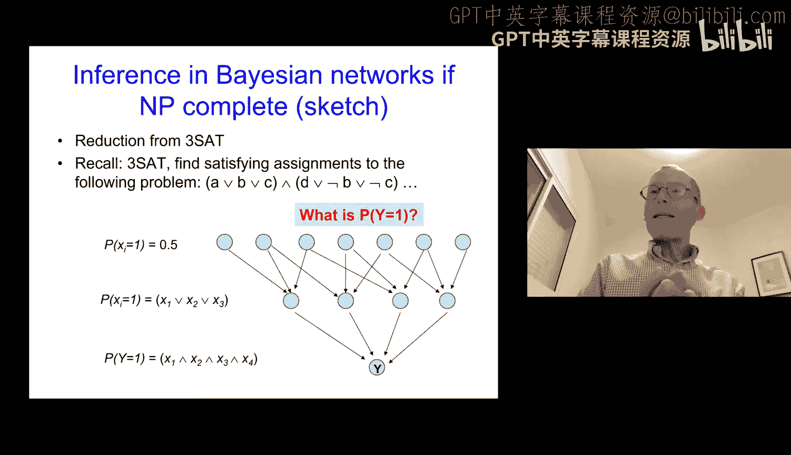

那么，是否存在更高效的方法呢？不幸的是，对于一般情况，答案是**否定的**。因为贝叶斯网络中的精确推理是一个**NP完全问题**。

## 为什么推理是NP完全问题？

为了证明贝叶斯网络推理是NP完全的，我们需要进行“归约”。我们展示，如果能在多项式时间内解决贝叶斯网络推理问题，那么就能解决一个已知的NP完全问题，例如**3-SAT问题**。

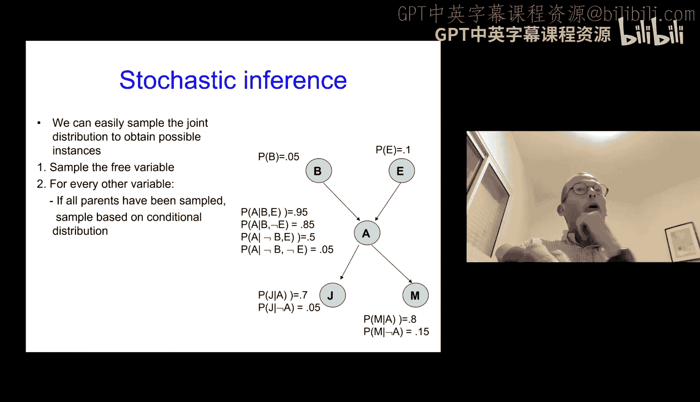

3-SAT问题要求判断是否存在一组布尔变量的赋值，使得一组由三个变量构成的子句的合取式为真。我们可以构造一个特定的贝叶斯网络来模拟3-SAT问题：
*   网络中的节点代表3-SAT中的变量和子句。
*   每个变量节点被赋予一个先验概率（如0.5）。
*   每个子句节点的条件概率表被设定为：当且仅当其父变量（即子句中的变量）的赋值满足该子句时，该节点取值为1的概率为1，否则为0。
*   最后，一个顶层节点是所有子句节点的“与”操作。

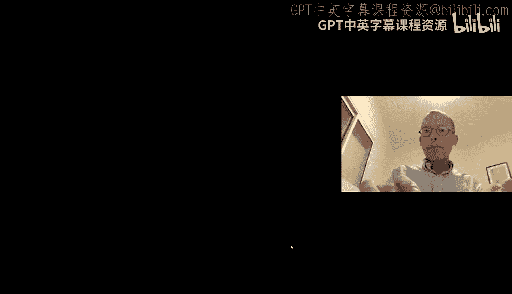

现在，我们提出一个推理问题：**在这个网络中，顶层节点 `Y` 等于1的概率 `P(Y=1)` 是多少？**
*   如果 `P(Y=1) = 0`，则意味着没有任何变量赋值能使所有子句同时为真，即该3-SAT实例**不可满足**。
*   如果 `P(Y=1) > 0`，则意味着至少存在一种赋值能使所有子句为真，即该3-SAT实例**可满足**。

因此，如果我们能在多项式时间内计算出 `P(Y=1)`，我们就能在多项式时间内解决3-SAT问题。由于3-SAT是NP完全的，这证明了贝叶斯网络推理也是NP完全的。这意味着，对于一般图结构，我们无法保证找到多项式时间的精确推理算法。

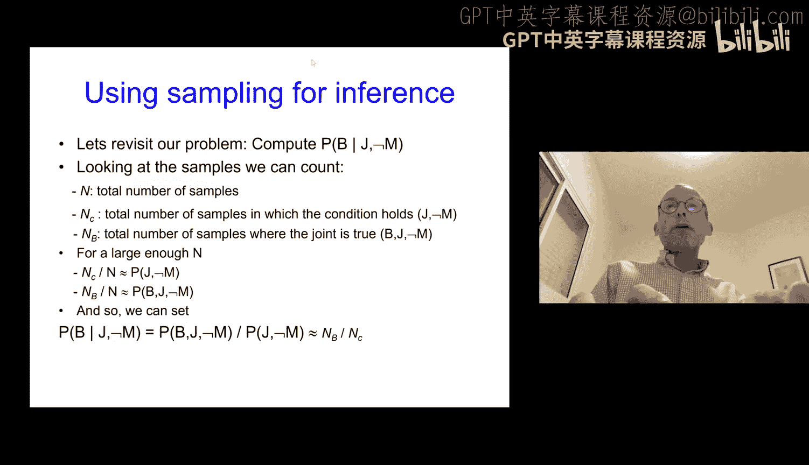

既然精确推理是困难的，我们就需要转向其他策略，例如寻找近似解或利用网络特殊结构加速计算。

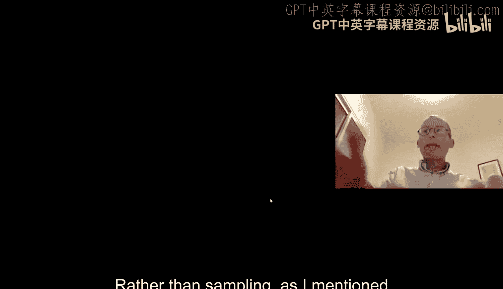

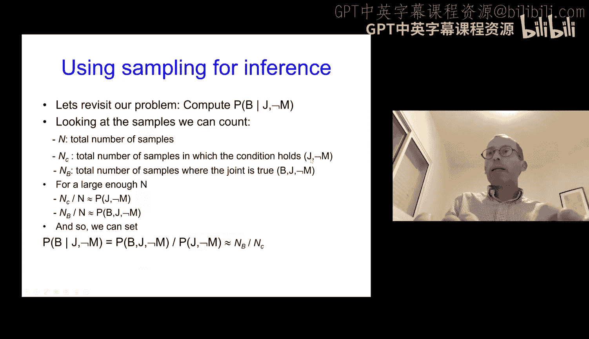

## 近似推理方法：随机采样

最常用的近似推理方法之一是**随机采样**。其核心思想是从联合概率分布中生成大量样本，然后用这些样本的统计结果来近似我们想要的概率。

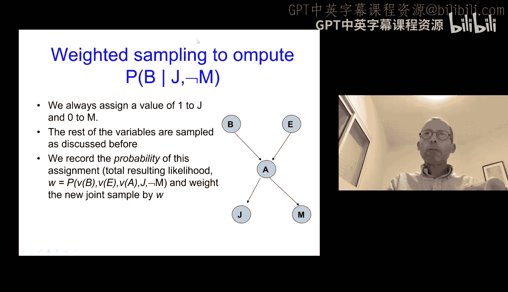

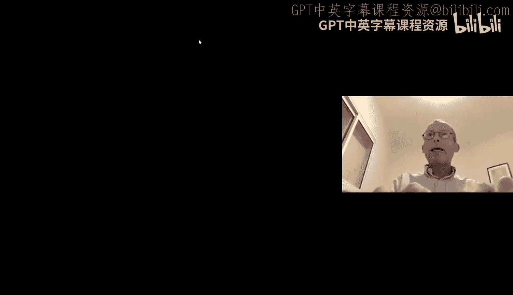

在贝叶斯网络中，我们可以按照拓扑顺序进行采样：
1.  从没有父节点的节点开始，根据其先验概率分布进行采样。
2.  对于有父节点的节点，在给定其父节点取值的情况下，根据条件概率表进行采样。

通过这个过程，我们可以得到网络所有变量的一个完整样本。重复多次，就能得到一组来自联合分布的样本。

假设我们想计算条件概率 `P(B=1 | J=1, M=0)`。我们可以：
*   生成大量样本。
*   统计满足 `J=1` 且 `M=0` 的样本数量 `N`。
*   在这些样本中，再统计同时满足 `B=1` 的样本数量 `N_B`。
*   近似计算 `P(B=1 | J=1, M=0) ≈ N_B / N`。

这种方法的优点是我们可以控制计算时间（通过控制采样次数），并且随着采样次数增加，近似结果会趋近于真实值。然而，它有一个明显的缺点：当我们关心的条件（如 `J=1, M=0`）在现实中很少出现时，绝大多数样本都会被浪费掉，因为它们不满足条件，无法用于计算。

## 改进的采样：似然加权

为了解决上述问题，我们可以使用**似然加权采样**。思路是：我们固定观测变量的值（如 `J=1, M=0`），然后对其他变量进行采样。

但是，我们不能简单地像之前那样采样，因为固定子节点的值会影响其父节点的分布。例如，如果固定 `J=1`，那么 `A` 更可能为1。如果我们忽略这一点，采样得到的 `A=0` 的配置将非常不可能出现。

因此，在似然加权中：
1.  我们固定观测变量的值。
2.  我们按照拓扑顺序对其他变量进行采样，但采样时只考虑其父节点的值，忽略其子节点的固定值（即仍然使用原始的条件概率表）。
3.  对于每个生成的完整样本（包含所有变量，观测变量已被固定），我们计算其**似然权重**。这个权重是该样本在给定网络参数下出现的概率。由于观测变量是固定的，这个概率可以通过网络中所有节点的条件概率乘积来计算。
4.  最后，我们使用加权统计来代替简单的计数。例如，`P(B=1 | J=1, M=0)` 近似等于所有样本中 `B=1` 的样本的权重之和，除以所有样本的权重之和。

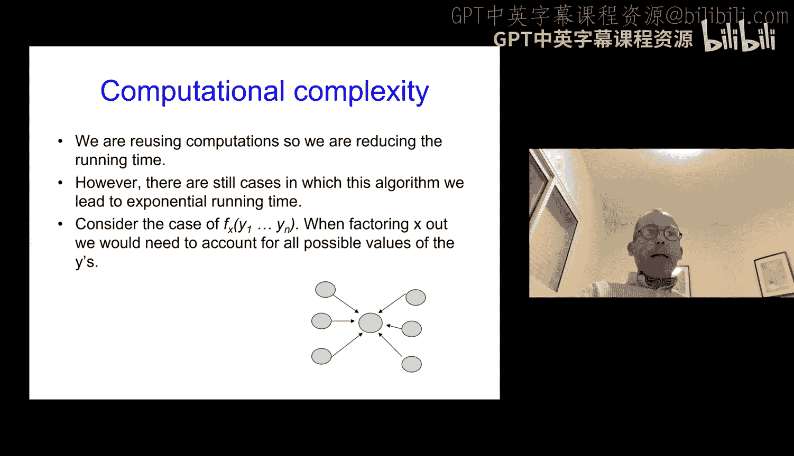

这种方法利用了所有样本，但通过权重来反映每个样本在给定观测下的合理性。虽然它仍然是一种近似，但通常比简单采样更高效。

## 精确推理优化：变量消除

另一种思路是尝试优化精确推理的计算过程本身，而不是求近似解。**变量消除**就是这样一种方法，它通过重用中间计算结果来避免重复计算。

核心思想是：在枚举求和时，许多计算是重复的。例如，概率 `P(J|A)` 只依赖于变量 `A`，当我们在外层循环改变变量 `E` 和 `B` 时，只要 `A` 的值相同，`P(J|A)` 就不需要重新计算。

我们可以将这类计算封装成**函数**：
*   定义函数 `f_J(A) = P(J|A)`。
*   定义函数 `f_M(A) = P(M|A)`。
*   在计算更大的求和式时，我们可以直接调用这些函数，而不是每次都回溯到原始的概率表。

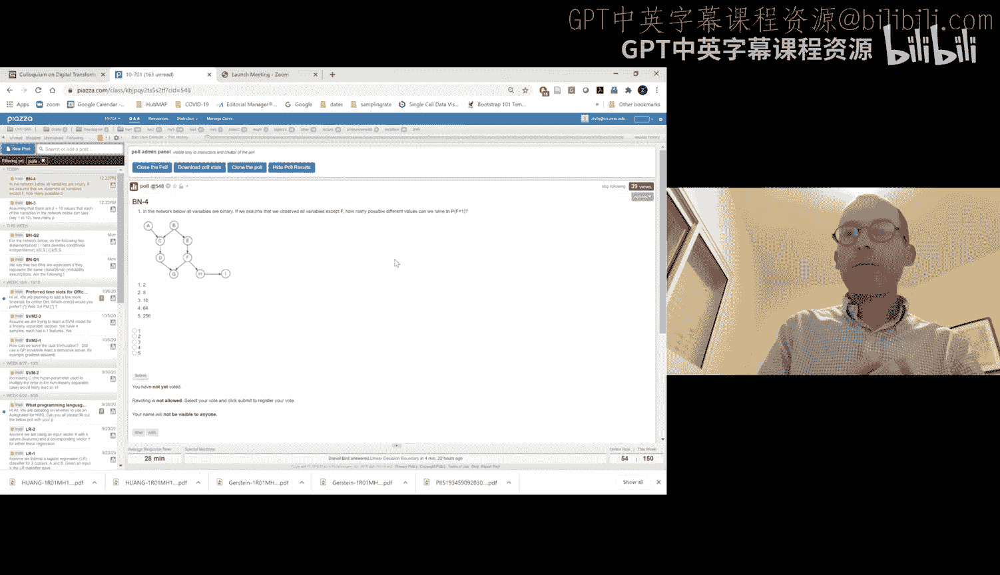

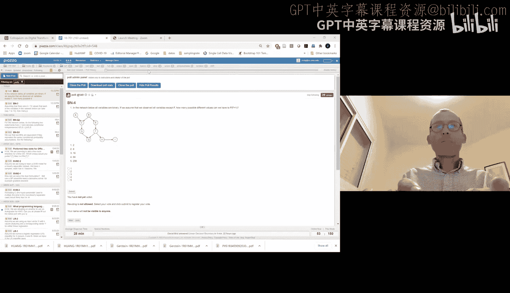

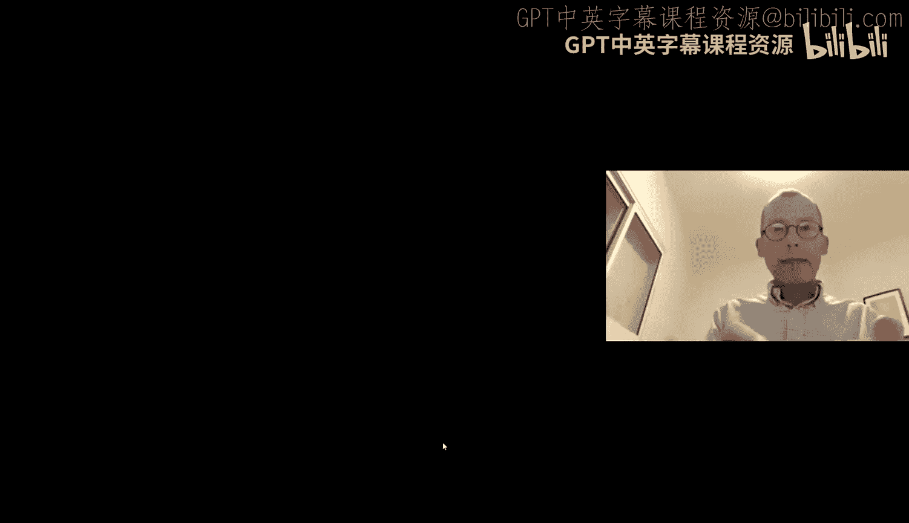

通过这种方式，我们将复杂的联合概率计算分解为一系列更小的函数计算和组合。变量消除的效率很大程度上取决于网络的结构。如果每个节点的入度（父节点数量）都很小，那么条件概率表本身就小，变量消除可以显著节省时间。反之，如果存在一个节点有很多父节点，那么该节点的条件概率表本身就很大，变量消除的优化空间就有限。

## 另一种转换：化为多树

贝叶斯网络推理在多树结构上可以在节点数上是线性的。多树是指图中任意两个节点之间只有一条路径。如果我们能把一个任意的贝叶斯网络转化为多树，就能应用高效的线性算法。

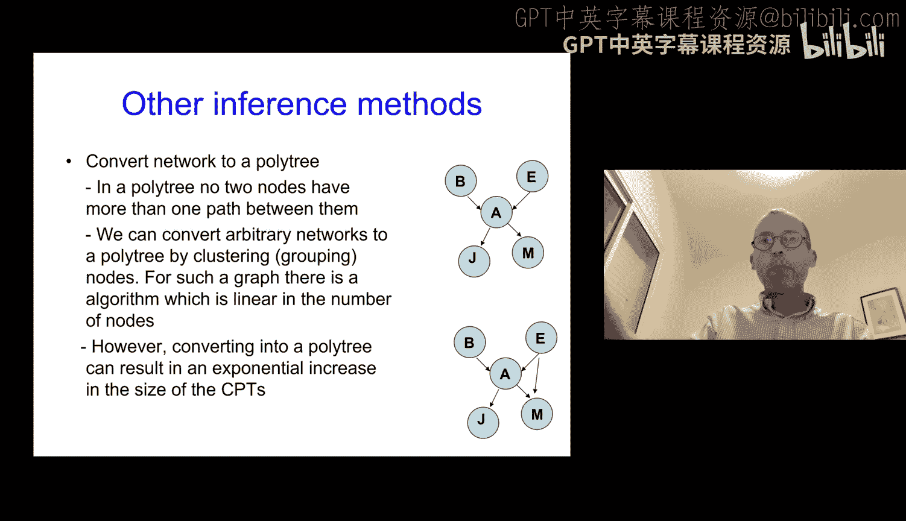

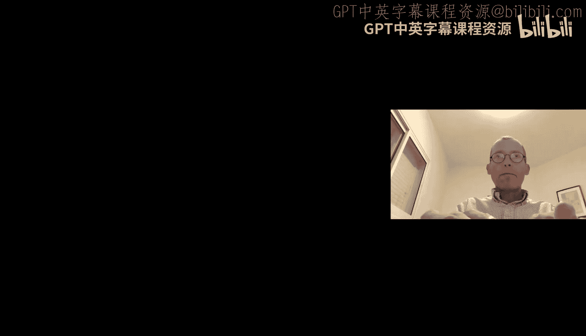

转化方法是将具有多条路径的节点**合并**成一个“超节点”。例如，如果 `E` 和 `A` 之间有多条路径影响，我们可以创建一个新节点 `Z`，其状态是 `E` 和 `A` 所有状态的组合。这样，原图中通过 `E` 和 `A` 的多条路径就变成了通过 `Z` 的单一路径。

然而，这种方法的代价是：新创建的“超节点”的状态空间是其组成部分状态空间的笛卡尔积，这会导致该节点的条件概率表变得非常庞大。因此，虽然推理在图结构上变简单了，但每个节点内部的复杂度却可能指数级增加。这是一种用空间（或节点内部的计算时间）换取图结构简单性的策略。

## 引入新模型：隐马尔可夫模型

贝叶斯网络的一个主要限制是其**无环性**要求，这难以建模许多具有反馈循环或时序依赖的现实问题。因此，我们引入另一类有向图模型——**隐马尔可夫模型**。

HMM 的核心思想是区分**隐藏状态**和**观测值**：
*   **隐藏状态**：一个我们无法直接观测的序列，它遵循马尔可夫性质（当前状态只依赖于前一个状态）。
*   **观测值**：在每一个时间步，我们观测到一个值，这个值是由当前时刻的隐藏状态**生成**的。

HMM 的图模型结构如下：
*   节点：表示隐藏状态和观测值。
*   边：有两种。
    *   状态之间的边：表示状态转移概率 `P(状态_t | 状态_{t-1})`。
    *   从状态指向观测值的边：表示发射概率 `P(观测_t | 状态_t)`。

HMM 广泛应用于语音识别（声音信号是观测，单词是隐藏状态）、自然语言处理（单词是观测，词性是隐藏状态）和生物信息学（DNA序列是观测，基因结构是隐藏状态）等领域。

与贝叶斯网络相比，HMM 有一个好消息：**对于 HMM，存在多项式时间的精确推理算法**（如前向-后向算法），这使得它在实践中非常强大和实用。

## 总结

本节课我们一起深入探讨了贝叶斯网络中的推理。
*   我们首先理解了精确推理在一般情况下是 NP 完全问题，因此需要寻求近似或利用结构的方法。
*   我们学习了**随机采样**和**似然加权采样**这两种近似推理技术，它们通过生成样本来估计概率。
*   我们探讨了**变量消除**这一精确推理的优化技术，它通过重用计算来提升效率。
*   我们还了解了通过转化为**多树**来利用特殊结构进行高效推理的思路。
*   最后，我们引入了**隐马尔可夫模型**，它通过区分隐藏状态和观测值，并允许状态间的序列依赖，克服了贝叶斯网络的一些限制，并且在其中可以进行高效的精确推理。

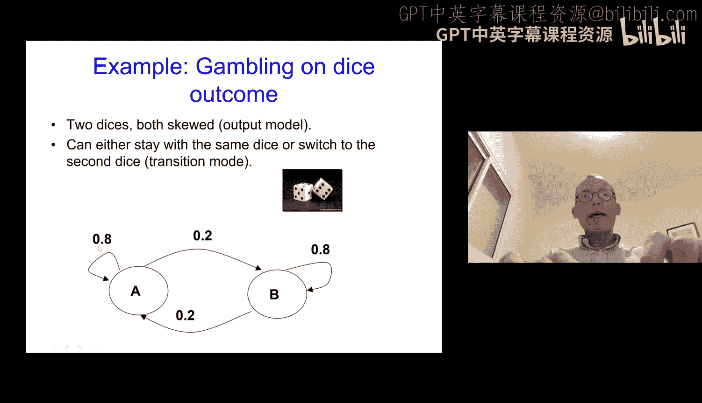

下节课我们将开始详细学习 HMM 的正式定义和其中的推理算法。