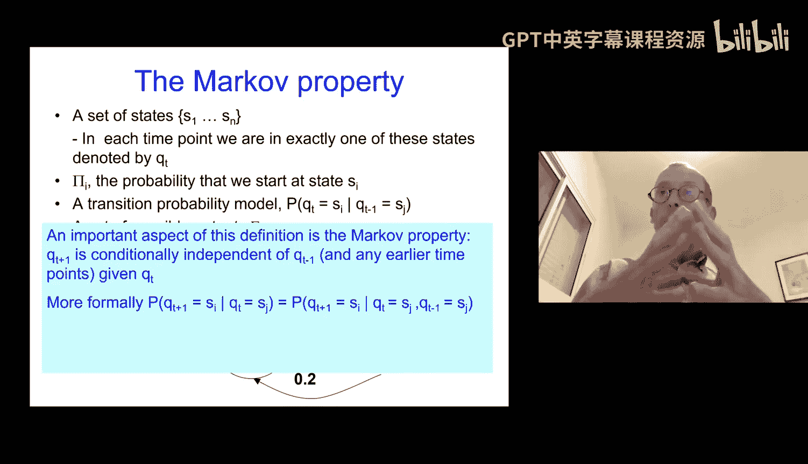
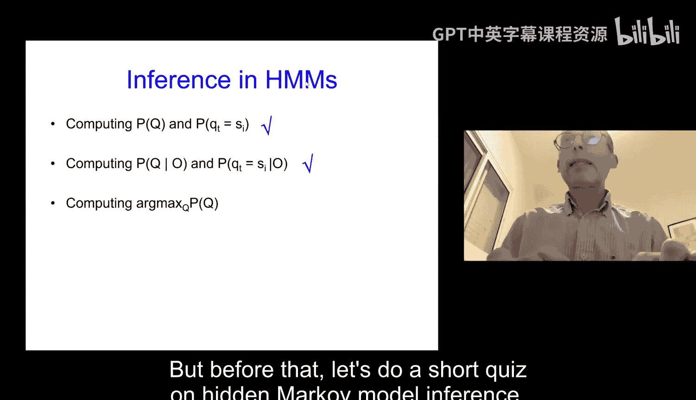
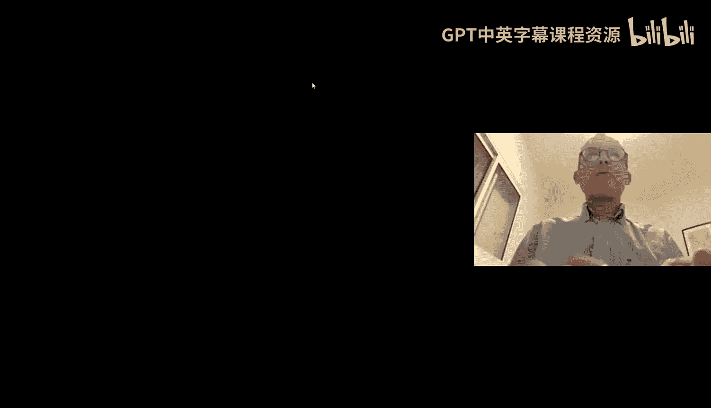
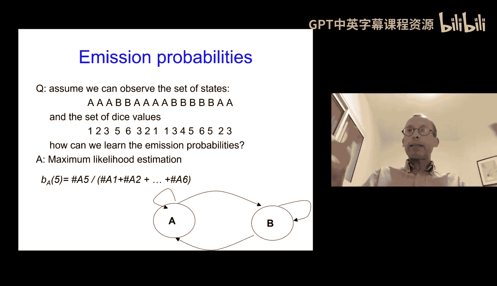

# 19：隐马尔可夫模型中的推断 🧠

在本节课中，我们将学习隐马尔可夫模型（HMM）的正式定义，并重点探讨如何在该模型中进行高效的推断。我们将了解HMM的核心参数，并学习几种关键的推断算法，包括计算状态概率、给定观测序列下的状态概率，以及寻找最可能的状态序列。

---

## 模型定义与参数 📋

上一节我们介绍了图模型，本节我们来看看一种特殊的图模型——隐马尔可夫模型。HMM是一种用于表示联合概率分布的紧凑方式，主要用于推断。它包含两个核心部分：一组生成观测值的**隐藏状态**，以及我们实际能看到的**观测值**。

为了正式定义一个HMM，我们需要以下参数：

*   **状态集合 (S)**：隐藏状态的集合，例如两个不同的骰子（A和B）。
*   **初始概率 (π)**：系统在初始时刻处于各个状态的概率。
*   **转移概率 (A)**：从当前状态转移到下一个状态的概率。这构成了一个矩阵 `A`，其中 `A[j][i]` 表示从状态 `j` 转移到状态 `i` 的概率。
*   **观测值集合 (V)**：每个状态可能输出的观测值的集合，例如骰子的点数1到6。
*   **发射概率 (B)**：在给定状态下，观测到某个特定值的概率。`B[i][o_t]` 表示在状态 `i` 下观测到 `o_t` 的概率。

HMM的一个关键假设是**马尔可夫性质**：下一个状态的概率仅取决于当前状态，与更早的历史状态无关。这个假设虽然很强，但正是它使得高效的推断成为可能。

---

## 推断问题类型 ❓

当我们拥有一个定义好的HMM（即所有参数已知）时，我们可以提出几种不同类型的推断问题：

以下是三种主要的推断问题：

1.  **计算 `P(Q_t = s_i)`**：在不观测任何数据的情况下，计算在时刻 `t` 处于某个特定状态 `s_i` 的概率。
2.  **计算 `P(Q_t = s_i | O_1...O_t)`**：在观测到从时刻1到 `t` 的序列 `O` 后，计算在时刻 `t` 处于状态 `s_i` 的概率。
3.  **计算最可能的状态序列**：给定观测序列 `O`，找出最可能（概率最高）的隐藏状态序列 `Q`。这通过维特比算法解决。

---

## 前向算法 ➡️

上一节我们提出了推断问题，本节中我们来看看如何高效地解决第二个问题：计算观测序列的概率 `P(O)` 以及 `P(Q_t = s_i | O)`。直接计算需要对所有可能的状态序列求和，复杂度是指数级的。

我们引入**前向算法**来高效解决这个问题。该算法定义了一个前向变量 `α_t(i)`：

`α_t(i) = P(O_1, O_2, ..., O_t, Q_t = s_i)`

它表示到时刻 `t` 为止观测到部分序列 `O_1...O_t`，并且当前时刻 `t` 处于状态 `s_i` 的联合概率。

以下是前向算法的计算步骤：

1.  **初始化**：`α_1(i) = π_i * B[i][O_1]`
2.  **递归**：对于 `t = 2` 到 `T`，`α_t(i) = [ Σ_{j=1}^{N} α_{t-1}(j) * A[j][i] ] * B[i][O_t]`
3.  **终止**：观测序列的概率 `P(O) = Σ_{i=1}^{N} α_T(i)`

得到 `α_t(i)` 后，我们可以计算条件概率：
`P(Q_t = s_i | O_1...O_t) = α_t(i) / P(O_1...O_t)`

该算法的时间复杂度为 `O(T * N^2)`，远优于指数级复杂度。

---

## 维特比算法 🏆

现在，我们来看第三个问题：如何找到给定观测序列下最可能的状态序列。这需要使用**维特比算法**，它是一种动态规划算法。

该算法定义了一个变量 `δ_t(i)`：
`δ_t(i) = max_{Q_1...Q_{t-1}} P(Q_1...Q_{t-1}, Q_t = s_i, O_1...O_t)`
它表示到时刻 `t` 为止，观测序列为 `O_1...O_t`，且以状态 `s_i` 结尾的所有路径中，概率最大的那条路径的概率值。

以下是维特比算法的计算步骤：

1.  **初始化**：`δ_1(i) = π_i * B[i][O_1]`；`ψ_1(i) = 0`（用于回溯路径）
2.  **递归**：对于 `t = 2` 到 `T`，
    `δ_t(i) = max_{1≤j≤N} [ δ_{t-1}(j) * A[j][i] ] * B[i][O_t]`
    `ψ_t(i) = argmax_{1≤j≤N} [ δ_{t-1}(j) * A[j][i] ]`
3.  **终止**：找到最终最可能路径的概率 `P* = max_{1≤i≤N} δ_T(i)`，以及终点状态 `q_T* = argmax_{1≤i≤N} δ_T(i)`
4.  **路径回溯**：对于 `t = T-1, T-2, ..., 1`，`q_t* = ψ_{t+1}(q_{t+1}*)`

最终得到的序列 `(q_1*, q_2*, ..., q_T*)` 就是最可能的状态序列。维特比算法的时间复杂度同样为 `O(T * N^2)`。

---

## 总结 📝

本节课中我们一起学习了隐马尔可夫模型的核心推断方法。

*   我们首先明确了HMM的正式定义和关键参数。
*   接着，我们区分了三种主要的推断问题：状态预测、滤波（给定观测求当前状态概率）和解码（求最可能状态序列）。
*   我们深入学习了**前向算法**，它能够高效地计算观测序列的概率以及给定观测下当前状态的概率，其核心是动态规划地计算前向变量 `α`。
*   最后，我们学习了**维特比算法**，它通过动态规划（计算变量 `δ` 和 `ψ`）和回溯，有效地找到了最可能的状态序列。

这些算法因其多项式时间复杂度，使得在HMM中进行高效推断成为可能，这是HMM被广泛应用于语音识别、生物信息学等领域的基础。在下一讲中，我们将探讨如何从数据中学习HMM的参数。