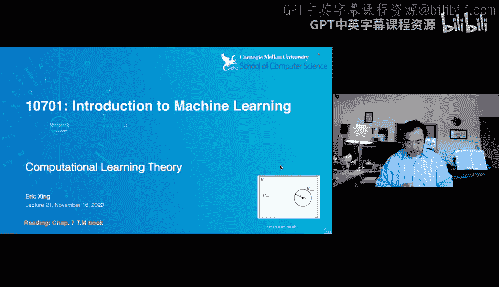
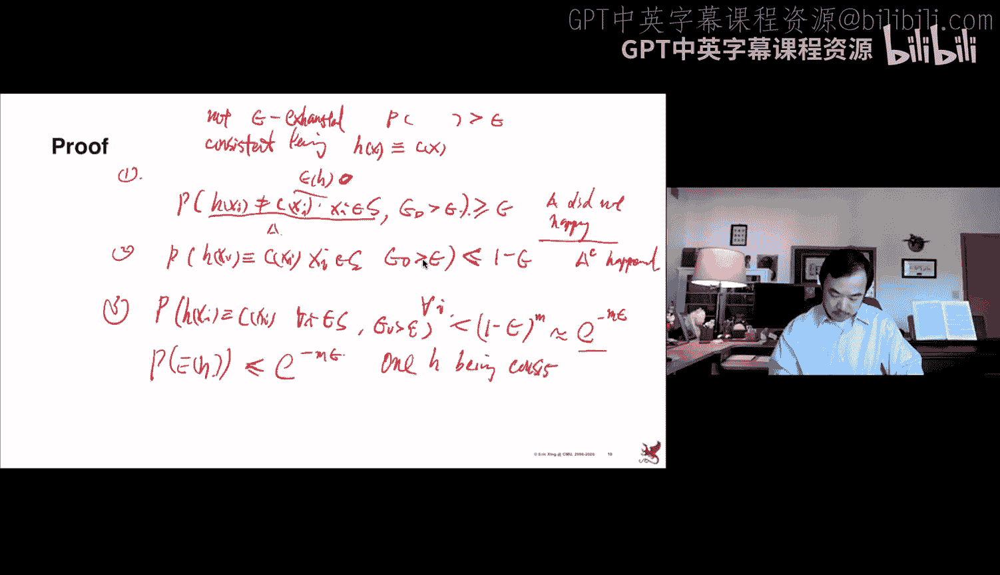
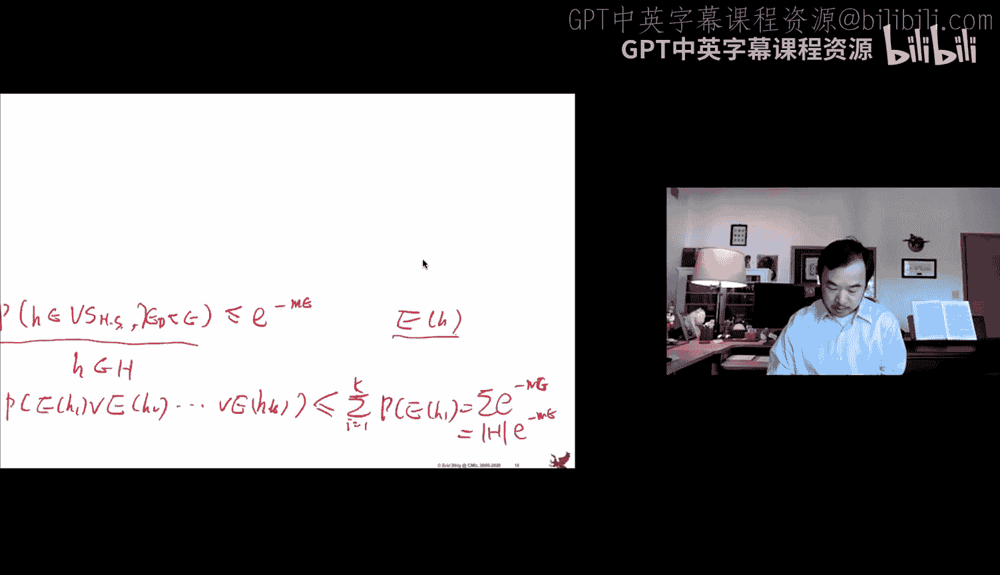
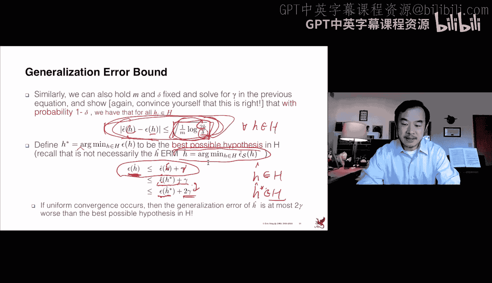

# 21：计算学习理论 🧠

在本节课中，我们将学习计算学习理论的基础知识。这个领域研究机器学习算法背后的理论支柱。分析的主要目的并非精确计算风险或所需样本量，而是帮助人们理解学习算法中几个关键权衡定律之间的联系，从而了解如何通过增加样本或设计不同模型来影响结果。这类分析通常是定性的，而非完全定量的，你会看到数字和符号以“大O”形式出现，这意味着它们取决于某些常数或低阶项。

## 泛化能力与成本

机器学习的一个核心问题是学习的泛化能力。假设我们有一个假设 `h`，它在训练数据集 `S` 上产生误差 `ε̂_S(h)`。我们通常最小化训练误差，然后将这个假设 `h` 应用到新数据上。新数据可能来自与训练数据相同的分布，也可能来自不同的分布。我们希望知道，尽管假设仅从训练数据中学习，它在新的、未见过的数据上表现如何。这就是机器学习泛化能力的核心。

在描述泛化能力时，有两个主要的成本维度特别令人感兴趣：信息成本和计算成本。信息成本或信息容量与需要准备多少训练数据来训练一个好的算法，以及学习速度有多快有关。计算成本则与从每个样本中学习需要付出多少计算代价有关。我们将看到这些数字如何与在测试数据上达到的准确率联系起来。

## 分析框架

我们将使用一个通用的框架来建立这种联系。我们将更正式地介绍样本复杂度，并捕捉计算复杂度。我们希望建立一个理论，将以下内容联系起来：
*   训练样本的数量 `M`，这基本上是样本复杂度的概念。
*   假设或概念空间的容量，这与学习成本有关。
*   两个概率：一个是接近目标函数的准确度（即误差），另一个是成功达到该训练误差的概率。

我们的结论将始终以大O符号的形式呈现，这意味着我们提出的任何关系通常都取决于某个常数或一些低阶项，因此不会是精确的。

## 假设空间与假设

让我们先了解一下假设空间 `H` 和假设 `h` 的概念。假设空间始于学习任务，不同的任务（如回归、分类）会导致不同的假设及其空间。

这里我们以最简单的二元分类为例。假设我们的示例 `x` 只是一组有限的离散特征列表。例如，我们有六个特征来描述某一天：天空状况、气温、湿度、风力、水况和预报。我们的目标函数是判断是否享受运动。因此，假设空间 `H` 就是这些特征值及其结果的所有可能组合的集合。我们可以想象这个空间可能提供的组合数量，这引出了假设空间的大小。

我们将通过训练示例 `S` 来训练我们的假设 `h`。`S` 通常是有限数量的特征-结果对。我们的目标是找到一个在训练集 `S` 上表现良好的 `h`，我们称之为经验风险最小化。但这并非我们的最终目标，因为我们希望将其用于测试示例，因此我们还需要描述这个 `h` 在所有来自某个分布 `D` 的数据上的表现如何。

## 两种分析范式

根据 `H` 的样子，我们将进入两种分析范式：
1.  **PAC学习框架**：在这个框架中，我们假设在假设空间 `H` 中，存在某个 `h` 能够完美地区分训练示例。这意味着假设空间中至少有一个 `h` 在训练数据上误差为零，那么在测试数据上的泛化误差将是“0 加上一些东西”。
2.  **不可知学习框架**：在这里，事情变得稍微复杂一些。我们对样本标签没有先验限制，标签可以是任意的，甚至可能是错误的。结果是，你的假设空间 `H` 可能不包含一个能完美标记训练示例的 `h`。因此，无论你怎么尝试，在训练数据上都会犯错，你的泛化误差将是在已犯的训练误差之上的额外误差。

今天我们将研究这两种框架。在两种情况下，假设空间 `H` 的大小都是有限的。我们将在下一讲中研究无限的 `H`。

## 样本复杂度

样本复杂度在最直观的情况下，是指为了以满意的程度学习目标概念所需的训练示例数量 `M`。在获取 `M` 时，有多种场景：学习者可以提出一个未标记的实例让训练者标记；或者训练者直接给出一批已标记的示例，学习者无权拒绝或建议新示例；有时样本也可能是随机从自然界生成的。所有这些实际上也创造了不同类型的风险保证。

在今天要讨论的两种框架（PAC框架和不可知框架）中，我们将忽略这些不同场景的影响，只假设我们有一组训练示例 `S`，这使得问题更容易分析。

## 分析协议

分析协议将非常标准化。我们将从一组称为 `H` 的示例开始，并假设存在一个固定的数据分布 `D`（我们未知）。假设空间是 `H`，我们有能力定义它。目标概念（如二元标签）由训练者提供。学习者将观察这个已标记的集合 `S`。更重要的是，我们假设训练集中的示例也来自那个真实的分布 `D`。因此，训练数据和未来的测试数据遵循相同的分布。这是一个非常重要的简化，使得分析能够更直接地进行。标签也来自所有可能概念的空间。当然，我们实际上并不知道生成标签的函数，我们只知道标签结果。我们的目标是学习一个假设 `h`，它成为真实函数 `c` 的估计器。

在PAC学习中，当我们说PAC学习是关于一个存在能完美遵守训练数据集中标签的假设空间时，这基本上意味着概念集与我们的假设集是相同的，数据在这种情况下被称为无噪声的。

## 误差分析

现在让我们更仔细地看看误差。我们已经知道有一个称为训练误差的术语，它在这个方程中明确定义为 `ε̂_S(h)`，即假设 `h` 预测的标签与给定标签 `c(x)` 不一致的概率。经验上，这个概率可以通过样本平均来估计。这是你在训练假设后实际可以计算的误差。当然，我们的目标是建立这个训练误差（经验训练误差）与真实误差之间的联系。真实误差定义在这里：`ε_D(h)`，即来自分布 `D` 的任何数据上，预测与真实标签不同的概率。

图形上，你可以看到它们接近并不一定是自动保证的。你有一个实例空间 `X`，数据可以用各种方式标记。假设空间可能只是数据标记方式的一个子集。真实的标记函数 `c` 对你来说是未知的。你只看到实例，但函数可能是数据标记方式的另一个子集。当它们不完全相同时，就会存在分歧。这些分歧的程度基本上对应于我们将要有的泛化误差。

## 关键引理

我们将使用几个著名的性质或引理来证明某些属性。这里介绍两个非常重要的引理：
1.  **并界**：它描述了某个事件发生的概率，通过每个事件发生的个体概率来界定。该陈述说，在 `k` 个事件中至少有一个事件发生的概率，将以每个事件发生概率之和为上界。这很直观，也称为布尔不等式。
2.  **霍夫丁不等式**：它通常用于描述伯努利率或离散事件概率估计的质量。想象你有一个二元事件（如抛硬币或二元分类的结果），其真实概率为 `φ`。这个真实的 `φ` 可能未知，但在你抛几次硬币或在一些示例上尝试二元分类器后，你可以计算二元事件的结果，从而计算出 `φ` 的样本估计。霍夫丁不等式告诉你以下性质：这个随机变量（即二元随机变量的均值）的样本估计以高概率接近真实率 `φ`。换句话说，估计值与真实值之差大于某个小数 `γ` 的概率，将以一个很小的数作为上界，这个数是指数形式的：`2 * exp(-2 * γ² * M)`。其中 `M` 是样本数量。这个项很直观：`M` 越大，你拥有的示例越多，整个项就越小。因此，这意味着如果你从更多示例中估计你的率，那么偏离真实值的概率将越来越小。

我将在后面使用这两个定理来证明一些学习性质。

## 版本空间

另一个概念帮助我们进一步量化不同的假设。我提到有一个假设空间 `H`，里面有很多小 `h`，但并非所有 `h` 都是平等的。有些 `h` 不犯任何错误。想象在整个大写 `H` 空间中，存在一个子集，其中的小 `h` 是一致的。“一致”意味着它们在训练示例上不犯错误。我们称之为版本空间。版本空间定义得非常仔细，有两个概念：一个是大写 `H`，即该类型假设的整个宇宙；另一个是训练集 `S`，它定义了与训练集中标签的一致性。这就是版本空间。这基本上允许我们查看 `H` 的一个子集，我们将从中选取一个作为我们的泛化假设。

一致学习器基本上是一种算法或努力，允许你挑选出版本空间中的那些小 `h`。当然，现在我们需要知道这样的假设如何泛化。它们泛化的方式通常是人们说它们误差很小，并且有很高的成功机会等等。这里我们想稍微收紧一下陈述，使其变得真正严谨。这就是PAC学习框架试图实现的目标。

## PAC学习

PAC学习基本上是说，PAC学习器旨在产生一个假设 `ĥ`（`^` 表示它是从样本中经验估计的），该假设是近似正确的。“近似正确”意味着这个 `h` 在真实数据分布 `D` 上的误差接近0。不仅是近似正确，而且要以高概率达到这个高标准。你可以说，如果我训练100个假设，其中一个会有很低的误差，但这并没有太大帮助，因为即使这样一个低误差假设存在于 `H` 中，你需要训练100个不同的 `h` 才能得到这一个，这不好。你实际上希望有高概率达到这个目标。这是一个双重保障的故事，称为“可能近似正确”。这就是PAC学习试图阐述的。

## 版本空间耗尽

更进一步，我们知道我们将从版本空间中得到 `h`，它们在训练数据上误差为零，并且我们知道它们在测试数据上会犯一些错误。因此，我们需要对训练误差设定一个上限，强制其变小。这引出了如何耗尽版本空间的概念。再次看图，这个大正方形是整个 `H` 空间，中间的小形状是我们的版本空间。可以看到，所有在训练数据上误差为零的 `h` 都在这里。但是，在这些不同的、训练数据上零误差的假设中，它们仍然可能有不同的测试误差值，一个是0.1，一个是0.2。显然我们更喜欢小的那个。因此，我们现在要真正设定一个可能误差的上限。这基本上是一种量化版本空间的技术，或者说是在有噪声的情况下耗尽版本空间。版本空间有多好？它们是否包含很多具有大误差的假设？如果是这样，我们可能想选择不同的 `H`，使其版本空间表现更好。但如果版本空间的真实误差界限很小，那么我们基本上希望其中一个会非常好。

## 霍夫丁界限

这里有一个由David Haussler发现的重要陈述。它说，你可以从关于 `H` 和 `S` 的版本空间开始，并通过操纵 `M` 的数量和其他一些量来建立这种联系，从而描述它是否被 `ε` 耗尽。基本上，它说版本空间未被 `ε` 耗尽的概率，可以被这里的一个量所界定。这实际上非常好，因为现在你知道事情不顺利的概率有一个上界。显然，我们希望版本空间被 `ε` 耗尽，这样我们就知道版本空间内的每个假设的真实误差都小于那个 `ε`。如果未被耗尽，我们希望这个概率非常小。这个陈述基本上是说存在这样一个上界。它基本上以这个量为界。其美妙之处在于，现在你可以进行控制，因为 `M` 是训练示例的数量。只需通过添加更多示例，就可以实现这个不良事件的一个非常小的上界。当然，你也可以通过放宽 `ε` 来使不良事件不那么频繁发生，但这并没有太大帮助，因为你毕竟希望误差很小。因此，你需要操纵的是 `M`。另一个当然是假设空间的大小，你也可以产生影响，我们将在下一讲中讨论，这涉及到如何进行结构风险最小化，即通过选择不同的假设函数（比如是曲线还是直线），你实际上也有办法界定这种更好的概率。

## 样本复杂度计算

让我们做一些练习，看看它们在实际训练任务中如何发挥作用。假设我们要学习一些简单的假设，比如之前提到的“好日子或坏日子”分类示例。假设是一堆布尔文字，可能是三值布尔文字：是、否和无关。那么，这种属性函数的假设数量基本上是 `3^n`，其中 `n` 是布尔文字的数量。然后，你可以使用这个方程、这个定理来得出结论：你需要 `M` 大于这个数量，才能以高概率 `1 - δ` 实现泛化误差不大于 `ε`。你可以代入数字。事实上，请记住，在我们的“享受运动”示例中，我们有6个布尔文字，因此你的假设空间是 `3^6`。你还可以说，我希望以95%的概率得到这样一个分类器，因此 `δ` 是0.05。误差 `ε`，分类器的泛化误差应小于10%。代入所有这些数字，你大致可以得出结论，你需要大约100个示例来定义版本空间。这很直观，对吧？版本空间是假设和示例数量的函数。如果你只使用一个或两个示例进行训练，你可以很容易地定义一个版本空间，基本上很容易获得一个在示例上正确的假设。但你可以想象，它在训练中表现很差的概率会很高。在这里，你将增加 `M`，以便有足够的示例。如果你在足够多的示例上不犯任何错误，那么你将有很高的概率获得一个在测试示例上犯低误差的好分类器。

## PAC可学习性

这基本上是PAC可学习性的核心。如果每个训练示例所需计算不超过多项式，且所需示例数量也不超过多项式，以实现高概率的良好结果，那么学习算法是PAC可学习的。多项式基本上是证明PAC可学习性的依据。你在哪里看到多项式？就是在这个方程中。你实际上可以计算需要多少个示例才能获得好的结果。在前面的例子中，你可能已经可以代入，例如，这里的 `H`，如果它是指数级的，比如 `2^n`，那么它的对数会得到 `n`，因此示例数量是假设维数的多项式。这就是PAC可学习假设。此外，多项式不仅与特征大小有关，还应与 `C` 的大小（即标记方式的数量）以及 `1/ε` 和 `1/δ` 有关。当然，在这里我们看到更好的结果，是对数形式的 `1/`，这在限定上界方面实际上是一个更好的数字。

## 不可知学习

我讲完了PAC学习，它是我们后来为更高级的算法、更高级的假设空间和更高级的数据分布开发的所有计算学习理论的基础。

我将更快地进入更具挑战性的不可知学习场景。在不可知学习中，我们将基本放弃标记函数 `c` 在假设空间内的假设。这意味着如果你使用 `H` 内的假设，它们可能会犯错。我们实际上将展示，在这种情况下，计算复杂度或样本复杂度将由一个不同的界限来表征，这个界限与PAC学习中的不同。你可以看到这里有 `ε` 和 `σ`，你还会看到一些其他概念。

我们将使用霍夫丁界限来实际证明这个新性质。

## 新概念与经验风险最小化

当你的假设空间不存在版本空间时，你如何选择假设？有了版本空间，你从版本空间中选择假设，这意味着它们误差为零。没有版本空间，意味着存在错误标记或不可调和的标记 `c`。你可以采取的策略是：最小化训练示例上的误差，这被称为经验风险最小化。这非常直观：如果你没有零误差假设，你就选择误差最小的假设。例如，在我们的线性分类中，你基本上可以写出一个损失函数，损失函数可以是平方误差损失、逻辑损失或其他，然后你找到最小化该损失的数据。这就是ERM。

ERM给出你的误差 `ε̂_S(ĥ)`。你想要的是误差 `ε_D(ĥ)`。那么，这两者如何联系？这就是任务。再次，我们通过假设有限的 `H` 使问题更容易分析。尽管你可能看到这不一定非常普遍，因为即使在回归中，你也会有无限的 `H`，对于斜率和截距有连续参数。但为了论证，我们先假设它是有限的，以使证明简单。我们将对这种经验风险最小化器 `ĥ` 的泛化误差给出保证。我们将展示，首先，任何假设的经验误差都将是其真实误差的可靠估计。然后，一旦这一点成立，我们将说明这以某种方式导致了对这个误差的一个很好的上界。

## 分类误差与霍夫丁不等式

第一个很容易。误分类概率，分类可以被视为一个新事件，正确或错误带有误差概率。因此，任何假设的经验误差只是分类结果的计数。现在你记得在霍夫丁不等式中，我们基本上有一种方法来界定这个估计误差与真实误差的偏差。只需将误差视为二元事件，那么这两者实际上是等价的。因此，我们可以基本上说：分类误差的样本估计以距离 `γ` 接近该假设的真实误差的概率很小。它将以此项为上界。基本上是说，如果你的 `M` 足够大，得到一个坏的估计器的概率很小。

## 一致收敛

然后我们将得到一致收敛，这在这里非常有用。我们现在再次讨论包含许多假设的假设空间。刚才我们讨论的是一个假设。这里我们有许多假设。我们可以使用并界来界定至少一个假设是坏的概率。利用只有一个假设是坏的概率，我们将所有这些加起来。我们知道它是一个有限的假设空间，因此假设的数量是 `K`。这意味着，以很小的概率，存在至少一个坏的假设。这也意味着其逆事件可以计算：不存在坏假设的概率将非常高，即 `1` 减去这个小数。这意味着所有以这种方式训练的假设都是好的。

## 误差界限与样本复杂度

在上面的讨论中，我们基本上能够建立两种误差之间的联系：一种是真实误差，另一种是任何假设的经验误差。然后，差异的界限 `γ` 是示例数量、假设空间大小以及真实误差幅度等的函数。我们可以代入这些数字。假设我们希望这个概率非常小，即存在坏假设的概率应小于 `δ`。然后你可以计算需要多少个示例 `M` 来实现这一点。这等价于说，以至少 `1 - δ` 的概率，你学习到的假设将具有小的误差，该误差以 `γ` 为上界。

## 经验风险最小化器与最佳可能假设

不知何故，我们能够证明，基于足够多示例的经验训练假设，将以高概率具有小的误差。在这里，一个关键的观察是 `M` 对假设空间大小 `K` 的依赖是通过对数实现的。这个对 `K` 的对数依赖非常重要。这实际上引出了一个非常接近PAC可学习性的概念，即示例数量与问题难度或计算量之间的多项式依赖关系。为什么计算在这里？因为计算成本与示例的大小密切相关。如果你有一个 `n` 维的示例 `x`，计算权重函数或其他什么通常需要 `n` 步，因为每个维度一步。如果这种计算与 `M` 不是多项式相关的，那是一件好事，因为当你想学习一个稍大的假设时，样本复杂度不会爆炸。例如，如果你想学习一个具有两倍 `n` 特征的假设，那么你不需要指数级的示例数量，你只需要大约两倍的 `M` 个示例。这很好。

## 泛化误差幅度

我们可以研究的另一件事是泛化误差的幅度，除了样本容量之外。你可以将 `δ` 代回我刚刚得到的界限中，并用这部分替换 `γ`。然后你实际上可以看到