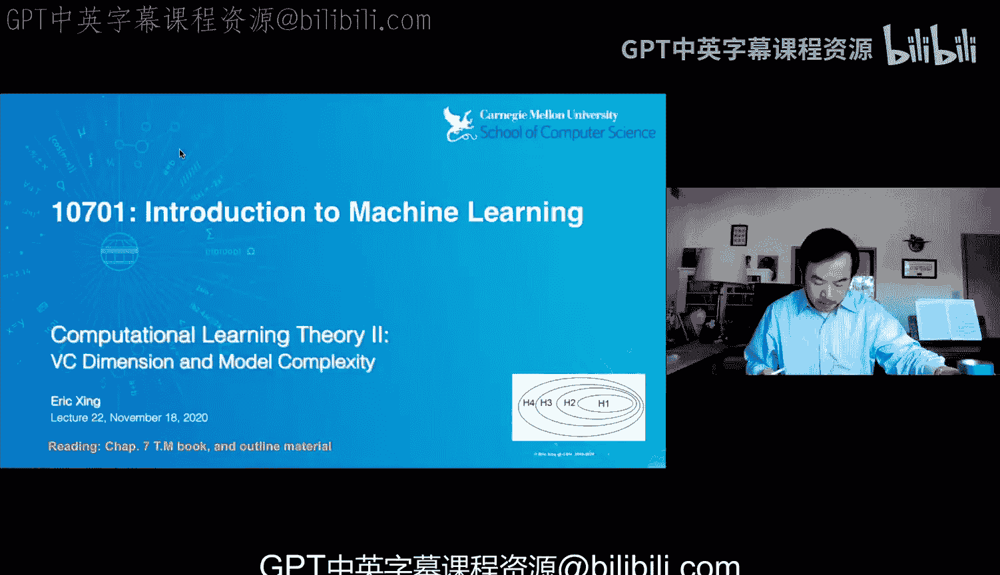
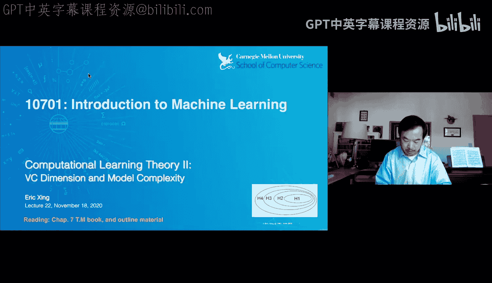
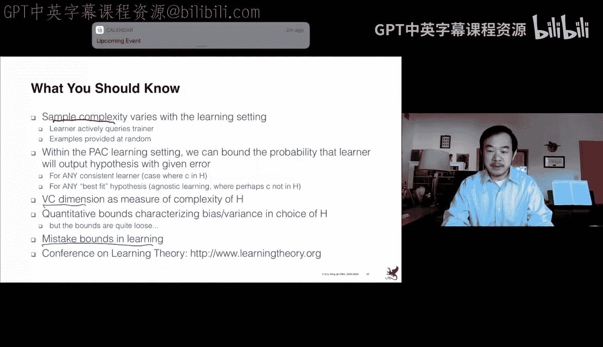

# 22：计算学习理论 II

在本节课中，我们将继续讨论计算学习理论，重点介绍如何衡量无限假设空间的复杂度，并理解其对学习算法泛化能力的影响。

## 概述回顾

上一节我们介绍了PAC学习和不可知学习两种框架，它们都基于**有限假设空间**。我们证明了，通过增加样本数量，可以降低找到一个在训练集上表现良好但真实误差很高的“坏”假设的概率。

然而，现实中的假设空间（如线性分类器）通常是**无限**的。因此，我们需要一个新的工具来衡量无限假设空间的复杂度，这就是**VC维**。

## 引入VC维：衡量假设空间的“打散”能力

为了描述假设空间的“能力”或“丰富度”，我们引入一个核心概念：**打散**。

**打散的定义**：给定一个包含 `m` 个数据点的集合 `S` 和一个假设空间 `H`。如果对于 `S` 上所有可能的 `2^m` 种二分类标签组合，`H` 中总存在一个假设能实现零训练误差的完美分类，那么我们就说 `H` **打散**了集合 `S`。

简而言之，打散意味着你的假设家族足够强大，可以拟合给定数据点上任何任意的标签模式。

基于打散的概念，我们定义 **VC维**：

**VC维的定义**：假设空间 `H` 的VC维，是能被 `H` 打散的**最大**集合 `S` 的大小。如果 `H` 能打散任意大的有限集，则其VC维为无穷大。

VC维量化了假设空间的**容量**或**表达能力**。它比单纯计算参数个数更能准确反映模型的复杂度。

### 一个关键例子：线性分类器的VC维

考虑二维平面上的线性分类器（即直线）。以下是分析其VC维的步骤：

1.  **VC维至少为3**：我们可以找到3个不共线的点（例如，一个三角形的三个顶点）。对于这3个点的任意一种标签组合（共8种），我们总可以画一条直线将它们完美分开。因此，线性分类器能打散大小为3的集合。
2.  **VC维小于4**：对于平面上任意4个点，总存在一种标签组合（例如，交叉标签，如XOR模式）使得没有一条直线能完美分类。因此，不存在能被直线打散的大小为4的集合。

**结论**：二维平面上线性分类器的VC维是 **3**。更一般地，在 `d` 维空间中，线性分类器（超平面）的VC维是 **d+1**。

### 为什么VC维比参数个数更好？

参数个数并不总能准确反映模型的真实容量。例如，考虑以下单参数函数族：
`h_alpha(x) = sign(sin(alpha * x))`
这个函数虽然只有一个参数 `alpha`，但其VC维是**无穷大**。它可以打散任意有限大小的点集（通过精心选择 `alpha` 来产生振荡）。这表明，即使参数很少，模型也可能具有极高的容量和过拟合风险。

## 基于VC维的理论保证

有了VC维，我们可以在无限假设空间下，得到类似于有限假设空间的泛化误差上界。

### 一致性条件

一个学习过程是**一致**的，意味着当训练样本数趋于无穷时，学到的假设的经验风险将收敛于其真实风险（泛化误差）。

**关键定理**：一个假设空间 `H` 上的经验风险最小化算法是一致的**必要**条件是，`H` 具有**有限的VC维**。有限VC维是获得一致性保证的基础。

### 收敛速率与泛化误差界

我们可以推导出泛化误差的上界。对于通过经验风险最小化学到的假设 `h`，以高概率有以下关系成立：

`真实风险(h) ≤ 经验风险(h) + O( sqrt( (VC维(H) * log(样本数m)) / 样本数m ) )`

这个公式揭示了泛化误差的两个来源：
1.  **经验风险**：模型在训练数据上的拟合程度。
2.  **置信区间项（VC置信度）**：由于使用有限样本估计真实分布所产生的不确定性。此项随 **VC维增大而增大**，随 **样本数增多而减小**。

## 结构风险最小化：平衡拟合与复杂度

上一节我们介绍了经验风险最小化。根据上面的误差界，我们意识到不能只最小化经验风险，还需要控制假设空间的复杂度（VC维）。这引出了**结构风险最小化** 的思想。

SRM不只在单一假设空间 `H` 内寻找最优假设，而是在一组**嵌套**的、复杂度递增的假设空间序列 `H1 ⊂ H2 ⊂ ... ⊂ Hn` 中进行选择。每个 `H_i` 对应一个特定的VC维。

以下是SRM的实践策略：
1.  对每个假设空间 `H_i`，执行经验风险最小化，得到假设 `h_i`。
2.  计算每个 `h_i` 对应的**结构风险**，即 `经验风险(h_i) + 复杂度惩罚项(H_i)`。
3.  选择使结构风险最小的那个 `h_i` 作为最终模型。

**注意**：理论给出的复杂度惩罚项（`O( sqrt(VC维/m) )`）中的常数因子通常是未知的，因此其**数值并不精确**，主要用于理解趋势。在实践中，我们通常使用**交叉验证**来近似实现SRM，即用验证集误差来估计泛化误差，并选择在验证集上表现最好的模型复杂度。

### 正则化：实现SRM的实用方法

一种直接实现复杂度控制的方法是**正则化**。我们在经验风险损失函数中增加一个与模型参数大小相关的惩罚项。

例如，在线性回归中，我们最小化：
`损失 = 均方误差(训练数据) + λ * ||权重向量w||^2`
其中，`λ` 是正则化系数。增大 `λ` 会迫使 `w` 的范数变小，这等价于限制了解空间，**降低了模型的有效VC维**。L2正则化（岭回归）和L1正则化（Lasso）都是这一思想的体现。

### 支持向量机：SRM的典范

支持向量机是SRM思想的完美体现。其原始优化问题为：
`最小化： (1/2) * ||w||^2 + C * Σ 松弛变量`
`约束条件： y_i * (w·x_i + b) ≥ 1 - 松弛变量`

这里：
*   `最小化 ||w||^2` 直接对应于**最小化VC维**（对于线性SVM，间隔最大化等价于权重范数最小化，而大间隔对应低VC维）。
*   `C * Σ 松弛变量` 部分对应于**控制经验风险**（允许一些误分类，但施加惩罚）。

通过核技巧，SVM可以将数据映射到高维特征空间，并在那里构造线性分类器。此时，模型的VC维等于特征空间的维度加一。这解释了为什么使用复杂核函数（如高斯核，对应无限维空间）时需要格外小心过拟合。

## 总结

本节课我们一起学习了计算学习理论的核心进阶内容：

1.  **VC维**：我们引入了VC维作为衡量**无限假设空间**容量的关键工具。它定义为假设空间能“打散”的最大点集的大小，比参数个数更能准确反映模型复杂度。
2.  **基于VC维的泛化界**：我们得到了泛化误差的上界，它由**经验误差**和与**VC维/样本数**相关的**置信区间**两部分组成。这解释了偏差-方差权衡的理论基础。
3.  **结构风险最小化**：为了获得良好的泛化性能，我们不能只最小化训练误差。SRM指导我们在一系列复杂度不同的模型中进行选择，以最小化经验风险和复杂度惩罚项之和。
4.  **实践联系**：我们看到了正则化和支持向量机如何将SRM的思想付诸实践，通过控制模型参数的大小或间隔来隐式地控制模型复杂度，从而提升泛化能力。

理解这些理论概念有助于我们在实践中做出更明智的决策，例如选择模型复杂度、理解正则化的作用以及诊断过拟合/欠拟合问题。