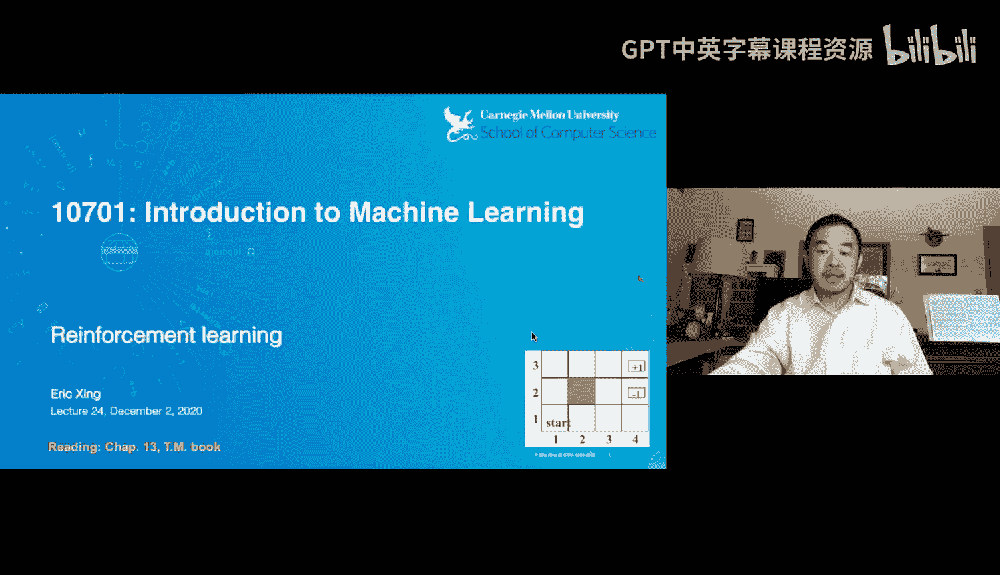
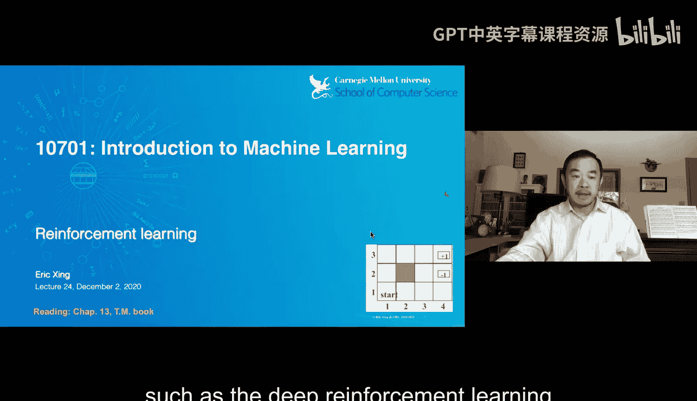
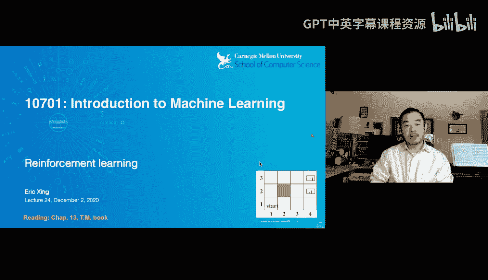
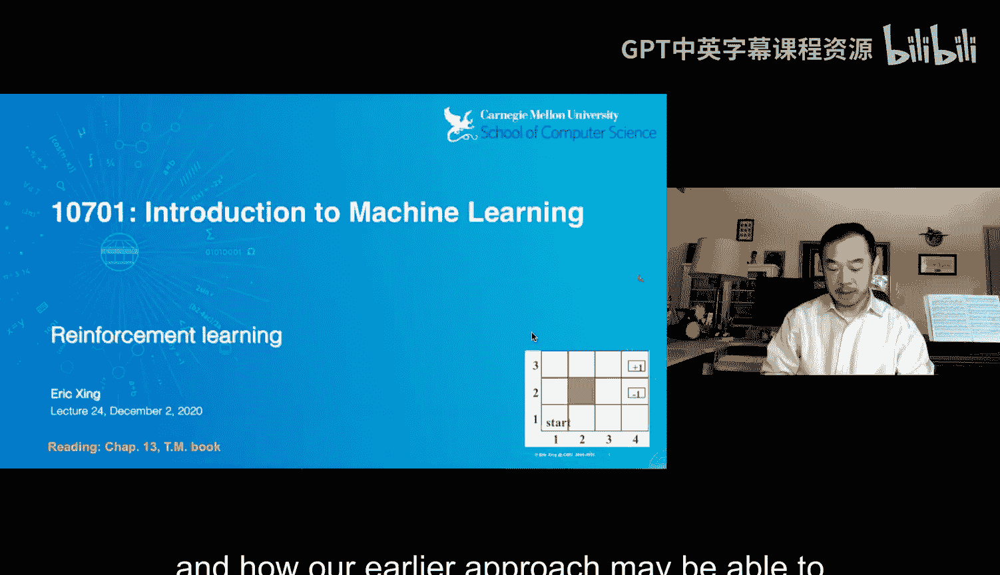
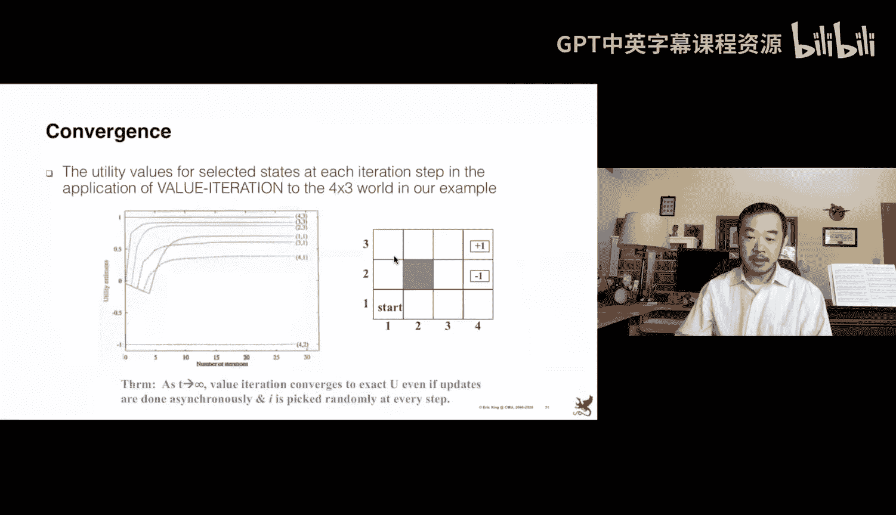
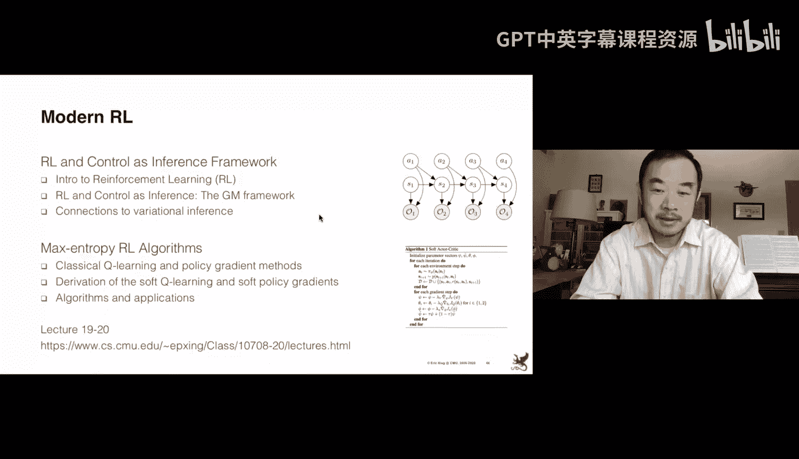

# 24：强化学习









在本节课中，我们将学习强化学习的基础知识。强化学习是一种让智能体通过与环境的交互来学习如何采取行动以最大化累积奖励的学习范式。我们将介绍其核心概念、基本算法，并了解它与其他学习范式的联系。

## 强化学习概述

到目前为止，我们学习了许多机器学习形式，例如用于模式识别和预测的监督学习，以及用于发现数据内在结构的无监督学习。然而，这些学习范式并未直接解决一个关键问题：如何利用学到的模型来采取有用的行动。强化学习正是为了填补这一空白，它允许智能体直接学习在给定状态和激励下如何行动。

强化学习的训练数据由三元组 `(状态 S, 动作 A, 奖励 R)` 构成。我们的目标是学习一个最优策略 `π*`，该策略能根据状态生成动作，从而最大化长期累积奖励。这项技术对于棋类游戏、机器人控制等领域至关重要。

## 强化学习的基本要素

上一节我们介绍了强化学习的目标，本节中我们来看看构成强化学习问题的几个核心要素。

*   **状态**：描述环境当前状况的信息，例如棋盘配置、机器人位置。
*   **动作**：智能体在某个状态下可以执行的操作集合。
*   **奖励**：智能体执行动作后，环境给出的一个标量反馈信号，表示该动作的“好坏”。
*   **策略**：一个从状态到动作的映射函数 `π(s) -> a`，它定义了智能体的行为方式。
*   **价值函数**：衡量在某个状态（或状态-动作对）下，遵循特定策略所能获得的**预期累积奖励**。状态价值函数记为 `V(s)`，状态-动作价值函数记为 `Q(s, a)`。

强化学习问题通常被建模为**马尔可夫决策过程**，它由元组 `(S, A, P, R, γ)` 定义，其中：
*   `S` 是状态集合。
*   `A` 是动作集合。
*   `P(s' | s, a)` 是状态转移概率。
*   `R(s, a)` 是奖励函数。
*   `γ` 是折扣因子，用于权衡即时奖励和未来奖励的重要性。

智能体的目标是找到最优策略 `π*`，使得对于所有状态 `s`，其价值函数 `V^{π*}(s)` 都是最大的。

## 动态规划方法

当我们完全了解环境模型（即知道 `P` 和 `R`）时，可以使用动态规划方法求解最优策略。以下是两种经典算法。

### 价值迭代

价值迭代算法通过不断更新状态价值函数 `V(s)` 来逼近最优价值函数 `V*(s)`。

算法从对 `V(s)` 的任意初始化开始（例如全零），然后重复应用以下**贝尔曼最优方程**进行更新：

```
V_{k+1}(s) = max_a [ R(s, a) + γ * Σ_{s'} P(s' | s, a) * V_k(s') ]
```

这个更新过程会收敛到最优价值函数 `V*`。一旦得到 `V*`，最优策略可以通过选择使上述方程右边最大的动作来提取：`π*(s) = argmax_a [ R(s, a) + γ * Σ_{s'} P(s' | s, a) * V*(s') ]`。

### 策略迭代

策略迭代算法直接在策略空间中进行搜索，它交替进行两个步骤：策略评估和策略改进。

1.  **策略评估**：给定一个策略 `π`，计算其价值函数 `V^π`。这可以通过求解线性方程组（贝尔曼方程）完成：`V^π(s) = R(s, π(s)) + γ * Σ_{s'} P(s' | s, π(s)) * V^π(s')`。
2.  **策略改进**：基于当前价值函数 `V^π`，对每个状态采用贪婪策略进行改进：`π_{new}(s) = argmax_a [ R(s, a) + γ * Σ_{s'} P(s' | s, a) * V^π(s') ]`。

重复以上两个步骤，直到策略不再发生变化，此时就得到了最优策略。

## 无模型方法：蒙特卡洛与时序差分学习

动态规划方法需要已知完整的环境模型，这在实际中往往不现实。无模型方法则通过与环境直接交互来学习。

### 蒙特卡洛方法




蒙特卡洛方法通过运行完整的“回合”来学习。对于一个给定的策略，智能体从起始状态开始，根据策略行动直到回合结束，得到一条状态、动作、奖励的轨迹 `(s0, a0, r1, s1, a1, r2, ..., sT)`。对于轨迹中访问过的每个状态 `s`，其价值 `V(s)` 可以通过计算该状态之后所有奖励的折扣和（即回报 `G_t`）来估计。通过对多个回合的回报取平均，可以更新 `V(s)`。

蒙特卡洛方法必须等到回合结束才能更新，且只适用于有终止状态的问题。

### 时序差分学习

时序差分学习结合了动态规划和蒙特卡洛的思想，它可以在每一步之后立即更新，无需等待回合结束。最简单的形式是 **TD(0)** 学习。

其更新公式为：
```
V(s_t) ← V(s_t) + α * [ r_{t+1} + γ * V(s_{t+1}) - V(s_t) ]
```
其中 `α` 是学习率。括号内的部分 `[ r_{t+1} + γ * V(s_{t+1}) - V(s_t) ]` 称为 **TD 误差**，它基于当前估计和下一步的估计之间的差异来调整价值函数。

## Q学习与SARSA

上一节我们学习了基于状态价值 `V(s)` 的方法，但提取策略需要环境模型。本节介绍直接学习状态-动作价值函数 `Q(s, a)` 的方法，它能更直接地得到策略。

### Q学习

Q学习是一种离策略的时序差分学习算法。它直接学习最优动作价值函数 `Q*(s, a)`。其更新规则为：
```
Q(s_t, a_t) ← Q(s_t, a_t) + α * [ r_{t+1} + γ * max_{a'} Q(s_{t+1}, a') - Q(s_t, a_t) ]
```
注意，更新中使用了下一个状态 `s_{t+1}` 下所有可能动作的最大 `Q` 值，这体现了其追求最优策略的特性。智能体在实际交互时可以采用**ε-贪婪策略**（以 ε 概率随机探索，以 1-ε 概率选择当前最优动作）来收集经验。

### SARSA

SARSA 是一种在策略的时序差分学习算法，其名称来源于更新所需的数据序列 `(s_t, a_t, r_{t+1}, s_{t+1}, a_{t+1})`。其更新规则为：
```
Q(s_t, a_t) ← Q(s_t, a_t) + α * [ r_{t+1} + γ * Q(s_{t+1}, a_{t+1}) - Q(s_t, a_t) ]
```
与 Q 学习不同，SARSA 使用智能体**实际执行**的下一个动作 `a_{t+1}` 的 `Q` 值进行更新，因此它学习的是遵循当前策略（通常是 ε-贪婪策略）的价值函数，更注重安全性。

## 现代发展与总结

本节课中我们一起学习了强化学习的经典基础：从基于模型的动态规划（价值迭代、策略迭代），到无模型的蒙特卡洛和时序差分方法，再到直接学习 `Q` 函数的 Q 学习和 SARSA 算法。

强化学习领域在近十年与深度学习结合后，产生了许多现代进展，例如：
*   **深度强化学习**：使用深度神经网络来近似价值函数、策略或环境模型。
*   **策略梯度方法**：直接参数化策略，并通过梯度上升来优化期望回报。
*   **将强化学习视为推理**：在概率图模型的框架下形式化强化学习问题。

这些发展极大地扩展了强化学习处理复杂、高维状态和动作空间的能力。要深入了解这些现代主题，可以参考相关的进阶课程和资料。



希望本教程为你理解强化学习提供了一个清晰的起点。