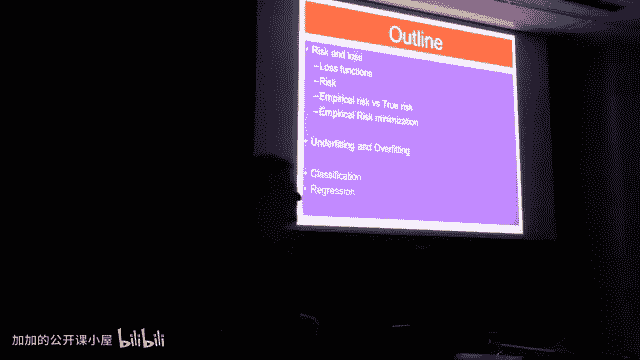

# 018：学习理论概述

在本节课中，我们将学习如何从理论上分析机器学习算法的性能。我们将探讨算法在未知测试集上的表现，以及为了达到较小的测试误差，我们需要多少训练样本。此外，我们还将研究使用这些算法所能达到的最小可能误差是多少。

学习理论正是研究这些问题的领域。为了回答这些问题，我们必须正式地讨论一些关于风险和损失的定义。

## 监督学习设定

上一节我们介绍了学习理论的目标，本节中我们来看看其基础设定。我们将讨论监督学习的框架。

在监督学习中，我们有一个数据集，即训练数据，它由成对的样本组成：`(x1, y1), (x2, y2), ..., (xN, yN)`。其中 `x` 是输入特征，`y` 是对应的输出标签。同时，我们也有一个测试数据集。

我们假设输入特征 `x` 来自一个 `D` 维的特征空间，标签 `y` 是实数。同时，我们假设特征 `x` 和标签 `y` 之间存在一个联合分布 `P(x, y)`。具体来说，特征向量 `x` 是从某个边缘分布 `P(x)` 中采样得到的，而标签 `y` 则是给定 `x` 后，从条件分布 `P(y|x)` 中采样得到的。

在回归问题中，标签通常是连续的区间值；在分类问题中，标签可能是离散的，例如 `0` 和 `1`。

## 损失函数与风险函数

为了评估算法性能，我们需要一个损失函数 `L`。损失函数衡量的是：给定输入特征 `x`，算法预测结果为 `f(x)`，我们将 `f(x)` 与真实标签 `y` 进行比较。

我们的目标是使损失在测试集上尽可能小。

以下是几种常见的损失函数：
*   **分类损失（0-1损失）**：如果预测标签与真实标签不同，则损失为 `1`；如果相同，则损失为 `0`。公式为：`L(y, f(x)) = I(y ≠ f(x))`，其中 `I` 是指示函数。
*   **回归损失（L2损失）**：即平方误差损失，公式为：`L(y, f(x)) = (y - f(x))^2`。
*   **回归损失（L1损失）**：即绝对误差损失，公式为：`L(y, f(x)) = |y - f(x)|`。

接下来，我们定义**风险函数**。风险是损失函数在数据联合分布 `P(x, y)` 上的期望值。对于任意函数 `f`，其风险 `R(f)` 定义为：
`R(f) = E[L(y, f(x))]`
这里的期望 `E` 是针对分布 `P(x, y)` 计算的。

## 风险与测试性能的关系

你可能会问，我们关心的是在具体测试集上的表现，为什么要分析这个理论上的“风险”呢？

原因在于，当测试集足够大时，模型在测试集上的平均损失会收敛到其理论风险值。也就是说，风险是我们期望在未知数据上获得的平均性能。即使我们手头有具体的测试特征，分析风险也能为我们提供算法泛化能力的理论保证。

当然，如果我们已知测试特征，或许能利用其结构做更多事情（这属于半监督学习的范畴）。但为了简化分析，我们将专注于研究风险。

总结来说，我们有一个训练集，并从中学习得到一个函数 `f`。我们关心的是这个学到的函数 `f` 的风险 `R(f)`，即其期望损失。虽然算法无法直接获取真实的数据分布 `P(x, y)`（它只能访问训练数据），但风险为我们提供了一个衡量算法泛化能力的核心理论工具。

在本节课中，我们一起学习了监督学习的基本设定，正式定义了损失函数和风险函数，并理解了风险与模型在测试集上实际表现之间的关系。这些概念是学习理论分析的基石。