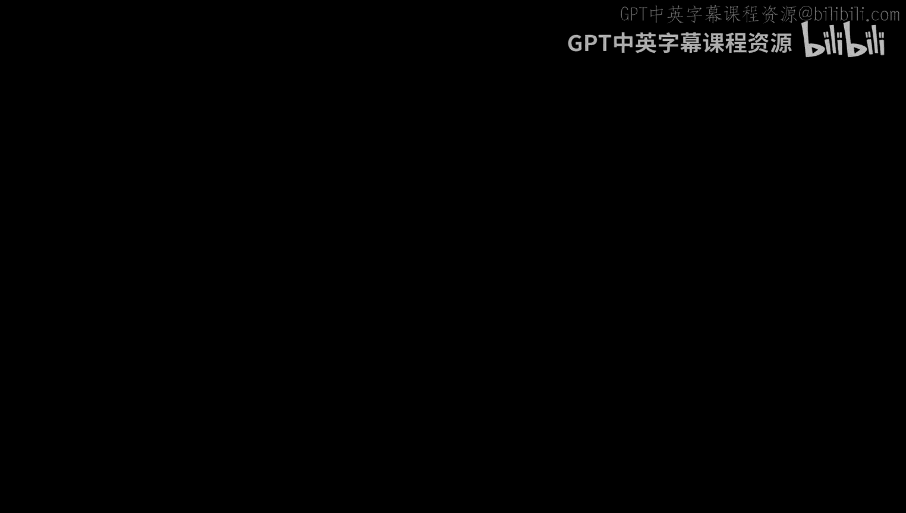
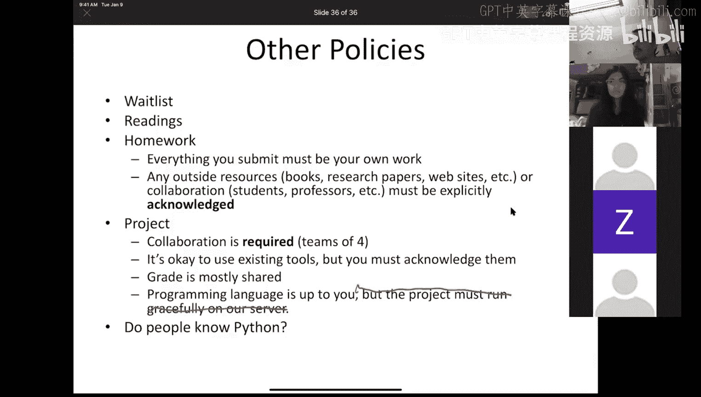
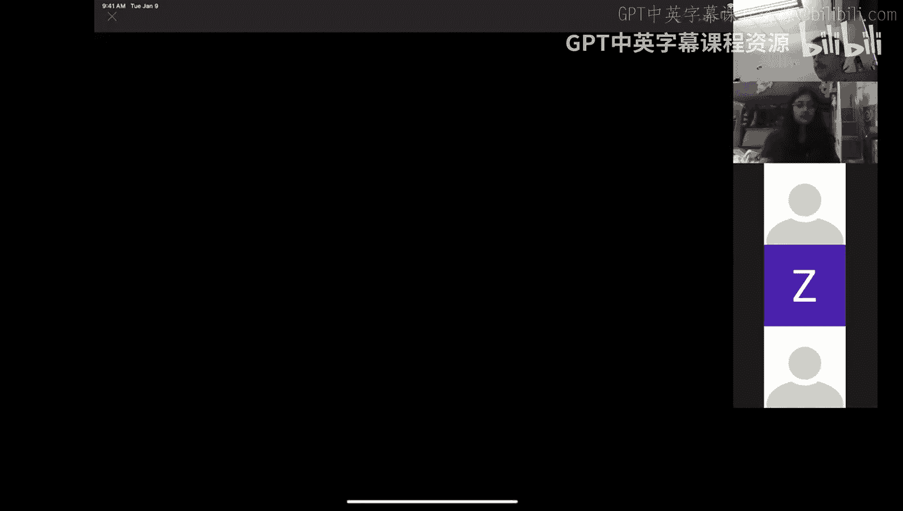
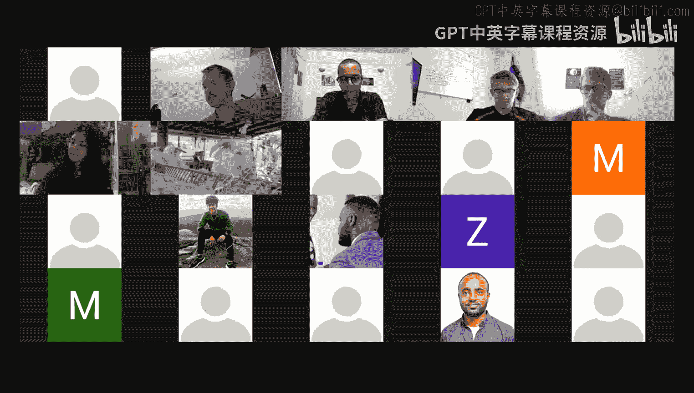
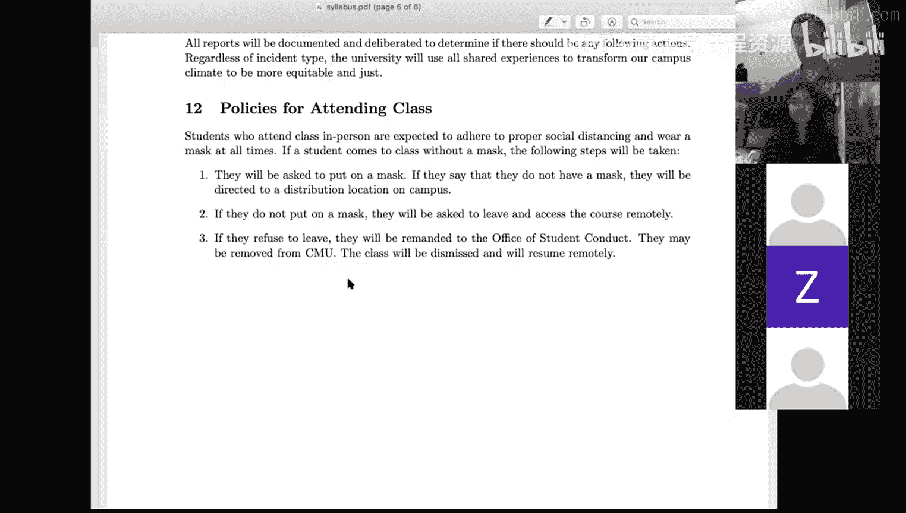

# 0

在本节课中，我们将要学习自然语言处理（NLP）的基本概念、课程目标以及相关的教学安排。我们将探讨NLP的定义、重要性、应用领域以及课程的核心内容。

欢迎来到自然语言处理课程 11-411/11-611。我是David Mortonson，是这门课程的讲师之一。另一位讲师是Alan Black，他将进行自我介绍。

大家好，我是Alan Black，就是那位留着长胡子的。我也会讲授部分课程内容。但前几节课将由David主讲。

我们很容易区分彼此：长胡子和小胡子。我的胡子没有那么有特色，也不是永久性的。我无法像甘道夫或邓布利多那样成为小说中的标志性人物。但我对自然语言处理充满热情，并很高兴能向你们介绍这门学科的基础。

在这节课中，我们将介绍自然语言处理是什么，以及本课程将讨论哪些内容。我们还将讨论课程大纲和课程的实际要求，并给你们机会提问，以便更好地了解课程评估方式。

## 什么是自然语言处理？

你们对NLP一定有所了解，否则不会选这门课。我们对NLP的定义是：**自动化地分析、生成和获取人类（即自然）语言**。这包含三个部分：
*   **分析**：NLP中的理解或处理部分。
*   **生成**：根据某种意义或功能的表示来生成自然语言。
*   **获取**：从数据中获取表示、必要算法和知识。

有些人用NLP指代所有语言技术，有些人仅用它指代分析。令人困惑的是，有些人将NLP与语音技术分开，认为语言仅指书面语。在本课程中，我们将采取包容的态度，NLP将涵盖分析、生成和获取这三个类别，并且同时包含语音和书面语言。

## 为什么自然语言处理很重要？

为什么你想学习NLP？一个原因是网络搜索。有一家名为Alphabet的大型公司，它拥有谷歌等众多公司。他们选择Alphabet这个名字，部分原因是因为NLP是他们业务的核心。Alphabet意味着代表语言的字母集合，而语言是人类最重要的创新之一，也是我们使用谷歌搜索进行索引的核心。

不仅仅是谷歌认为NLP重要。许多大小公司都在招聘NLP团队，并支付高薪让他们完成各种自然语言处理任务。所有大型科技公司都有NLP团队。因此，了解NLP是值得的。即使你将来不从事NLP工作，了解它也能帮助你与从事NLP的人交流，并理解其带来的问题和益处。

## 自然语言处理能做什么？

NLP有哪些实际应用？以下是一些例子：
*   **自动小说生成**：生成虚构或创意文本。
*   **机器翻译**。
*   **个人数字助理**：如Alexa、Siri和Google Home，它们严重依赖NLP。
*   **信息抽取**：从文本中提取结构化信息。
*   **聊天机器人和其他对话系统**。
*   **情感分析**：分析文本背后的情感，例如判断文本是愤怒的还是善意的。
*   **问答系统**。
*   **文本摘要**。
*   **信息管理**：如管理短信、电子邮件和电话留言。
*   **理解搜索查询**。
*   **翻译书籍**。
*   **自动更正和自动补全**：这是NLP的应用，本课程将学习其工作原理和实现方法。
*   **写作辅助工具**：如Grammarly，帮助改善写作。
*   **创意写作**：创意文本生成。
*   **自动电话**：一些自动电话能进行对话，试图让你相信它们是真人。
*   **文档翻译**。
*   **图书馆研究**。
*   **辅助决策**：通过从文本中提取大量信息来帮助做出明智决策。
*   **考试评分**：许多标准化考试在评分过程中使用NLP。
*   **倾听和建议**。
*   **评估公众舆论**：通过爬取在线论坛、扫描Twitter、检测宣传等方式，使用信息抽取和情感分析来评估公众舆论。
*   **监听私人电话**：理解电话内容并从中提取信息。
*   **阅读一切并做出预测**。
*   **互动式学习辅助**。
*   **帮助残疾人士、难民和灾民**。
*   **记录或振兴土著语言**。

## 自然语言处理的职业前景

大多数NLP从业者在工业界工作，为各种公司服务。也有许多人在政府和学术界工作，还有少数人在人道主义组织工作。选择工作时，不仅要考虑薪酬，还要考虑伦理问题，思考你所做的工作对人类是有害还是有益，以及你是否能做得更好。

## 自然语言处理的详细定义

回到NLP的详细定义，我们可以将其视为自动化语言分析、生成和获取。分析是指将语言作为输入，输出某种可以据此行动的表示。生成则是将这种表示作为输入，输出语言，是相反的过程。获取则是从数据中获取表示、必要算法和知识。

那么，NLP中的“表示”是什么？让我们看下面的图表。这些是语言表示的不同层次。

在底部，你有**文本和语音**。这是分析时的输入，也是生成时的输出。语言具有丰富的结构，包含多个不同的表示层次：
*   **语音学/音系学**：语音的表示。
*   **正字法**：书写系统的表示。
*   **形态学**：关于词语内部结构的表示。
*   **词汇学**：关于语言中词语集合（词典）的表示。
*   **句法学**：关于句子结构的表示。
*   **语义学**：关于意义的表示。
*   **语用学**：关于语境中语言使用的表示。
*   **语篇学**：关于超越句子层次的语言结构的表示。

同一个句子，无论是书面的还是口头的，都可以从所有这些不同的层次来表示。但这非常困难，因为层次之间的映射非常复杂。一个特定的表示是否适合某项任务，取决于你的应用目标。

此外还有其他问题。输入可能是有噪声的。语言表示是理论构建的，我们无法直接观察它们。还存在歧义问题。每个字符串在每个表示层次上都有许多可能的解释。人们非常擅长解决语言歧义，但问题在于我们如何表示上下文以及如何表示可能的选择集合。

另一个问题是丰富性。表达相同意义的方式有很多，而要表达的意义更是数不胜数。我们可以用几乎无限多的不同方式组合词语和短语，以获得不同的意义、句子和语篇。这些层次之间相互影响，存在接口。

最后，人类语言具有多样性。虽然我们表达的意义大致相同，但不同语言表达相同意义的机制可能非常不同。有些语言更喜欢谈论某些意义，或者更适合表达某些类型的意义。

## 本课程的学习内容

在本课程中，我们将学习**模型**。模型是什么？它是一个抽象的、理论性的、预测性的构建体，包含三个部分：对世界的部分表示、创建或识别世界的方法，以及关于世界的推理系统。

在NLP中，我们使用许多不同的工具进行建模。有时，非常浅显、不那么复杂的模型效果很好。有时则需要更复杂的模型，这很大程度上取决于你的应用目标。

本课程旨在向你们介绍一些形式化工具，帮助你们在NLP领域导航。它不是介绍当前NLP实践，也不是试图让你们成为最先进的NLP从业者。它旨在为你们提供必要的形式化工具基础，以便你们将来适应NLP实践，或理解过去人们在NLP领域所做的工作。

因此，我们专注于**形式化和算法**。这不是一个全面的概述，而是对某些关键主题的深入介绍。我们主要关注分析和英语文本，尽管我们也有几节关于语音的讲座，以及几节与非英语NLP相关的讲座。然而，你们将培养的技能适用于NLP的任何子领域。根据经验，我们发现这对于将来在工业界或其他地方从事NLP工作的人来说是一个非常好的入门。

## 应用与挑战

那么应用呢？这里有一些挑战。应用任务在不断演变，并且通常很难形式化定义。你可能会问，既然应用总是在变化，并且不容易形式化，我们如何弥合这一鸿沟？实际上，这很自然。正因为应用总是在变化，所以建立基础比直接教授应用本身更重要。

还要注意，系统性能的客观评估总是存在争议。评估非常重要，但很少有单一指标来评估你在特定应用上的表现，存在许多相互竞争的评估标准和指标。这既适用于分析本身，也适用于应用任务。

最后，不同类型的应用可能需要不同层次的不同表示。因此你必须灵活，但如果你理解了不同的表示层次以及所使用的不同形式化方法，就更容易为特定应用找到合适的方案。

以下是2020年的一些应用：
*   **计算语言学**：用计算模型模拟人类的语言能力。
*   **信息抽取**：如开放信息抽取。
*   **问答系统**：你们将在本课程的项目中完成。
*   **机器翻译**：目前非常重要且效果很好。
*   **文本摘要**：效果一直在提升。
*   **观点和情感分析**：目前对工业界、学术界和政府应用都非常重要。
*   **社交媒体分析**：与观点和情感分析密切相关。
*   **虚假新闻识别**：使用技术来发现不真实的信息。

## 自然语言处理与计算语言学

这引出了NLP和计算语言学之间的区别。在另一门相关课程中，有人这样评价语言分析：你取了一个美丽的生物，杀死它，然后把它切成碎片。这就是我们在NLP和计算语言学中所做的。

NLP侧重于处理语言的技术。计算语言学侧重于使用技术来支持或实现语言学。这有点像人工智能（更侧重于工程和技术）与认知科学（试图研究大脑以及我们在进行认知时大脑内部发生了什么）之间的区别。

## 语言表示层次详述

让我们更详细地看看一些表示层次。

**形态学**是关于将词语分析为有意义组成部分的学科。不同语言具有不同程度的形态复杂性。有些语言被称为分析语或孤立语，如汉语和程度较低的英语，这些语言的词语内部结构不多，大多数词语只有一个意义单位。有些语言是综合语，如芬兰语、土耳其语或希伯来语，这些语言的词语内部结构非常丰富。

**词汇学**涉及词典。一个问题是如何将文本分割成词语。在汉语中，通常认为每个字符代表一个词，但这并不完全正确。词语作为存储在人类心理词典中的单位，以及需要作为单位存储在NLP词典中的单位，通常大于一个字符。进行这种分析需要了解词典，即词语的存储库。

你还需要做其他事情，例如规范化和消歧词语。有些词有多个含义，如“bank”或“mean”。有些词具有许多特定领域的含义。你还会遇到多词表达式，这些表达式由多个词组成，但需要作为一个单一的词汇条目来处理。

英语的一种词汇分析是**词性标注**，即为每个词分配标签，如名词、动词、形容词等。

**句法学**涉及句法分析，即给一个符号序列赋予层次或组合结构。这与语言学理论密切相关，这些理论解释了为什么有些句子结构良好而有些则不然。句法也是歧义的，并且歧义会组合性地爆炸式增长。

**语义学**是将自然语言句子映射到有意义的领域表示的过程，例如机器人命令语言、数据库查询或形式逻辑表达式。范围歧义是语义学中的一个例子，例如“a seat is available to every customer”可以表示有一个座位，也可以表示每个顾客都有一个座位。超越特定领域是人工智能的目标之一，即能够以非领域特定的方式做到这一点。

**语用学和语篇学**。语用学是语境中的语言使用。例如，如果你说“Can you pass the salt?”，在语境中它实际上是一个请求，甚至是告诉某人递盐。我们如何让计算机知道这一点？我们赋予它们语用学知识。还有其他类型的语用推理。

语篇学是关于句子层次之上的内容。文本、对话、多方对话都涉及语篇，并且都很困难。

## 课程管理信息

本课程的网页地址是上述链接。你也可以通过Canvas访问该网页。我们还使用Piazza。我们使用多个不同的平台，虽然这可能会让你们困惑，但每个平台都有其作用。

教材是《Speech and Language Processing》。我鼓励你们不要获取盗版副本，除非你无法将纸质书送到你的所在地。

讲师是Alan Black和David R. Mortonson。助教是Kinja、Milan、Sbi Mohanti、Yuuhao和Michael Huang。Kit也在。

任何想上这门课的人基本上都可以加入，我们欢迎所有人。你们应该完成阅读，这非常有用。有些计算机科学背景的人可能会反对，因为教材中有很多文字，但这些文字的目的是向你们传达自然语言处理的知识。阅读教材对你们大有裨益。

在作业或其他方面使用教材以外的任何资料时，都需要注明出处。作业必须独立完成，这不包括测验。每周五将发布大约10个测验，需要在周一前完成。我们努力使它们更好，更能衡量你们的学习情况。

还有一个**项目**，这是本课程最重要的部分之一。当被问及对课程的印象时，这是最积极的回应之一，他们从这个小组项目中学到了很多。我们将在接下来的讲座中详细讨论。

你们需要进行合作，我们希望你们组成四人小组。你们应该立即开始寻找小组成员。项目是关于问题生成和问题回答的。在Piazza上发帖是寻找小组成员的好方法。

成绩大部分是共享的，除非有人确实没有完成工作，我们会重新分配分数。编程语言由你们选择。项目必须在Docker容器中运行，只要它能在AWS实例中运行，你们可以随意选择语言，只需遵循特定的结构以便我们运行。

第一周有作业吗？查看网站上的日程安排，第一次作业在9月3日（周四）布置，9月10日截止。这是一个非常简单的作业，旨在确保你们能够进行基本的编程和文本处理，并阅读文档等。

有任何问题吗？

我建议课前阅读吗？当然。如果课前阅读，你会从讲座中获得更多。我强烈推荐这样做。

组队截止日期通常在第二周结束时。所以请立即开始着手。有时我们需要进行一些调整，因为有人可能退课或其他情况。我们希望在下周末之前基本确定下来。

你们可能会问，我们可以做什么来开始？我们对NLP一无所知，这正是我们选这门课的原因。但事实证明，你们可以做很多事情，并且通过开始实践会学到很多。

让我们看看你们关心的部分。这是评分评估。将有两场期中考试，各占成绩的15%，分别覆盖课程的前半部分和后半部分。

项目同样重要，占成绩的30%。这是一个为期整个学期的四人小组项目，并且是竞争性的，我们稍后会讨论。部分成绩（不是大部分）来自你们在与其他系统生成和回答问题比赛中的表现。

将有七次作业，主要是小型编程作业，在学期的大部分周中布置，占成绩的25%。

将有测验，占成绩的15%。将有10次Canvas测验，在大多数周末发布，大约包含5到10个问题。这些测验旨在帮助你们自我评估，确保你们完成阅读、观看讲座并做必要的事情以在课程中取得成功。

我们将去掉两次最低的作业成绩和三次最低的测验成绩。但我们不接受迟交作业，除非在特殊情况下。这样，当你们生病或旅行无法完成时，可以使用这些去掉的机会。

关于混合教学的一些说明可能不适用，因为现在日程有所改变，我们可能有足够的时间在规定时间内完成讲座。我们不会进行预录讲座，但会录制所有讲座并在线发布，以便无法同步参加的人观看。

感恩节假期后，所有课程都将远程进行。根据情况，变化可能更早发生。但至少在一段时间内，我们将进行面对面教学，并与远程教学同步进行。我们有一个特殊的教室，应该具备特殊功能，使我们能够有效地做到这一点。

任何学生都可以在学期的任何时间转为远程学习，无需通知或获得教学团队的许可。但是，如果你想转为面对面学习，则必须获得许可。

我们使用不同的技术完成不同的事情：Zoom用于进行实时复习课，YouTube用于分发录制的讲座，Piazza用于传播课程信息和回答学生问题，GradeScope用于评分作业和管理考试，Canvas用于提供成绩簿访问、提交小组作业和收集私人链接。

我理解处理五件不同的事情可能会让很多人感到烦恼，但这是我们制定的方案，似乎对本课程有效。这些工具中没有哪一个能单独提供我们需要的所有功能。

如果你有残疾，我们鼓励你与我们交谈，以便我们开始做出安排，但你也应尽快在本周与残疾资源办公室联系，以便做好所有安排。

关于学生健康。我们正在经历非常困难的一年。冠状病毒让许多人感到孤立和孤独，并打乱了一切。我们希望你们照顾好自己，尽力保持健康的生活方式，饮食健康、锻炼、避免毒品和酒精、保证充足睡眠，并尝试花时间放松。我知道你们是CMU的学生，但你们仍然可以放松，而不是一直工作。这将对你们有帮助。但我们所有人都在挣扎时都需要支持。如果你们中任何人需要为这类困难提供便利或需要额外帮助，请告诉我们。如果你知道有人因生活事件或焦虑、抑郁等情绪而承受巨大压力，请寻求支持，有咨询和心理服务可以帮助你。同时，尝试向你信任的朋友、教职员工或其他人寻求帮助以获得支持。

这里还有一份关于多样性的声明。我们希望每个人都感到受到尊重，无论他们以何种方式表现出多样性。如果你觉得因为与讲师、助教或其他人的某些不同而受到不良对待，请不要犹豫，联系学生多样性与包容中心。或者，如果你看到其他人以这种方式受到虐待，你也可以使用Report It进行在线举报。

如果是面对面授课，则有特定的课堂出勤政策。我们鼓励每个人参加同步课程，这对你们有帮助，但出勤不是必须的，无论是面对面还是远程。但如果你面对面参加，必须佩戴口罩。如果你不始终佩戴口罩，将采取以下步骤：你将被要求戴上口罩；如果你说没有口罩，将被引导到校园内的分发点；如果你不戴上口罩，将被要求离开并通过远程方式访问课程；如果你拒绝离开，将被移交给学生行为办公室。你可能会被CMU开除，课程将被取消并转为远程进行。

关于教学大纲有什么问题吗？我没有关注聊天，所以得回看一下。另一场期中考试被列为“期末”，但它不是综合性的期末考试，而是第二场期中考试。测验主要是选择题，尽管有些是公式或简答题。还有什么关于测验的问题吗？关于教学大纲或课程还有其他问题吗？

考试有固定的时间窗口吗？通常我们有一个时间窗口，但我们有多个窗口。对于当时不在北美的人，我们可能有另一个时间窗口，也许是匹兹堡时间的早上，以便亚洲、欧洲或非洲的人参加考试。

还有其他问题吗？好的，我非常高兴你们这学期能选这门课。我认为这将是一个很棒的学期，我很高兴我们有这么多学生。我认为我们将有一些非常好的项目和非常好的体验。如果你有任何问题，请在Piazza上发帖。也请花时间看看Canvas，确保你对那里的一切都熟悉。但如果你有任何问题，请在Piazza上发帖，助教会回答他们知道的问题，如果他们不知道，他们会把问题转给我或Black教授，我们会尽快给你答复。保重。抱歉，我被聊天分散了注意力。祝你们下午愉快。