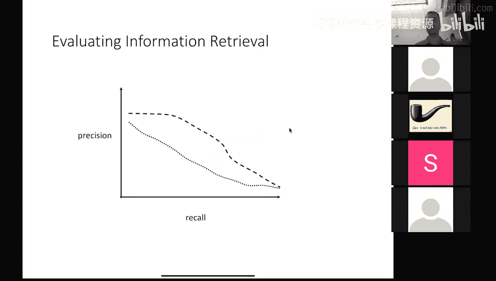
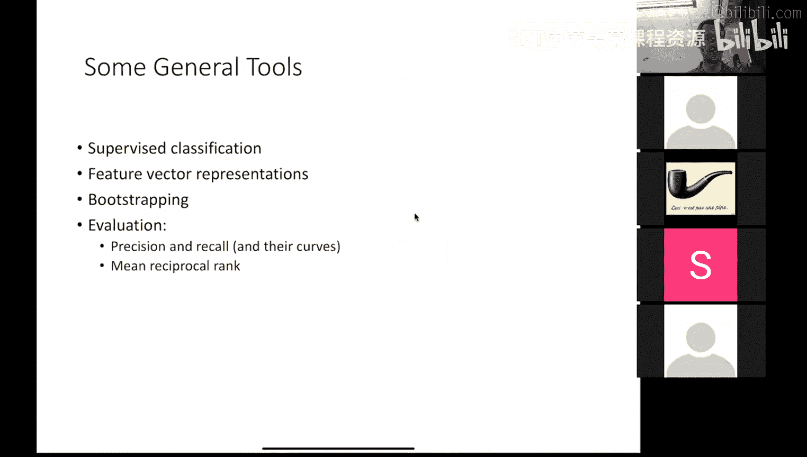

# 2：NLP应用与核心技术

在本节课中，我们将学习自然语言处理（NLP）的几个核心应用领域：信息抽取、信息检索和问答系统。我们将探讨这些任务的基本概念、实现方法以及评估方式，为后续深入学习打下基础。

## 信息抽取：从文本到结构化数据

信息抽取的目标是从非结构化的文本中提取结构化信息，并填充到预定义的关系数据库中。其核心输入是文本，输出是填充好的数据表。

### 命名实体识别

命名实体识别是信息抽取的基础步骤，旨在识别文本中属于特定类别的专有名词，如人名、组织名、地点等。

上一节我们介绍了信息抽取的整体概念，本节中我们来看看命名实体识别的具体实现。

命名实体识别通常被建模为一个序列标注任务。我们将文本分割为词元（大致相当于单词），并为每个词元分配一个标签，表示它是否属于某个命名实体以及在该实体中的位置。

以下是常见的标注方案（IOB格式）：
*   **B-PER**: 表示一个**人**名实体的开始。
*   **I-PER**: 表示一个**人**名实体的内部。
*   **B-ORG**: 表示一个**组织**名实体的开始。
*   **I-ORG**: 表示一个**组织**名实体的内部。
*   **O**: 表示不属于任何命名实体。

例如，在句子 “President Donald Trump met…” 中：
*   “President” 被标注为 `B-PER`
*   “Donald” 被标注为 `I-PER`
*   “Trump” 被标注为 `I-PER`
*   “met” 被标注为 `O`

使用B（开始）和I（内部）标签是为了区分相邻的不同命名实体。

### 指代消解与实体链接

在识别出命名实体后，我们需要理解这些提及指向现实世界中的哪个具体实体。

*   **指代消解**：确定文本中不同的提及（如“约翰·爱德华兹参议员”和“爱德华兹”）是否指向同一个实体。
*   **实体链接**：将文本中的命名实体提及链接到知识库（如维基百科）中对应的唯一实体条目。

### 关系抽取

关系抽取旨在发现文本中实体之间满足的特定关系，例如“成员_of”、“位于”、“已婚_to”等。

这是一个比命名实体识别更复杂的任务，因为它通常需要理解句子的语义和上下文，而不仅仅是识别词汇模式。一种简单的方法是使用自举法：从少量种子模式或实体对出发，迭代地发现新的模式和实体对。

## 系统评估：精确率、召回率与F1值

在构建了NLP系统后，我们需要客观地评估其性能。对于分类任务（如命名实体识别），常用的评估指标是精确率、召回率和F1值。

上一节我们探讨了如何从文本中抽取信息，本节中我们来看看如何衡量这些抽取系统的优劣。

评估需要基于人工标注的“黄金标准”数据。我们将系统输出与黄金标准进行比较。

以下是核心评估指标的定义：

*   **精确率**：衡量系统找出的结果中有多少是正确的。
    `精确率 = 系统正确识别的数量 / 系统识别出的总数`
*   **召回率**：衡量所有正确的结果中，系统找出了多少。
    `召回率 = 系统正确识别的数量 / 黄金标准中存在的总数`
*   **F1值**：精确率和召回率的调和平均数，是综合衡量指标。
    `F1 = 2 * (精确率 * 召回率) / (精确率 + 召回率)`

为什么不用准确率？因为在诸如命名实体识别的任务中，大多数词元都不是实体，一个总是预测“非实体”的愚蠢系统也能获得很高的准确率，但这显然不是一个好系统。精确率和召回率能更好地反映系统在目标类别上的表现。

## 信息检索：向量空间模型

信息检索的核心是从大量文档集合中找出与用户查询相关的文档。向量空间模型是解决此问题的基础方法。

上一节我们学习了如何评估NLP系统，本节中我们转向信息检索，看看如何让计算机理解文档的相关性。

其核心思想是将文档和查询都表示为高维空间中的向量。

*   每个维度对应词汇表中的一个唯一词语。
*   向量的每个位置的值是该词语在文档（或查询）中出现的次数（词频）。
*   这构成了一个**词袋模型**，它忽略了词语的顺序。

为了衡量文档与查询的相似度，我们计算它们对应向量的**余弦相似度**。余弦相似度关注的是向量之间的夹角，而非长度，因此能避免长文档仅仅因为包含更多词语而获得更高分数的问题。

在实际应用中，我们常使用**TF-IDF**（词频-逆文档频率）对向量进行加权。TF-IDF倾向于给那些在少数文档中频繁出现（因此可能更具代表性）的词语更高的权重。

## 问答系统：检索与答案生成

问答系统是NLP的一个重要应用，它直接回答用户用自然语言提出的问题。一个典型的基于检索的问答系统流程如下。

上一节我们介绍了信息检索的基础，本节中我们来看看如何利用它来构建一个问答系统。

以下是构建问答系统的基本步骤：

1.  **问题处理**：
    *   将自然语言问题转换为可用于检索的**查询向量**（使用向量空间模型）。
    *   对问题进行**分类**（例如，是“是什么”事实型问题，还是“是否”判断型问题）。
2.  **文档/段落检索**：
    *   在一个文档集合（知识库）中，将每个文档或段落（如句子）也表示为向量。
    *   计算查询向量与所有文档/段落向量的余弦相似度。
    *   根据相似度得分对文档/段落进行排序，返回最相关的几个。
3.  **答案生成**：
    *   从排名最高的相关段落中，抽取出具体的答案片段。
    *   例如，对于问题“西弗吉尼亚州最大的城市是什么？”，如果检索到段落“西弗吉尼亚州最大的城市是宾夕法尼亚州的匹兹堡。”，系统应返回“匹兹堡，宾夕法尼亚州”，而不是整个句子。

问答系统常使用**平均倒数排名**作为评估指标。它衡量的是正确答案在系统返回的答案列表中的排名位置，排名越靠前（倒数越小），得分越高。

## 总结

本节课中我们一起学习了自然语言处理的三个核心应用领域。我们了解了**信息抽取**如何将文本转化为结构化数据，包括命名实体识别、指代消解和关系抽取等子任务。我们掌握了使用**精确率、召回率和F1值**来评估NLP系统性能的方法。我们还探讨了**信息检索**的向量空间模型，以及如何利用它构建一个基本的**问答系统**。这些基础概念和流程为后续更深入的NLP学习以及课程项目实践奠定了重要的基础。