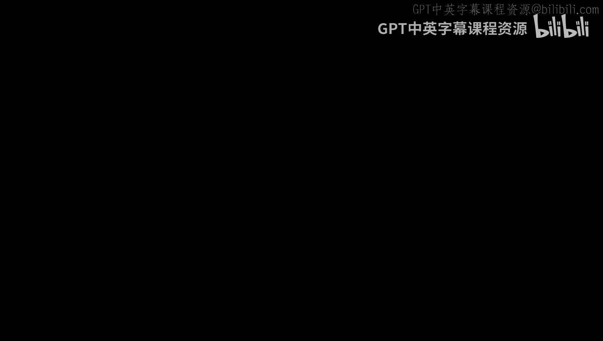
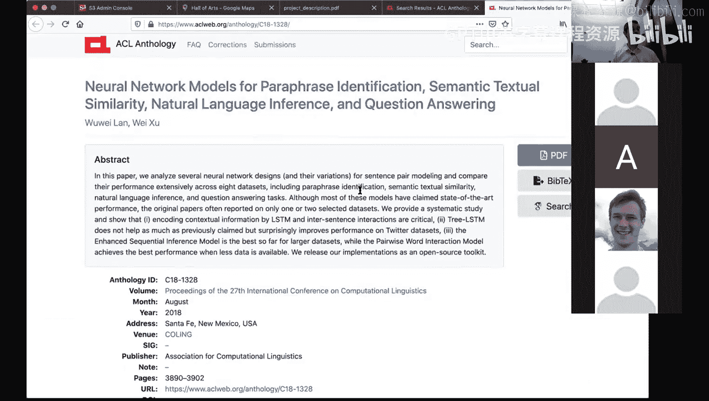
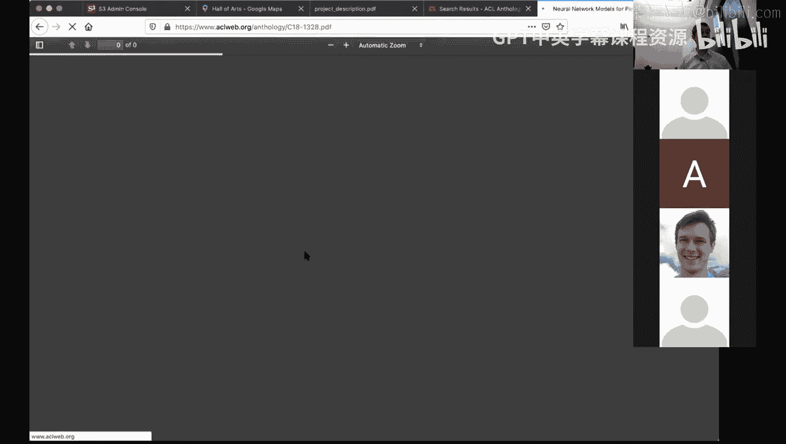
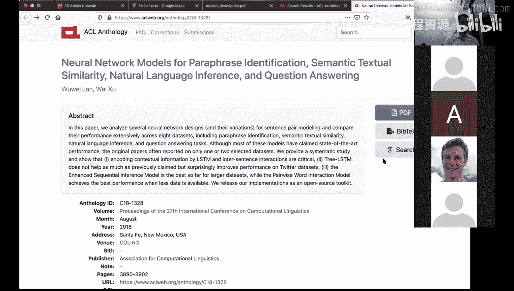

# 3：项目介绍与指南 🎯

在本节课中，我们将学习课程项目的目标、要求、评估方式以及关键的时间节点。项目包含两个核心任务：基于维基百科文章生成高质量问题，以及基于文章和问题生成高质量答案。

---

## 项目概述 📋

项目的目标是：给定一篇维基百科文章，生成N个高质量的问题；或者，给定一篇维基百科文章和一系列问题，从文章中生成高质量的答案。

上一节我们介绍了项目的总体目标，本节中我们来看看如何定义“好问题”与“坏问题”。

## 什么是好问题？🤔

好问题应该能从给定的文章中直接找到答案。以下是一些好问题的例子：
*   匹兹堡以什么闻名？（城市桥梁）
*   匹兹堡有多少座摩天大楼？
*   匹兹堡位于哪个州？
*   匹兹堡的人口是多少？
*   匹兹堡的昵称是什么？

以下是生成好问题的一种方法：使用**模板**。例如：
*   句子结构为 `X is Y`，可生成问题 `What is Y?`
*   句子结构为 `The X verbs Y`，可生成问题 `What does the X verb?`
*   对于包含数字的句子，可以生成基于数量的问题。

## 什么是坏问题？🚫

坏问题通常无法从文章中直接找到答案，或者答案的推导过程过于复杂。以下是一些坏问题的例子：
*   法国的首都是哪里？（信息不在文章中）
*   这篇文章的第57个字母是什么？（无意义的问题）
*   为什么匹兹堡有30座摩天大楼？（无法从文章中推断原因）
*   匹兹堡的三条河是什么？（信息隐含，需要复杂推理）

## 如何生成答案？💡

对于问题生成，可以采用基于模板的方法。对于问题回答，则有多种方法。

上一节我们讨论了问题生成，本节中我们来看看问题回答的常见方法。

一种简单的方法是**基于模板**。例如，对于问题 `What is X?`，在文章中寻找 `X is Y` 这样的模式，然后回答 `Y`。

更高级的方法是**基于抽取的技术**。你可以使用向量文档模型，在文本中寻找可能包含答案的片段，然后将其处理成最终答案。

一个可行的起点是构建一个**基于信息检索**的问答系统。

## 项目评估方式 📊

项目将由同学进行同行评估。具体流程如下：
1.  项目结束时，你的代码会被打包成Docker容器运行在未见过的文章上，生成一系列问题。
2.  这些问题会被随机分发给班上的其他同学进行评估。评估标准包括：**流畅性**（语法正确、表达地道）、**合理性**和**可回答性**。
3.  评估出的最佳问题会被输入到你的问答系统中，你的系统将生成答案。
4.  这些答案会再次被评估，标准包括：**正确性**、**智能性**（正确且合理）和**流畅性**。

## 具体任务与输入输出格式 ⚙️

以下是两个任务的具体要求：

### 任务一：问题生成
*   **输入**：一篇维基百科文章的文本，以及一个整数 `N`。
*   **输出**：`N` 个关于该文章的、**不同的**、流畅且合理的问题。
*   **命令行示例**：`./ask <article> <N>`
*   **注意**：`N` 通常在10到30之间，但具体数字每次运行可能不同。

### 任务二：问题回答
*   **输入**：一篇维基百科文章的文本，以及一个关于该文章的问题列表。
*   **输出**：每个问题对应的答案。答案应流畅、正确、智能。
*   **命令行示例**：`./answer <article> <question_file>`

## 重要时间节点与交付物 🗓️

以下是项目进程中的关键节点：
*   **9月24日：项目初步计划**。提交一份一页纸的计划，描述团队策略。
*   **10月22日：项目进度报告**。提交一个简短的视频报告，展示进展。
*   **11月17日：项目试运行**。提交可运行的代码（Docker文件），确保程序能正确执行 `ask` 和 `answer` 命令。
*   **12月3日：最终代码提交**。提交完整的项目代码（Docker文件）。
*   **12月10日：最终项目报告**。提交一个总结性的视频报告。

## 规则与资源 📚

在开始项目前，请了解以下规则和可用资源：

**允许事项**：
*   可以使用任何库或工具包（除以下列出的例外）。
*   可以阅读并借鉴相关研究论文，但**必须注明引用**。

**禁止事项**：
*   不能使用**黑盒语法检查器**（如果自己实现则可以）。
*   不能使用包含问题答案的**外部知识库**（如数据库）。
*   程序在运行时**不能访问互联网**（所有操作必须在Docker容器内完成）。

**可用资源**：
*   课程将提供五个领域的维基百科文章作为开发数据。
*   寻找研究论文的好去处是 **ACL Anthology**（计算语言学协会文集）。

## 组队建议与分工 👥

请在本周内完成组队。建议：
*   在Piazza上寻找队友，并简要介绍自己。
*   考虑寻找**相同时区**的队友，以便协调会议时间。
*   在项目结束后，我们会通过调查了解各成员贡献度，并据此调整成绩。

---

## 总结 ✨

本节课中我们一起学习了课程项目的核心内容。我们明确了项目的两个主要任务：**生成高质量问题**和**生成高质量答案**。我们探讨了“好问题”与“坏问题”的区别，介绍了基于模板和基于抽取的解决方法。我们还详细了解了项目的**评估流程**、**关键时间节点**、必须遵守的**规则**以及可以使用的**资源**。

请立即开始组队并讨论项目初步计划。我们期待看到你们提出的创新想法和完成的优秀项目！如有任何问题，请通过邮件或Piazza联系我们。