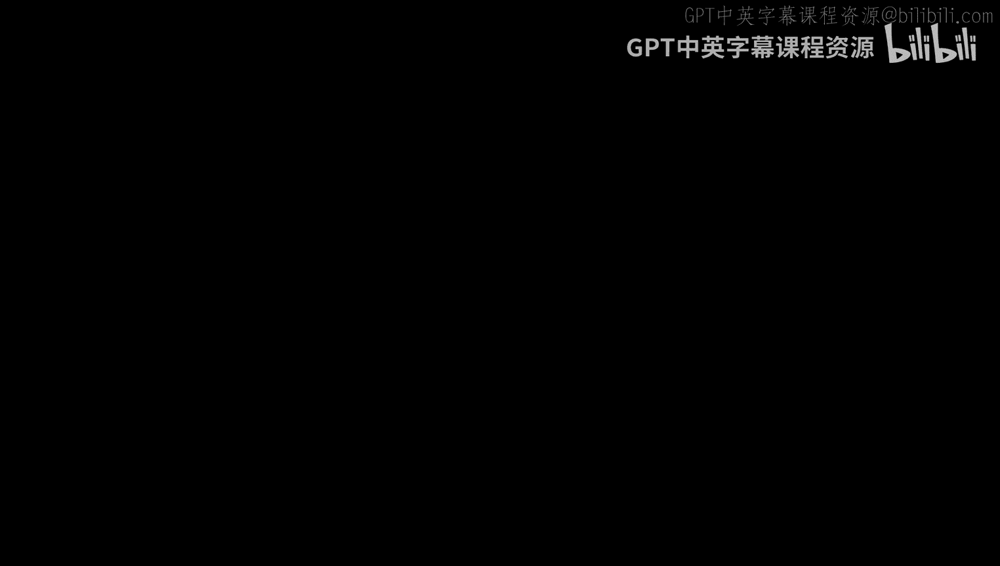
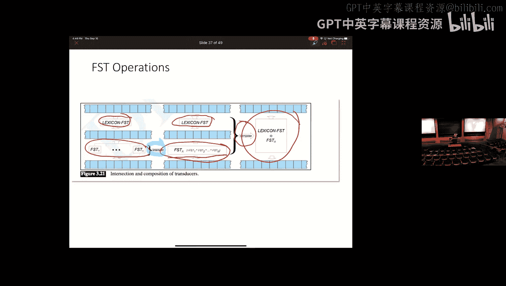

# 4：词汇与形态学

在本节课中，我们将要学习自然语言处理中的一个基础层面：词汇与形态学。我们将探讨词汇的内部结构、形态学的不同类型，以及如何利用有限状态技术来处理形态学问题。

## 概述

形态学研究词汇的内部结构。与生物学中研究生物体形态不同，语言学中的形态学关注词汇的构成单元——语素。理解形态学对于自然语言处理至关重要，因为它能帮助我们识别词汇的底层统一性，并利用形态变化中编码的信息。

## 什么是形态学？

上一节我们介绍了形态学的概念，本节中我们来看看它的具体构成。

形态学是关于词汇内部结构的学科。词汇并非不可分割的原子单位，它们可以分解为更小的、有意义的单元，这些单元称为语素。

语素主要分为两种类型：
*   **词根**：承载词汇的核心意义。
*   **词缀**：附加在词根上以修改其意义或添加额外信息。

词缀有四种类型：
*   **前缀**：附加在词根之前，如 `pre-`（在…之前，如 `prenuptial`）或 `ir-`（不，非，如 `irregular`）。
*   **后缀**：附加在词根之后，如 `-s`（复数）、`-er`（施事者）或 `-ize`（使…化）。
*   **中缀**：插入到词根中间。英语中较少见，但在其他语言中很常见。
*   **环缀**：同时附加在词根的两侧。

## 形态学的类型

形态变化不仅限于简单地将语素拼接在一起，还存在非拼接性形态学。

以下是两种主要的形态学功能类型：
*   **屈折形态学**：为词汇添加与句子上下文一致的信息，如数（单数/复数）、格（主格/宾格）、动词时态或一致性（数、性）。例如，`walk` -> `walked`（过去时），`fox` -> `foxes`（复数）。
*   **派生形态学**：通过添加词缀创造出具有新意义、甚至新词性的全新词汇。例如，`parse`（解析）-> `parser`（解析器，名词），`repulse`（排斥）-> `repulsive`（令人厌恶的，形容词）。

## 为什么形态学对NLP重要？

形态学对自然语言处理而言，既是一个挑战，也是一个信息来源。

一方面，屈折形态学会使同一个词呈现不同的表面形式，这给信息检索、信息抽取等任务带来了问题，因为它掩盖了底层的统一性，可能导致数据稀疏。

另一方面，形态学编码了大量有用信息，对于机器翻译、自然语言理解、语义角色标注等任务，尤其是在形态丰富的语言中，这些信息至关重要。

## 有限状态形态学

为了处理形态学，我们需要在词汇的书写形式（正字法形式）和其词条形式（词典形式加特征集）之间建立映射。有限状态转换器是实现这种映射的强大工具。

在深入FST之前，我们先回顾其更简单的亲戚：有限状态自动机。

有限状态自动机由五个部分组成：
*   **Q**：有限状态集合。
*   **q0**：特殊的初始状态。
*   **F**：终止状态集合（F ⊆ Q）。
*   **Σ**：有限的字母表（符号集合）。
*   **δ**：状态之间的转移函数，标记来自Σ的符号。

FSA定义了一组能被识别的字符串集合，即正则语言。

有限状态转换器在FSA的基础上进行了扩展，用于实现输入字符串到输出字符串的转换。

FST同样包含Q、q0、F，但它有两个字母表：
*   **Σ**：输入字母表。
*   **Δ**：输出字母表。

其转移标记为 `输入符号:输出符号`。当经过一个转移时，它从输入带读取输入符号，并向输出带写入输出符号。

## 构建形态分析器

在为一个语言构建形态分析器时，通常将其分为两部分，分别用FST实现：

1.  **语素结构规则**：规定语素如何组合。它处理词条与词缀的拼接。例如，规则可能规定动词词根后接 `-ing` 构成现在分词。
2.  **语素变体/正字法规则**：规定语素在组合时，其书写形式或发音如何变化。例如，英语中“辅音双写”（`bag` -> `bagging`）、“e删除”（`make` -> `making`）等规则。

这两个FST可以通过“复合”操作组合成一个大的FST。FST的一个重要特性是**可逆性**：你可以交换每个转移上的输入/输出符号，从而得到一个进行相反方向转换（如从分析变为生成）的FST。

此外，对FST还可以进行多种操作，如串联、克林闭包、并集等。其中，复合操作最为重要，它相当于将第一个FST的输出作为第二个FST的输入，从而创建一个新的、功能复合的FST。

## 总结

本节课中我们一起学习了自然语言处理中的词汇与形态学。我们了解了语素作为词汇最小意义单元的概念，区分了屈折形态学和派生形态学，并认识到形态学在NLP中既是挑战也是资源。最后，我们重点介绍了有限状态自动机和转换器，以及如何利用它们来高效地分析和生成词汇的形态变化，这是处理形态丰富语言的一项基础且重要的技术。