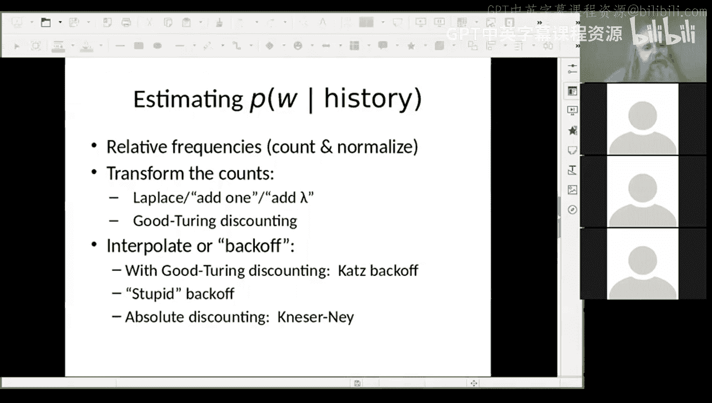

# 5：语言模型与平滑技术

在本节课中，我们将学习语言模型的基本概念，这是一种用于预测下一个单词或评估句子“像英语”程度的工具。我们将从简单的模型开始，探讨如何对它们进行评分、改进以及训练的相关方面。

## 什么是语言模型？

语言模型是自然语言处理中的一个特定概念。它是一种表示方法，允许我们预测下一个单词是什么，或者根据模型来评估一个给定句子有多“像英语”或有多合适。我们希望获得一个衡量句子好坏的标准。这个标准可以是一个概率值，也可以是一个置信度分数，好的句子得分高，差的句子得分低。

例如，句子“This is a pen”是一个好句子，它有动词“is”、主语“This”和宾语“a pen”。而“pen this is a”则不是一个好句子。语言不仅仅是单词的堆砌，它们具有内在的结构，例如主谓宾的顺序和一致性。我们希望语言模型能给“This is a pen”打一个高分，给“pen this is a”打一个低分。

## 评估翻译质量

考虑一个中文句子的四个英文翻译：
1.  He briefed two reporters on the chief contents of the statement.
2.  He briefed reporters on the chief contents of the statement.
3.  He briefed two reporters on the main contents of the statement.
4.  He briefed reporters on the main contents of the statement.

我们的目标是让一个自动系统能够判断哪个翻译是最好的英文句子。虽然这四个句子都传达了基本含义，但有些听起来更自然。例如，“briefed two reporters”听起来可能不如“briefed reporters”自然。语言模型可以帮助我们自动选择最佳翻译。

## 概率论基础

我们将依赖概率论来构建语言模型。这里简要回顾一些基本概念：
*   **随机变量**：一个具有分布特性的变量。
*   **概率表示**：`P(X = x)` 表示随机变量 `X` 取值为 `x` 的概率，通常简写为 `P(x)`。
*   **联合概率**：`P(X=x, Y=y)` 表示 `X` 取值为 `x` 且 `Y` 取值为 `y` 的概率。在句子中，单词之间通常不是独立的。
*   **条件概率**：`P(X=x | Y=y)` 表示在 `Y` 取值为 `y` 的条件下，`X` 取值为 `x` 的概率。例如，给定前一个词是“president”，下一个词是“of”的概率就很高。

## 一元模型

一元模型是最简单的语言模型，它只考虑每个单词自身的概率，忽略上下文。一些单词（如“the”）的概率很高，而另一些单词（如“zoo”）的概率则很低。

我们可以通过统计大型文本语料库（如维基百科）中每个单词的出现频率来估计其概率。然后，一个句子的概率可以近似为其中所有单词概率的乘积。

然而，一元模型生成的文本是杂乱无章的，因为它没有考虑单词之间的顺序和关联。例如，它可能生成“L or it tillil the open par eye question mark”这样的无意义字符串。

## N元模型

为了考虑上下文，我们引入N元模型。它基于前N-1个单词来预测下一个单词的概率。
*   **二元模型**：根据前一个单词预测下一个单词。
*   **三元模型**：根据前两个单词预测下一个单词。

随着上下文长度的增加，模型生成的文本会变得更连贯，但同时也需要更多的数据来训练。N元模型可以被表示为有限状态自动机，其中状态代表上下文，转移弧代表可能的下一单词及其概率。

## 词汇与未知词

构建语言模型时，我们需要定义词汇表。这引出了几个问题：
*   **词汇量**：一个人的词汇量大约在1万到2.5万之间，而英语的总词汇量可能达到数百万，包括许多专业术语和地名。
*   **什么是词**：我们需要决定是否将标点符号（如句号、逗号）视为独立的词，以及如何处理不包含空格的语言（如中文）的分词问题。
*   **未知词**：任何数据集都是有限的，总会遇到不在词汇表中的词（未知词）。我们需要一种方法来处理它们。

此外，我们还需要特殊的符号来表示句子的开始和结束，例如 `<s>` 和 `</s>`。

## 模型评估：困惑度

我们需要一个标准来评估不同语言模型的好坏。常用的指标是**困惑度**。困惑度衡量的是模型预测测试集的能力，数值越低表示模型越好。

困惑度的计算公式基于概率，可以理解为模型在预测下一个词时的平均分支因子（即平均有多少个可能的选择）。例如，《华尔街日报》文本的三元模型困惑度约为109，意味着平均在每个上下文中，大约有109个可能的后续单词。

## 平滑技术

一个关键问题是，当我们在训练数据中从未见过某个N元序列时，其概率会被估计为0。这会导致整个句子的概率为0，并且无法比较包含未知序列的句子。为了解决这个问题，我们使用**平滑技术**。

以下是两种常见的平滑方法：
*   **加一平滑**：在计算所有N元序列的计数时，简单地给每个计数加1（或加一个小的常数）。这确保了没有概率为零的情况。虽然简单，但效果不错。
*   **古德-图灵平滑**：一种更精细的方法。它根据观察到的频率分布来估计未出现事件（N元序列）的概率。基本思想是：用出现一次的事物的部分概率来“补贴”从未出现的事物。

## 其他实用技巧

在实践中，我们还会用到以下技巧：
*   **回退与插值**：当高阶N元模型（如三元组）没有数据时，可以回退到低阶模型（如二元组）的概率。也可以将不同阶的模型概率进行加权组合。
*   **对数概率**：由于句子概率是许多小数的乘积，结果会非常小，容易导致数值下溢。因此，实际计算中通常使用**对数概率**，将乘法转换为加法，更加稳定和高效。

本节课中，我们一起学习了语言模型的基本概念，包括一元模型和N元模型。我们探讨了如何评估模型（困惑度），并介绍了处理数据稀疏问题的关键技术——平滑。这些是构建更复杂NLP系统的基础组件。