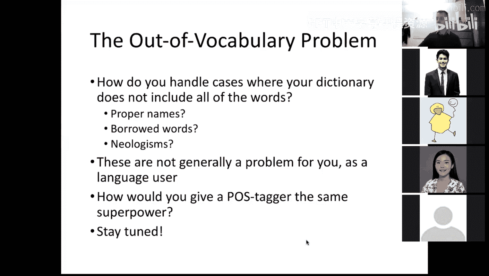
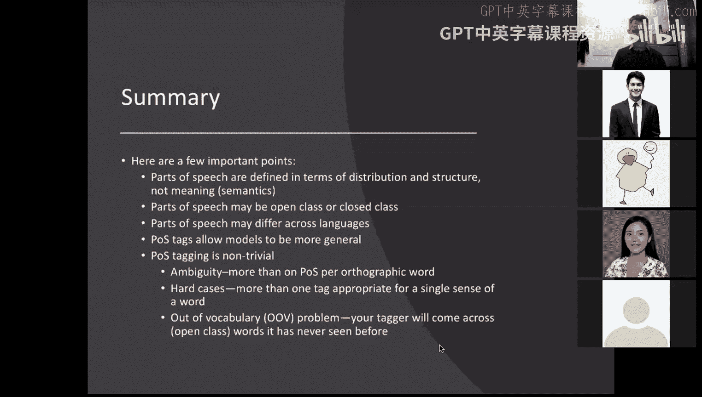

# 6：词性标注 🏷️

在本节课中，我们将要学习词性标注的基础知识，包括词性的定义、分类、重要性以及在实际应用中面临的挑战。

## 概述

词性标注是自然语言处理中的一项基础任务，旨在为句子中的每个单词分配一个词性标签。理解词性对于构建更高级的语言模型至关重要。

## 词性的定义与重要性

词性，或称词类，是依据单词的分布和形态特征，而非其含义，对词汇进行的分类。这种分类为语言提供了结构，使得我们能够更有效地处理和理解文本。

## 词性的分类标准

词性分类主要依据两个标准：分布标准和形态标准。

*   **分布标准**：指单词在句子中出现的位置和上下文。例如，名词通常出现在动词之前作为主语，或之后作为宾语。
*   **形态标准**：指单词可以接受的前缀和后缀。例如，在英语中，可以添加复数后缀“-s”的通常是名词。

## 主要词性类别

以下是英语中一些主要的词性类别及其特征。

### 开放类词性

开放类词性的成员数量可以不断增加，新词很容易被创造出来。

*   **名词**：可以充当动词的主语或宾语，可以被形容词修饰，通常可以与冠词（如 `the`, `a`）连用。例如：`book`（书），`city`（城市）。
*   **动词**：可以带名词短语作为论元（如主语、宾语），可以有时态变化（如过去式 `-ed`），可以被副词修饰。例如：`run`（跑），`think`（思考）。
*   **形容词**：可以修饰名词（定语用法），也可以在系动词后描述主语（表语用法）。部分形容词有比较级（`-er`）和最高级（`-est`）变化。例如：`big`（大的），`smart`（聪明的）。
*   **副词**：主要修饰动词、形容词或其他副词。例如：`quickly`（快速地），`very`（非常）。

### 封闭类词性

封闭类词性的成员数量相对固定，很少增加新词。

*   **介词**：出现在名词短语之前，表示名词与句中其他成分的关系。例如：`in`（在…里），`from`（从…）。
*   **限定词**：出现在名词短语的开头，包括冠词（`the`, `a`）和指示词（`this`, `that`）。例如：`the cat`（这只猫）。
*   **代词**：用于替代名词短语。例如：`he`（他），`it`（它）。
*   **连词**：用于连接词语、短语或句子。例如：`and`（和），`because`（因为）。
*   **助动词**：与主要动词连用，表达时态、语态等。例如：`is`（是），`have`（有），`can`（能）。

## 词性标注的挑战

尽管词性有明确的定义，但在实际标注中仍面临一些挑战。

*   **一词多性**：许多单词根据上下文不同，可以属于多个词性。例如，单词 `run` 既可以是动词（`I run`），也可以是名词（`a long run`）。
*   **新词问题**：语言中不断出现新词（如专有名词、网络新词），标注器在训练时可能从未见过这些词，需要有能力根据上下文推断其词性。
*   **细粒度分类**：根据任务需要，词性标签的粒度可以很粗（如`名词`），也可以很细（如`专有名词`、`复数名词`）。常用的宾州树库标签集包含近60个标签。

## 总结

本节课我们一起学习了词性标注的核心概念。我们了解到词性是依据分布和形态而非意义定义的语法类别，分为开放类和封闭类。词性标注任务虽然基础，但由于存在一词多性、新词等挑战，并非微不足道。它为语言模型提供了更一般的结构信息，是后续许多NLP任务的重要基础。