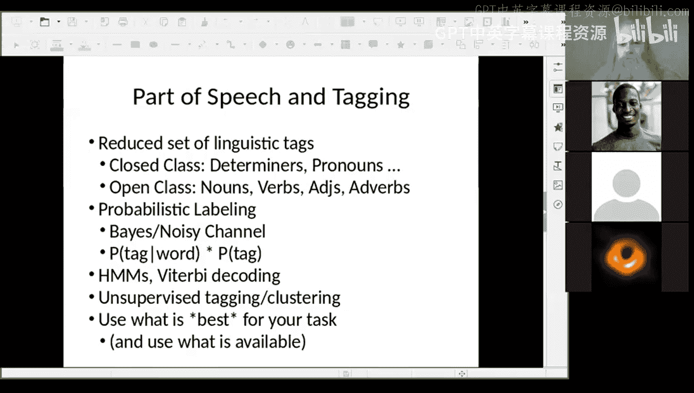

# 7：隐马尔可夫模型

在本节课中，我们将学习隐马尔可夫模型。这是一种用于序列建模和标注的通用表示方法，特别适用于词性标注任务。我们将了解如何结合词的固有信息和上下文信息，来自动确定句子中每个词的词性。

---

## 概述：词性标注的重要性

词性标注是自然语言处理中的一项基础任务。它允许我们减少符号数量，通过关注词的语法功能而非具体词汇来捕捉语言的普遍规律。这对于减少训练机器学习任务所需的数据量非常有用，因为它将成千上万个不同的词压缩到大约10到50个词性标签中。

## 从示例开始：一个歧义句子

我们以一个精心构造的句子作为运行示例：**Bill directed plays about English kings**。

我们通常将其理解为：一个名叫Bill（William的简称）的人，他导演了关于英国国王的戏剧。对应的词性标注应为：
*   Bill：专有名词
*   directed：动词
*   plays：复数名词
*   about：介词
*   English：形容词
*   kings：复数名词

然而，这个句子中的每个词都可能存在歧义：
*   **Bill**：可以是专有名词、动词（“寄账单”）或名词（“账单”）。
*   **directed**：可以是动词或形容词（“被导演的”）。
*   **plays**：可以是复数名词或动词。
*   **about**：可以是介词、副词或小品词。
*   **English**：可以是形容词或名词。
*   **kings**：可以是复数名词或动词（如国际象棋中的“王车易位”）。

我们的目标是利用从数据中学习到的概率，结合上下文信息，自动选择最合理的词性序列。

## 隐马尔可夫模型简介

隐马尔可夫模型类似于带概率的有限状态自动机。它包含以下组成部分：
*   **一个开始状态和一个结束状态**：用于标记序列的起始和结束。
*   **一组状态**：可以理解为词性标签。
*   **一个有限的词汇表**：即所有可能被观察到的词。
*   **状态转移概率**：从一个状态（词性）转移到下一个状态的概率。
*   **发射概率**：在某个状态下生成（观察到）某个特定词的概率。

## 噪声信道模型

我们可以通过噪声信道模型来理解隐马尔可夫模型在词性标注中的应用。

我们观察到的词序列（例如 “Bill directed plays…”）是输出。我们想要发现的是背后不可见的、产生这些词的词性标签序列。

这里有两类关键信息需要结合：
1.  **先验概率**：词性标签序列本身的概率。这类似于一个语言模型，它告诉我们某个词性序列（如“专有名词-动词-名词”）出现的可能性有多大。这个概率可以在看到具体句子之前就计算好。
2.  **后验概率/似然概率**：给定某个词性标签，观察到某个特定词的概率。例如，给定标签是“动词”，词是“directed”的概率是多少？这个概率是在我们看到具体词之后才起作用的。

我们的目标是找到最可能的隐藏标签序列（Y），给定观察到的词序列（X）。根据贝叶斯规则，这等价于最大化 **P(Y) * P(X|Y)**。由于对于给定的句子X，P(X)是常数，我们可以忽略它。

## 计算最可能路径

理论上，我们可以枚举所有可能的词性路径，计算每条路径的联合概率 `P(标签序列) * P(词序列|标签序列)`，然后选择概率最高的那条。

例如，对于句子“Bill directed plays…”，我们需要计算诸如“专有名词-动词-复数名词-…”和“专有名词-形容词-动词-…”等所有路径的概率。

然而，这种方法计算量巨大。如果一个句子有N个词，每个词平均有K个可能的词性，那么路径总数是 K^N，对于长句子这是不可行的。

## 维特比算法：高效搜索

幸运的是，我们不需要计算所有路径。维特比算法利用动态规划的思想，高效地找到最可能路径。

其核心观察是：当我们从左到右处理句子时，对于当前位置的每个可能状态（词性），我们只需要保留到达该状态的最优路径（即概率最高的路径）。那些非最优的路径，无论后续如何，其总概率都不可能超过从最优路径延续下去的概率。因此，我们可以安全地“剪枝”掉这些非最优路径。

以下是该算法的简要步骤：
1.  初始化：计算第一个词所有可能词性的概率（结合先验和发射概率）。
2.  递推：对于句子中的第 i 个词，考虑其每个可能的词性标签。对于每个这样的标签，检查所有可能的前一个词性标签（来自第 i-1 个词），计算从每个前驱状态转移到当前状态并发射当前词的概率。**只保留对于当前状态来说概率最高的那条路径**。
3.  终止：处理完所有词后，在最后一个词的所有可能状态中，选择概率最高的那个。
4.  回溯：沿着保留的指针回溯，即可得到整个最可能的词性标签序列。

通过这种方式，我们将指数级复杂度降低到了与 `(句子长度 * 标签数^2)` 相关的多项式复杂度。

## 处理未知词

在实际应用中，我们会遇到训练数据中未出现过的词（未知词）。简单的处理方法是将其视为一个特殊的“未知词”标记，并估计它在不同词性下的发射概率。

更高级的方法会利用词的形态特征：
*   以大写字母开头的词更可能是专有名词。
*   以“-ed”结尾的词更可能是动词过去式。
*   包含数字的词可能是一个数字或部件号。
*   通过分析词缀、大小写等信息，可以更好地估计未知词的词性概率。

## 训练数据与跨语言挑战

英语词性标注通常使用宾州树库进行训练，它包含了手工标注的《华尔街日报》文本。但这带来了领域和时代局限性。

对于新语言，构建词性标注器面临挑战：
*   **资源稀缺**：需要语言学家手工标注数据，成本高昂。
*   **形态丰富**：许多语言有复杂的形态变化，同一个词干可能有多种形式，这既是挑战（需要更多数据），也是机遇（形态本身常包含词性信息）。

## 无监督与半监督词性标注

为了减少对标注数据的依赖，研究者开发了无监督方法。其核心思想是：在相似上下文环境中出现的词，往往具有相同的词性。

一种常见方法是**布朗聚类**。它不依赖于任何语法知识，仅根据词的共现上下文，将词汇表中的词聚类成一棵二叉树。聚类结果中，兄弟节点或附近子树中的词在语义或语法上通常相似。虽然我们不知道每个聚类具体对应什么词性，但得到的类别对于许多下游任务（如语言模型、信息抽取）非常有帮助。

我们可以先用无监督方法（如上下文聚类或布朗聚类）得到词的粗粒度类别，然后利用这些类别作为特征，或者由语言学家快速映射到标准词性集上，从而加速标注过程。

## 实际应用中的注意事项

在实现维特比算法时，我们通常在**对数概率空间**中进行计算，而不是直接使用概率。这是因为概率值通常很小，连续相乘可能导致下溢（数值归零）。使用对数概率可以将乘法转换为加法，避免了这个问题。通常我们使用**负对数概率**，这样最优路径就对应着总和最小的路径（因为概率越高，负对数概率越小）。

是否使用词性标注取决于具体任务：
*   **优点**：能有效减少特征空间，捕捉语法规律，对数据量小的任务尤其有益。
*   **考量**：如果任务数据充足，或者预训练模型已经隐含了语法信息，额外的词性标注可能收益不大。同时，要评估标注器在目标领域（如社交媒体文本 vs. 新闻文本）的性能。

## 总结

本节课我们一起学习了隐马尔可夫模型及其在词性标注中的应用。

*   我们首先了解了词性标注的意义，它能通过语法类别对词汇进行泛化。
*   我们通过一个歧义例句，引出了结合**词本身偏好**（发射概率）和**上下文规律**（转移概率/先验概率）的必要性。
*   我们介绍了隐马尔可夫模型的基本框架和噪声信道模型的视角。
*   我们认识到暴力枚举所有路径不可行，从而引入了高效的**维特比算法**，它利用动态规划剪枝非最优路径。
*   我们讨论了如何处理**未知词**，以及构建标注器所面临的**数据挑战**。
*   最后，我们探讨了**无监督方法**（如布朗聚类）如何帮助资源稀缺的语言或领域快速获得有用的词类别信息。

词性标注是NLP中一项经典且实用的技术，理解其背后的HMM模型和维特比算法，有助于我们掌握序列标注任务的基本思路。