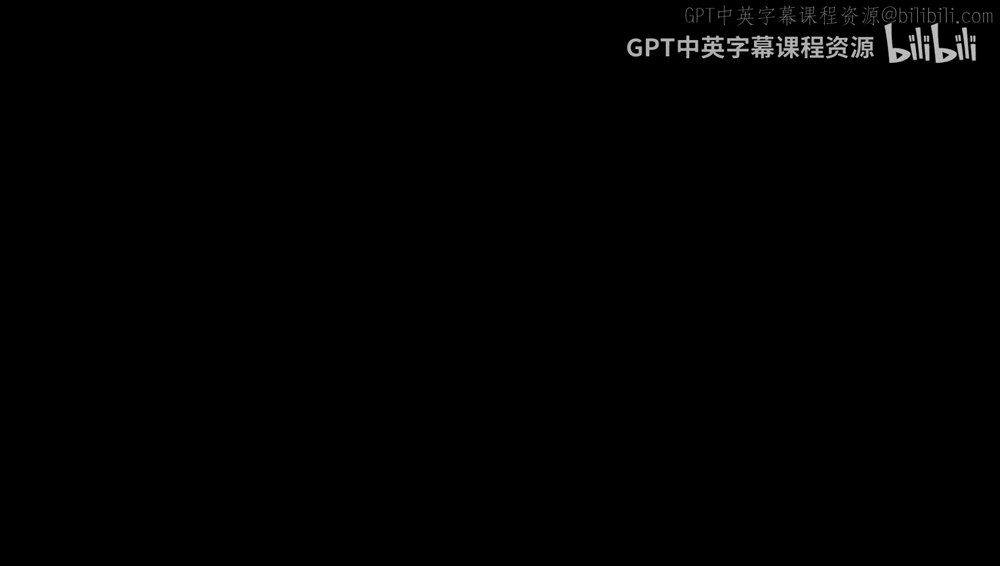
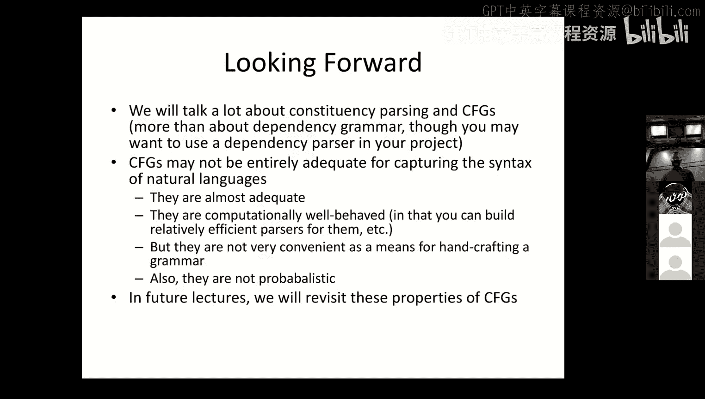

# 8：句法分析 🧠

在本节课中，我们将要学习自然语言处理中的一个核心概念：句法。我们将探讨什么是句法，它与语义有何不同，并介绍两种主要的句法表示方法：成分句法和依存句法。理解句法是让计算机理解“谁对谁做了什么”的关键一步。

## 什么是句法？🤔

上一节我们介绍了课程的整体框架，本节中我们来看看句法的基本概念。

句法研究的是如何将单元组合在一起。在编程语言中，句法定义了如何将不同的令牌（如命令、关键字和值）合法地组合成更大的结构（如语句）。它关注的是组合的规则，即形式。语义则关注这些结构的意义，即它们在程序运行时会产生什么效果。编译器或解释器通常能捕获句法错误，但很少能捕获语义错误。

对于自然语言而言，句法和语义的区分同样存在。句法处理的是词语如何组合成短语，以及短语如何组合成句子，它只关乎结构。语义则关乎意义。

一个著名的例子是乔姆斯基的句子：“Colorless green ideas sleep furiously.”（无色的绿色思想愤怒地睡觉。）这个句子在句法上是完全正确的，但在语义上是无意义的，充满了逻辑矛盾。这清楚地表明句法和语义是两个独立的概念。

## 句法的核心概念：成分与短语 🌳

上一节我们区分了句法和语义，本节中我们来看看句法分析中的两个重要概念：成分和短语。

一种看待句子结构的方式是将其视为一系列嵌套的成分，就像一棵树。每个子树都是一个成分，即句子中比其他词语关系更紧密的一组词。比单词大的成分我们称为短语。短语可以包含其他类型的短语或同类型的短语，因此这是一种嵌套且可能递归的结构。

以下是几种重要的短语类型：

*   **名词短语**：由一个或多个词组成，作为一个整体起到名词作用的单位。例如，“the elephant”、“it”、“the big ugly elephant”。名词短语可以很复杂，例如“the elephant I love to hate”，其中包含了一个句子（“I love to hate”），这被称为关系从句。
*   **介词短语**：由介词（如 on, in, under）和一个名词短语组成。结构为：`PP -> P NP`。例如，“under the leaking roof”。
*   **句子/从句**：句子是一种可以独立存在的从句。从句也可以是更大句子的一部分，例如关系从句（修饰名词）或补语从句（作为动词的补充）。

为了形式化地描述这种嵌套和递归的结构，我们需要比有限状态机更强大的工具：上下文无关文法。

## 上下文无关文法 📝

上一节我们了解了短语的嵌套结构，本节中我们来看看如何用形式化的工具——上下文无关文法来描述它。

上下文无关文法包含以下组成部分：
*   终结符集合 Σ（通常是词汇）。
*   非终结符集合 N（代表短语或词性类别）。
*   一个特殊的开始符号 S（通常代表句子）。
*   一组产生式规则，形式为 `X -> α`，其中 X 是一个非终结符，α 是由终结符和非终结符组成的字符串。

在句法分析中，非终结符主要有两种：
1.  代表短语的符号，如 NP（名词短语）、VP（动词短语）。
2.  代表词性的预终结符，如 N（名词）、V（动词）。

终结符就是具体的单词。推导过程从开始符号 S 出发，不断应用产生式规则，直到所有符号都转化为终结符。解析树是推导过程的图形化表示。

上下文无关文法可能产生歧义，即同一个词串可以有多个不同的解析树和推导过程，通常对应不同的含义。

## 合乎语法性：理论与现实 ⚖️

上一节我们介绍了形式化的文法，本节中我们探讨一个关键概念：合乎语法性。

“合乎语法”描述的是一个句子是否属于某种语言。这有两种理解：
1.  形式语言角度：一个句子是否能够由某个自动机或文法生成。
2.  人类语言角度：一个句子是否被说话者内化的语法规则所接受。

重要的是，合乎语法性考虑的是语言的所有形式方面（音系、形态、句法），而不包括语义。不同说话者内化的语法规则可能不同，导致对同一个句子是否“合乎语法”判断不一。例如：
*   “I’m done my homework.” 在一些方言中可接受，在另一些中则不行。
*   匹兹堡英语中，“It needs washed.” 是常见的，而其他方言可能说 “It needs to be washed” 或 “It needs washing”。

这种语法变异使得构建鲁棒的自然语言处理系统更具挑战性。

## 为什么需要句法分析？🎯

上一节我们讨论了语法的主观性，本节中我们来看看为什么句法分析在自然语言处理中至关重要。

考虑以下几个句子：
1.  Oswald shot Kennedy.
2.  Kennedy was shot by Oswald.
3.  Oswald, who shot Kennedy, was shot by Ruby.

要确定“谁枪击了谁”，计算机需要理解句法。在第一句中，主语是 Oswald；在第二句的被动语态中，主语变成了 Kennedy，但施事者仍是 Oswald。在第三句的复杂结构中，需要理解关系从句的修饰关系。句法分析是获取句子结构表示的第一步，进而帮助我们识别主语、宾语等语法关系，并最终推断出施事、受事等语义角色。

## 主语、宾语与依存语法 🔗

上一节我们看到了句法对理解语义关系的重要性，本节中我们深入探讨主语、宾语的概念，并介绍另一种句法表示法：依存语法。

关于主语，存在一些常见的误解：
*   **误解1**：主语是句子的第一个名词短语。（并不总是）
*   **误解2**：主语是动作的执行者（施事）。（在被动句中，主语是受事）
*   **误解3**：主语是句子谈论的话题（主题）。（主题可能与主语不同）

主语是一个句法概念，而非语义概念。在英语中，主语通常与动词保持一致性，代词采用主格形式。

依存语法提供了一种不同于成分句法的视角，它强调词与词之间的二元依存关系。在一个依存关系中，一个词是核心词，另一个词是依存词，它们之间的弧被标记为“主语”、“宾语”等关系。例如，动词通常是句子的根节点，主语和宾语是其依存词。

与成分句法相比，依存语法能更直接、清晰地展示语法关系，跨语言时结构也更相似，因此当前在自然语言处理中应用非常广泛。许多解析器（如斯坦福解析器）能同时输出两种表示。

## 总结与展望 📚

本节课中我们一起学习了自然语言处理中的句法分析。
*   我们首先区分了句法（结构）和语义（意义）。
*   然后介绍了成分和短语的概念，以及如何使用上下文无关文法进行形式化描述。
*   我们探讨了“合乎语法性”在形式理论和现实语言使用中的不同含义。
*   接着，我们理解了句法分析对于推断“谁对谁做了什么”这一语义理解任务的关键作用。
*   最后，我们辨析了主语和宾语的句法本质，并介绍了能清晰表示语法关系的依存语法。

上下文无关文法虽然可能不足以完全捕捉自然语言的所有句法现象，但其计算性质良好，便于构建高效的解析器。在后续课程中，我们将学习如何从数据中学习概率上下文无关文法，并探讨更强大的句法模型。

---
**本节课中我们一起学习了句法的基本概念、形式化表示方法及其在自然语言理解中的重要性。掌握句法分析是构建能够深度理解语言的人工智能系统的基石。**