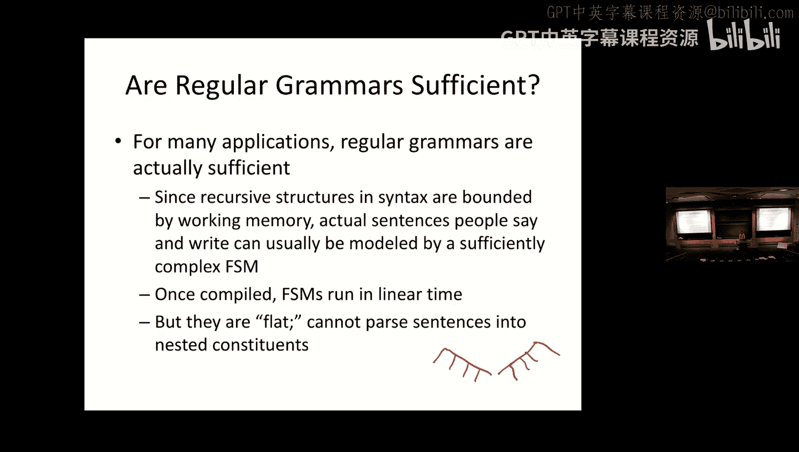
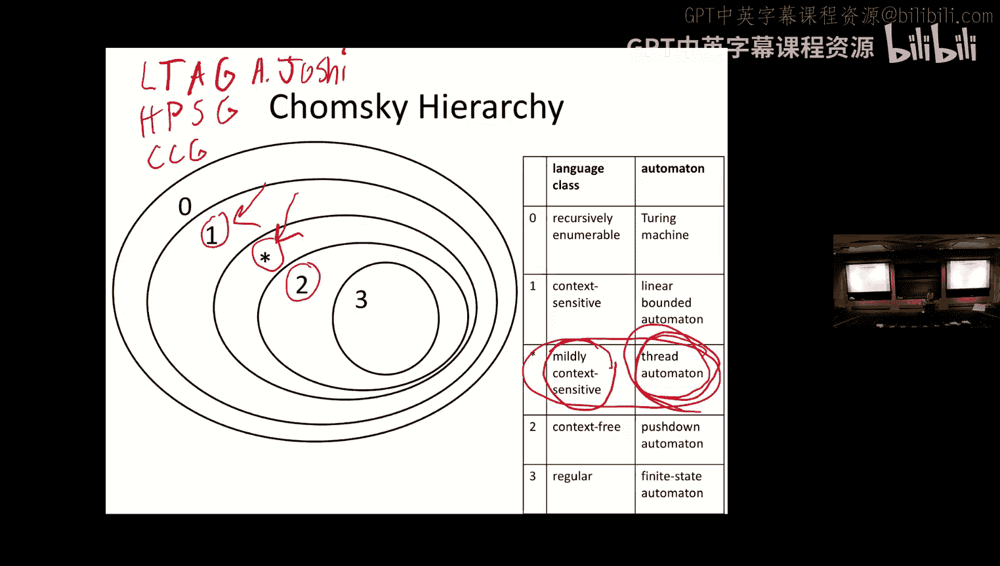

# 9：乔姆斯基层级 🧠

在本节课中，我们将要学习形式语法和乔姆斯基层级。我们将从最受限的正则语法开始，逐步介绍上下文无关语法和上下文相关语法，并探讨它们与不同自动机（如有限状态自动机、下推自动机）的对应关系。最后，我们将讨论自然语言在乔姆斯基层级中的位置。

## 形式语法概述

为了理解乔姆斯基层级，我们首先需要了解形式语法。我们已经讨论过一种形式语法，即上下文无关语法。现在，我们将讨论形式语法的更一般化概念。

一个形式语法 G 包含以下几个部分：
*   一个终结符词汇表，记作 Σ。
*   一个非终结符集合，记作 N。
*   一个特殊的起始符号 S。
*   一组产生式规则。

根据语法的不同类型，你可以拥有不同种类的产生式规则。例如，正则语法有一种产生式规则，上下文无关语法有另一种，上下文相关语法又有不同的类型，直到一种等价于图灵机的语法，它允许你将任何东西重写为任何东西。

形式语法 G 定义了一种形式语言，我们通常将其记作 L(G)，即由语法 G 生成的语言。

## 正则语法

能够生成无限字符串集的最受限的形式语法是正则语法。正则语法有两种形式：右线性语法和左线性语法。对于任何右线性正则语法，都存在一个生成相同字符串集（即接受相同语言）的左线性正则语法，反之亦然。因此，右线性和左线性语法之间总是存在等价关系。

以下是右线性语法的样子。你可以有两种规则：
1.  将一个非终结符重写为一个终结符。
2.  将一个非终结符重写为一个终结符后跟一个非终结符。

正是第二种规则提供了递归性，允许你用有限的正则语法生成长度无限的字符串。

左线性语法具有相同的约束，但规则是相反的：非终结符被重写为非终结符后跟终结符，只是颠倒了这两个元素的顺序。

所有可以由正则语法描述的语言（即可用正则语法生成的字符串集），都同时拥有右线性和左线性语法。

你可能会问，为什么它们被称为“正则”语法？这与正则表达式有关。正则语法识别的语言集，与真正的正则表达式识别的语言集完全相同。回想我们在词法学部分讨论有限状态机时，有限状态自动机也等价于正则表达式。因此，这三者——有限状态自动机、正则语法和正则表达式——在表达能力上是等价的，它们都描述了完全相同的语言族。

以下是一个正则语法的例子，它生成一个或多个 A 后跟一个或多个 B。
*   起始符号是 S。
*   S 可以重写为 `aA` 或 `aB`。
*   A 可以重写为 `aA` 或 `aB`。
*   B 可以重写为 `b` 或 `bB`。

对应的正则表达式是 `a+ b+`（`+` 符号来自实用的正则表达式记法，并非原始的克林记法）。

L(G) 可以被有限状态机识别。这意味着任何有限状态自动机都可以被确定化和最小化，使得每个状态对每个终结符最多只有一个出弧。但为了做到这一点，你可能需要创建一个非常庞大的、具有 2^N 个状态的 FSA。它也可以被最小化，以找到接受相同语言的最小状态和弧集。

正则语法和有限状态机有时被用于实现正则表达式。但有时它们无法实现。如果你实现了像“向前看”这样的功能，你就不再拥有真正的正则表达式，你可以识别不属于 L(RG) 的非正则语言。因此，你不能直接单独使用有限状态机或正则语法来实现，必须使用其他不那么优雅的机制。

## 上下文无关语法

我们已经讨论过上下文无关语法，它比正则语法更强大，即它可以识别正则语法能识别的所有语言，以及更多。

与只有两种规则类型不同，上下文无关语法可以有多种规则类型。它们的共同点是，规则的左侧只能有一个非终结符，但规则的右侧可以是任何东西。

这对于表达括号嵌套之类的事情非常有用，例如数学表达式中的括号：`(2 * (3 + 1)) + 5`。你能用正则语法智能地处理这个表达式，或者描述这类表达式的集合吗？答案是不能。你需要某种形式的内存来跟踪已经经过了多少个左括号和右括号。正则表达式没有办法做到这一点。基于同样的逻辑，正则语法也无法做到。但上下文无关语法可以处理这个问题。

以下是一个用于算术表达式的上下文无关语法示例（A 和 B 代表加法和减法）。括号嵌套通过一条规则来表达，该规则生成开括号、内容和闭括号，然后你可以在其中包含这些符号的任何组合，无论是括号内的还是括号外的。

CFG 比正则语法更强大，因为任何你在正则语法中能有的规则，在 CFG 中也能有，而且 CFG 还允许这些其他很酷的东西。L(CFG) 可以被下推自动机识别。下推自动机之于上下文无关语法，就如同有限状态自动机之于正则语法。它们就像有限状态自动机，但带有一种有限的内存——下推栈，这使得它们能够处理这类括号嵌套的情况。

上下文无关语法也可以被规范化，这在学习解析算法时很重要。有一种形式叫做乔姆斯基范式。在乔姆斯基范式中，任何上下文无关语法都可以被重写，并且只有三种规则：
1.  非终结符重写为空（ε）。
2.  非终结符重写为终结符。
3.  非终结符重写为两个非终结符。

任何上下文无关语法都可以被规范化为乔姆斯基范式，有时它会变得大很多，但这总是可能的。

大多数编程语言实际上是上下文无关语言。它们可以用上下文无关语法描述。事实上，有些语言使用上下文无关解析器进行解析，它们的正式规范通常用上下文无关语法来表述。但也有例外，例如 C++ 由于模板语法的原因，其解析甚至需要解决停机问题，因此不能完全用上下文无关语法描述。

## 上下文相关语法

上下文相关语法的规则形式如下：`α Nt β -> α γ β`。其中，`Nt` 是被重写的东西，`γ` 是它被重写成的结果，而 `α` 和 `β`（规则左右两侧的部分）是上下文。因此，这个 `Nt` 只有在出现在这两个非终结符之间时，才会被重写为 `γ`。这就是“上下文相关”的含义。

在上下文相关语法中，规则的左侧可以有多个符号，但其中只有一个符号被重写，其他的是左右上下文。

在音系学（研究语言声音结构和模式的语言学分支）中，传统上使用上下文相关规则。它们写成这样：`A -> B / X _ Y`（斜杠表示“在...的语境中”）。例如，`N -> M / _ P or B`（N 在 P 或 B 之前重写为 M）。这些都是上下文相关规则，重写只发生在特定语境中，但你只修改目标，不修改语境。

具有讽刺意味的是，正如你可能从词法学部分注意到的那样，我们将这些规则写成了有限状态转换器。事实上，几乎所有在语言中描述过的音系规则都可以用有限状态转换器实现。这意味着我们使用了一个比必要强大得多的形式体系来完成这件事。

上下文相关语法对应的语言可以被一种称为线性有界自动机的自动机识别。它们的处理可能困难得多，因为解析开销很大，并且可能存在大量虚假的歧义。因此，我们喜欢在可能的情况下避免使用上下文相关语法，因为它会引入这些问题。

## 广义重写规则与乔姆斯基层级

然后是广义重写规则。在这些规则中，两侧可以有任意数量的符号，可以将任何东西重写为任何东西。这些规则等价于图灵机，因此可能是难以处理的，但功能非常强大。

我们可以将所有不同类型的语言和自动机放入一个层级结构中。顶层（0 型语言）包含所有其他类型。1 型（上下文相关）包含除 0 型外的一切。2 型（上下文无关）包含 3 型。3 型（正则语言）是最受限、限制最多的。基本上，规则的限制越严格，语言族（语言类别）就越受限，自动机也越简单。

这就是乔姆斯基层级。你可能会想，这里提到的“轻度上下文相关”和对应的“线程自动机”是什么？我们稍后会回到这个问题。

我们想要做的是努力证明特定语言是或不是正则的，或者不是上下文无关的。我们使用一种称为“泵引理”的证明方法来做到这一点。实际上，有针对正则语言的泵引理，也有针对上下文无关语言的泵引理。

对于正则语言的直觉来自 Jurafsky & Martin 第 533 页：如果一个正则语言有任何长于自动机状态数的字符串，那么该语言的自动机中必然存在某种循环。我们可以通过证明如果一个语言没有这样的循环，那么它就不可能是正则语言，来利用这个事实。换句话说，如果你要生成无限数量或非常长的字符串，并且没有任何重复模式，那么如果你没有任何循环，你就无法用正则语法生成该语言。该语言至少必须是上下文无关的。

我们可以用这个来证明某些语言不是正则的。例如，考虑英语中像“The cat the dog chased likes tuna fish.”这样的嵌套结构。支持这些句子的人认为，尽管由于大脑内存限制，处理起来很困难，但它们仍然是合乎语法的英语句子。其背后的观点是，英语不是正则语言。为什么？因为这些句子具有类似 `a^n b^n` 的结构模式（例如，n 个名词短语对应 n 个动词短语）。你能用正则语法或正则表达式描述 `a^n b^n` 吗？你不能无限继续而没有循环。根据泵引理，这种语言不可能是正则的。

## 自然语言与轻度上下文敏感性

现在回到乔姆斯基层级图。我们知道有些语言至少是上下文无关的。问题是，所有语言都是上下文无关的吗？或者有些语言是否需要更强大的自动机来识别？有一种观点认为，在 1 型和 2 型之间存在一个层级，即“轻度上下文相关”语言。

对于人类语言（自然语言）来说，是否有任何自然语言是上下文无关的？有人认为乔姆斯基遗漏了一些东西，实际上存在这个“轻度上下文相关”的星号，并且有些自然语言是轻度上下文相关的，而不是完全上下文无关的。但也许没有语言是完全上下文相关的，这很好，因为处理上下文相关语言将是一场噩梦。

最初支持这一观点的论据来自瑞士德语。瑞士德语中有一种称为“交叉序列依存”的结构。例如，在句子中，动词与宾语的关系不是简单的嵌套，而是交叉对应。这种模式无法用上下文无关语法来捕捉，它需要比上下文无关更强大的形式体系，但又不需要上下文相关语法的全部功能，是介于两者之间的东西。

因此，即使英语也可能不是完全上下文无关的。例如，“分别”结构（Alice, Bob and Carol will have a beer, wine and a coffee respectively）在语义上建立了交叉对应关系。

语言学家和计算机科学家得出的结论是，自然语言是轻度上下文相关的。这对英语来说可能不完全正确，英语在很大程度上是上下文无关的，只有一些特殊结构例外。然而，这对瑞士德语和一些其他语言（如某些荷兰语变体）是成立的。即使在有这种结构的语言中，上下文相关结构的使用频率也相对较低，并且其深度往往受到实际记忆能力的限制。

那么，我们关心语言不一定是上下文无关这个事实吗？对于许多应用来说，CFG 可能就足够了。即使你处理的是瑞士德语，CFG 可能仍然足够。它们具有很大的优势：在计算上比上下文相关语法（甚至是轻度上下文相关语法）更容易处理，易于理解和推理，并且解析算法也易于实现。

但退一步说，对于很多应用来说，实际上正则语法就足够了。由于句法中的这些递归结构受到工作记忆的限制，人们实际说出和写出的句子通常可以用一个足够复杂的有限状态机来建模。一旦编译完成，有限状态机可以线性时间运行，这比任何上下文无关解析算法都要好得多。另一方面，它们是“扁平”的，不能将句子解析为嵌套的组成成分（除了向一个方向分支）。解析树总是看起来像一条链。

## 课程总结

本节课中，我们一起学习了乔姆斯基层级和形式语法。我们从最基础的正则语法及其与有限状态自动机、正则表达式的等价关系开始，然后探讨了更强大的上下文无关语法及其对应的下推自动机。我们还了解了上下文相关语法和广义重写规则，并将它们组织成乔姆斯基层级。最后，我们讨论了自然语言在层级中的位置，认识到自然语言通常被认为是“轻度上下文相关”的，但对于大多数实际应用，上下文无关甚至正则语法模型通常已经足够。理解这些不同语法类别的能力和限制，对于选择适合特定自然语言处理任务的工具和模型至关重要。