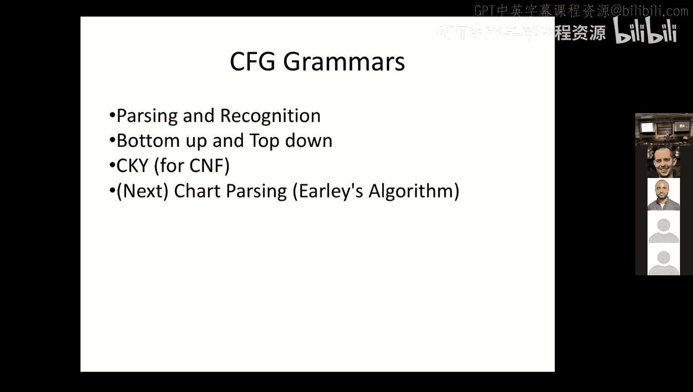

# 10：上下文无关识别

在本节课中，我们将要学习上下文无关语法在自然语言处理中的应用，特别是识别和解析的概念。我们将重点介绍一种名为CKY（或CYK）的特定算法，并探讨其工作原理、前提条件以及如何将其从识别算法扩展为解析算法。

## 概述

解析是自然语言理解中的重要环节，它有助于从句子结构过渡到语义分析。上下文无关语法非常强大，可以用于识别和解析，并且能与多种解析算法结合使用。本节课，我们将深入探讨CKY算法及其所需的乔姆斯基范式。

## 为什么需要解析？

你可能会认为，不需要解析，仅通过匹配词的模式（例如使用正则表达式）就能完成所有工作，甚至实现部分自然语言理解。然而，考虑以下句子：
> The student who was taught by Alan Black won the prize.

如果仅进行表面字符串匹配，可能会错误地认为“Alan Black won the prize”。但通过解析，我们可以正确地将“the student who was taught by Alan Black”识别为一个独立成分（名词短语），然后与“won the prize”结合。这说明了解析的重要性：它能正确分析句子的层次结构。

虽然本节课主要学习识别，但CKY算法稍作修改即可变为解析算法。

## 上下文无关语法定义

一个上下文无关语法包含以下组成部分：
*   **终结符集合 Σ**：例如单词。
*   **非终结符集合 N**：例如表示短语类型或词性的符号。
*   **起始符号 S**：通常代表句子。
*   **产生式规则**：形式为 **X → α**，其中 X 是一个非终结符，α 是由终结符和非终结符组成的序列。

## 识别与解析问题

给定一个句子 **W** 和一个语法 **G**：
*   **识别** 是判断句子 W 是否属于语法 G 所定义的语言。
*   **解析** 是找出句子 W 在语法 G 中的一个或多个推导（即分析树）。

解析可以被视为一种搜索过程。自底向上解析从句子开始，搜索通往起始符号 S 的路径；自顶向下解析则从 S 开始，搜索能推导出该句子的路径。

## 搜索算法框架

一个通用的识别搜索算法框架如下：
1.  初始化一个议程，包含初始状态（例如状态0）。
2.  当议程非空时：
    *   从议程中弹出一个状态 S。
    *   如果 S 是成功状态，则返回 S（识别成功）。
    *   如果 S 不是失败状态，则从 S 生成所有可能的新状态，并将其加入议程。
3.  如果议程为空仍未找到成功状态，则返回“否”（识别失败）。

这个框架过于通用，需要结合具体语法和策略来实现。

## 语法示例与乔姆斯基范式

一个语法通常包含两部分：语法规则（非终结符到非终结符序列）和词典规则（非终结符到终结符）。为了使用CKY算法，语法必须转换为**乔姆斯基范式**。

在乔姆斯基范式中，每条产生式规则只能是以下两种形式之一：
1.  **A → B C** （一个非终结符推导出两个非终结符）
2.  **A → w** （一个非终结符推导出一个终结符）
3.  （有时也允许 **S → ε**，即起始符号推导出空串，但非必需）

任何上下文无关语法都可以通过引入新的非终结符被转换为等价的乔姆斯基范式语法，尽管规则数量可能会增加。

## CKY算法详解

CKY是一种基于动态规划的自底向上识别算法。它使用一张表格来记录所有可能的成分。

以下是算法的核心步骤：

**初始化**
遍历句子中的每个单词 *w_j*，在表格的对角线位置 *table[j-1, j]* 中，填入所有能推导出该单词 *w_j* 的非终结符 A（即应用所有 **A → w_j** 形式的词典规则）。

**组合推导**
接下来，我们按长度递增的顺序遍历所有可能的子串跨度。对于跨度 *[i, j]*，我们寻找一个分割点 *k* (*i < k < j*)，使得存在语法规则 **A → B C**，并且非终结符 B 出现在 *table[i, k]* 中，非终结符 C 出现在 *table[k, j]* 中。如果找到，则将非终结符 A 加入到 *table[i, j]* 中。

**检查成功**
最终，如果起始符号 S 出现在覆盖整个句子的单元格 *table[0, n]* 中（n为句子长度），则识别成功。

让我们通过一个例子“book this flight through Houston”来可视化这个过程。算法首先标注每个词的词性，然后逐步组合成更大的短语（如名词短语、介词短语、动词短语），最终判断能否构成一个句子（S）。

## 从识别到解析

CKY本质上是一个识别算法。要将其变为解析算法，只需在向表格单元格添加非终结符时，同时记录**回溯指针**。这些指针指明了当前成分是由哪两个子成分通过哪条规则组合而成的。识别完成后，从顶层的 S 符号出发，沿着回溯指针向下展开，就能重建出完整的分析树。

## 算法复杂度与比较

CKY算法的时间复杂度是 **O(n³ * |G|)**，其中 n 是句子长度，|G| 与语法大小相关。这是一个确定的上界（最坏情况复杂度）。对于自然语言处理，存在平均性能更优的算法（例如Earley算法），但CKY因其概念清晰、易于实现和理解，是学习解析算法的良好起点。

## 总结

本节课我们一起学习了上下文无关语法在识别和解析中的应用。我们了解了识别与解析的区别，介绍了自底向上和自顶向下的解析思路。我们重点学习了**CKY算法**，这是一种基于动态规划和乔姆斯基范式的自底向上识别算法。我们还探讨了如何通过添加回溯指针将CKY扩展为解析算法。最后，我们讨论了算法的复杂度，并指出它是学习更高级解析算法的基础。掌握CKY有助于理解自然语言句法分析的核心机制。