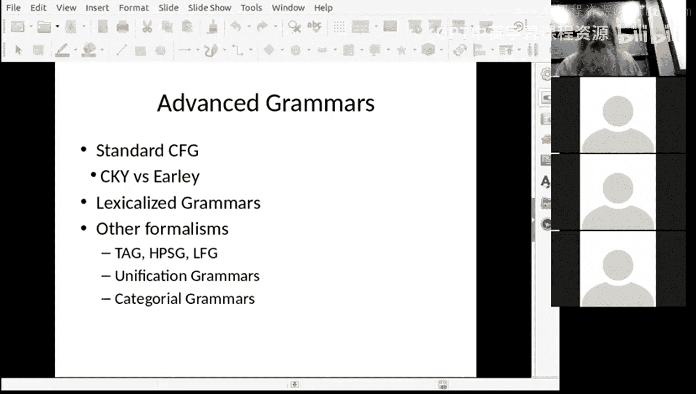
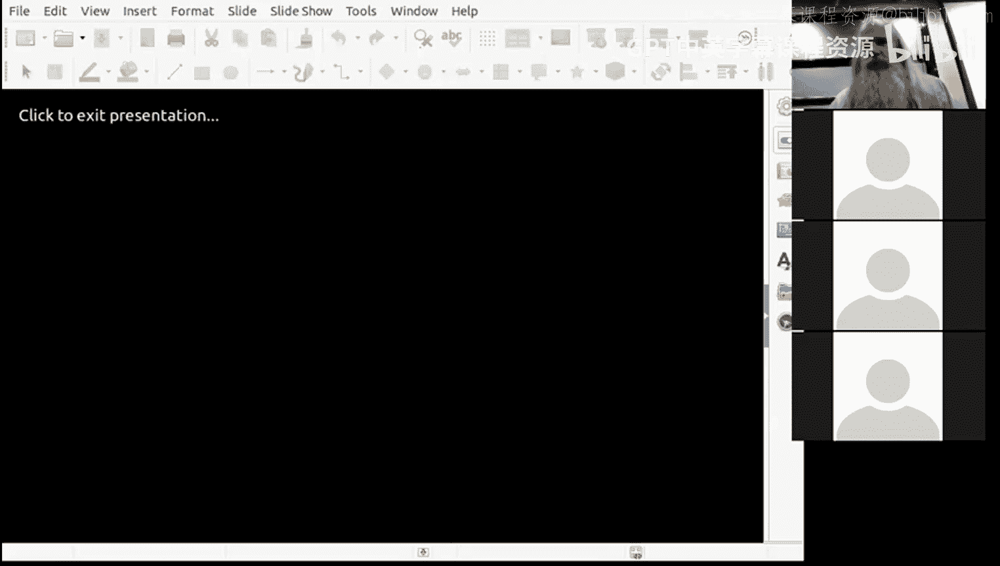

# 11：解析算法与语法形式

在本节课中，我们将继续探讨上下文无关语法的解析。我们将介绍一些新的算法和解析类型，包括依存解析，并简要提及一些历史上不同的解析方法。我们还将讨论如何为语法规则添加概率，以及如何利用这些概率来选择最佳解析树。

## 概率上下文无关语法

上一节我们介绍了CKY算法及其在解析中的应用。本节中，我们来看看如何为上下文无关语法添加概率，以便在多个可能的解析之间进行选择。

考虑以下两个句子：
1.  Book the dinner flight.
2.  Book the dinner, Flight.

第一个句子更可能表示“预订包含晚餐的航班”，而第二个句子则可能表示“告诉一个名叫Flight的人去预订晚餐”。为了在解析时区分这两种可能性，我们可以为语法规则添加概率。

我们可以为每条规则分配一个概率，表示该规则相对于其他规则的可能性。然后，通过将解析树中所有使用规则的概率相乘，可以计算出整个解析树的概率。这样，我们就可以选择概率最高的解析。

**核心概念**：在概率上下文无关语法中，每个非终结符的所有扩展规则的概率之和应为1。例如，对于非终结符 `NP`，其所有规则 `NP -> ...` 的概率之和为1。

为了在CKY算法中融入概率，我们只需在原有算法的基础上为每个条目添加一个概率分数。我们可以选择保留所有匹配的规则并在最后比较概率，或者在应用规则时进行局部最优选择（虽然这可能错过全局最优解析，但效率更高）。概率通常很小，相乘后会更小，因此实践中常使用负对数概率（`-log(p)`）进行计算，这样可以将乘法转换为加法，并提高数值精度。

解析也可以被视为一种推导过程。我们可以将规则及其概率视为带权重的推导步骤，通过组合这些步骤并累乘其概率，最终得到解析树的权重。

有时我们使用“权重”而非严格的“概率”，因为确保所有权重和为1在理论和实践上可能比较困难。由于我们主要关心解析树的相对优劣（即权重的大小比较），而非其绝对概率值，因此使用权重是可行的。有时，我们甚至会手动调整某些规则的权重以获得更好的解析结果。

## Earley算法与图表解析

CKY算法要求语法是乔姆斯基范式，即规则必须是二元分支的。虽然任何上下文无关语法都可以转换为二元分支形式，但这有时不够直观。本节中，我们来看看一个更通用的算法——Earley算法。

Earley算法由Jay Earley于1971年提出，可以处理任意形式的上下文无关语法。它是一种高效的图表解析算法，能够找到所有可能的解析（而不仅仅是最佳解析）。该算法使用一种称为“状态”或“边”的数据结构。

**核心概念**：Earley算法使用“点规则”。在规则中插入一个点“•”，用以表示解析进度。例如，规则 `S -> • NP VP` 表示我们正在寻找一个 `S`，并且刚刚开始，正在寻找 `NP`。规则 `NP -> Det • Nom` 表示我们已经找到了一个限定词（Det），正在寻找一个名词短语（Nom）。

每个状态都有起始和结束位置，对应于句子中词与词之间的位置。算法是动态规划的，通过维护一个议程（agenda）和图表（chart）来工作。初始时，会将寻找句子（S）的起始状态放入议程。然后，算法循环处理议程中的状态，应用三个主要操作：
1.  **预测**：如果点的右边是一个非终结符（如 `NP`），则将所有能展开该非终结符的规则（如 `NP -> Det Nom`）作为新状态加入图表（起始于当前点位置）。
2.  **扫描**：如果点的右边是一个与当前位置单词匹配的终结符（如 `book` 匹配 `Verb`），则创建一个点移动过该单词的新状态。
3.  **完成**：如果一个状态的点已到达规则末尾（如 `VP -> Verb NP •`），则查找图表中那些点正好位于该状态起始位置、且正在寻找该状态左侧非终结符（如 `VP`）的其他状态，并为它们创建点移动过该已完成成分的新状态。

算法会持续进行，直到议程为空。最终，如果在图表中存在一个从句子开头到结尾、且规则为 `S -> ... •` 的状态，则解析成功。为了防止左递归规则导致无限循环，需要确保不重复添加相同的状态到图表中。

Earley算法的时间复杂度为 O(n³)，空间复杂度为 O(n²)。虽然无法在保证找到所有解析的前提下更快，但可以通过启发式方法加速以在大多数情况下获得可接受的速度。要恢复解析树结构，只需在每个状态中记录其是由哪些子状态推导而来的，解析完成后反向追踪即可。

## 词汇化语法与中心词

手动编写语法规则非常困难，且容易产生大量规则。本节中，我们来看看如何通过词汇化和引入“中心词”的概念来约束和丰富语法规则。

动词通常有特定的论元结构（及物、不及物、双及物等），并且可能要求特定的介词短语作为间接论元。这称为“子语类化”。为了更精确地描述这些约束，我们可以在规则中引入词汇信息，特别是“中心词”。

**核心概念**：在一个短语中，“中心词”是该短语最重要的词，它决定了短语的核心属性。例如，在名词短语“the luxury automaker”中，中心词是“maker”；在动词短语“sold 1,214 cars”中，中心词是“sold”。

中心词可以通过一系列语言学规则来确定。例如，在名词短语中，中心词通常是那个可以发生数变化（单数/复数）并与动词保持一致的词。在“the short teachers”中，“teachers”是中心词，它决定了动词要用复数形式“are”。

我们可以创建词汇化的语法规则，将中心词信息编码到非终结符中。例如，规则 `NP(maker) -> Det(luxury) Nom(automaker)`。这样，规则的概率可以基于具体的中心词来计算，从而减少歧义，提高解析准确性。从已解析的树库中，我们可以自动提取此类规则及其概率。

另一种利用中心词信息的方法是构建“中心词标注树”，即记录每个短语的中心词是什么。这可以进一步细化和区分语法规则。词汇化语法能生成更符合语言习惯的句子。

## 依存解析

上一节我们介绍了基于成分的解析树。本节中，我们来看看另一种重要的解析表示形式——依存解析。

给定一个词汇化的解析树，我们可以换一个视角来看待它：不再关注S、NP、VP等成分标签，而是关注词与词之间的依赖关系。这称为依存解析。

**核心概念**：依存树由词与词之间的有向链接构成，表示一个词（中心词）依赖于另一个词。通常，句子的主要动词是根节点。例如，在句子“The luxury automaker last year sold 1,214 cars in the U.S.”中，动词“sold”是根，它依赖于主语“maker”和宾语“cars”。“maker”又依赖于修饰语“luxury”和“automaker”。

依存树是一种树结构，每个词（除了根节点）恰好有一个父节点（其中心词），但一个中心词可以有多个子节点（依赖于它的词）。与成分树相比，依存树更扁平，直接表示了词与词之间的语义关系。

依存解析有几个优点：
1.  **更易于下游任务使用**：对于许多机器学习任务，将依存关系作为特征（例如，每个词及其中心词）比处理复杂的树结构要简单得多。
2.  **跨语言一致性**：依存关系在不同语言中可能比成分结构更稳定。
3.  **高效解析**：存在专门的高效依存解析算法。

从成分树到依存树的转换是明确的（需要定义中心词提取规则），但反向转换则可能丢失信息，因为多个不同的成分树可能对应同一个依存树。

确定中心词有时存在选择。例如，在动词短语“have written”中，中心词应该是“have”还是“written”？在介词短语“picture of my son”中，中心词应该是介词“of”还是名词“son”？这取决于下游任务的需求。有些依存解析器提供不同的中心词定义方案。

近年来，基于神经网络的依存解析器取得了很大成功。例如，斯坦福大学的Dependency Parser使用一个从左到右的神经网络，根据当前上下文决策是建立链接还是将词压入栈中以待后续处理。这种方法不仅准确，而且速度极快，使得大规模文本的依存解析变得可行。

依存树通常以图形方式绘制，但为了输入机器学习模型，常被编码为如下表格形式：为句子中的每个词编号，然后列出每个词的父节点编号和依赖关系类型。

## 其他语法形式主义

在计算语言学和自然语言处理的发展历程中，研究者提出了多种语法形式主义，旨在更简洁、更强大地描述语言。本节中，我们简要介绍其中两种。

**合一语法**：这类语法（如广义短语结构语法、中心词驱动短语结构语法、词汇功能语法）不使用简单的符号作为规则成分，而是使用“属性-值”对列表，并可以包含变量。例如，可以定义规则 `S -> NP[num=?n] VP[num=?n]`，其中变量 `?n` 确保主语和动词在数上一致。这极大地减少了规则数量，并使语法更易于编写和维护。近年来，在知识图谱等领域的表示学习中，类似的思想有所回归。

**范畴语法**：这是一种非常简洁的语法形式，核心思想是将句法信息主要编码在词汇条目中，而语法规则数量极少（例如，只有5条核心规则）。例如，专有名词“John”的范畴是 `NP`，及物动词“likes”的范畴是 `(S\NP)/NP`，表示它需要一个右侧的 `NP`（宾语）和一个左侧的 `NP`（主语）来构成一个句子 `S`。通过“向前应用”和“向后应用”等组合规则，可以像数学运算一样推导出句子的结构。虽然词汇条目变得复杂，但同类词的范畴是相同的。范畴语法与类型论和函数式编程有深刻联系，也有基于树库的统计和神经解析器。

## 总结

本节课我们一起学习了上下文无关语法解析的进阶内容。

我们首先介绍了**概率上下文无关语法**，通过为规则添加概率，并修改CKY等算法，使我们能够选择可能性最高的解析树。

接着，我们探讨了**Earley算法**，这是一种能够处理任意形式上下文无关语法的通用图表解析算法，通过“点规则”和预测、扫描、完成三个操作高效地找到所有解析。

然后，我们讨论了**词汇化语法**和**中心词**的概念，通过将具体的词（尤其是中心词）信息融入语法规则，可以生成更精确、约束性更强的解析。

之后，我们重点介绍了**依存解析**，这是一种关注词与词之间依赖关系的解析方式。依存树更易于集成到下游机器学习任务中，并且存在像神经网络解析器这样的高效实现。

最后，我们简要回顾了历史上重要的**其他语法形式主义**，如合一语法和范畴语法，它们以不同的方式追求语法描述的简洁性和表达力。

理解这些不同的解析方法和语法表示形式，有助于我们根据具体任务的需求（如速度、准确性、与下游任务的集成度）选择合适的工具，并更好地理解自然语言结构的复杂性。