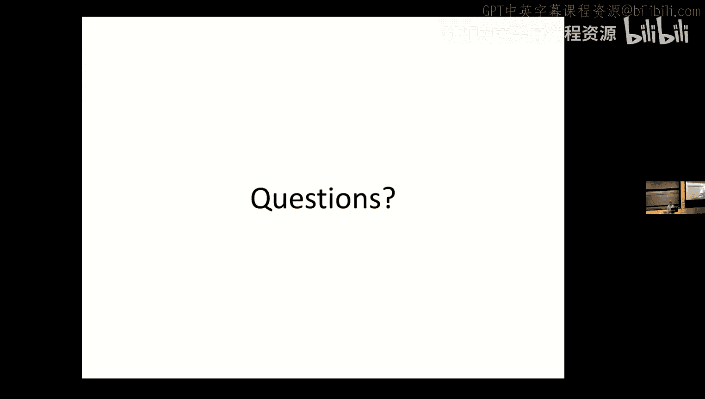

# 12：树库与概率上下文无关文法

在本节课中，我们将要学习树库和概率上下文无关文法。我们将探讨什么是树库，如何从树库中获取语法规则，以及如何利用这些规则构建概率模型来处理句子的歧义问题。

## 什么是树库？

树库是一个大型的文本语料库。这个语料库中的每个句子都已经被分析成了句法树。这些句法树可以是成分树，也可以是依存树。今天我们将主要讨论成分树，因为我们要讨论概率上下文无关文法，但许多相同的原理也适用于依存树。

## 语法编码的两种方式

表示语言语法的方式主要有两种。一种方式是显式编码，即直接写出所有的规则。例如，你可以手动写出一个上下文无关文法的所有规则。另一种方式是隐式编码，即通过分析大量句子的句法结构，从这些分析中推导出一套规则。树库就属于后一种方式。

## 树库的构建与挑战

构建树库是一项艰巨的任务。它至少包含六个步骤，每一步都需要大量的工作。首先，需要制定一个初始的编码手册，指导标注者如何应用句法测试来确定句子的结构。其次，需要开发标注工具，包括一个预处理器和一个用户界面。然后，需要收集数据，并确保拥有数据的合法使用权。接着，需要自动解析数据，并培训标注人员。之后，需要人工修正自动标注的结果。最后，当遇到编码手册中未涵盖的情况时，需要修订手册并更新已标注的数据。

## 树库的局限性

树库虽然有用，但也存在严重的局限性。首先，构建成本高昂，导致难以被替代，因此即使存在缺陷，也可能被长期使用。其次，由于时间和资金的压力，树库的质量可能并不完美。此外，编码手册和高级决策通常由专家制定，但大部分标注工作由非专家完成，这可能导致错误和不一致。

## 从树库中提取规则

从树库中可以提取出大量的上下文无关文法规则。例如，从一个句子“Pierre Vinken joined the board”的句法树中，我们可以提取出诸如 `NP -> NNP NNP` 和 `S -> NP VP .` 等规则。然而，树库中的规则分布极不均匀：少数规则出现频率极高，而大量规则只出现几次。

## 解析器的评估

评估一个解析器的性能，我们通常使用解析树与标准树库（黄金标准）的对比。常用的评估指标包括标记召回率、标记精确率和交叉括号数。标记召回率衡量解析器正确识别的成分占黄金标准中总成分的比例。标记精确率衡量解析器识别的成分中正确的比例。交叉括号数则衡量两种解析在结构上的差异程度。

为了综合评估，我们使用F值，其通用公式为：
\[
F_{\beta} = (1 + \beta^2) \cdot \frac{precision \cdot recall}{(\beta^2 \cdot precision) + recall}
\]
其中，当 \(\beta = 1\) 时，即为F1值，它是精确率和召回率的调和平均数。

## 概率上下文无关文法

概率上下文无关文法是对标准上下文无关文法的扩展，它为每条产生式规则赋予一个概率值。一个PCFG包含四个部分：终结符集合、非终结符集合、起始符号以及带有概率的产生式规则集合。对于每个非终结符，其所有产生式规则的概率之和必须为1。

PCFG的一个关键优势是能够计算整个句法树的概率。给定一个句法树，其概率等于树中所有节点所使用的产生式规则概率的乘积：
\[
P(tree) = \prod_{rule \in tree} P(rule)
\]
这使得PCFG可以用于句法歧义消解。对于有多个可能解析的句子，我们可以计算每个解析树的概率，并选择概率最高的那个。

## PCFG概率的来源

获取PCFG概率最简单的方法是从树库中统计。对于每条规则 `X -> α`，其概率估计为：
\[
P(X \rightarrow \alpha) = \frac{Count(X \rightarrow \alpha)}{Count(X)}
\]
也可以从普通语料库中学习PCFG，但这更复杂，需要先有一个CFG来解析语料库，然后通过迭代算法（如向内-向外算法）来估计规则概率。

## PCFG的局限性与词汇化

标准的PCFG存在两个主要问题。第一，它假设规则之间是独立的，无法捕捉结构间的依赖关系。第二，它缺乏词汇信息，无法利用词语本身对句法结构选择的影响。

为了解决这些问题，我们引入了词汇化的概率上下文无关文法。在这种文法中，每个句法成分都与其中心词相关联。中心词是决定该成分类型（如名词短语、动词短语）的最重要词语。通过将中心词信息标注到非终结符上，规则变得更加具体，从而能够捕捉到词汇对句法概率的影响。例如，规则不再是简单的 `S -> NP VP`，而是 `S(dumped) -> NP(workers) VP(dumped)`。

然而，词汇化也带来了数据稀疏问题，因为规则数量急剧增加。这通常需要更多的训练数据或更智能的平滑技术来处理。

## 总结

本节课我们一起学习了树库和概率上下文无关文法。我们了解了树库的构建过程、价值与局限，学习了如何从树库中提取语法规则并评估解析器的性能。我们重点介绍了概率上下文无关文法，它通过为规则赋予概率，使得句法分析能够进行歧义消解并评估句子的合理性。最后，我们探讨了标准PCFG的局限性以及词汇化PCFG如何通过引入中心词信息来提升模型性能。理解这些基础概念对于使用和改进句法分析器至关重要。