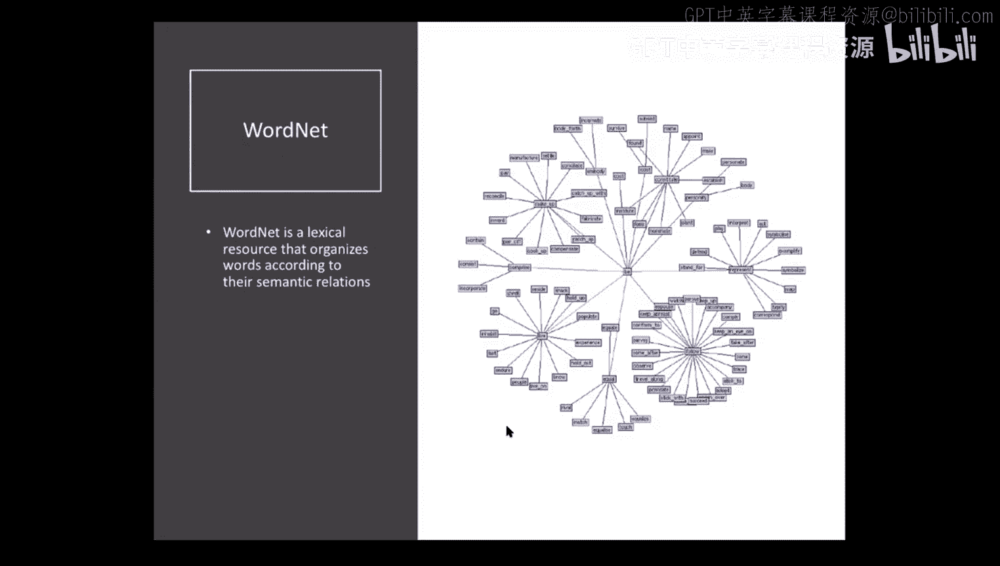
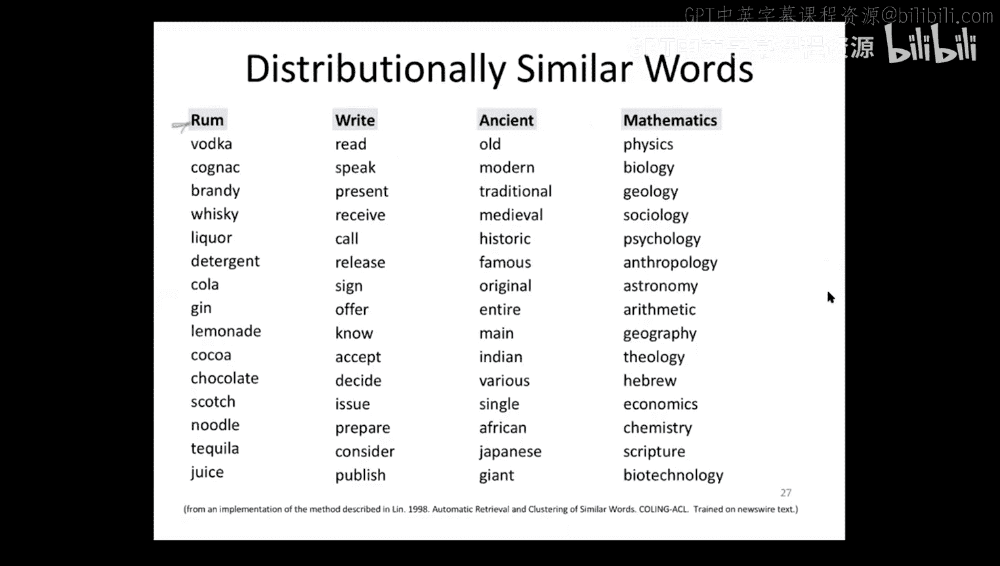

# 13：词汇语义学


在本节课中，我们将要学习词汇语义学，即关于词语意义的学问。我们将探讨三种理解词语意义的方法：分解法、本体论法和分布法。课程将介绍核心概念，并通过公式和代码示例进行说明，旨在让初学者能够轻松理解。

---

## 课程概述

在之前的课程中，我们讨论了句法分析、分类和语言建模等技术。然而，所有这些技术的最终价值都依赖于它们与现实世界的联系，即语义。本节课，我们将聚焦于词汇层面的语义，探索如何表征词语的意义，以便在自然语言处理应用中使用。

---

## 分解语义学

上一节我们介绍了语义学的重要性，本节中我们来看看第一种方法：分解语义学。这种方法认为，词语的意义可以分解为更小的、有意义的特征或“原子”，就像分子由原子构成一样。

例如，我们可以用一组特征来描述“男孩”、“女孩”、“男人”、“女人”等词语：

*   **男孩**: `+人类, -女性, -成年`
*   **女孩**: `+人类, +女性, -成年`
*   **男人**: `+人类, -女性, +成年`
*   **女人**: `+人类, +女性, +成年`

以下是这种方法的潜在优势：
*   它为每个词语提供了一个完整且可解释的表征。
*   这些特征可以转化为二进制向量（如+为1，-为0），从而可以在向量空间中计算词语之间的相似度。

然而，这种方法也存在明显的缺点：
*   需要大量的特征来覆盖整个词汇表。
*   确定每个词语的正确特征集非常困难，且缺乏统一标准。
*   难以将这些特征与现实世界准确关联。

因此，尽管在某些特定任务（如语义角色标注）中有所应用，分解语义学在计算词汇语义学中并不常用。

---

## 本体论语义学

上一节我们介绍了自底向上的分解法，本节中我们来看看自顶向下的本体论方法。这种方法不直接定义词语本身，而是通过定义词语与其他词语之间的关系来表征其意义。

以下是几种核心的语义关系：

*   **同义关系**: 词语意义大致相同。例如，“小”和“微小”。
*   **反义关系**: 词语意义相反。例如，“小”和“大”。
*   **上下位关系**: 表示“是一种”的集合包含关系。
    *   **下位词**: 表示更具体的概念。例如，“狗”是“哺乳动物”的下位词。
    *   **上位词**: 表示更一般的概念。例如，“哺乳动物”是“狗”的上位词。
*   **部分整体关系**: 表示“是…的一部分”或“拥有…”的关系。
    *   **部分词**: 表示整体的一部分。例如，“肝脏”是“身体”的部分词。
    *   **整体词**: 表示拥有某部分。例如，“身体”是“肝脏”的整体词。

**重要区分**: 下位关系是集合包含（如“狗”属于“哺乳动物”），而部分整体关系是组成部分（如“肝脏”是“身体”的一部分）。两者完全不同。

---

### WordNet：一个著名的词汇本体

WordNet 是一个广泛使用的英语词汇数据库，它按照上述关系将词语（更准确地说，是词语的义项）组织成一个大型网络。

在 WordNet 中，意义相近的词语被分组到 **同义词集** 中。例如，关于“狗”的一个同义词集可能包含 `{dog, domestic dog, Canis familiaris}`，并附有定义和例句。



WordNet 的主体是一个庞大的 **上下位关系层级结构**（或称分类法）。例如，“鱼”的下位关系链可能是：`实体` <- `物体` <- `整体` <- `生物` <- `生物体` <- `动物` <- `脊索动物` <- `脊椎动物` <- `水生脊椎动物` <- `鱼`。

利用 WordNet 这样的层级结构，我们可以计算词语的 **信息量**。信息量公式为：
`I(c) = -log P(c)`
其中 `P(c)` 是词语 `c` 或其下位词在语料库中出现的概率。越具体、越少见的词语，其信息量越高。

WordNet 可以通过 Python 的 NLTK 库方便地使用：
```python
from nltk.corpus import wordnet as wn
synsets = wn.synsets(‘dog’) # 获取“dog”的所有同义词集
```

然而，WordNet 这类资源也存在局限：它们需要大量人工编纂，可能存在不一致性，并且是静态的，难以覆盖所有语言使用现象。

---

## 分布语义学

上一节我们讨论了依赖于人工定义的本体论方法，本节中我们来看看完全数据驱动的分布语义学。其核心思想是：**一个词的意义由其上下文决定**。即，出现在相似上下文中的词语，其意义也相似。

我们可以通过构建 **共现向量** 来形式化这一思想。具体做法是：设定一个滑动窗口（例如，窗口大小为5个词），扫描大型语料库。对于目标词 `w`，统计其他每个词 `f` 出现在 `w` 窗口内的次数。这个计数向量就表征了 `w` 的上下文分布，从而间接表征了其意义。

例如，分析“杏子”、“菠萝”、“数字”、“信息”四个词的共现向量后，我们会发现“杏子”和“菠萝”的向量相似（因为它们常与“水果”、“甜”等词共现），而“数字”和“信息”的向量相似（因为它们常与“技术”、“数据”等词共现）。

### 点间互信息

直接使用原始共现计数有一个问题：像“the”、“is”这样的高频词，它们与许多词共现的次数都很高，但这并非因为有特殊的语义关联，仅仅是因为它们本身出现频繁。

为了解决这个问题，我们使用 **点间互信息**。PMI 衡量的是两个词实际共同出现的概率，与它们随机共同出现的概率的比值。其公式为：
`PMI(w, f) = log( P(w, f) / (P(w) * P(f)) )`
在计算中，常使用正点间互信息：
`PPMI(w, f) = max(PMI(w, f), 0)`

PPMI 降低了高频但无特殊关联词对的权重，突出了那些有显著共现关系的词对。

### 实践结果

使用大型语料库计算词语的 PPMI 向量，然后通过 **余弦相似度** 比较向量，可以找到与目标词语义最接近的词。例如：
*   **rum（朗姆酒）** 的相似词：vodka, cognac, brandy, whiskey...
*   **say（说）** 的相似词：read, speak, present, receive...
*   **mathematics（数学）** 的相似词：physics, biology, geology, sociology...

这些结果完全由算法从数据中自动学习得到，没有人工干预，效果相当不错，展示了分布语义学的强大能力。

---

## 课程总结

本节课我们一起学习了词汇语义学的三种主要方法：
1.  **分解语义学**：将词语意义分解为语义特征。
2.  **本体论语义学**：通过词语间的语义关系（如上下位、部分整体关系）来定义意义，并以 WordNet 为例进行了说明。
3.  **分布语义学**：基于“一个词的意义由其上下文决定”的分布假设，使用共现向量和点间互信息来从数据中自动学习词语的语义表征。



理解词语的意义是连接语言计算与现实世界的关键。在接下来的课程中，我们将深入探讨词向量这一将分布语义思想转化为强大工具的技术。