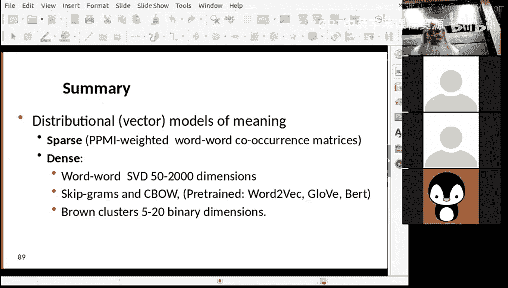

# 14：词向量语义学

在本节课中，我们将学习词向量语义学，通常被称为词嵌入。我们将探讨现代自然语言处理如何表示词语，理解词嵌入的工作原理，以及如何从分析角度和神经网络角度构建词嵌入。核心目标是让机器能够理解词语之间的相似性，从而应用于问答、摘要、抄袭检测等任务。

## 概述：词义与相似性

词语并非完全孤立存在。许多词语具有相似的含义，而另一些则含义迥异。我们通常将词语视为词典列表中的符号，认为它们要么相等，要么完全不相关。然而，这种观点并不准确。例如，“fast”（快速）和“rapid”（迅速）在含义上是相关的，我们希望它们比“fast”和“chair”（椅子）更相似。

考虑构建一个问答系统。如果有人问“Mount Everest有多高？”，而维基百科条目写的是“Mount Everest的官方高度是29,029英尺”。如果系统知道“tall”（高）和“height”（高度）在某种意义上是相似的，就能回答这个问题。否则，系统会认为“我知道高度，但不知道‘高’是什么意思”，从而无法作答。

因此，我们需要一种表示方法，使得“tall”和“height”比“tall”和“chair”更相似。

## 词义的变化与语境

语言会随时间变化。语言学家通过研究词语在历史语境中的使用来评估词义是否发生了变化。例如，词语“dog”（狗）、“deer”（鹿）和“hound”（猎犬）的含义在历史上发生了演变。在1250年左右，“dog”的含义比现在更局限，“deer”则泛指森林中的大型动物（类似于德语中的“Tier”，意为动物），而“hound”曾指代许多我们现在称为“dog”的动物。

另一个例子是“gay”这个词。一百年前，“gay”主要意为“快乐的、愉快的”，而如今通常指“同性恋的”。通过分析历史文本中“gay”出现的上下文，我们可以追踪其含义的演变。

人们通过观察词语在语境中的使用来判断其含义是否相似。传统上，我们使用同义词词典来查找相似词，但同义词词典可能过时，且并非对所有语言都适用。

## 分布语义模型

我们试图借助的核心思想是**分布语义模型**。我们无法从计算上精确定义一个词的含义，但可以尝试通过词语出现的上下文来**表示**其含义，以便用于自然语言处理任务。

语言学家Zellig Harris在1950年代指出，词语“oculist”（眼科医生）和“eye doctor”（眼科医生）出现在几乎相同的语境中。因此，如果两个词出现在相似的语境中，我们可以认为它们是同义词。不过需要谨慎，例如颜色词“blue”（蓝色）、“red”（红色）、“green”（绿色）也常出现在相似语境中，但它们并非同义词，而是描述物体的相同属性（颜色）。

丹麦语言学家John Rupert Firth在1957年说过：“You shall know a word by the company it keeps”（观其伴，知其义）。这句话非常重要，它指出了我们今天的计算技术基础：通过词语出现的上下文来构建词义，并衡量这些上下文是否相似。

## 通过上下文推断词义

假设你从未听过“tisquino”这个词，但看到以下句子：
*   A bottle of tisquino is on the table.
*   Everybody likes tisquino.
*   Tisquino makes you drunk.
*   We make tisquino from corn.

即使不认识这个词，你也可以推断“tisquino”很可能是一种用玉米酿造的酒精饮料（事实上它是一种啤酒）。这是因为你可以用“beer”（啤酒）或“whiskey”（威士忌）等词替换“tisquino”，句子依然通顺（只要假设它们也是玉米酿造的）。人类在阅读时会这样做，我们也希望机器能具备这种能力。

因此，我们的核心观点是：**如果两个词出现在相似的词语上下文中，那么它们就是相似的。**

## 向量表示：稀疏与稠密

我们已经讨论过用向量表示词语。例如，可以定义一个包含1万个词的词汇表，每个词对应一个长度为1万的向量（**one-hot向量**），其中只有该词对应的位置是1，其余为0。这是一种**稀疏向量**表示，大部分元素是0。

我们可以基于上下文构建词表示：对于一个目标词，查看其周围出现的词，并在一个很宽的向量中标记这些上下文词。但这会产生非常宽且稀疏的向量。

另一种方法是尝试获得**稠密向量**表示。我们可以通过计算技术（如奇异值分解SVD，一种潜在语义分析形式）将稀疏向量投影到更低维度的空间。或者使用神经网络（如Skip-gram或连续词袋模型CBOW）来学习一个紧凑的表示，该表示能尽可能准确地预测原始上下文。我们之前讨论过的布朗聚类也可以用于获得更密集的表示。

这种表示通常被称为**嵌入**。人们常说的词向量或嵌入通常指稠密向量。关键目标是获得一种表示，使我们能够计算词语之间的**距离度量**，而不仅仅是给每个词分配一个独立的整数编号。

## 共现向量

我们首先来看**共现向量**。基本思想是统计词语在特定上下文（如文档）中共同出现的情况。

例如，分析莎士比亚的几部戏剧中词语的出现次数：

| 词语 | 《皆大欢喜》 | 《第十二夜》 | 《尤利乌斯·凯撒》 | 《亨利五世》 |
| :--- | :--- | :--- | :--- | :--- |
| battle | 1 | 1 | 8 | 15 |
| soldier | 2 | 2 | 12 | 36 |
| fool | 114 | 43 | 2 | 1 |
| clown | 9 | 33 | 0 | 0 |

观察可知，“battle”和“soldier”在《尤利乌斯·凯撒》和《亨利五世》中出现更频繁，而“fool”和“clown”在《皆大欢喜》和《第十二夜》中出现更频繁。这表明《尤利乌斯·凯撒》和《亨利五世》这两部戏剧更相似（都是关于战争和王权的），而“fool”和“clown”这两个词也比它们与“soldier”或“battle”更相似。

基于整个文档进行统计可能不够精细。我们可以将上下文限制在目标词前后固定数量的词语范围内（例如前后各7个词）。但这种方法需要大量数据才能获得可靠的统计信息。

## 点互信息与正点互信息

原始的共现频率并不理想，因为像“the”、“of”这样的高频词会出现巨大的数值，但它们的信息量并不高。我们更关心那些能区分语境的内容词。

因此，我们引入**点互信息**来衡量一个上下文词对于目标词的信息量。其基本思想是：比较两个词**实际共同出现**的概率与它们**独立出现**的预期概率。

**公式**：
`PMI(x, y) = log2( P(x, y) / (P(x) * P(y)) )`

PMI值范围在负无穷到正无穷之间。负值表示两个词共同出现的次数比随机预期还要少（可能互为反义词）。但在许多任务中，我们只关心词语何时相似，而不关心它们何时不相似。因此，通常使用**正点互信息**，即将所有负的PMI值设为零。

**公式**：
`PPMI(x, y) = max(0, PMI(x, y))`

PPMI仍然对低频事件有些敏感。非常罕见的词可能因为共现次数极少而获得异常高的PPMI值。我们可以使用平滑技术（如加一平滑）来缓解这个问题，给予低频词稍高的概率估计，从而得到更稳定的PPMI值。

## 相似性度量：余弦相似度

获得词向量后，我们需要一种方法来衡量两个向量的相似度。一种简单的方法是计算它们的点积。但点积的值会受到向量长度（即非零元素数量）的影响，难以直接比较不同词对之间的相似度。

更好的方法是使用**余弦相似度**。它计算两个向量夹角的余弦值，从而消除了向量长度的影响。

**公式**：
`cosine_similarity(A, B) = (A · B) / (||A|| * ||B||)`

其中 `A · B` 是点积，`||A||` 和 `||B||` 是向量的模（长度）。余弦相似度的取值范围在-1到1之间。对于PPMI向量（非负），其值通常在0到1之间，1表示完全相同，0表示无关。

余弦相似度本质上是衡量两个向量在空间中的方向是否一致。我们可以基于余弦相似度对所有词语进行聚类，形成层次结构，从而发现语义上相近的词语类别（如身体部位：手腕、脚踝、肩膀、手臂等）。

## 基于句法上下文的改进

前述方法只考虑了词语的上下文，没有利用句法结构。我们可以使用**依存句法分析**来改进。不是简单地取目标词前后几个词，而是取其在依存树中直接相连的词语（如主语、宾语等）。这样得到的上下文更关注句法上相关的词（如动词及其核心论元），而不仅仅是表面相邻的词。这种方法通常能获得更好的语义表示。

## 另一种度量：TF-IDF

除了PPMI，**TF-IDF**是另一种常用的度量。
*   **TF**代表词频，即词语在文档中出现的频率（有时会取对数）。
*   **IDF**代表逆文档频率，衡量一个词在所有文档中的普遍程度。IDF值高意味着该词在少数文档中集中出现，是区分文档的有力指标。

TF-IDF结合了这两者，用于评估一个词对于特定文档的重要性。

## 从稀疏到稠密：降维技术

到目前为止，我们讨论的向量表示仍然是稀疏的（维度高，大部分为零）。从计算效率和机器学习角度，我们希望得到**稠密**的、低维度的向量表示（例如300维）。这样不仅计算更快，有时还能捕捉到更抽象的语义关系。

以下是三种主要的降维或稠密表示方法：

### 1. 奇异值分解

**奇异值分解**是一种数学技术，是**潜在语义分析**的一种。它通过线性代数方法，将高维稀疏矩阵分解，并保留最重要的特征，投影到低维空间（如300维）。SVD会寻找数据中的相关性，例如“car”和“automobile”的共现模式相似，可能会在低维空间中被合并或接近。选择300维并没有特别的理论依据，更多是历史和经验结果。

### 2. 神经网络词嵌入

这类方法使用神经网络来学习稠密词向量。核心思想与之前一致：利用上下文信息。

*   **Skip-gram模型**：给定一个中心词，训练神经网络来预测其周围的上下文词。
*   **连续词袋模型**：给定上下文词，训练神经网络来预测中心词。

在训练时，输入是词语的one-hot向量，通过网络中的一个“瓶颈”层（如300维）后，试图预测上下文或中心词。训练完成后，这个“瓶颈”层的激活值就作为该词的稠密向量表示。这类模型（如Word2Vec）可以预先在大规模语料上训练好，供下游任务直接使用。

研究表明，Skip-gram等神经网络嵌入与PPMI存在相关性，并且由于神经网络固有的平滑效应，它们在处理低频词时可能表现更好。

使用这些预训练的词向量，并通过余弦相似度查找最近邻，可以发现语义上相似的词语或短语（例如“Redmond”（雷德蒙德）与“Microsoft”（微软）、“Washington”（华盛顿）与“government”（政府））。

词嵌入还有一个有趣的性质：它们似乎能捕捉到某种语义关系。例如，经典的例子是：`vector(“king”) - vector(“man”) + vector(“woman”) ≈ vector(“queen”)`。这暗示在向量空间中存在着“性别”或“国家-首都”等关系方向。不过后续研究指出，这种关系并不总是那么精确和普适，但确实表明词向量编码了有用的语义信息。

### 3. 布朗聚类

我们之前在词性标注中讨论过**布朗聚类**。它是一种层次聚类算法，将词汇表中的所有词组织成一棵二叉树。每个词都可以通过从根节点到该词叶子节点的路径（一串0和1）来表示，这个路径就可以作为该词的向量表示。这种表示是离散的，并且具有层次结构：路径前缀相同的词在语义上更接近。布朗聚类计算成本较高，但得到的表示针对特定语料，有时非常有效。

## 上下文化词嵌入

Word2Vec或GloVe为每个词提供一个**静态**的向量，不考虑一词多义。例如，“apple”的向量混合了其作为“水果”和“公司”的所有含义。

**上下文化词嵌入**（如ELMo、BERT）解决了这个问题。它们需要输入整个句子，然后根据词语在句中的具体上下文，生成不同的向量表示。例如，“apple”后面跟着“pie”和跟着“computer”会得到不同的向量。BERT等模型使用Transformer架构，能够考虑句子中所有词之间的交互，因此产生的表示质量更高，极大地推动了自然语言处理的发展。不过，它们模型更大，计算也更昂贵。

## 评估与应用

如何评估词向量的好坏？除了内在任务（如计算余弦相似度），更重要的是看其在**下游任务**中的表现，例如：
*   问答系统
*   拼写检查（寻找相似词）
*   文本评分
*   模拟人类的词汇测试（如TOEFL中的同义词选择）

词向量在这些任务中表现良好，但它们并不真正“理解”语言，这一点需要牢记。

## 总结

本节课我们一起学习了**分布向量语义模型**。我们讨论了如何用一组浮点数（向量）来表示词义，并希望这个表示能支持距离度量，从而服务于下游任务。

我们首先介绍了**稀疏**表示方法，包括简单的共现统计以及更优的**正点互信息**方法。

接着，我们探讨了三种获得**稠密**向量表示的主要技术：
1.  **降维技术**：如奇异值分解，将高维稀疏表示投影到低维稠密空间。
2.  **神经网络嵌入**：如Skip-gram和CBOW模型，通过神经网络学习紧凑表示，或直接使用预训练模型（如Word2Vec、GloVe）。我们还提到了更先进的**上下文化词嵌入**（如BERT），它能根据句子上下文生成动态向量。
3.  **布朗聚类**：一种层次聚类方法，为每个词生成一个基于聚类路径的离散向量表示。

这些词向量表示是现代自然语言处理系统的基石，使我们能够以计算的方式处理和利用词语之间的语义关系。