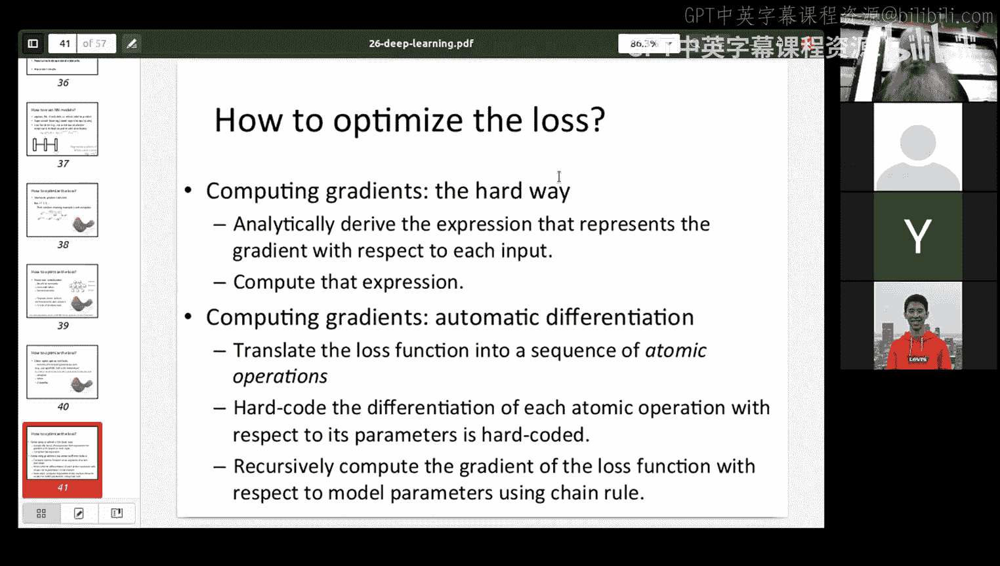
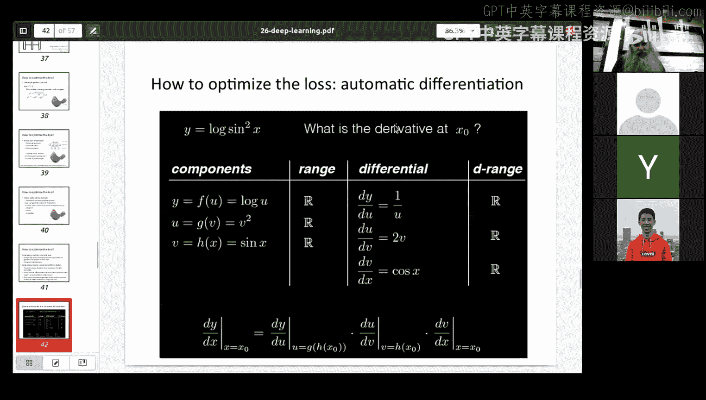
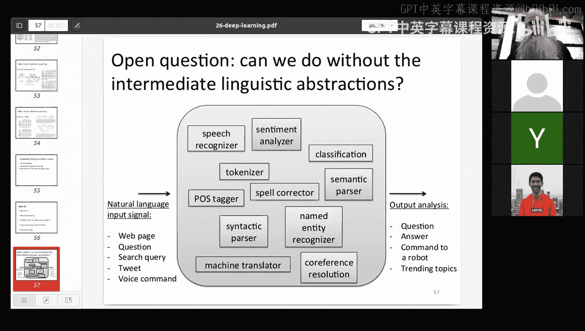

# 15：深度学习概述 🧠

在本节课中，我们将对深度学习进行一个快速的概览。我们将回顾深度学习的历史、其在自然语言处理（NLP）中应用的原因与局限性，并探讨一些使用深度学习改进NLP的重要里程碑。

## 课程概述

我们这门课程主要讨论自然语言分析的各种形式。输入形式是人类文本（也可能是语音，但我们主要讨论文本），例如网页、问题、推文、语音指令或整个文档。我们需要对这些输入进行处理，例如生成问题、生成答案、解释指令、查询数据库或发现趋势话题。我们使用某种算法或函数来处理输入，并最终产生输出，输出可能是自然语言，也可能是现实世界中的某个动作。

我们探讨了多种可能用到的算法类型，例如语音识别、情感分析、文档分类。我们也讨论了用于解决这些高级任务的底层技术，如分词、拼写纠正、词性标注、句法分析等。此外，还有一些中间任务，如命名实体识别、语义解析、共指消解，这些任务本身很有趣，但通常是为更大的NLP应用服务的。

核心问题是：我们能否用深度学习取代所有这些分析过程？答案是肯定的。但问题是，我们是否应该这样做？这取决于具体任务，因为我们的目标是获得最佳结果，而不一定是最高的CPU或GPU使用率。我们需要知道在何时何地，相较于统计学习或规则系统，神经网络学习是最佳选择，以及如何最容易地实现它。

总的来说，神经网络效果很好，但它们需要大量数据。如果我们没有足够的数据，可以通过数据增强技术或添加额外信息（如词性标签或句法信息）来弥补，使学习过程更快。但一般来说，我们需要大量数据。因此，如果你的任务数据量不足，可能需要考虑更简单的统计技术。无论如何，我们都应该评估并选择最佳方案。

## 深度学习简史 📜

接下来，我将简要介绍深度学习的历史。这不仅因为其历史悠长（可追溯到20世纪50年代），还因为了解其构建模块在过去50多年里的演变至关重要。

我们将讨论训练，因为训练是深度学习的关键技能。虽然本课程不专门教授如何为NLP构建深度神经网络（那是另一门课程的内容），但我会介绍一些在过去10年里改变我们对神经网络在NLP中应用的看法、并显著推动该领域发展的重要成果。

我将以文档分类作为主要示例。假设我们有一系列新闻文章，需要将它们分类到金融、商业、体育、娱乐和健康等类别中。我们试图找出每篇文章属于哪个类别。

## 从线性模型到神经网络

我们真正讨论的是一个函数，它接收一个标签（如“体育”）和一个文档，并输出一个概率。我们的目标是找到给定文档下最可能的类别。无论是统计学习、神经网络学习还是规则学习，我们都在尝试从数据中学习这个概率函数。

几百年来最明显的方法是使用某种线性模型。我们会查看一系列特征（例如单词的出现情况），并尝试找到合适的权重来乘以这些特征，然后求和，看结果是否超过某个阈值（例如大于零）。一个线性模型可能会考虑文档中所有单词的出现情况（出现为1，不出现为0），向量的长度等于词汇表大小。我们希望学习到的权重能告诉我们某些单词更可能出现在特定类别中。

然而，这种方法孤立地处理每个单词，没有考虑上下文。例如，“皇家马德里”这个二元词组是谈论足球的强有力指标。我们可以通过训练来发现这一点。线性模型试图在数据中画一条线（线性分割）来区分不同类别。但对于真实数据，几乎不可能得到一条完美的分割线，因此我们只能尝试最小化误差。

如果我们被允许画多条线，效果会好得多。换句话说，简单的单线线性模型可能不足以完成我们想做的许多复杂任务。因此，我们希望得到更复杂的模型以获得更好的结果。机器学习领域的人们已经为此探索了很长时间。

## 神经网络基础 🧮

最简单的神经网络形式实际上就是线性回归。你有一组输入特征，将其与权重相乘，然后求和，最后选择输出值最高的节点。这仍然是一个线性过程。

神经网络（即使在这种只有两层的简单网络中）的不同之处在于权重的获取方式。在线性回归中，我们通过逆矩阵乘法等方式获取权重。而在神经网络中，我们使用一种称为**反向传播**的技术。给定一个示例，我们预测输出，查看误差，然后尝试修改权重以减少该误差。我们不会一次性大幅度改变权重（否则权重会剧烈波动），而是每次只改变一小部分（如10%或5%）。通过多次迭代，权重会逐渐移动到能实现最佳分割的位置。

因此，神经网络感知机通过反向传播来学习权重。我们分配误差量，将其分布到所有权重上，然后尝试更新它们。如何更新有很多选择，我今天会讨论其中一些。但基本思想是：它仍然是一个线性模型，我们有一组特征乘以权重，然后在另一端查看某个阈值。但获取权重的方式不同，这对神经网络很重要，因为我们不仅仅有简单的线性模型。

在神经网络中，我们实际上可以有更复杂的形式。这种线性权重模型在20世纪50年代就已出现。你可以将神经网络视为矩阵乘法，这与线性代数中的概念相同，但视角不同，这在我们扩展神经网络复杂性时具有优势。

## 多层网络与编码器-解码器

人们很快意识到，除了线性模型，我们还可以做更复杂的事情。我们可以拥有多个层，还可以改变每层的节点数量。例如，在中间层使用更少的节点，然后尝试预测输出。这样，神经网络可以用于一种压缩形式。

我们可以将输入（例如一个10000维的词汇表向量）压缩到中间层的一个只有几百维的编码，然后再从这个编码尝试重建出原始的10000维输出。我们可以使用神经网络学习技术来实现这一点。这意味着中间点包含了所有信息（虽然重建不会100%准确，但会非常接近）。这个中间的小向量对于下游机器学习任务有很多好处，这被称为**编码器-解码器**架构。

在21世纪初，我们经常在语音处理中使用它，将大量可能重要的频谱特征投影到更少的特征（通常称为瓶颈特征）上，然后使用这个中间表示。我们当时并没有在最终的识别器中使用神经网络，只是用它们来编码数据。

多层网络和这种压缩形式是有用的。可以说，这与矩阵乘法得到的结果相同，但这是训练的一种更有效方式。

我们发现，在这些压缩形式中得到的特征具有某种意义。它们是有用的。在该领域中的距离度量，相较于原始高维空间中的距离度量，具有了含义。当我们对单词做类似处理时（大约一个月前我们讨论过词嵌入），这就是将词袋表示压缩成词嵌入的一种方式。

大约在2011年，人们发现这种距离度量具有意义：相似的单词距离近，不同类别的单词会聚集在一起。当时有些人惊呼神经网络理解了世界，但这在哲学意义上绝对不是真的。当你使用神经网络获得这些压缩形式时，你实际上是在查看单词出现的上下文。你得到的是在相同上下文中可能出现的单词之间的距离度量。一旦你获得了具有这种属性的距离度量，出现在相同上下文中的单词距离更近，你就能得到一些语义信息。例如，地名出现在其他地名附近，颜色词出现在其他颜色词附近，水果词出现在其他水果词附近。所以它确实在学习一些东西，学习一些关于意义的东西，但不是这两个词在深层哲学意义上相同，而是这些词在相同上下文中出现，因此在某种意义上它们是相似的。它们可能是同义词，也可能是反义词（这有点问题），在这个领域中相似的词在语义上可能并不相似。

但这具有这些属性，并且非常有用，因为在自然语言处理中，我们真的想知道两个词是否在某种意义上相同或相关，因为这告诉我们很多信息，不仅是关于这个词本身，还关于它周围的词。

## 非线性函数与深度网络的力量

我们可以定义比简单线性形式更复杂的函数，这正是神经网络计算能力的真正来源。如果你看这个多层网络，它将是矩阵乘法乘以矩阵乘法。两个矩阵相乘，你可以预先计算矩阵的乘积，根据结合律，结果完全相同，所以我们没有得到任何增益。

那么，为什么我们要有多层呢？如果我们只是那样做，我们肯定不会得到更多。但这不是我们在神经网络中做的唯一事情。我们经常在中间乘法之后做一些后处理。事实上，我们经常在那里应用一个后处理函数，这个后处理函数通常是非线性函数，比如逻辑函数。我们可能会说，不是直接取所有的输出，而是查看输出，并做一些类似的事情：如果值高于阈值，就设为1；如果低于阈值，就设为0。这是一种试图进行0/1识别的过程。我们将应用这个函数，强制使高的值更高，低的值更低。

当我们这样做时，在神经网络中就不再是简单的矩阵乘法了，它实际上更复杂：乘以某个值，应用某个函数，再乘以另一个值。这样做之后，你无法预先计算中间发生的函数，因为你无法在不了解输入的情况下独立执行该函数。因此，你最终得到了实际上是新的、更复杂的函数。这是一件非常好的事情。

这里通常应用的是非线性函数。因此，我们实际上可以得到比简单多重线性回归更有趣的分类结果，因为那并没有真正的帮助。所以，如果我们在中间形式中应用这些函数（我们在几乎所有神经网络中都是这样做的），我们最终会得到这些函数的非线性表示，使我们能够学习比标准线性函数复杂得多的东西。这很酷，因为线性回归无法学习非线性回归函数，它是有限的。

你可以构建一堆线性回归决策器，取它们的输出，应用某个函数，然后将它们输入到另一层线性函数中。这正是神经网络所做的。但神经网络的优点是，我们可以从头到尾一起训练所有权重。而我刚才说的构建独立模型然后以某种方式组合它们的方法，你必须在不根据后续结果进行修正的情况下，尽可能好地训练这些初始模型。因此，将事物连接在一起在神经网络中进行的优势是，你可以一起训练所有这些权重，这非常强大。

## 激活函数与训练要求

在每个层级可以应用多种函数，其中一些最好被描述为“魔法”——它们并非真正的魔法，但当它们有效时，人们并不总能确切知道原因。人们对其何时有效有直觉，但并非总能弄清楚什么有效、什么好。有一些经验法则，一般来说，有一些函数你更可能使用，它们通常在你的工具包中实现，你不需要深入了解细节，通常是从其他地方复制而来。

但这里有很大的探索空间。并非任意函数都可以放在那里，因为训练的方式和设置权重的要求，放在那里的任何函数都必须是**可微分的**，因为你需要进行数学计算以应用每个权重的梯度。有些你想放入的函数（如softmax）不是处处可微的，但有近似技术可以让你随机地、没有太大问题地通过这一点。

## 为什么需要更多层？深度与宽度

为什么我们需要更多层？神经网络理论表明，只要网络足够宽（即具有足够多的特征），你实际上可以用一个神经网络训练任何可计算函数。这很有趣，但不太实用。就像任何信号都可以分解为傅里叶变换，任何计算机级别的函数都可以在图灵机中表示一样。我知道情况如此，但我不会构建一个拥有10亿个参数的单层网络，因为我将无法训练它，因为证明需要无限量的数据来测试。

那么，为什么我们有深度网络呢？深度网络实际上使我们能够获得更高效的表示，可能更快。如果我们使用宽网络，也许有办法做到，但这不是我们在研究中实际采用的方式，我们更关心深度形式而非宽度形式，因为深度允许我们做到这一点。在训练深度网络的权重时存在一些非平凡的问题，因为网络越深，距离输出越远的权重更新越小，或者说你越不确定，因此你不想快速更新权重，这使得训练更加困难。这意味着你可能需要大量数据。

回到20世纪80年代，大多数神经网络只有2到3层深。随着我们进入21世纪，训练数学的改进、计算机速度的提高以及数据量的增加，我们开始走向深度，因此深度学习兴起。那么，“深度”有多深？人们通常会转移话题，因为他们并不想回答“深度”有多深这个问题。这更像是一个广告术语而非实际要求。你可能会发现有些只有两层的网络被称为“深度”，也有些有1000层的网络被称为“深度”（尽管千层网络非常罕见，训练极其困难）。实际上，“深度”通常指3、4层到10、15层，因为超过这个范围会变得相当困难。而且，还有其他架构方面的事情，我稍后会谈到，这些对于构建更好的架构比仅仅说“我有一堆层，我再加10层看看是否更好”更为重要。因为你添加的层越多，可能就需要更多的数据来正确训练，调整超参数也越困难。

## 深度网络中的层级表征

人们注意到，当你拥有多层深度网络时，靠近输入的层似乎更关心低级功能。以视觉为例，第一层可能关心识别图片中的线条，第二层可能关心面部特征（如嘴、鼻子、眼睛），而第三层则关心面部识别、方向和位置。我们在视觉中看到了这一点，但这很难验证，因为记住，其中的所有权重都是完全随机的，你不能直接显示它们并说“看，那是嘴”。它看起来像一堆随机噪声，但如果你以某种方式排列，它可能看起来像嘴。要弄清楚如何做到这一点，实际上需要一些额外的机器学习。

但在自然语言中是否也能看到这一点呢？能否查看自然语言表示中的较低层级和较高层级，并尝试识别那里发生了什么？在这个领域已经有了一些工作。例如，在BERT中（其表示最终约有10层），较低层级似乎非常偏向句法，它们非常关注单词的局部信息（如单词特征、功能词与非功能词），而越往输出层走，它们似乎更偏向语义侧。也许这就是我们在自然语言中得到的维度，而在视觉中我们得到的是视觉表征。

## 循环神经网络与序列建模

到目前为止，我只讨论了在某种意义上是简单的前馈神经网络。它们有一堆输入，一些层（可能在这些层中有有趣的处理），以及一堆输出。它们可能改变这些层的宽度，可能改变应用于每层输出的函数，但总归是一堆输入，一堆输出。

这并不总是看待许多问题的最佳方式，尤其是在自然语言处理中。因为在自然语言中，我们实际上有单词序列（可能是文本或语音），我们可能希望得到的表示不是简单地获取文档中的所有单词，而是依次处理文档中的每个单词，并获得一种表示，因为我们知道单词的上下文实际上可以产生很大的影响，有时是紧邻的上下文，有时是更远的上下文。

因此，人们实际上在20世纪80年代早期就开始研究如何实现单词输入和单词输出表示，然后将前一个单词的输出传递给下一个单词，依此类推。在右侧的循环网络中，我们可能有一行三个单词。一个单词输入到这里，获得一个表示作为输出，然后将其与第二个单词的信息结合，再输出到第三个单词，依此类推。它可能无限长（也许不是无限长，但可以是任意长），而不是固定长度。然后我们将从输出中学习一些东西。这里的每个节点内部可能也有多层，甚至输出也可能有多层。

这就是所谓的**循环神经网络**。一般来说（因为有很多不同类型），它们通常被称为循环神经网络，因为它们将信息传递给下一个节点，并处理序列。在神经网络处理中，你经常会听到人们谈论**序列到序列建模**，因为自然语言中的许多任务（如语音识别、机器翻译）通常被称为序列到序列建模，并且它们使用某种形式的循环神经网络。有很多不同类型的循环神经网络，但这是最简单的形式。

重要的是，回到我们的文档分类问题，这种类型的模型将擅长识别在上下文中某处出现的“皇家马德里”这个二元词组，因为这是谈论足球的强有力指标，而不仅仅是任意出现在文档中但不相邻的“real”和“Madrid”这两个英文单词。我们可以区分它们。

## 循环神经网络的计算与变体

我们如何计算每个层级的隐藏层？实际上，我们真正想说的是，这就像查看一个中间节点，我们取来自前一个节点的任何信息和来自当前单词的任何信息（不一定非得是单词，但单词是很好的例子），然后会有一个组合函数做一些处理，将两者作为该点的输出并传递给下一个节点。我们可以在这里有更复杂的东西，但这是看待它的最简单方式。

处理循环神经网络有很多不同的方法，独立于绿色部分（即内部结构）的复杂性。有时我们查看所有这些单词，然后在最后有一个单一输出，这可能是情感分析或我们一直在讨论的文档分类。现在，也许这是一个更好的表示，而不是仅仅将其视为一个大词袋，我们实际上是在依次查看每个单词。

有时我们想做多对多映射，也许每个输入都会有一个输出，但我们关心上下文。例如，词性标注就是一个很好的例子，命名实体识别也是，我们关心上下文，并试图判断这是一个地名还是人名。有时我们会有一堆输入，直到某个特定点才有输出，然后我们开始输出一堆东西。机器翻译是一个很好的例子，因为在机器翻译中，我们通常先查看源语言的所有单词，然后到达句子结尾，此时我们开始输出目标语言的句子。我们这样做的原因是，在进行翻译时，词序可能完全不同。例如，英语是主谓宾，而日语输出可能是主宾谓。所以我们必须交换宾语和动词的位置。

因此，在机器翻译中，我们通常收集所有信息，然后在最后输出。语言生成过程通常也是这样工作的，预测对话中的下一轮也是如此。但我们不需要逐词进行。我们可以逐字符进行。对于像英语和中文这样的语言，这样做可能没有优势，但对于大多数具有复杂形态的语言（英语和中文是特例），如果我们将每个单词视为单独的标记，而不查看其内部字符如何指代形态变体和其他词根，就会错过一些东西，并且需要多得多的数据来训练。因此，我们也可以说从字符而不是单词构建这些序列模型，我们经常这样做，翻译通常是这样做的好方法，通常可以处理你从未见过的新词。

## 长短期记忆网络

除了循环神经网络，还有其他表示序列的方式，现在更常用的是**长短期记忆网络**。LSTM是标准缩写。与仅仅通过某个门控形式将输入和输出组合在一起不同（该形式既输出到隐藏层也输出到下一个节点），我们实际上可以做的是：我们可以让所有信息都通过，但用这里的某个东西进行门控，并学习哪些部分应该通过。然后，我们可以使这里的组合事物复杂化，我们还可以获取单词本身并能够传递它，而不是某种高级表示。

尽管理论上这完全没有区别，但实际上在训练时，就训练速度和它捕获单词级信息（如果我们处理单词）和高级信息的速度而言，LSTM要好得多。因此，许多人实际上会使用LSTM。从技术上讲，它们仍然是一种循环神经网络，但人们使用的是循环神经网络的简单形式。所以，如果有人说他们使用循环神经网络，而你想听起来很聪明，可以问是否是LSTM，因为这是一个非常合理的问题。

LSTM本身有许多不同的变体，其中有一些选项。很多时候人们并不关心，但如果你仔细观察，你可能应该关心这一点。大多数工具包实际上允许你尝试这个，但这可能不重要，取决于你实际训练的目标和训练方式。

## 双向循环神经网络与注意力机制

循环神经网络（无论是LSTM还是其他）可以是单向的（从左到右或从右到左），但也可以是双向的。实际上，在语言中，我们经常同时关心从左到右和从右到左的信息，因为信息是双向流动的。如果你有完整的句子并试图对其做些什么，那么同时进行从左到右和从右到左的处理以了解更多关于前后信息是非常好的。在语言建模中，有些情况下你不能展望未来。例如，当你试图预测某人接下来要说什么时，你不能查看他们接下来要说什么来预测他们接下来要做什么，因为那个时间还没有发生。尽管新闻中关于神经网络有很多炒作，但我们还不能进行时间旅行（至少据我所知）。所以，双向循环神经网络、双向LSTM也是完全合理的事情，尤其是在处理单词序列时，后面的信息非常相关。

因此，当你查看像BERT