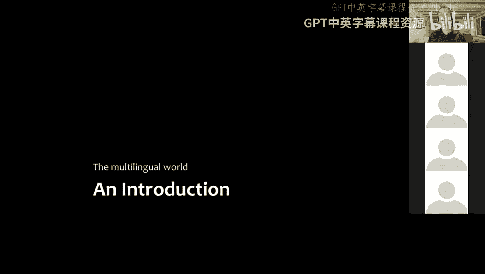
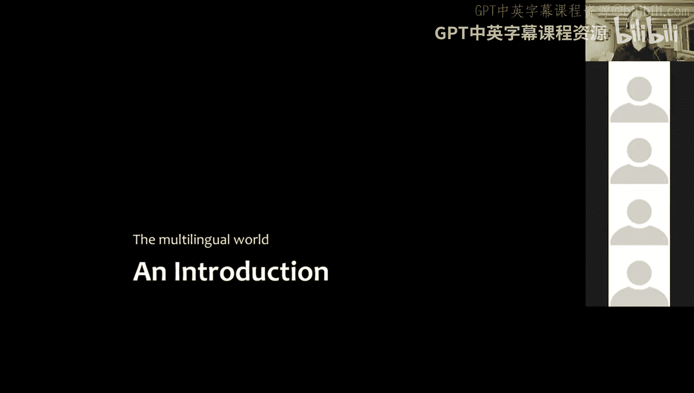
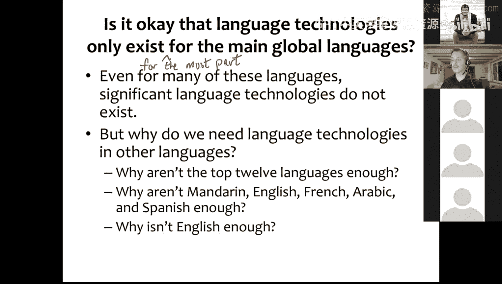
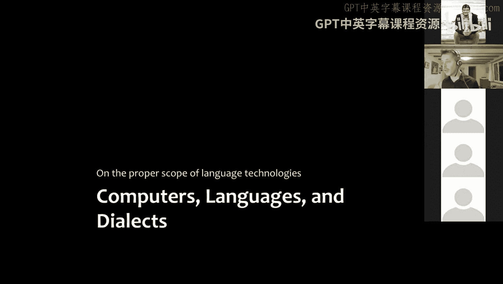
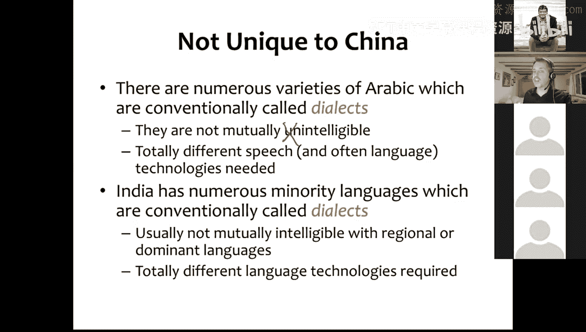
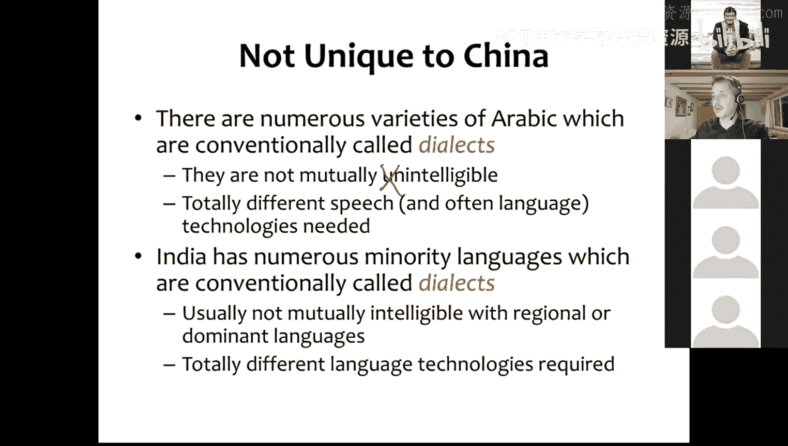
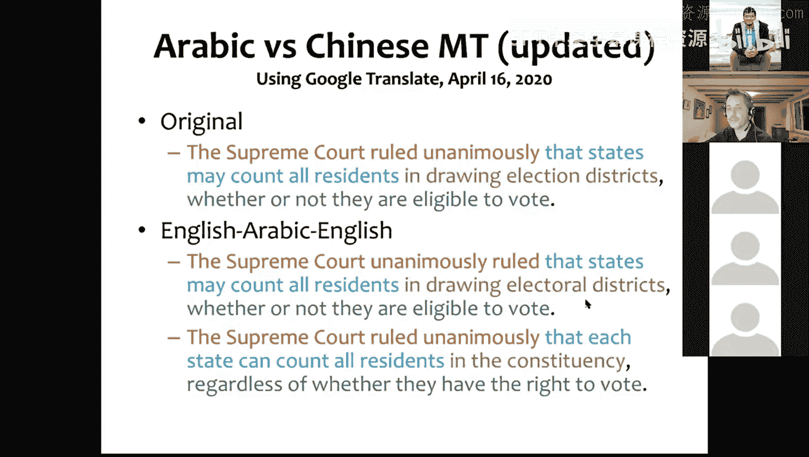

# 16：非英语语言的NLP 🌍

在本节课中，我们将探讨自然语言处理（NLP）在英语之外的语言世界中的应用。我们将了解全球语言的多样性、为不同语言开发技术所面临的挑战与机遇，以及为何需要关注资源匮乏的语言。

---

## 关于考试内容的说明

上一节我们介绍了课程的整体安排，本节中我们来看看关于期末考试的一个具体问题。

有同学询问关于多模态客座讲座（例如Transformer模型）的内容在期末考试中的占比。对于期末考试，你需要了解以下内容：

*   你需要知道Transformer是什么。
*   你需要了解不同神经网络架构的基本特性。这意味着你应该知道CNN（卷积神经网络）、RNN（循环神经网络）、LSTM（长短期记忆网络）以及Transformer是什么。

这并不意味着你需要能够完整描述它们的所有细节。但你应该知道这些架构是什么、它们各自擅长什么，以及它们的一些属性，例如可能的应用场景。

你确实需要掌握多模态客座讲座中的知识，考试中很可能会有题目大量涉及该讲座的内容。因此，你需要了解那些知识。

具体来说，你不需要能够绘制Transformer的示意图并讨论其背后的所有数学原理。但你应该知道注意力机制和自注意力是什么。如果你了解这些基础知识，就足够了。

---

## 多语言世界的NLP

在之前的课程中，我们主要讨论的是英语NLP。你的项目也是基于英语NLP，大多数讲座的例子也来自英语NLP。这不仅是因为我们是在英语语境下上课，英语是我们共享的通用语言，还因为大量的NLP研究是基于英语进行的。

例如，许多数据集仅存在于英语中，没有其他语言的等效数据集。因此，人们有时会假设，语言就是语言，如果一种解决方案对英语有效，那么它对任何语言都有效。所以只需要确保它对英语有效，其他语言的问题就微不足道了。

但事实并非完全如此，这也是我们今天要讨论的部分内容。当你超越英语NLP时，会遇到一些其他有趣挑战，同时也存在机遇。

---

## 世界的语言多样性

首先，根据一个名为Ethnologue的世界语言目录，世界上有超过7400种语言。这个数字是高于还是低于你的预期？

这取决于如何区分方言和语言，这是我们接下来要讨论的问题。方言与语言的区分，我们会发现这些术语被不同的人以不同的方式使用。当语言学家使用时，它们意味着一件事；当普通人使用时，它们意味着另一件事，并且这两者并不一致。

我们稍后会详细讨论。这里我们只讨论具有官方地位的语言吗？答案是否定的。就某些国家具有官方地位的语言而言，数量要少得多，只有几百种，而不是几千种。

那么，我们如何定义语言以回答之前的问题呢？在Ethnologue中，当他们确定什么是语言、什么是不同的语言时，他们使用了称为词汇统计学的方法。他们获取要比较的每种语言变体的词汇列表，如果任何两种变体之间同源词（显然具有相同起源的词）的数量超过某个阈值，那么我们就说这些不是不同的语言，而是同一语言的方言。如果低于该阈值，那么我们就说这些是独立的语言，是不同的语言的方言。

有时这些决定并非如此明确，但这是理想的方法论。所使用的核心标准是**相互可懂度**。如果两种语言变体是相互可懂的，即只懂这些变体的人可以在没有事先接触的情况下相互交谈，那么我们会说这些不是独立的语言，而是同一语言的方言。

例如，美式英语和英式英语是不同的，事实上，有许多不同的英式英语变体。但标准英式英语或标准发音与美式英语，如果我们让两个从未接触过对方语言的人共处一室，他们可以相互交谈。因此，我们会说美式英语和标准发音是同一语言的方言。

但是，说英语的人和说荷兰语的人则不会处于同样的情况，尽管荷兰语和英语关系相当密切，但仍然差异很大，荷兰语使用者和英语使用者在没有事先接触的情况下可能只能理解大约5%。我们稍后会回到这个问题，但这对语言技术来说很重要，因为方言需要一些特殊处理。而当你遇到完全独立、相互不可懂的语言时，你通常需要完全独立的模型、完全不同的数据等等。

这是一张世界语言地图，每个绿色小点代表一种语言。你会看到，在北美，英语是一个点（在英国，不在北美）。北美有许多原住民语言，其中大多数正在消亡，所以它们是非常小的语言。中美洲和南美洲有更多语言。非洲有大量语言，西非和中非的密度非常高。与中东、欧洲等地相比，印度有高密度的语言。东南亚有很多语言。而根据Ethnologue的定义，语言密度最高的地方是新几内亚，那里大约有世界四分之一语言。

世界上有很多语言，许多语言集中在资金并不集中的地区。因此，许多语言被忽视了，特别是因为其中许多语言的使用者数量相当少。

但有些你可能没听说过的语言，却有非常多的使用者。世界上大多数人，在人类历史上，大多数人都说一种以上的语言。在座有多少人会说两种语言？至少两种。有多少人会说至少三种语言？很好。有多少人会说三种以上语言？所以大约有四、五个人会说超过三种语言。

你都会说哪些语言？英语、印地语、卡纳达语和泰卢固语。这些都是大语言，都有很多使用者，我认为了解它们都很有用，特别是在印度南部。或者印地语，如果你在印度任何地方或印度侨民社区。

大多数人会说一种以上的语言，人类历史上大多数人都会说一种以上的语言。这里有一个我过去研究过的语言的例子，这种语言叫Koktai。Koktai的使用者主要居住在印度东北部曼尼普尔邦Ukhru区的一个叫Koktai的村庄里。

说Koktai的人在家里说这种语言，但在家庭或村庄生活之外基本不说。如果他们想与同属一个民族群体的邻近村庄的人交谈，他们会说一种相关的语言叫Tangkhul。Koktai和Tangkhul有时被称为那加语言，尽管这个类别意义不大，但由于历史原因，它们有时被这样称呼。

在高中阶段，Ukhru区的人，比如Koktai村的人，接受Tangkhul语的教育，这也是他们在教堂使用的语言，因为大多数Koktai使用者，实际上我认为所有Koktai使用者都是基督徒，他们大多属于美国浸信会教派。因此，他们的教堂服务不是用Koktai进行，而是用Tangkhul。

但他们生活在曼尼普尔邦。曼尼普尔邦的主要民族群体是梅泰人或曼尼普尔人，他们说一种与Tangkhul和Koktai有远亲关系的语言，叫梅泰语，这是曼尼普尔邦的官方语言。因此，在官方事务、高等教育中，例如，如果他们去曼尼普尔大学，教学语言将是梅泰语和英语。

但Koktai村的人不仅是一个区、一个邦的一部分，也是印度的一部分。实际上，他们中的许多人希望自己不是印度的一部分，因此他们进行了长期的叛乱，试图争取自治或独立。由于这个原因，曼尼普尔邦那个地区有很多印度士兵试图镇压叛乱，因此人们与许多士兵接触，并用印地语与这些士兵交谈。这也是他们与印度其他地区联系的主要方式。

因为Koktai村的人大多是美国浸信会教徒，所以他们与美国有联系。他们从美国接收传教士，派人到美国接受神学培训，这就是我遇到Koktai使用者的方式。他们也是国际社会的一部分，因此他们说英语，或者如果他们受过更多教育，许多人会说英语。

因此，对于生活在Koktai村的人来说，能够用所有这些不同的语言进行交流，并在不同语境中使用它们，并不罕见。事实上，这是普遍情况。

---

## 什么是全球语言？

这里的问题是，什么是全球语言？我会将其定义为一种你可能在学校（比如大学）学习的语言，一种你可能会学习的语言，不是作为专门的研究对象，而是作为通识课程的一部分。例如，主要是普通话、英语、法语、阿拉伯语、西班牙语、俄语、葡萄牙语、日语、德语、意大利语，现在还有韩语和土耳其语。我们可能还会加上印地语，因为越来越多的印度以外的人在学习印地语。

与汉语普通话相比，印度以外的人学习印地语的动力较小，因为印度有很多人说英语。如果你想去印度或与印度人交流，你只需要用英语。但印地语是另一种巨大的语言。

讨论所有这些的目的是为了谈论语言技术，谈论NLP。如果你想为你的语言拥有NLP，你希望提供哪些基本的东西，哪些技术给英语使用者、印地语使用者、梅泰语使用者、Tangkhul使用者，甚至可能是Koktai使用者（尽管它只是一个村庄，为一种只有几千人使用的语言开发语言技术相当困难）？

如果你说一种目前还没有什么语言技术的语言，你会想要什么？你想要哪些NLP功能？

以下是可能的需求：

*   **翻译**：翻译成或从更广泛使用的语言进行翻译，可能是指语音翻译，实现语音到语音的翻译。或者是指不仅适用于正式书面散文，也适用于口语对话或该语域的翻译。
*   **语音技术**：自动语音识别（ASR）、语音合成。
*   **机器翻译**：翻译成英语或其他全球语言，以及从这些语言翻译过来。
*   **语言建模**：语言模型有助于判断语言中可能的序列，这在许多语言技术中使用，例如语音识别、统计机器翻译。它也用于智能手机的预测文本输入、自动完成功能。
*   **输入法**：良好、易用的输入方法，如语音转文本、适合该语言的键盘。
*   **拼写检查**：如果人们要用该语言生成文档并保持拼写一致，则需要拼写检查。
*   **语法检查**：某种程度的语法检查。
*   **大型语料库**：拥有大型语料库是前提条件，但语料库本身不是技术，而是开发技术的基础。对于小语种，收集足够数据来训练好的语言模型或做其他事情通常是一个限制因素。
*   **信息检索和搜索引擎**：能够进行信息检索。
*   **词法分析**：处理语言的形态。
*   **问答系统**：与信息检索在很多情况下相关。

这些都是人们日常使用的东西。在这些功能之下，你需要为语言开发许多其他东西才能使一切正常工作。

以下是需要开发的基础设施：

*   **语言检测**：非常重要，例如在汇集数据集合时，你需要知道哪些数据是目标语言。
*   **词性标注**：我们在这门课中稍微涉及过。
*   **句法分析**：现今尤其指依存句法分析，可能需要产生依存树库。
*   **语义角色标注**：可能需要的。
*   **命名实体识别**：这对很多事情都有用，尽管用户不会直接下载NER应用到手机上，但它支撑着许多其他功能。
*   **文本摘要**。
*   **机器翻译**（再次提到）。
*   **信息抽取和问答系统**。

公司和政府使用所有这些来构建第一页提到的功能。但为了让一切正常工作，你必须建立大量的基础设施。

长期以来，为新语言创建语言技术最令人烦恼的事情之一是字符编码。如果你年纪稍长，你会记得有一段时间，每种语言都有自己的字符编码，因为你只能在一套编码中表示128或256个字符。因此，你必须为每种语言使用不同的编码和相应的字体，字体渲染也很差，生活很糟糕。我花了太多时间尝试在不同编码之间转换数据，比如中文的大五码和国标码，或者越南语的不同编码。

然后Unicode出现了，它解决了许多这些问题。现在，当有一种语言在Unicode中还没有得到很好支持时，有一个系统的过程可以将其添加进去。Unicode现在涵盖了世界上大多数文字系统，你可以用Unicode书写世界上几乎所有现存的文字，这是一项伟大的成就，我们都应该感激。

有同学提出了一个非常重要的问题：如果一种语言没有文字怎么办？有些语言根本没有自己的文字，或者没有任何文字书写系统。有人研究过为没有文字的语言开发纯粹基于语音的语言技术。基本上，你可以使用非文字的文本表示，比如音素层面的表示。但开发一种文字实际上要容易得多。如今，当你创造一种新的书写系统时，大多数时候你会使用罗马字母、西里尔字母或一种邻近大语言的书写系统（如果兼容性足够好）。因此，你可能需要一种用Unicode表示的方式，需要字体和字体渲染技术，然后，正如前面提到的，需要输入法。

如果你只说英语，你可能不理解这有多重要。你需要一种输入语言的方式，无论是通过键盘、语音还是其他方式。

另一个非常重要但人们有时不会想到的事情是，你需要**标准的正字法**，即标准的拼写系统，标准的书写系统。在我参与的一个DARPA项目中，我们为埃塞俄比亚最大的语言奥罗莫语开发NER、信息抽取和机器翻译。但奥罗莫语不是埃塞俄比亚的官方语言，在2000年代之前，它没有官方的正字法或书写系统。自1970年代以来有一种非官方的正字法，但并未标准化。因此，人们在何时写双元音、何时写双辅音上意见不一，人们只是按照听到的来写，并且存在方言变异。拼写上的大量变异使得技术开发变得困难。

为什么没有标准正字法会使开发技术具有挑战性？原因如下：

*   如果拼写不同，你可能无法识别同一单词的不同实例。
*   想象一下，你正在构建一个N元语言模型，一切都会被搞乱，因为实际上是同一个单词的实例被不同地书写，导致欠泛化，并可能导致稀疏性问题。
*   不仅对于语言建模，对于其他任务也是如此，因为有时一种拼写很少出现，看起来有很多不同的单词，但实际上只是几个单词，只是有很多不同的拼写方式。
*   你的表示是稀疏的。
*   你错过了这些单词具有相同语义的泛化，因为它们拼写不同。这会给任何你训练的模型注入表面噪音。

因此，标准化你的正字法，让一些当地人来教人们正确拼写，将使开发语言技术变得容易得多。

然后，最困难的部分可能是获取足够的文本或语音数据来训练模型，这取决于你试图训练哪种模型，可能需要大量数据。

---

## 语言技术的分布现状

以下是一些语言，这些实际上是世界上按母语者数量排名的前20种语言，从大到小排列。我想让你们告诉我，你们认为其中哪些语言可能拥有我们上面列出的大部分语言技术。

以下是可能拥有较好语言技术的语言：

*   联合国语言：英语、法语、俄语、西班牙语、汉语普通话、阿拉伯语。
*   印地语。
*   韩语。
*   德语：德国GDP高，资源丰富，也是欧盟主要语言之一。实际上，任何欧盟语言由于欧盟的补贴，其语言技术的发展程度可能超过其使用者数量所预期的水平，因为在这方面投入了大量资源。
*   葡萄牙语：葡萄牙在欧盟，巴西是一个大国，还有其他国家说葡萄牙语，如安哥拉和莫桑比克，尽管这可能不是它们拥有较好语言技术的原因。欧盟因素和葡萄牙、巴西作为人口大国（现在是中等收入国家）都有贡献。

让我们看看对每种语言技术发展程度的评估，你会发现我们基本上是对的。例如，葡萄牙语有相当程度的发展，尽管不如西班牙语。俄语、日语、法语、韩语，以及在某种程度上德语，都有良好的语言技术。

但为什么呢？你会注意到一些顶级语言中有些没有太多语言技术，孟加拉语、旁遮普语、泰卢固语、马拉地语和泰米尔语有什么共同点？

有同学说，任何其他印度语言都被印地语作为更可能被投资的通用语言所掩盖。这无疑是事实，对印地语技术的投资要多得多，资源被投入到印地语而不是这些其他语言中，尽管它们有数百万的使用者。例如，孟加拉语按母语者计算是世界第七大语言，但它的语言技术非常薄弱。我做过一些孟加拉语NLP工作，有很多文本数据，但除此之外的工作不多。

除了印地语因素，还有英语因素。当印度的中产阶级使用电脑时，他们使用母语的频率如何？他们使用英语的频率如何？根据经验，几乎总是英语。部分原因可能是大多数教授NLP等课程的高等教育机构是用英语授课的。但很大程度上是因为受过教育的印度人习惯于使用英语技术，并利用所有现有的英语技术。即使在印度开发语言技术，也常常是针对英语，因为市场被认为在那里。

现在，大多数印度人是否希望一直说英语并只使用英语电脑？根据我的非正式调查，可能不是。但受过教育的人习惯于使用英语，而且这样更容易，你不需要复杂的输入法。

另一个可能重要的因素是，许多印度语言在互联网上有时使用罗马化拼写，而不是其标准的书写音节文字。主要问题是，人们很难输入天城文或其他印度文字。他们必须有特殊的输入法，而且很难习惯，通常无法在普通笔记本电脑或台式机上轻易买到专门支持这些正字法的键盘，而且人们可能也不想要，因为他们也想使用英语。因此，为了绕过这个问题，人们为不同的正字法开发了罗马化方案，用英文字母、罗马字符输入这些语言的方式。

这实际上不是问题，只要人们遵守标准化约定，这可以作为良好NLP的基础。你甚至可以自动在标准正字法和罗马化之间转换。问题在于缺乏标准化和公认的约定。

但我认为，随着技术，特别是语音技术（与不一定识字或文化程度不高的人相关）的普及，随着低成本智能手机等的普及，对这些其他语言的语言技术市场的吸引力将真正扩大，人们将习惯于使用英语或这些主要全球语言之外的语言的技术。

那么，语言技术主要只存在于主要的全球语言中，这可以吗？即使对于许多这些语言，也存在尚未开发的重要语言技术。

为什么我们需要其他语言的语言技术？为什么前12种语言不够？为什么英语不够？难道不能每个人都只使用英语的语言技术吗？我们应该担心这个问题吗？

以下是支持为其他语言开发技术的论点：

*   **社会和文化的理由**：希望防止许多语言的灭绝，缺乏语言技术会加速灭绝，因为缺乏日常生活的便利性和使用。并非所有人都被前12种语言覆盖，特别是在欠发达地区。
*   **道德论点**：我们希望每个人都能获得语言技术。
*   **文化论点**：我们希望保护语言和文化，为它们提供语言技术是促进其发展、帮助其与使用者保持相关性从而不至于灭绝的一种方式。
*   **经济论点**：即使你覆盖了前12种左右语言的使用者，世界上仍有大量的人不把这些语言作为母语。这是一个潜在的市场。随着硬件成本降低、数据连接成本降低，向说这些语言的人销售语言技术的机会变得更大。
*   **政府与安全需求**：政府通常也对低资源语言的语言技术感兴趣，例如用于识别错误信息、发现预谋犯罪等。美国政府就是如此，这也是他们资助我为低资源语言工作的原因，以便能够与主要说这些低资源语言地区的人交流，收集和处理信息，建立世界动态模型。

因此，实际上有很多理由想要为低资源语言开发语言技术。

---

## 方言与语言：术语的挑战

我们稍微谈了一下方言和语言。在中国，有非常多的语言变体，人们以差异巨大的方式说汉语。这包括标准普通话、其他官话变体、上海话和其他吴语变体、粤语和其他粤语变体、客家话和其他闽语变体，以及其他语组变体，如晋语、赣语、湘语等。

如果你问一个中国的普通人或语言学家关于这些变体，他们会称之为“方言”。而“方言”在英语中通常被翻译为“dialect”。但它与语言学家使用的英语术语“