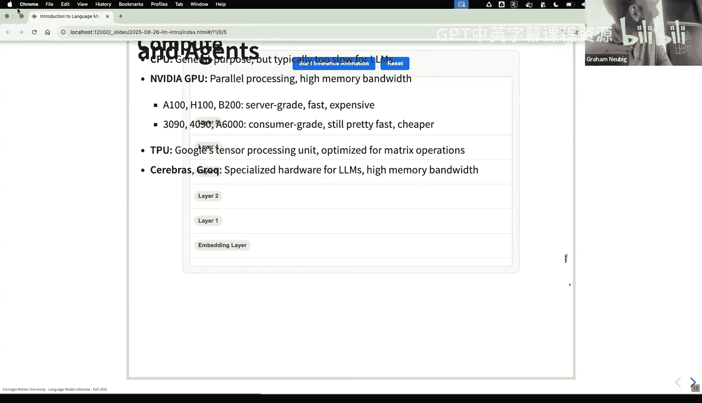
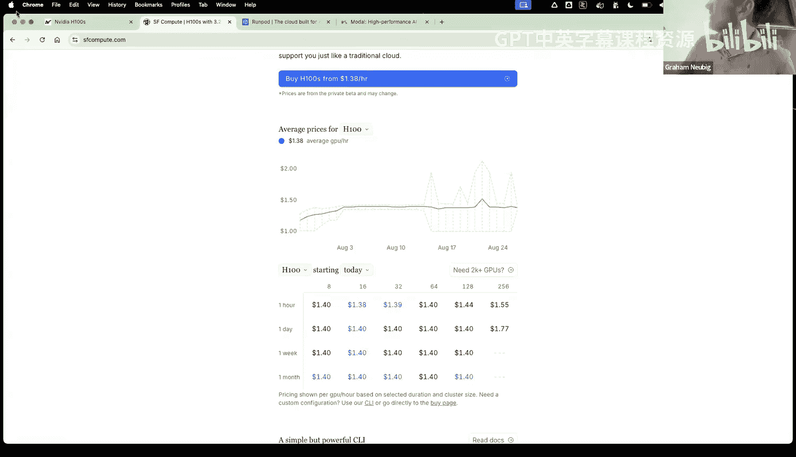
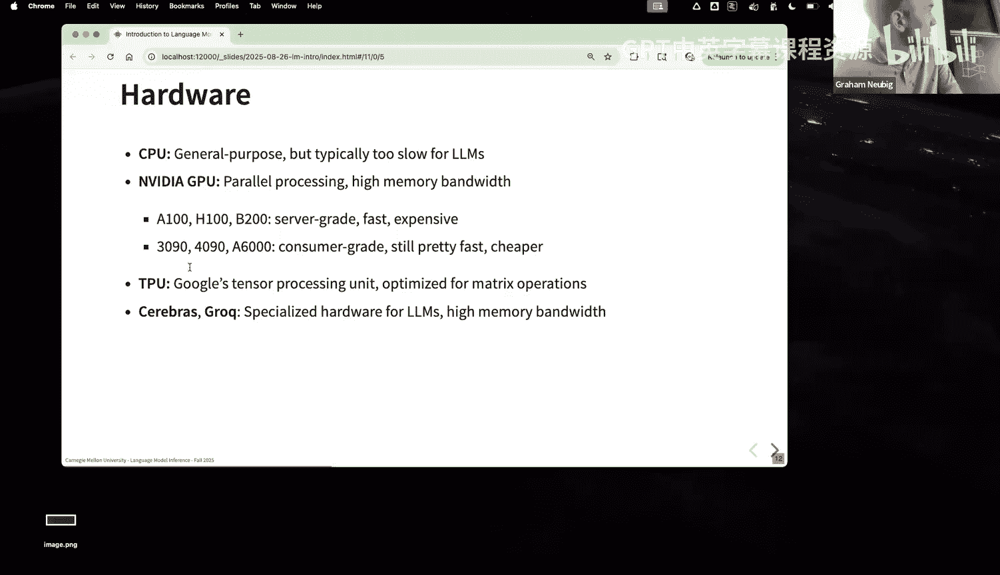

# 1：语言模型与推断导论 🧠

在本节课中，我们将要学习语言模型的基本概念、其工作原理，以及为什么推断（Inference）过程与训练过程存在显著差异。我们将从模型定义开始，逐步深入到推断的计算成本、硬件考量以及不同的生成策略。

---

## 语言模型基础

语言模型的核心是为一个由词元（Token）组成的序列分配概率。对于一个序列 **x**，其概率可以表示为 **P(x)**。在大多数现代应用中，我们讨论的是自回归（Autoregressive）模型。

自回归模型将序列的概率分解为一系列条件概率的乘积。具体公式如下：

**P(x) = P(x₁) * P(x₂ | x₁) * P(x₃ | x₁, x₂) * ... * P(x_L | x₁, x₂, ..., x_{L-1})**

这意味着模型逐个预测下一个词元，每次预测都基于之前所有已生成的词元。这是当前大型语言模型（如GPT系列）的主要工作方式。扩散模型（Diffusion Models）是此规则的一个主要例外，它们采用不同的推断算法，我们将在后续课程中单独讨论。

---

## 无条件生成示例

为了理解模型的行为，我们可以观察其无条件生成（即仅给定起始词元）的结果。例如，使用一个较小的模型（如Qwen2-1.7B）从句子起始词元生成文本，我们可以将结果分为高、中、低概率序列。

*   **高概率序列**：通常是极短的序列，如“...”、“0 0 )”等。这是因为概率是多个小于1的数值相乘，序列越长，总概率值通常越低。
*   **中概率序列**：可能包含一些代码片段或数学表达式。
*   **低概率序列**：可能包含其他语言（如中文）或更复杂、更长的句子。

这个练习表明，单纯追求高概率输出并不总能得到对人类有用或有趣的文本。

---

## 条件生成与提示工程

在实际应用中，我们几乎总是进行**条件生成**。我们给定一个前缀或提示（Prompt），让模型生成后续的补全（Completion）或回应（Response）。

数学上，这相当于在自回归分解中，固定前缀部分的条件概率。例如，给定提示“The best thing about Carnegie Mellon University is”，模型会生成各种可能的补全，如“computer science”、“its community”、“its location...”等。

我们注意到，较短的补全通常具有较高的模型概率，但这不一定等同于“更好”或“更相关”的回答。因此，我们需要在模型概率和输出质量之间进行权衡。

---

## 模型架构与计算成本

目前，绝大多数高性能语言模型都基于**Transformer架构**，特别是仅包含解码器（Decoder-only）的变体，例如GPT系列。其核心组件包括：
1.  嵌入层（Embedding）与位置编码（Positional Encoding）。
2.  掩码多头自注意力层（Masked Multi-Head Self-Attention）。
3.  前馈网络层（Feed-Forward Network）。
4.  层归一化（Layer Norm）和线性预测层。

从推断效率的角度看，计算成本主要来自两个部分：

1.  **自注意力机制**：其成本包含与序列长度**L**成线性关系的部分（Q/K/V投影），以及一个与**L²**成二次关系的关键部分（计算注意力权重）。
2.  **前馈网络**：其成本与序列长度**L**成线性关系。

对于一个具体模型（如Llama 3.1 405B），当上下文长度较短时（例如1k），前馈网络的计算量占主导。但随着上下文长度增长到模型上限（如128k），注意力机制的二次成本部分将变得极其昂贵，成为推断的主要瓶颈。

**计算公式示例（分组查询注意力）**：
*   注意力线性部分 FLOPs ≈ `4 * L * D_model * D_model`
*   注意力二次部分 FLOPs ≈ `2 * L² * D_model`
*   前馈网络 FLOPs ≈ `2 * L * D_model * D_ff`，其中 `D_ff` 通常是 `D_model` 的3-4倍。

---

## 训练与推断的差异

理解训练和推断的差异对于优化至关重要。

*   **训练**：目标是学习模型参数。我们使用大量文本数据，进行前向传播计算损失，再通过反向传播更新参数。这个过程可以处理大批量数据，并能高效饱和GPU的计算能力。
*   **推断**：目标是给定提示生成文本。这是一个**自回归**的过程，需要反复调用模型以逐个生成词元。每次生成步骤都可能无法充分利用GPU的并行计算能力，并且存在固定的调度开销，导致计算效率通常低于训练。

关键区别在于，推断时我们无法预先知道所有要生成的词元，因此无法像训练那样一次性计算整个序列的表示。

---

## 基本生成算法

最基本的生成算法框架如下：
1.  初始化输出序列为给定的提示。
2.  当未达到停止条件（如生成结束符或达到最大长度）时，循环：
    a. 将当前序列输入模型，获得下一个词元的概率分布。
    b. 根据某种策略（如采样或搜索）从该分布中选择下一个词元。
    c. 将该词元追加到输出序列中。

这个框架衍生出两大类方法：
*   **采样（Sampling）**：从模型输出的概率分布中随机抽取下一个词元。这能产生**多样性高**的输出，但可能牺牲一致性或质量。
*   **搜索（Search）**：试图找到在某个评分标准下（不一定是概率）最优的输出序列。例如**贪婪搜索**（每一步选概率最高的词元）和**束搜索**（Beam Search，同时保留多个候选序列）。搜索通常能产生**质量更高、更一致**的输出，但多样性较低。

---

## 元生成算法与潜在变量

有时，生成单个序列不足以达到最佳效果，因此出现了**元生成算法**。这类算法将生成过程本身作为一个子程序来调用。

一个常见的例子是**重排序**：
1.  使用模型生成多个候选序列。
2.  使用另一个（可能相同的）模型或评判标准为这些候选序列打分。
3.  选择得分最高的候选作为最终输出。

另一种重要概念是引入**潜在变量**，例如**思维链**。模型在输出最终答案前，先生成一系列中间推理步骤。这能显著提升复杂任务的准确性，但也带来了新的推断挑战：
*   **效率**：生成更长的中间文本会增加延迟。
*   **评估**：我们可能只关心最终答案，而不展示中间步骤。这催生了如**自洽性**等方法，即生成多个推理路径，然后选择最一致的答案。

---

## 评估、搜索错误与模型错误

我们通常不满足于高概率输出，而是追求在某种评估标准下的“好”输出。评估标准可以是人类偏好、另一个LLM的评判（LLM-as-a-judge），或针对特定任务的确定性指标（如数学答案的正确性）。

在优化输出时，需要区分两类错误：

1.  **搜索错误**：你的生成算法未能找到模型评分最高的输出。例如，贪婪搜索可能错过全局更优的序列，而束搜索能找到更好的。**解决方法**是改进推断算法（如使用更强大的搜索方法）。
2.  **模型错误**：模型本身的评分函数与你的评估标准不一致。即模型认为概率高的输出，在实际评估中得分反而低。**解决方法**通常是改进模型训练（使其评分更符合人类偏好），但也可以通过调整推断算法（例如，故意不选择模型最高分的输出）来规避。

---

## 硬件与效率考量

高效的推断离不开对硬件的理解。主要硬件平台包括：
*   **CPU**：通用计算，线程并行度低，不适合大规模神经网络推断。
*   **GPU**（特别是NVIDIA系列）：当前的主流选择，具有高度的并行计算能力和成熟的软件生态。
*   **专用硬件**：如Google的TPU，专为矩阵运算设计，具有高内存带宽和快速互联。

对于本课程实践，我们建议使用现有计算资源、云平台（如AWS、Google Colab）或GPU租赁市场（如RunPod）来获取必要的计算能力。

---

## 课程路线图与总结

本节课我们一起学习了语言模型和推断的基础。在后续课程中，我们将深入探讨以下主题：

1.  **生成算法**：各种采样与搜索方法，如束搜索、A*搜索。
2.  **推理与智能体**：思维链、工具使用、多智能体通信。
3.  **元生成与扩展**：重排序、最小贝叶斯风险、用计算时间换取性能。
4.  **效率与系统优化**：KV缓存、推测解码、模型压缩、替代架构（如MoE, Mamba）。

通过本课程的学习，你将能够理解并实现高效的语言模型推断策略，以平衡输出质量、多样性、延迟和吞吐量等多个目标，为构建实用的语言模型应用打下坚实基础。