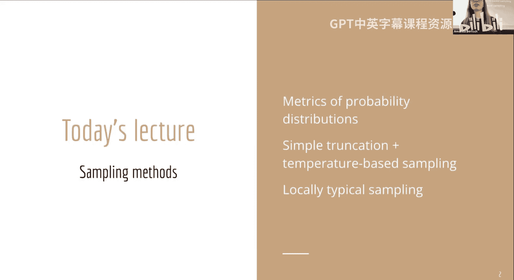
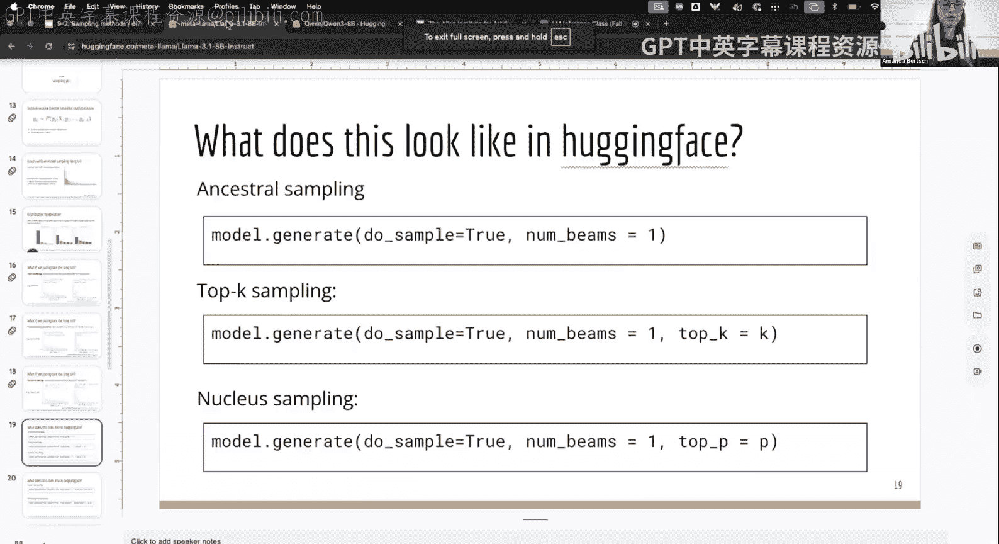
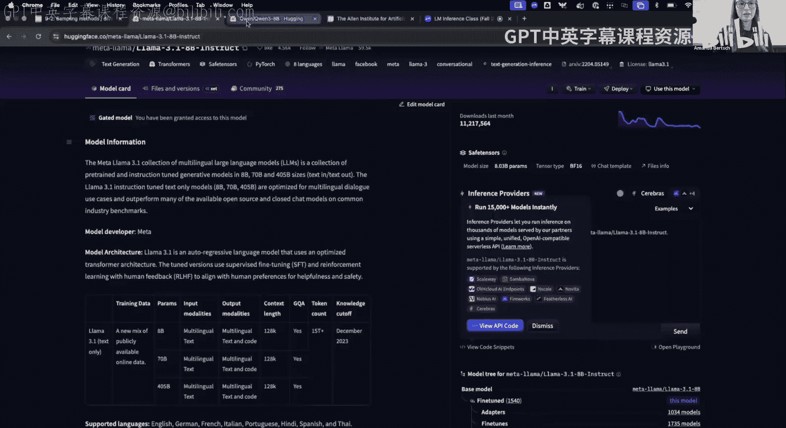
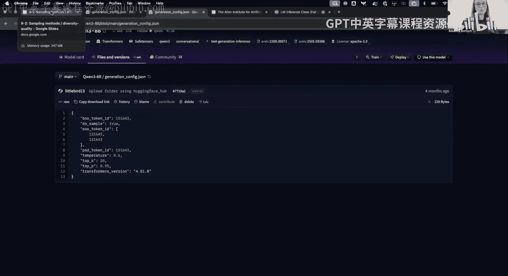
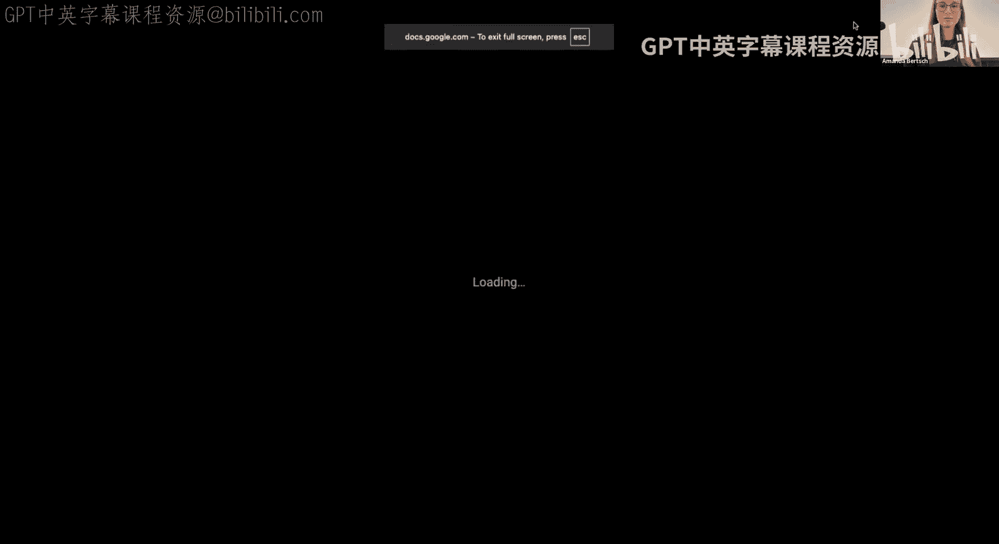
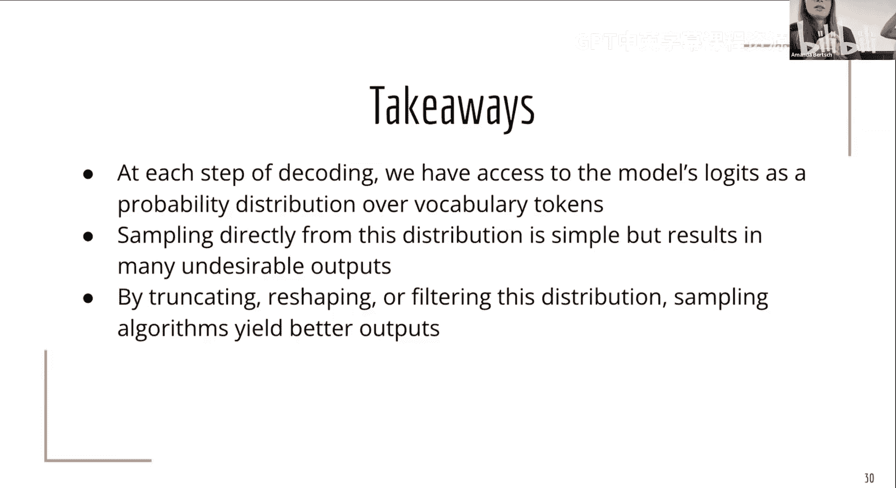
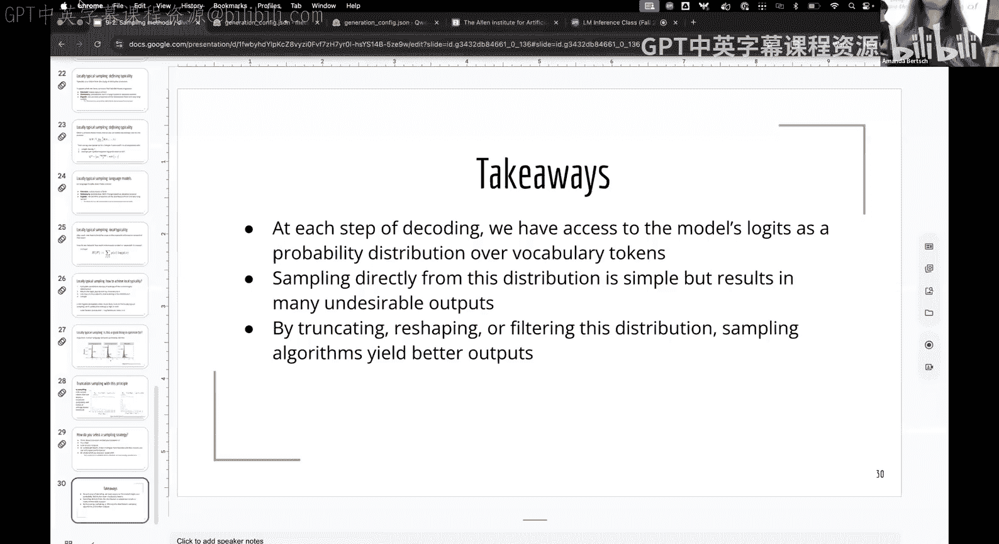

# 3：常见采样方法

在本节课中，我们将学习如何从语言模型的概率分布中进行采样。我们将从模型作为概率分布的基本概念开始，然后探讨几种常见的采样方法，包括简单的截断采样、基于温度的采样，以及一种更复杂的、利用概率分布度量进行采样的方法。

## 模型作为概率分布

正如我们在第一节课中提到的，我们可以从几个不同的框架来思考模型。至少对于今天的内容，我们采用的框架是：**模型就是一个条件概率分布**。我们暂时不关心这个分布是如何得到的，我们只知道，给定一些输入和先前的输出标记，在每个步骤中，我们都有一个覆盖词汇表空间的下一个标记的分布。

在这个定义下，我们可以对这个分布做一些说明。首先，我们今天讨论的模型是**局部归一化**的。这意味着在每个步骤中，我们都会得到该步骤标记的分布，而不是在每个步骤得到一个可能不是分布的东西，然后在解码结束时再进行归一化。

局部归一化的一个特点是，随着我们添加更多标记，序列的总体概率会单调非递增。这也意味着，如果你从一个看起来不太好的前缀开始，后面无法再“添加”回概率质量。例如，解码“2023年的美国总统是”时，续写“约瑟夫·拜登”可能看起来是一个合理的输出。但即使另一个续写“巴拉克·奥巴马的前副总统”在语义上更连贯，在局部归一化模型中，后者的总概率也可能不会超过前者，因为模型已经为“约瑟夫·拜登”分配了相对较高的初始概率。

与局部归一化相对的是**全局归一化**模型，它在每个步骤产生一个分数，这些分数可以大于1，从而允许序列后期“提升”某些候选序列的概率。我们使用局部归一化主要是因为它训练起来简单快速。然而，当我们想在推断时施加全局约束时，就需要更多思考。实际上，本学期后续讨论的许多方法，都是在尝试对仅经过局部归一化训练的模型施加全局约束。

## 概率分布的特性

除了归一化方式，我们还关心概率分布的其他特性。其中一个重要特性是**校准**。我们说一个模型是校准的，如果模型的置信度分数与正确答案的概率有良好的相关性。例如，对于一个多选题，如果模型将50%的概率质量分配给选项B，那么我们希望在50%的情况下B确实是正确答案。这样，我们就可以直接将模型的逻辑值作为置信度的度量。

预训练模型，如果训练数据质量好，其似然性与真实性（或该答案为真的可能性）的对应关系通常比较合理。然而，当我们进行像RLHF这样的后训练步骤时，虽然输出质量通常更好，但会破坏模型的校准特性。因此，对于经过后训练的模型，其校准性没有太多保证。

另一个特性是，模型通常会在各种各样的事物上分配非零的概率质量。即使在有半明显事实的情况下，模型也会至少分配一些概率质量给不正确的输出。例如，模型不会将100%的概率分配给“2+2=4”。从机器学习理论来看，如果我们还希望模型保持校准性，那么完全消除这种“在非事实上分配概率质量”的特性是不可能的。

## 分布的计算与度量

现在，我们想计算分布的一些统计量，这些统计量对后面讨论的方法很有用。

第一个是分布的**熵**。我们通常在解码的单个时间步上计算，公式如下：
`H(p) = - Σ p(x) * log p(x)`
其中求和是在该时间步的词汇表空间上进行的。

熵高意味着分布更平坦、更均匀，我们需要更多信息（比特）来指定分布中的任何一个特定结果。熵低意味着分布非常尖锐（峰值很高），例如，如果100%的概率质量都集中在一个标记上，那么指定该分布的输出就只需要很少的信息。

我们不仅关心抽象的熵，还关心相对于某个真实分布的熵。这引出了**交叉熵**的概念。在语言模型中，我们通常关注下一个标记预测任务。我们查看训练文档中实际的下一个标记，并将其表示为一个独热向量（该标记为1，其他为0）。交叉熵的计算公式为：
`H(p, q) = - Σ p(x) * log q(x)`
其中 `p` 是真实分布（独热向量），`q` 是模型预测的分布。这实际上就是正确下一个标记的**负对数似然**。

如果你读过模型训练的论文，一定见过**困惑度**。困惑度就是2的交叉熵次方：
`Perplexity = 2^(H(p, q))`
困惑度有一个直观的解释：它表示如果你有一个面数为困惑度数值的骰子或硬币，你正确预测下一个标记的几率。例如，困惑度为6意味着模型预测下一个标记时，就像掷一个六面骰子，只有掷出1时才能预测正确。

## 基础采样：祖先采样

有了这个分布，我们想得到一些输出。最简单的方法是直接从分布中采样，这被称为**祖先采样**。具体来说，我们根据模型参数化的分布进行采样。

这样做的好处是，我们精确地恢复了模型分布。既然我们花费了大量努力来训练得到这个分布，直接从中采样似乎是合理的。

然而，直接对模型分布进行采样存在一些缺陷。我们今天将花最多时间思考的问题是**长尾问题**。现代模型的词汇表非常大（例如，Llama 3有128k个标记）。每个不在最合理的几百个候选内的标记都只有微小的概率，但这些微小概率累加起来非常快。可视化显示，概率质量分布中后50%的部分（即长尾）占据了总概率质量的一半。这意味着，在采样生成一段文本（可能需要100或200步）时，从这条非常长的尾巴中抽到一些非常奇怪内容的几率是相当可观的。

## 应对长尾：温度采样

为了解决长尾问题，我们看到了第一种方法：使用**温度**来重塑分布。温度参数 `T` 用于调整逻辑值（logits）的尖锐程度：
`logits_adjusted = logits / T`
- **温度 T = 1**：原始分布。
- **温度 T < 1**：锐化分布。概率峰值更高，长尾更平坦（即长尾概率质量更少）。这有助于减少采样到奇怪内容的几率。
- **温度 T > 1**：平坦化分布。增加了采样到原本概率稍低的标记的几率，从而可能产生更多样化的输出。

## 应对长尾：截断采样

另一大类方法是直接“切断”长尾。有几种常见的方式：

**Top-K 采样**：只从概率最高的K个标记中采样。根据概率分布的尖锐程度，这K个标记可能包含大部分概率质量，也可能只包含一小部分。例如，解码“the”之后，合理的后续标记很多，Top-6可能只包含68%的概率质量；而解码“the car”之后，合理后续较少，Top-6可能包含99%的概率质量。

**Top-P 采样（核采样）**：定义一个希望覆盖的概率质量总量（例如，90%），然后从最可能的标记开始，依次添加标记，直到累积概率达到该阈值。然后，在这个子集内重新归一化并采样。这种方法能动态适应不同时间步概率分布的尖锐程度。

**Epsilon 采样**：只截断那些概率小于或等于某个极小值 `ε` 的标记。如果所有标记的概率都至少达到某个合理值，则从完整分布中采样；否则，剔除那些概率过低的标记。

这些参数在像 Hugging Face 这样的库中很容易设置。但需要注意的是，不同模型可能有其默认的生成配置（例如，温度、Top-P值），这些默认值通常是模型提供商通过超参数扫描确定的，可能在该模型上效果较好。因此，在指定生成参数时，最好检查并覆盖你关心的设置。

## 局部典型性采样

以上是几种经典的解码算法。接下来，我们看一个更复杂、可能不那么广泛使用的方法，因为它提供了一个关于采样的不同思考角度。

首先，我们提出一个问题：假设我有一个不均匀的硬币，正面朝上的概率是60%。我连续抛掷100次，记录结果序列。所有可能序列中，**单个最可能**的序列是什么？答案是100次全是正面。但这会是抛掷这个硬币时令人惊讶的输出吗？是的。那么，**典型**的输出应该是什么样的？我们期望得到大约60%正面、40%反面的某种组合。

这就引出了**典型性**的概念：概率分布中**最可能**的事件，并不一定是该分布的**典型**代表。为了定义典型性，我们借鉴随机过程文献中的概念。我们将语言模型视为一个随机过程：在每个步骤，根据当前概率分布发射一个标记，然后以该标记为条件继续下一步。

要定义典型集，我们需要这个过程满足三个性质：离散性、平稳性和遍历性。如果满足这些性质，我们可以定义过程的**熵率**（平均每符号熵），然后定义长度为N、容差为ε的**典型集**：所有那些平均每符号负对数概率接近熵率的序列。

然而，语言模型满足这些性质吗？离散性（词汇表有限）是满足的。平稳性（概率不依赖于绝对位置，只依赖于条件）在有限上下文窗口的假设下可能成立。但遍历性要求可以从任何状态到达任何发射状态，而语言模型在生成序列结束标记（EOS）时会停止，EOS是一个“吸收态”，破坏了遍历性。

既然无法严格定义全局典型性，论文《Locally Typical Sampling》提出了一种局部近似的方法。其思想是：我们不要求整个序列平均接近熵率，而是要求**每个新标记的负对数概率接近当前时间步分布的熵**。

**局部典型性采样算法**步骤如下：
1.  计算当前时间步条件分布的熵 `H`。
2.  将逻辑值（或对数概率）按照其与 `H` 的接近程度重新排序（而不是按概率大小）。
3.  使用 Top-P 方法对这个新排序的分布进行截断（从最接近 `H` 的标记开始累积概率）。
4.  从截断并重新归一化的分布中采样。

这种方法可能不仅会截断长尾，甚至可能截断一些概率较高但远离熵值的标记。其动机来源于认知科学和信息论：人类语言的下一个标记，其信息量（负对数概率）往往接近当前语境下分布的熵。这样既能有效传递信息，又不会总是说最显而易见或最离奇的话。

与局部典型性采样追求特定信息量相对，还有一种称为 **Mirostat 解码** 的方法，它试图通过持续更新的方式，控制生成文本的最终困惑度接近一个预设值。

另一种结合了截断和典型性思想的方法是 **Eta 采样**。它同时设置基于 Epsilon 的阈值和另一个随分布熵移动的阈值（Eta），只保留概率大于 Epsilon 且对数概率在熵的 Eta 范围内的标记。

## 如何选择采样方法？

面对这么多采样方法，如何选择？遗憾的是，没有放之四海而皆准的答案。

1.  **考虑任务的开放性**：对于“写一个关于青蛙的创意故事”这类开放性问题，你可能更关心输出的多样性；对于“马萨诸塞州的首府是哪里”这类封闭性问题，你可能更关心准确性。
2.  **动手尝试**：这些方法在代码上改动很小，非常容易实验。可以在你关心的模型上生成一些样本进行观察。
    -   如果输出看起来重复或退化，可能是采样过于集中在头部。
    -   如果输出开始走向奇怪的方向，可能是采样到了长尾。
    -   如果采样100次得到的结果几乎相同，你可能需要增加多样性（例如，提高温度或增大Top-P）。
3.  **注意模型规模**：小模型和大模型的行为差异很大。小模型可能更易出现采样的病理现象，因此调参更重要。大模型通常对默认参数更鲁棒。
4.  **谨慎评估**：模型的性能可能随解码参数变化很大。如果你在评估模型（尤其是自己的模型），建议尝试一组参数，找到一个性能相对稳定的区域，然后在该区域内选定一套策略并标准化用于所有评估。过度调优每个评估任务的最佳解码策略，对于最终用户来说并不现实。

最后需要提醒的是，语言模型本身已经隐含地根据问题类型调整了其概率分布的形状（例如，数学问题分布更尖锐，创意写作分布更平坦）。在系统层面，根据用户提示类型动态调整生成设置也是一个合理的思路。

## 总结

本节课中，我们一起学习了从语言模型概率分布中采样的核心方法。我们首先将模型视为条件概率分布，并讨论了其局部归一化、校准等特性。然后，我们介绍了直接祖先采样及其长尾问题。为了解决这个问题，我们探讨了：
-   **温度采样**：通过缩放逻辑值来锐化或平坦化分布。
-   **截断采样**：包括 Top-K、Top-P (核采样) 和 Epsilon 采样，通过限制采样范围来避免长尾。
-   **局部典型性采样**：一种更复杂的方法，旨在使每个采样标记的信息量接近当前分布的熵，以生成更“典型”的文本。

选择哪种方法取决于具体任务、模型规模和对输出多样性/准确性的需求。最好的方式是通过实验来找到适合你用例的策略。