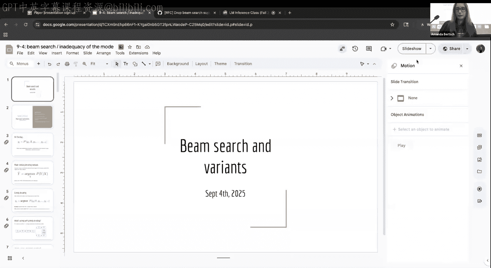
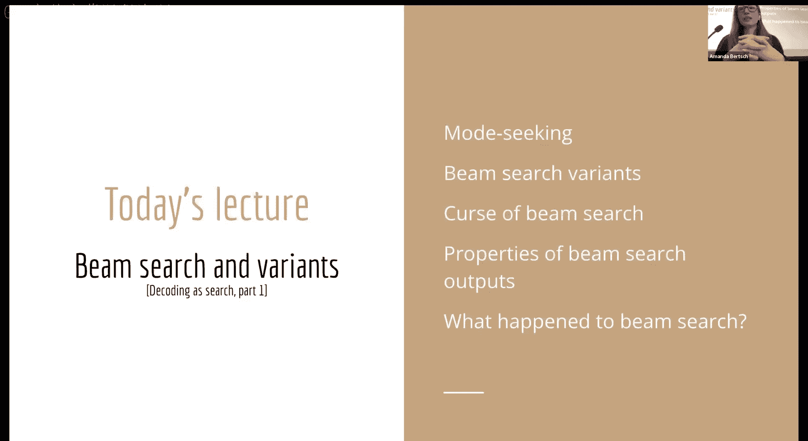
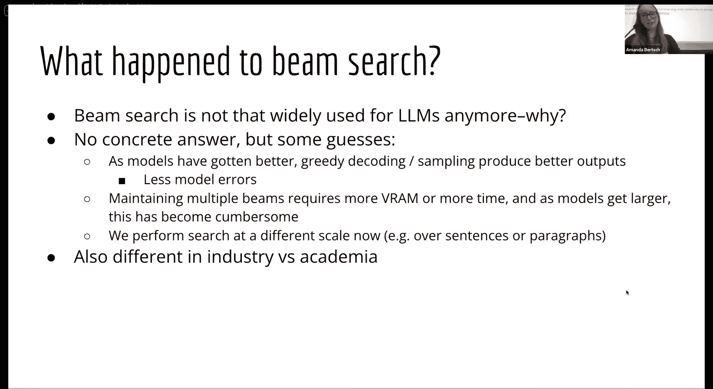
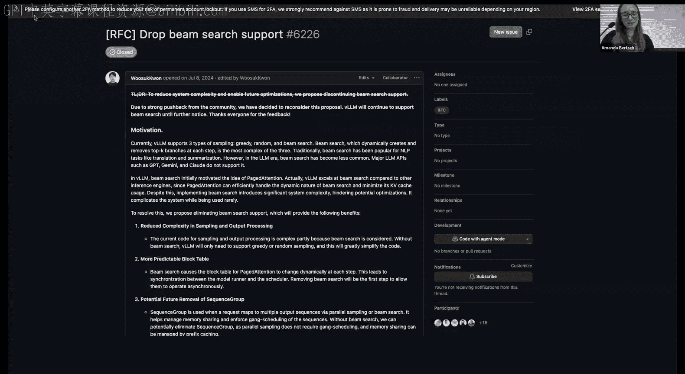
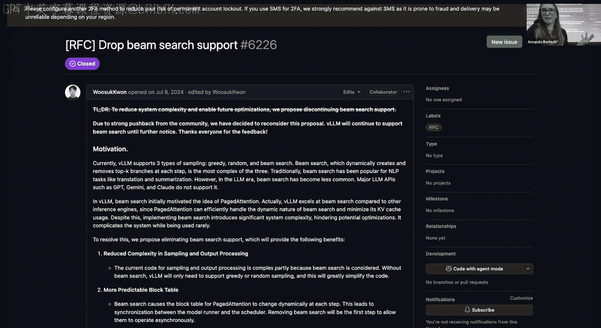
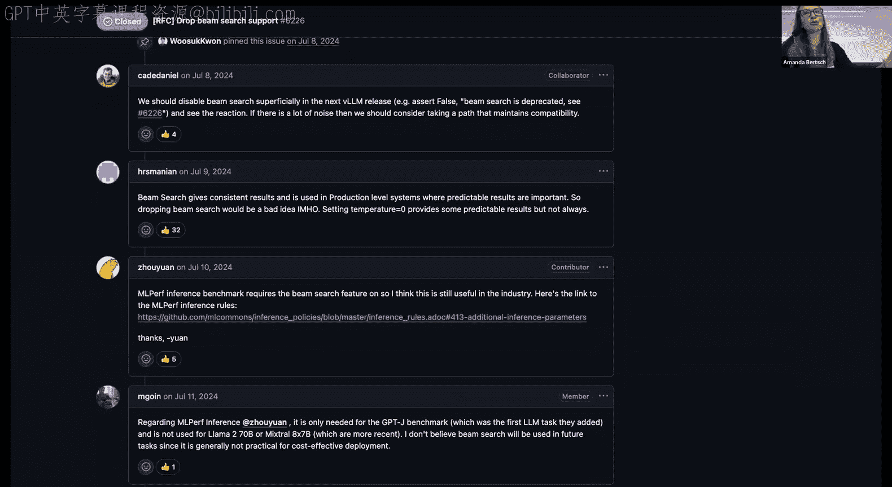
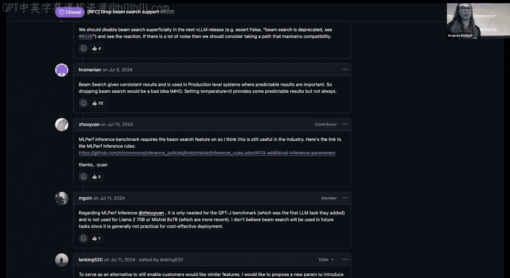
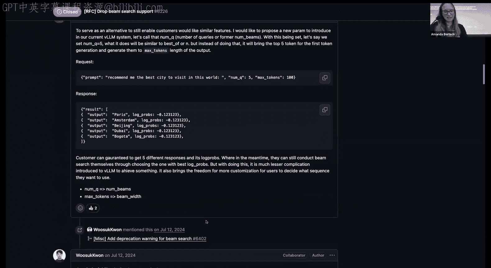

# 4：Beam Search及其变体 🧠

在本节课中，我们将学习一种称为“模式搜索”的解码方法，其目标是找到模型输出分布中概率最高的单个序列。我们将重点介绍Beam Search算法，探讨其工作原理、存在的问题以及几种旨在提升输出多样性的变体。

## 模式搜索与贪婪解码的局限

上一节我们介绍了基于采样的解码方法。本节我们将从更偏向优化的视角来看待解码问题：我们不仅希望获得模型的一个好输出，更希望找到给定模型参数下最可能的那个单一序列。这被称为**模式搜索**或**最大后验（MAP）解码**。

对于单步输出，找到概率最高的词元很简单，只需对逻辑值进行 `argmax` 操作即可。然而，对于多词元序列，情况就复杂了。

一种简单的基线方法是**贪婪解码**：在每一步都选择当前概率最高的词元。这种方法计算简单，但存在几个问题：

1.  **可能无法得到全局最高概率序列**：局部最优选择可能导致后续步的概率骤降，从而错过整体概率更高的路径。
2.  **容易陷入重复陷阱**：一旦模型开始重复某些词元，贪婪解码会不断强化这种重复，导致输出陷入循环。
3.  **可能产生不自然的句子**：为了优先选择高频词（如“the”），模型可能生成语序别扭的句子（如“The dog was seen by Jane”而非更自然的“Jane saw the dog”）。

因此，我们需要更智能的方法来近似找到序列的“模式”。

## Beam Search算法详解

Beam Search的核心思想是：为了避免因过早做出硬性选择而错过潜在的高概率路径，我们在每一步保留多个（K个）候选序列。这是一种宽度优先搜索的近似方法，通过扩展和剪枝来管理计算复杂度。

以下是Beam Search的步骤：

1.  **初始化**：设定**束宽（Beam Width）** K。根据输入前缀，选择概率最高的K个词元作为初始候选束。
2.  **迭代扩展与剪枝**：
    *   **扩展**：对于当前束中的每个候选序列，考虑其所有可能的下一个词元，生成K * V个新候选（V是词表大小）。
    *   **评分**：计算每个新候选序列的得分。通常使用序列的**对数概率**之和。
    *   **长度归一化**：由于序列概率随长度增加而单调递减，长序列在评分中处于劣势。因此，通常会对得分进行归一化，常见方法是除以序列长度（或长度的α次幂，α是一个超参数，称为长度惩罚）。
    *   **剪枝**：从所有扩展后的候选序列中，选出得分最高的K个，作为下一轮的候选束。
3.  **终止与输出**：当所有候选序列都生成结束符（EOS），或达到最大解码长度时，停止迭代。最后，从最终的K个候选序列中，选择（归一化后）得分最高的一个作为输出。

使用对数概率而非原始概率主要是出于**数值稳定性**的考虑，因为长序列的原始概率会变得非常小，接近零。

## 提升多样性：Diverse Beam Search

标准的Beam Search有一个缺点：其最终保留的多个候选序列往往非常相似，缺乏多样性。这在需要多种合理输出的场景（如图像描述）中是个问题。

**Diverse Beam Search** 旨在生成一组既高质量又多样化的输出。其核心思想是：将束分成G个组，依次解码每个组，并在解码后续组时，对与前面组相似的词元施加惩罚，从而鼓励多样性。

具体流程如下：

1.  第一组使用标准Beam Search解码。
2.  解码第二组时，在计算得分时加入一个**多样性惩罚项**，该惩罚基于第二组候选与第一组已解码内容的相似度。
3.  解码后续组时，惩罚基于与所有前面已解码组的相似度。
4.  为了高效计算，解码过程在时间上错开进行，总时间步数约为 T + G - 1。

多样性可以通过多种方式度量，例如：
*   **汉明多样性**：惩罚那些在前面组的活跃序列中出现过的词元。
*   **累积多样性**：仅当在同一时间步使用相同词元时才施加惩罚。
*   **N元语法惩罚**：惩罚匹配前面组中出现的完整N元语法片段。

在实践中，通常将组数G设置为束宽K，并在每组内进行贪婪解码（即每组束宽为1），这样能在多样性和质量间取得良好平衡。

## 另一种思路：Stochastic Beam Search

如果我们想要多样性，一个直观的想法是采样。**Stochastic Beam Search** 巧妙地将采样融入了Beam Search框架。它不是在扩展时选择Top-K，而是**采样K个**独特的词元，同时利用Beam Search的剪枝机制来保证输出质量。

实现高效无放回采样的关键在于 **Gumbel-Max Trick**。该技巧表明：若有一组随机变量 `X_i = Gumbel(logit_i, 1)`，即每个变量服从位置参数为`logit_i`、尺度参数为1的Gumbel分布，那么 `argmax(X_i)` 的分布恰好等于对 `logit_i` 做Softmax后的分类分布。这意味着，我们可以通过向逻辑值添加Gumbel噪声并取`argmax`来**采样**一个词元。

要无放回地采样K个词元，只需取添加Gumbel噪声后值最大的K个即可。然而，在Beam Search中，我们不能直接使用带噪声的得分进行剪枝，因为这可能导致序列得分随时间步增加而上升，违反概率单调性且影响长度归一化。

因此，Stochastic Beam Search在扩展时使用Gumbel-Max Trick进行采样，但在剪枝评分时，会对带噪声的得分进行修正，确保其不超过原始逻辑值的上限，从而在保持采样多样性的同时，维护了搜索的合理性。

## Beam Search的特性与“诅咒”

选择束宽K时面临权衡：K越小，解码越快、内存占用越少，但**搜索误差**越大，可能错过真正的高概率序列；K越大，越接近精确搜索，但计算成本更高。

然而，一个反直觉的现象是：在许多任务中，**增大束宽有时会导致下游任务性能下降**，这被称为 **“Beam Search的诅咒”**。对此有两种解释：

1.  **长度归一化问题**：更大的束宽可能平均倾向于生成更短的序列，而某些任务中短序列性能较差。调整长度惩罚参数可能缓解此问题。
2.  **模型分布的模式并非最优**：模型概率最高的序列（模式）可能并非人类最偏好的输出。存在一种 **“似然陷阱”**：人类更喜欢的输出可能接近但并非 exactly 是概率最高的那个。因此，Beam Search引入的搜索误差可能意外地成为一种有益的归纳偏置，将我们引向更受人类青睐的区域。

有研究指出，较小的束宽倾向于产生**局部信息密度**更均匀的序列（即每个词元的负对数似然标准差更小），这可能是一个理想属性。

## 总结与现状

本节课我们一起学习了Beam Search及其变体：
*   **Beam Search** 是模式搜索的近似算法，通过维护一个候选束来平衡搜索质量和计算开销。
*   **Diverse Beam Search** 通过分组解码和多样性惩罚，旨在生成一组多样化的高质量输出。
*   **Stochastic Beam Search** 利用Gumbel-Max Trick将采样融入Beam Search框架，以获得多样性。
*   我们探讨了 **“Beam Search的诅咒”**，即增大束宽可能降低性能，这源于长度归一化的挑战或模型分布模式本身并非最优的事实。

值得注意的是，在当前最前沿的大模型API使用中，Beam Search已不常见，人们更多使用更简单的采样方法（如Top-p）。这可能是因为模型质量提升降低了精细解码策略的必要性，同时维护多束也带来了额外的计算和内存成本。然而，在许多特定的工业应用场景中，Beam Search及其变体因其可控性和稳定性，仍然扮演着重要角色。