# 6：其他受控生成方法

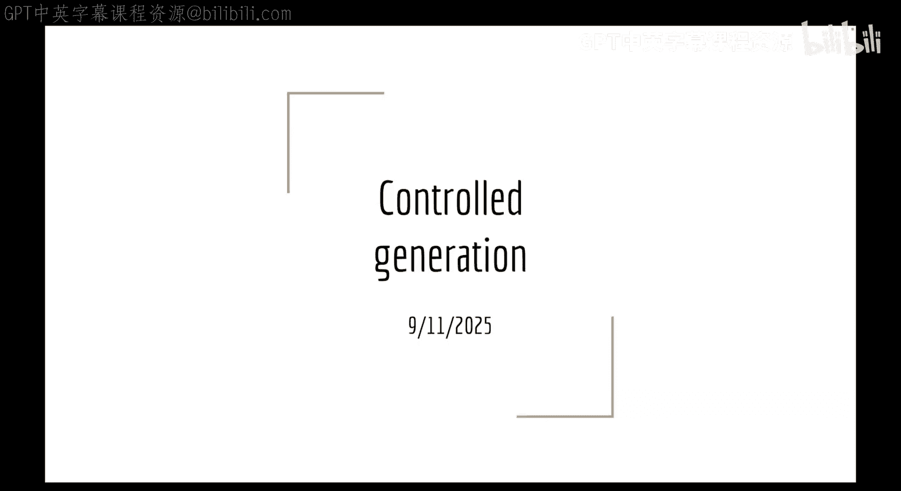

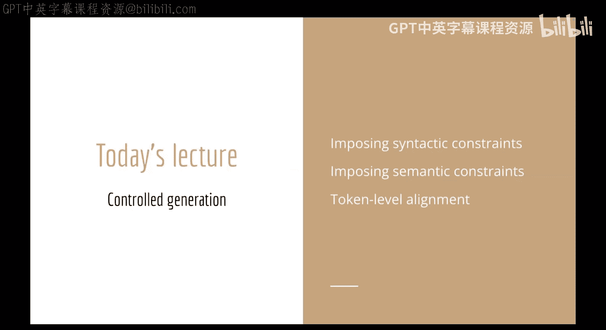

在本节课中，我们将继续探讨如何控制和约束语言模型的生成过程。我们将介绍两种主要类型的约束：易于用规则列表描述的**句法约束**，以及更难以明确定义的**语义约束**。通过学习这些方法，你将了解如何在推理阶段灵活地引导模型输出，以满足特定格式或内容要求。

上一节我们讨论了束搜索和A*搜索等通过调整搜索分数来约束输出的方法。本节中，我们将看看另一种思路：直接修改模型的概率分布，然后从中重新采样。

## 可验证的约束与状态机

首先，我们来看一类相对简单的约束：**可验证约束**。这类约束的特点是，在生成结束时，我们可以用一个确定的函数来检查约束是否被满足。更进一步，如果我们在生成**每个单独的标记**时都能验证当前路径是否可能满足最终约束，那么这类约束就更容易处理。

例如，“输出必须是10个标记长”这个约束在生成结束时很容易验证，但在生成过程中，我们无法确定当前的选择是否能最终满足这个条件。相比之下，“每个标记都必须以空格开头”或“输出必须是有效的JSON”这类约束，在每一步生成时我们都能判断是否偏离了目标。

### 模板化生成：以JSON为例

一个常见的需求是让模型始终输出特定格式，比如有效的JSON。虽然可以通过微调模型来实现，但如果约束很简单或者需要频繁更改，在推理时进行控制是更灵活的选择。

如何强制模型输出有效的JSON？关键在于，在每一步解码时，虽然模型有超过10万个可能的标记选择，但只有少数几个能导向最终的有效JSON。我们可以通过一个**状态机**来跟踪生成进度，并屏蔽掉无效的路径。

以下是一个生成包含`name`和`birth_year`键的JSON对象的状态机示例：

*   **状态 0 (起始)**: 唯一有效的起始标记是左花括号 `{`。
*   **状态 1**: 接下来可以生成 `"name": "` 或 `"birth_year": "`。
*   **状态 2 (生成姓名)**: 进入此状态后，只能输出构成姓名字符串的字母标记。
*   **状态 4 (生成出生年份)**: 进入此状态后，只能输出数字标记。
*   **状态 6/7 (结束值)**: 完成一个值后，需要输出闭合引号，然后可以选择输出逗号并生成另一个键值对，或者直接以右花括号 `}` 结束。

这个状态机确保了生成的结构是 `{"name": "某姓名", "birth_year": 某年份}` 的形式。然而，它也存在一些问题：
1.  没有限制姓名或年份的长度。
2.  可能重复生成同一个键（如多个`birth_year`）。
3.  可能漏掉某个必需的键。
4.  无法处理嵌套的JSON结构。

在实践中，我们通常不会手动绘制这些状态机。对于JSON这类常见格式，许多库（如Llama.cpp、LangChain、OpenAI的Structured Outputs）允许你直接提供一个JSON模式（Schema），库会自动将其转换为约束并在生成时强制执行。

### 标记修复

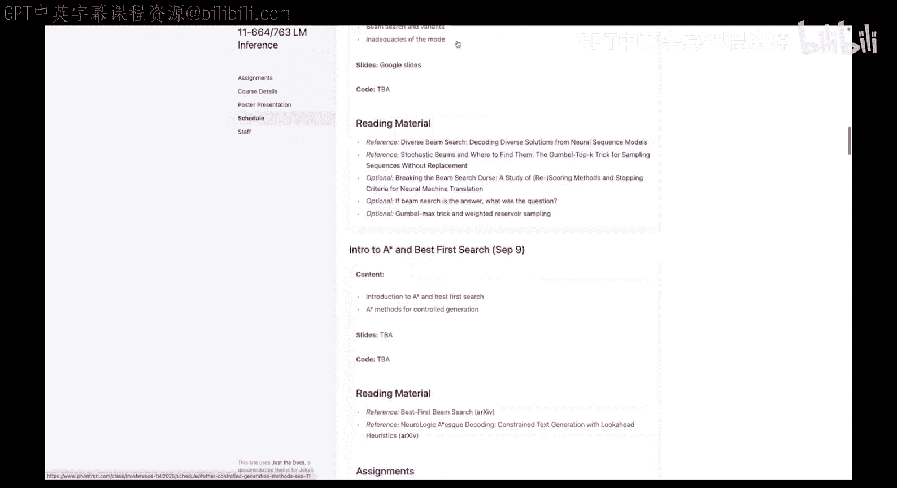

使用状态机进行模板化生成时，可能会遇到“不自然”的标记边界。例如，模型在无约束时可能将 `http://` 作为一个标记生成，但在状态机中，你可能先被迫生成冒号 `:`，然后需要生成 `//`。`//` 作为一个独立标记的概率可能很低。

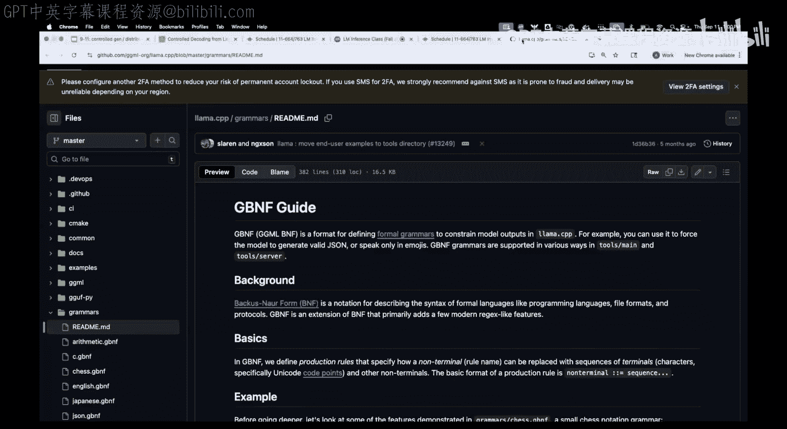

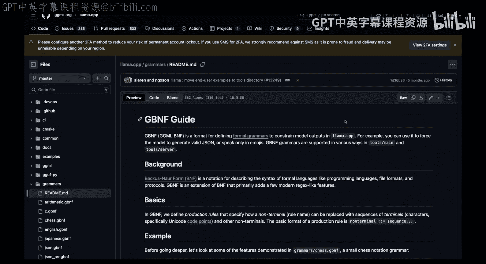

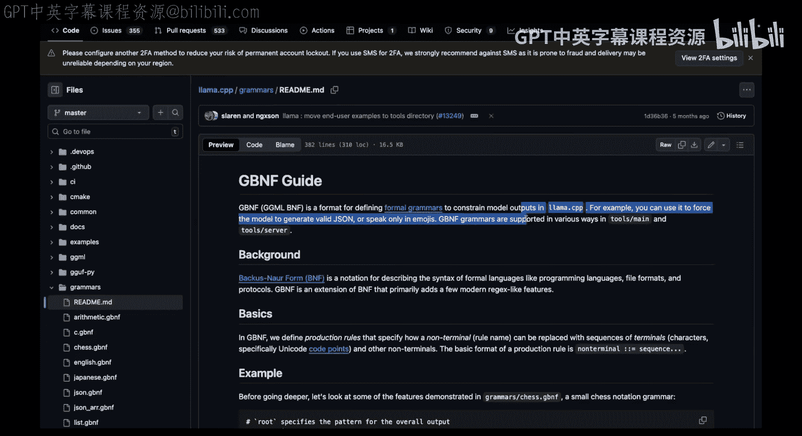

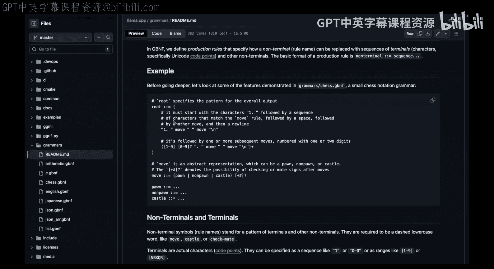

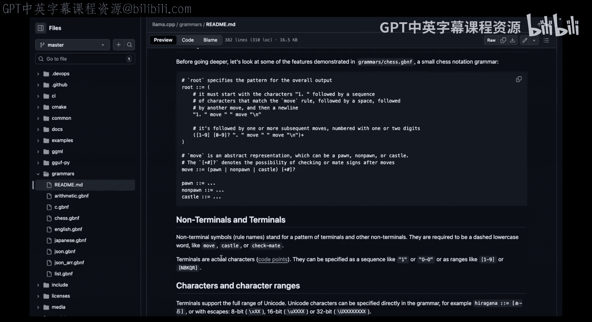

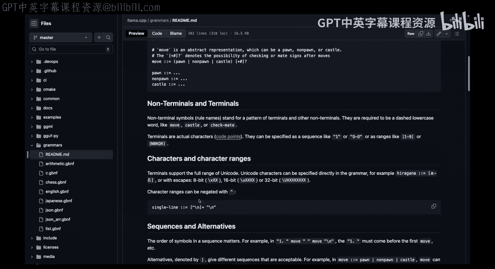

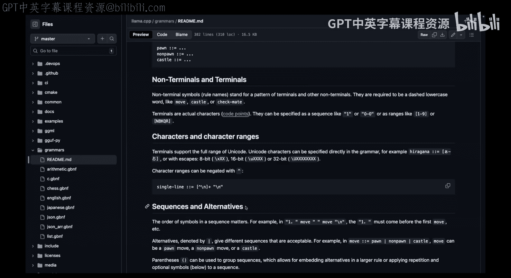

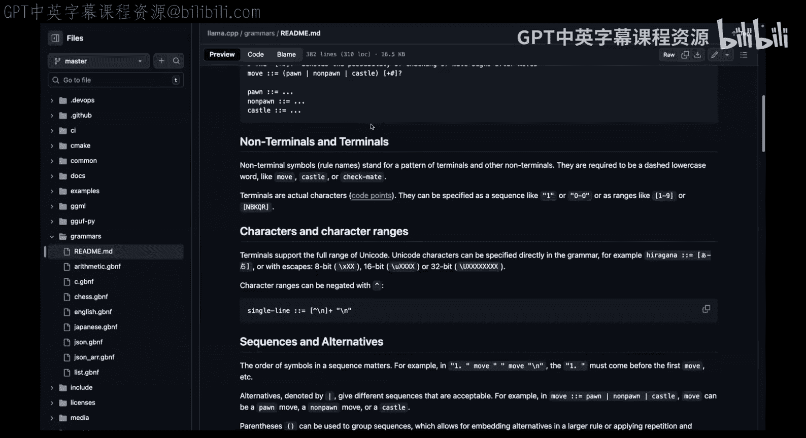

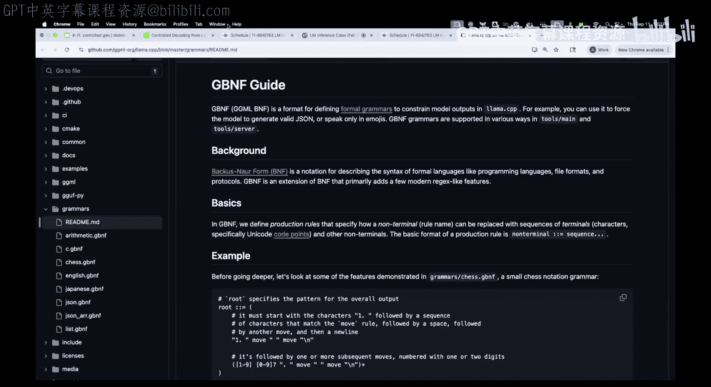

**标记修复** 技术可以解决这个问题。其思想是：当我们知道下一个标记必须以某个特定字符（如 `:`）开头时，我们并不强制该字符必须是一个完整的标记。相反，我们回退一步，只要求下一个标记以该字符为**前缀**。这样，像 `://` 这样更自然、概率更高的标记就会被纳入考虑范围。

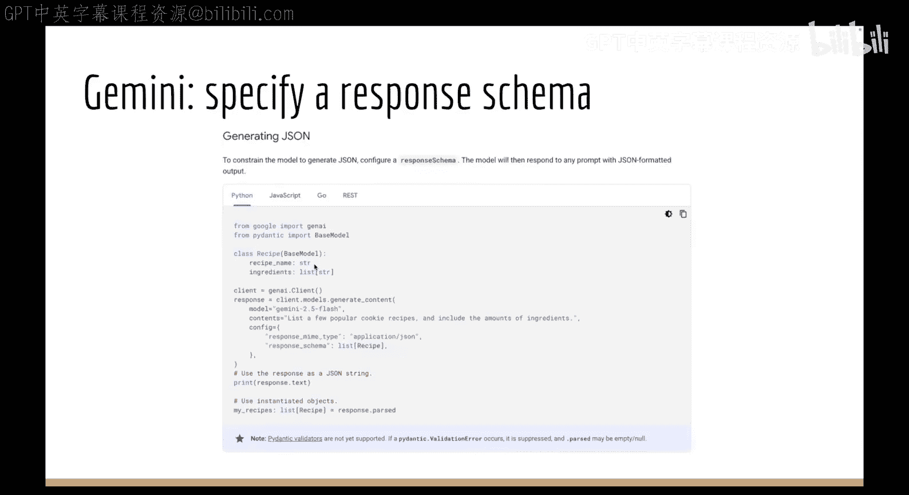

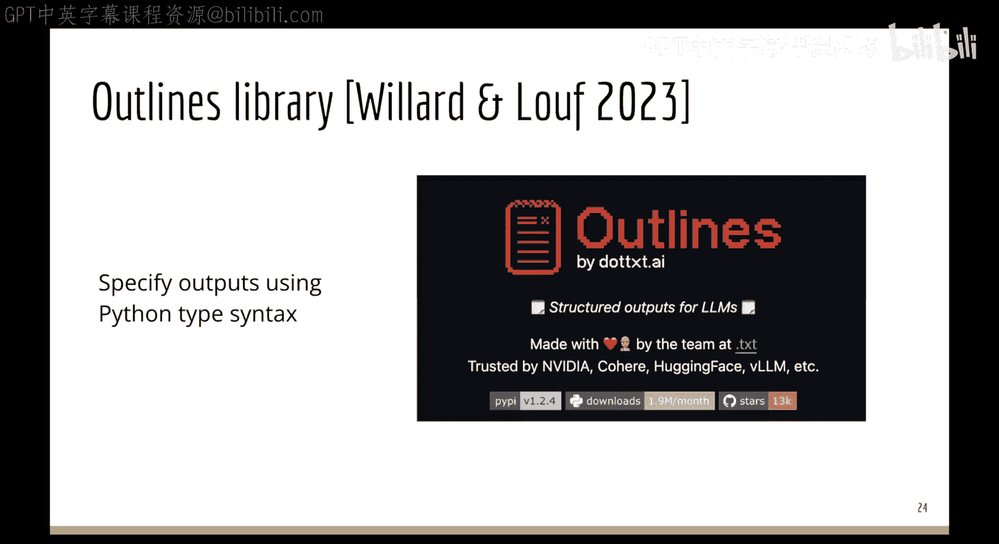

触发标记修复的启发式规则包括：
*   维护一个常见“问题字符”列表（如孤立的冒号、斜杠）。
*   当上一个生成的标记非常短时（例如单个字符）。
*   当上一个标记不以空格或标点符号开头或结尾时（在代码生成中常用）。
*   当上一个标记是另一个高概率标记的精确前缀时。

## 从正则语言到上下文无关语言

我们之前绘制的状态机在形式语言理论中称为**有限状态自动机**，它所能表达的语言类别称为**正则语言**。正则语言易于指定，但表达能力有限。

JSON要求括号正确嵌套，这需要跟踪已打开括号的数量，这超出了正则语言的能力范围。要处理嵌套结构，我们需要更强大的 **上下文无关文法**，其对应的自动机称为**下推自动机**，它带有一个栈来记录额外信息。

几乎所有支持JSON模式验证的库在底层都使用了下推自动机。然而，如果你需要更复杂的约束（例如“所有键必须唯一”或像验证C代码那样需要检查变量是否已声明），这属于**上下文有关语言**的范畴，无法用这种高效的逐标记检查方式来实现。这时就需要其他方法。

## 处理语义约束：FUDGE方法

对于无法用精确规则描述的**语义约束**（例如“生成一段正式文本”或“避免提及爬山”），我们需要不同的策略。简单地屏蔽“爬山”这个标记是行不通的，因为它无法处理同义词、词语的其他用法，并可能导致不流畅的生成。

一种方法是使用 **FUDGE** 方法。其核心思想是通过一个辅助的**未来判别器**来估计在当前生成路径下，最终输出满足约束的可能性。

具体步骤如下：
1.  **训练判别器**：收集带有约束标签的数据（如正式/非正式文本）。将每个完整文本的所有前缀（从开头到各个位置）作为输入，其完整文本的标签作为输出标签，来训练一个分类器。这个分类器学会根据当前已生成的前缀，预测最终结果满足约束的概率。
2.  **在生成时应用**：在每一步生成时，对于模型预测出的Top-k个候选下一个标记，分别将它们拼接到当前前缀后，送入未来判别器，得到 `P(约束|前缀+候选标记)`。
3.  **调整概率**：将模型原始的标记预测概率与判别器给出的概率相乘（或在对数空间相加），然后重新进行Softmax。这样，既符合语言模型习惯，又更可能满足约束的标记就会被提升。

**公式表示**：
我们希望得到的分布是 `P(下一个标记 | 输入, 已生成前缀, 约束)`。
根据贝叶斯规则，这可以近似正比于：
`P(约束 | 前缀+下一个标记) * P(下一个标记 | 输入, 前缀)`

FUDGE的优点是判别器任务相对简单，数据容易获取。但它不能**保证**约束一定被满足，通常需要与拒绝采样结合使用。此外，它需要访问模型的逻辑值。

## 对比解码与约束生成

**对比解码** 本身是一种提高生成质量的方法，其核心思想是：从“专家”模型（强模型）的预测概率中减去“业余”模型（弱模型）的预测概率，从而放大强模型更擅长而弱模型容易出错的部分。

我们可以利用这个思想进行约束生成，特别是针对**安全约束**。与其定义所有“安全”的内容，不如定义什么是“不安全”的。具体做法是：
1.  用正常的提示词（如“你是一个有帮助的助手”）让模型生成，得到一组逻辑值。
2.  用诱导生成有害内容的提示词（如“你是一个邪恶的助手”）让同一个模型生成，得到另一组逻辑值。
3.  将两组逻辑值相减，从而抑制那些在“有害”模式下概率较高的输出。

这种方法被称为**对抗性解码**。它的优点是不需要训练额外的模型，让模型自己判断内容的危险性。缺点是需要两倍的计算量，因为每次生成都需要运行两次前向传播。

## 总结

本节课我们一起学习了多种控制和约束语言模型生成的方法：
1.  **对于句法/模板化约束**（如JSON格式），使用基于状态机或文法的**约束解码**是最直接、最可靠的方法，它能提供硬性保证。
2.  **对于逐标记可验证的约束**，可以通过修改逻辑值并屏蔽无效选项来实现。
3.  **对于更复杂的语义约束**（如文本风格、避免特定主题），可以使用像 **FUDGE** 这样的方法，通过训练一个未来判别器来调整生成概率。
4.  **对于安全约束等场景**，**对比解码/对抗性解码**提供了一种通过比较不同提示下的输出来抑制不良内容的方法。

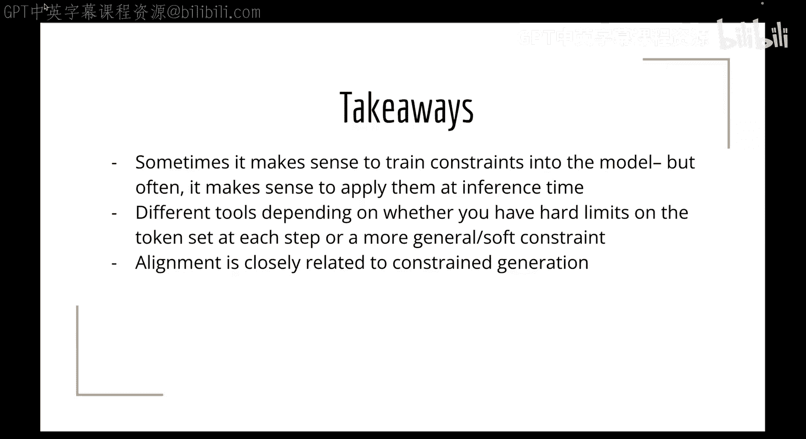

这些方法为我们提供了在推理阶段灵活引导模型的工具箱。将约束内置到模型训练中（如RLHF）适用于广泛、持久的约束，而对于临时性、特定或格式化的约束，在推理时进行处理则更加灵活高效。理解约束的类型（是否可逐标记验证）是选择合适工具的关键。