# 7：思维链与中间步骤 🧠

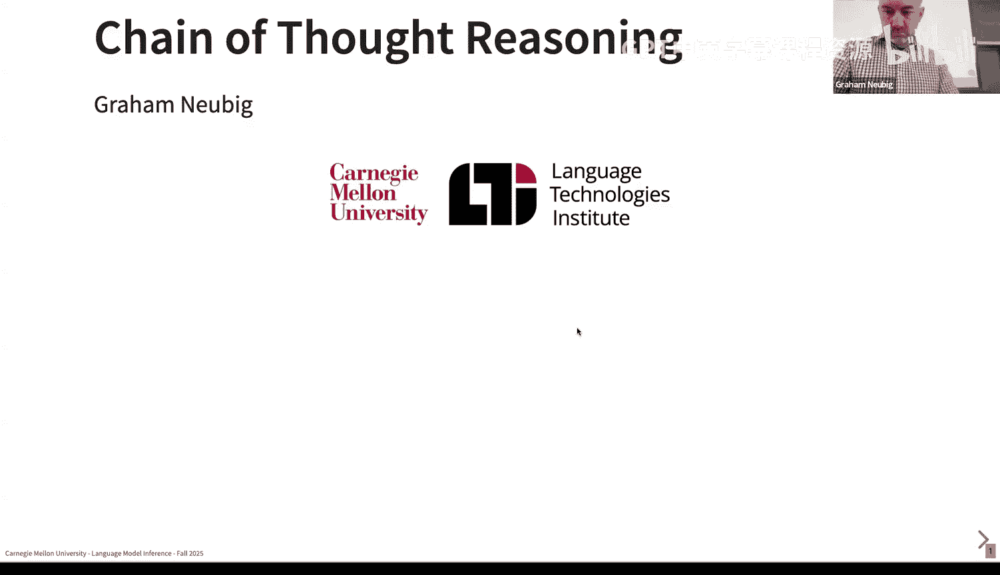

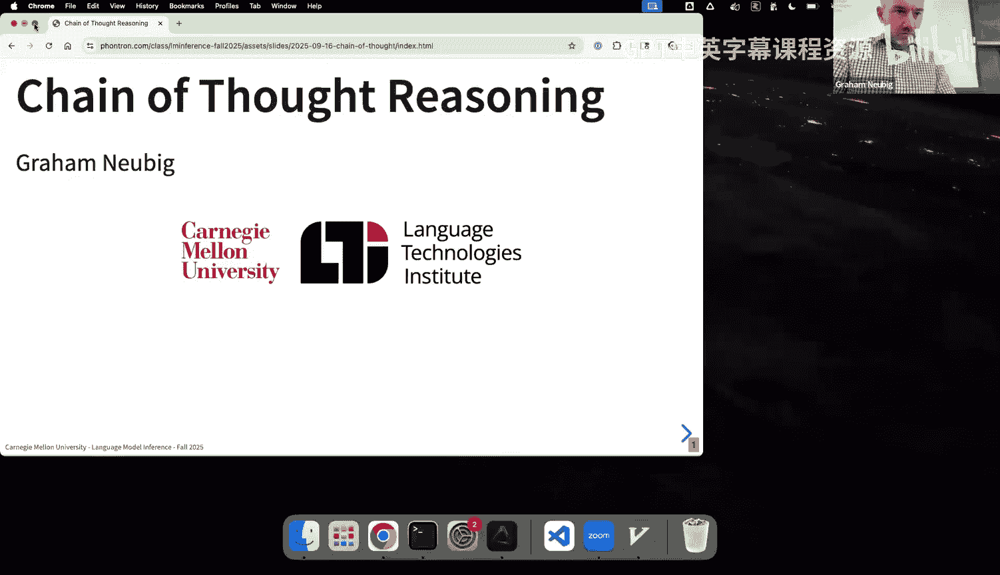

在本节课中，我们将要学习思维链推理。这是一种在现代模型中广泛使用的基础技术，对于构建执行推断的模型至关重要。思维链允许模型在生成最终答案前，先生成中间推理步骤，从而更好地处理复杂问题。

## 动机：处理复杂推理任务

我们希望通过语言模型执行复杂的推理任务。例如，思考这样一个问题：“理论上，一块H100 GPU生成100个Llama 3 8B模型的token最快需要多长时间？”

要解决这个问题，模型需要执行多个步骤：回忆H100的FLOPS性能、了解Llama 3 8B的模型结构、设置计算过程，最后执行数学运算。这凸显了一个核心挑战：并非所有问题的难度都相同。有些问题（如简单算术）可以一步解决，而复杂问题则需要多步、细致的思考。语言模型需要根据问题难度动态分配计算资源。

上一节我们介绍了处理复杂任务的动机，本节中我们来看看思维链的具体定义和优势。

## 思维链：定义与优势

思维链的基本思想是：在生成最终答案 `Y` 之前，先生成中间推理步骤 `Z`。我们可以将其形式化地定义为，在给定输入 `X` 的情况下，我们希望通过边缘化所有可能的思维链 `Z` 来得到最可能的输出 `Y`：

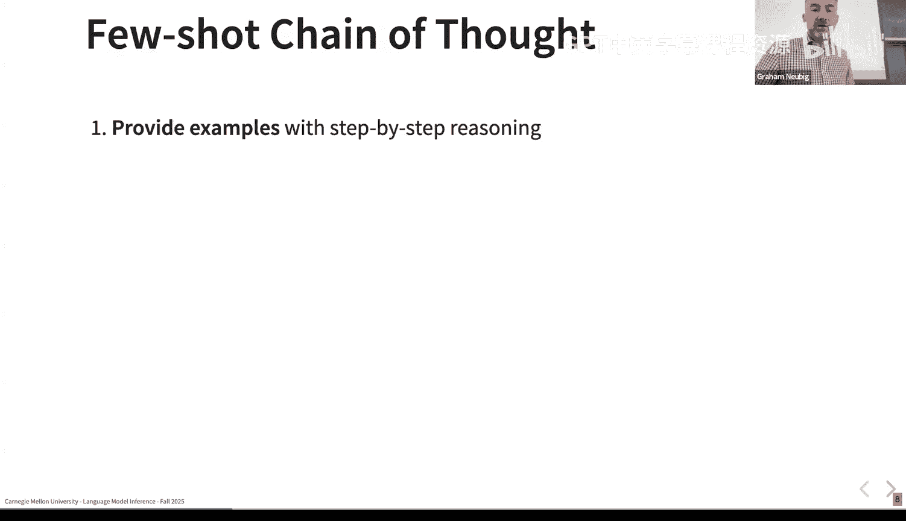

`P(Y|X) = Σ_Z P(Y, Z|X)`

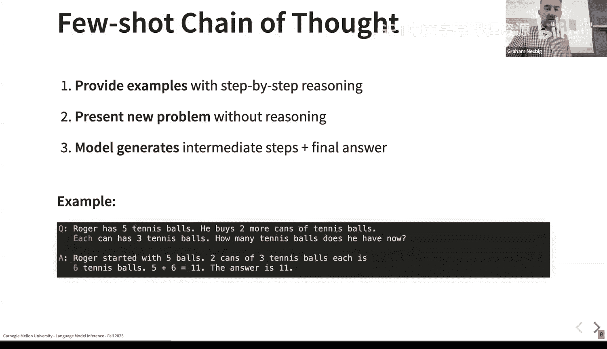

这里，`Z` 是一个潜在变量，用于提高我们预测 `Y` 的准确性。

使用思维链主要有两大优势：
1.  **自适应计算时间**：额外的token允许模型为更困难的问题投入更多计算（FLOPS）。
2.  **可解释性与可验证性**：如果思维链忠实于真实的推理过程，人类可以逐步检查，从而更容易理解和验证模型的输出。

## 思维链的学习方式

模型可以通过以下几种方式学会使用思维链：

1.  **涌现能力**：在足够大/强的模型（如2022年的GPT-3 175B）中，思维链能力会自然涌现。这是因为训练数据（如数学教科书、代码、证明过程）中已经包含了大量的分步推理示例。
2.  **监督微调**：在明确包含推理步骤的数据集上对模型进行微调，可以教会模型使用思维链。
3.  **强化学习**：训练模型进行推理，并在其成功回答问题后给予奖励。这是当前推理模型研究的重要方向。

一个重要的说明是，如今许多“基础模型”在预训练末期会混入高质量、类似教学的数据，因此其涌现能力可能部分源于这种精心设计的数据选择。

## 思维链提示方法

在实践中，我们主要通过提示来激发模型的思维链能力。

以下是两种主要的提示方法：
*   **少量示例提示**：在输入中提供几个包含完整推理步骤的示例（问题 -> 推理 -> 答案），模型会模仿这种格式进行输出。
*   **零样本提示**：令人惊讶的是，即使不提供示例，仅使用“让我们一步步地思考”这样的前缀，也足以鼓励模型进行思维链推理。这个特定的提示词被证明效果显著。

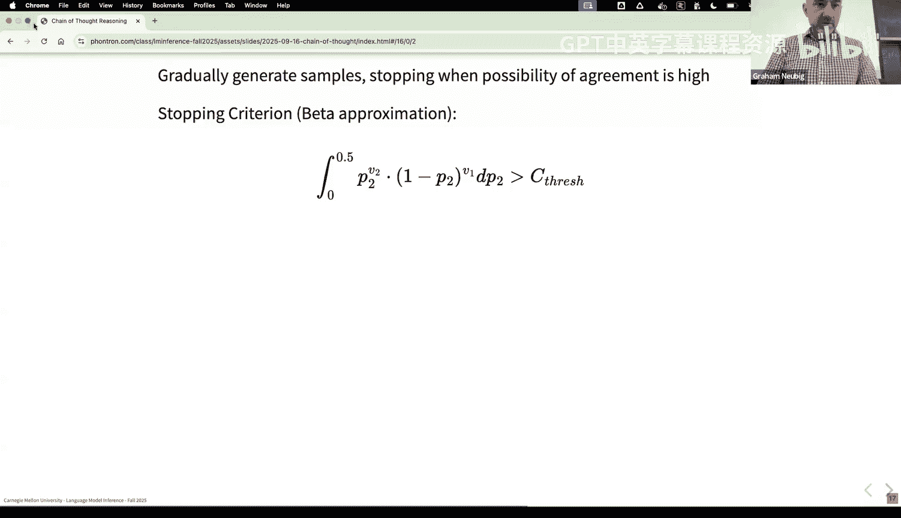

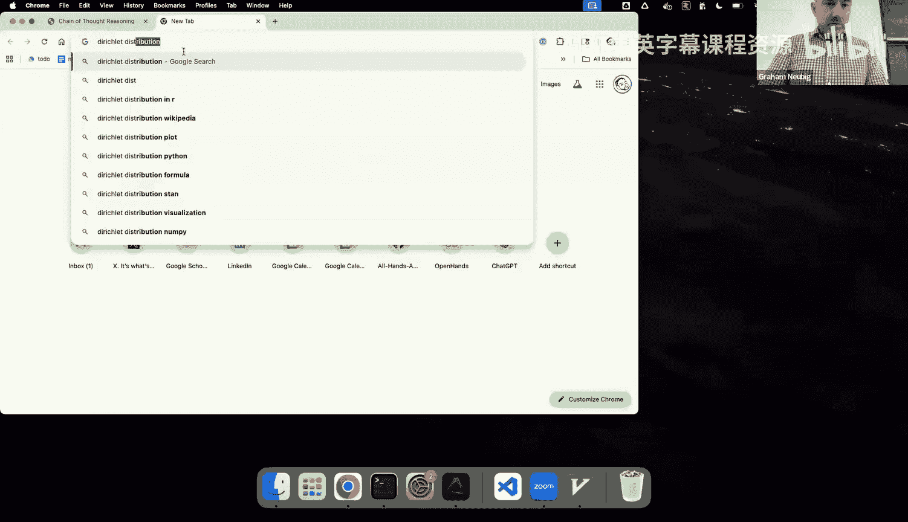

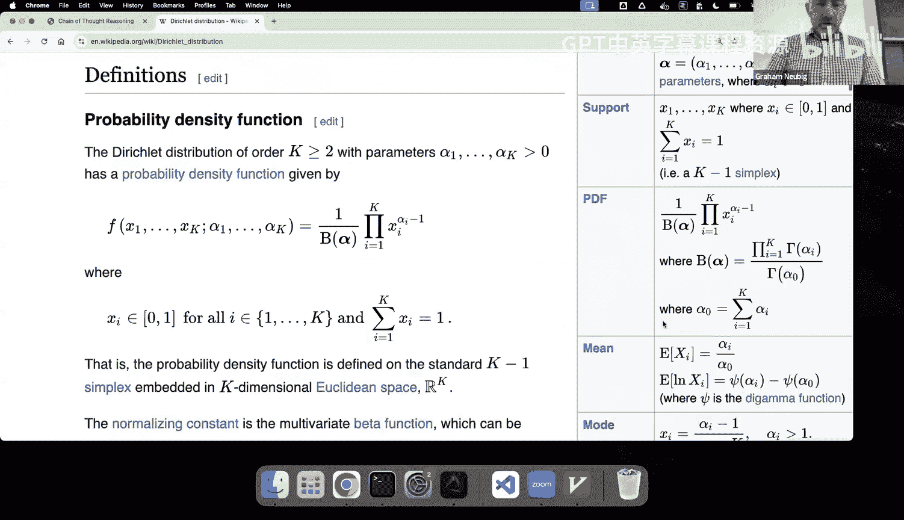

## 思维链的推断算法

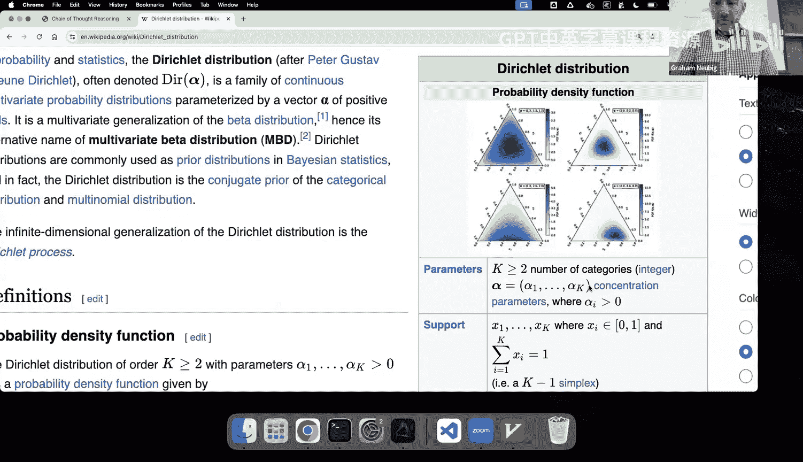

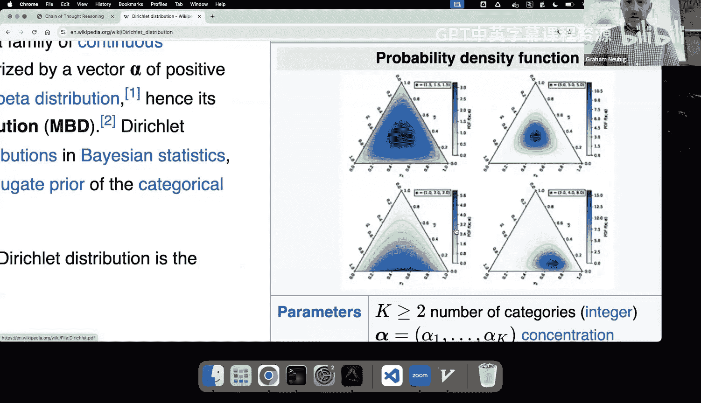

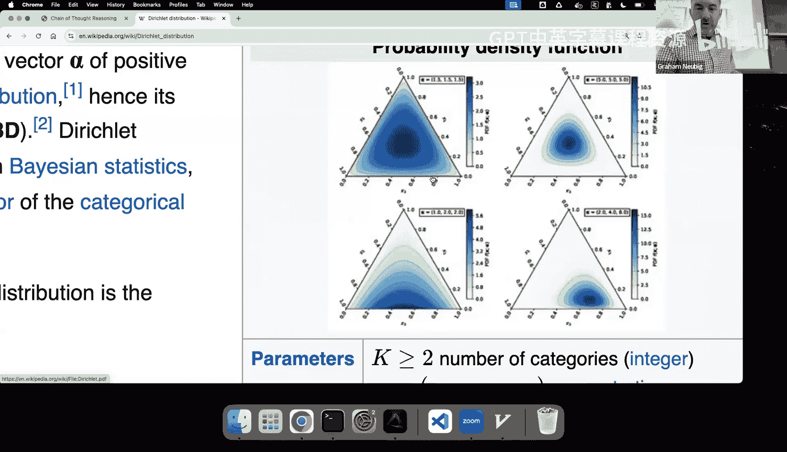

现在，我们回到本课程的核心——推断算法。我们的目标通常有两种：从模型中采样，或进行寻模搜索以找到最高分的输出。

对于思维链，其推断有其特殊性：
*   **采样**：要精确地从模型分布中采样，使用温度=1的祖先采样即可。即先采样思维链 `Z`，然后基于 `Z` 采样最终答案 `Y`。
*   **寻模**：我们的目标是找到最大化 `P(Y|X)` 的 `Y`。这需要边缘化所有 `Z`，而 `Z` 的可能性空间极其巨大（词汇表大小^链长度），无法直接枚举。

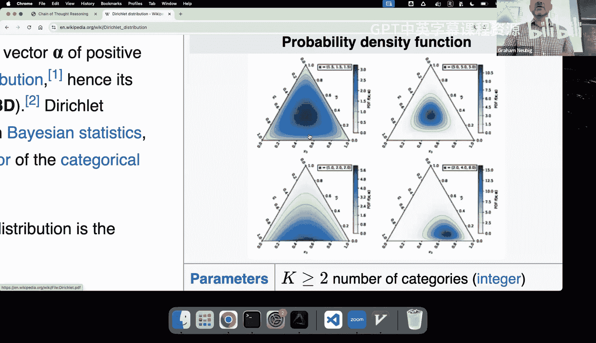

一种简单的寻模方法是**联合寻模**，即直接寻找概率最高的 `(Z, Y)` 对。但这种方法可能无法得到概率最高的 `Y`，因为可能存在多个不同的 `Z` 指向同一个正确的 `Y`，其总概率可能高于那个概率最高的 `(Z, Y)` 对。

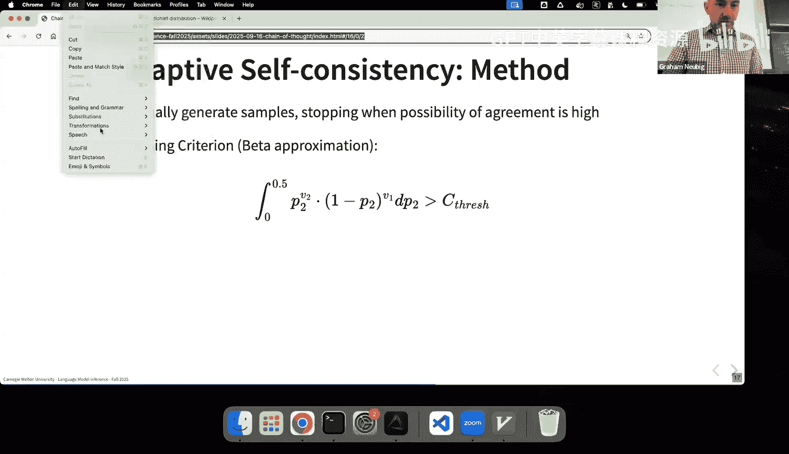

为了解决这个问题，对于答案明确（如数学题答案）的任务，可以使用**自洽性**方法：
1.  从模型中采样大量不同的推理路径。
2.  统计所有路径最终得出的答案。
3.  选择出现频率最高的答案作为最终输出。

自洽性通常效果更好，但计算成本也更高（需要多次采样）。

## 自适应计算与自洽性优化

我们可以将自适应计算的思想也应用到假设生成上。**自适应自洽性**方法旨在动态决定需要采样多少个假设才能足够确信。
其核心思想是：逐步生成样本，并利用贝叶斯统计（如狄利克雷分布/贝塔分布）来估计在继续采样后，当前最高频答案发生变化的概率。当这个概率低于某个阈值（例如5%）时，就停止采样。这种方法可以在保证结果可靠性的同时，节省不必要的计算开销。

## 思维链的特性与局限

了解思维链的以下特性与局限对于有效使用它至关重要：

1.  **并非万能**：思维链带来的性能提升并非在所有任务上均等。大量分析表明，它在数学、逻辑和演绎推理任务上提升巨大，但在许多常识推理、知识问答任务上提升有限甚至没有。这意味着评估或应用推理模型时，应首先关注其数学能力。

2.  **解释的忠实性问题**：思维链的解释可能并不忠实于模型实际的推理过程。研究表明，模型可能生成看似合理但实则为错误答案辩护的解释（例如，当受到提示示例中的偏见影响时）。这意味着不能完全依赖思维链进行可信性验证。

3.  **长度与质量的相关性**：对于早期的思维链模型，更长的推理链往往与更高的答案准确性相关。基于此，有人提出了**基于复杂度的提示**方法：生成多个思维链，过滤掉较短的，然后对剩余的较长链进行自洽性投票，这能带来额外的性能提升。

## 扩展与总结

思维链的概念可以扩展到多模态领域，例如让模型根据图像和文本输入生成推理步骤，再给出答案，这在视觉问答等任务上取得了更好效果。

本节课中我们一起学习了思维链推理的核心概念。我们了解了它的定义、优势、学习方式以及如何通过提示来激发它。我们重点讨论了与之相关的推断算法挑战，如寻模的困难和自洽性解决方案，并介绍了自适应计算在其中的应用。最后，我们探讨了思维链的局限性，包括其任务特异性、解释的忠实性问题以及长度与性能的关系。这些知识为我们后续学习自我修正模型和更强大的推理模型奠定了重要基础。

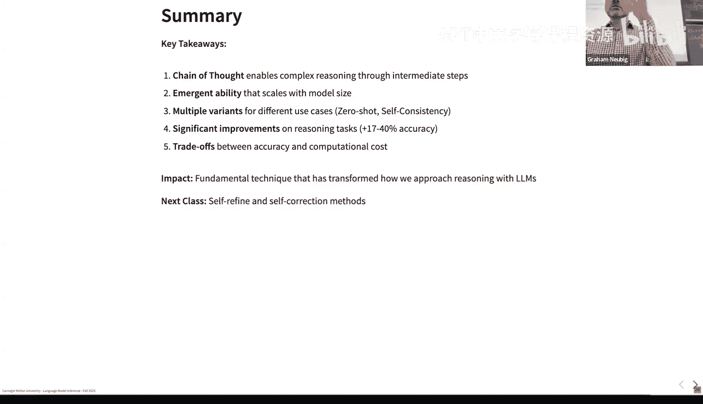

---
*课程内容来源：CMU《语言建模的推断算法》讲座 P7 - 思维链与中间步骤*