# 8：自优化与自校正方法 🛠️

在本节课中，我们将要学习一系列自优化与自校正方法。这些方法旨在让语言模型能够像人类一样，通过迭代地审视和修改自己的输出来提升生成质量，而不是仅依赖单次从左到右的生成。

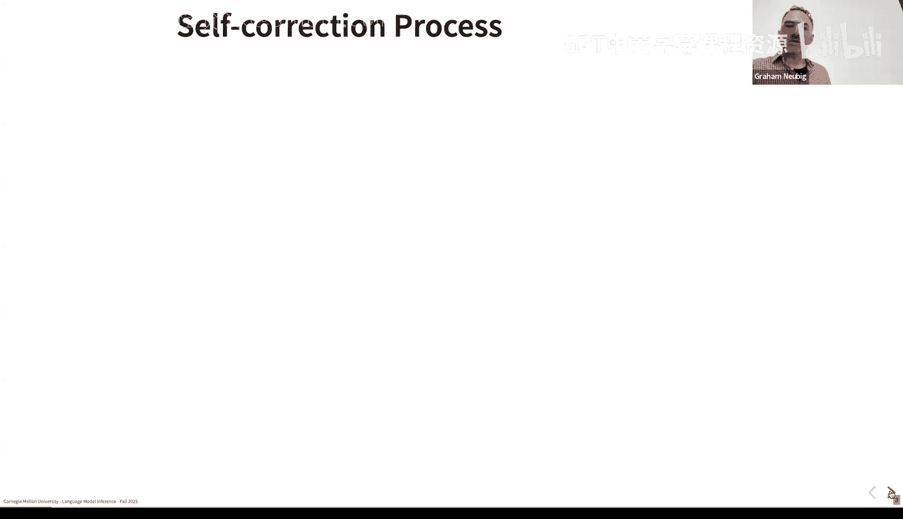

## 概述

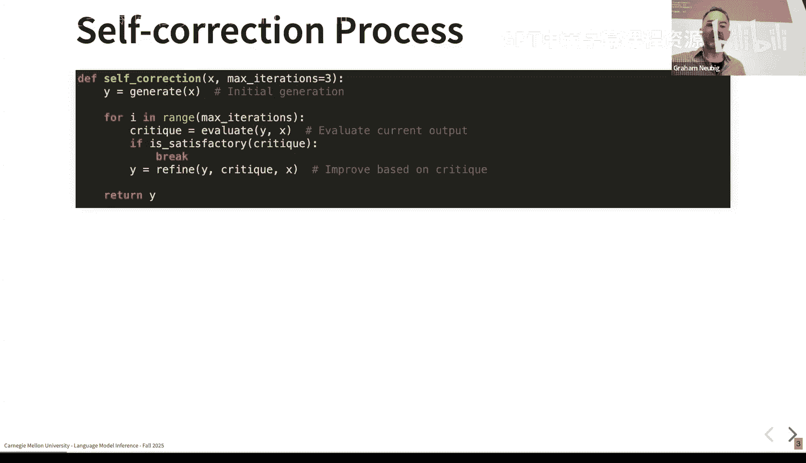

语言模型的生成通常是单次从左到右完成的，这使其在生成长或复杂输出时容易出错。相比之下，人类的写作过程往往是迭代式的：先完成初稿，然后反复修改和润色细节。本节课介绍的方法正是为了帮助语言模型实现类似的迭代优化过程。

## 自校正循环的基本框架

自校正过程通常遵循一个通用框架，其核心是一个循环结构。以下是该过程的基本步骤：

1.  **初始生成**：模型根据输入生成初始输出。
2.  **评估与评判**：对当前输出进行评估，判断其是否令人满意。这一步可以是显式的（明确提示模型进行评判）或隐式的（例如，当模型不再生成修改时即视为满意）。
3.  **判断与循环**：如果输出不满足停止标准，则基于评估结果（评判）对输出进行精炼修改。这个过程会重复进行，直到输出满足标准或达到预设的最大迭代次数。

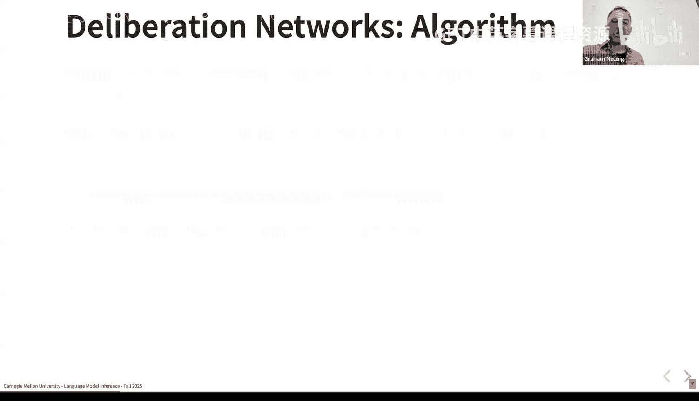

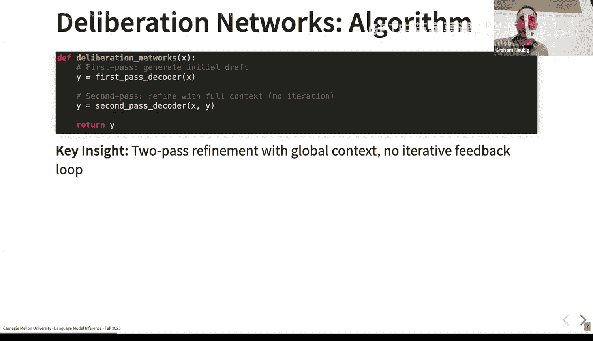

该框架可以用以下伪代码表示：
```python
output = generate(input)
for i in range(max_iterations):
    critique = evaluate(input, output)
    if is_satisfactory(critique):
        break
    output = refine(input, output, critique)
```

## 关键设计维度

实现自校正方法时，需要考虑几个关键的设计决策，不同的论文在这些维度上做出了不同的选择。

以下是几个核心的设计维度：

*   **评判方式**：分为**显式评判**（明确要求模型评估输出质量）和**隐式评判**（通过模型是否继续生成修改来间接判断）。
*   **训练需求**：是否需要**显式训练**模型使其擅长自我优化，还是直接使用预训练模型进行**零样本/少样本**提示。
*   **精炼条件**：在精炼步骤中，模型可以基于**原始输入**、**当前输出**和/或**评判反馈**来生成修改。
*   **工具使用**：评判或精炼过程是否依赖**外部工具**（如代码执行器、知识库、搜索引擎）来提供更可靠的反馈。

接下来，我们将通过介绍几篇代表性论文，具体看看这些设计决策是如何被应用的。

## 早期探索：两阶段解码与训练

上一节我们介绍了自校正的基本概念，本节中我们来看看一个早期的具体实现。2017年的一篇论文提出了一个简单但有效的思想：不满足于单次生成，而是通过“深思熟虑”进行两阶段解码来优化输出。

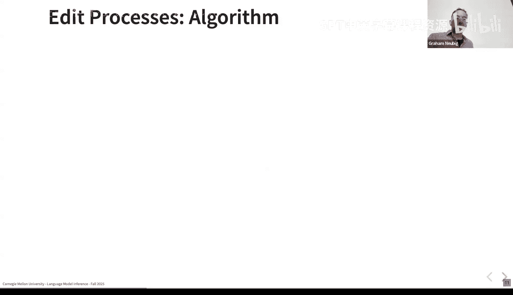

该方法的算法非常简单：
1.  第一遍生成初始草稿序列。
2.  第二遍基于对整体输出的全局上下文感知，对草稿进行精炼。

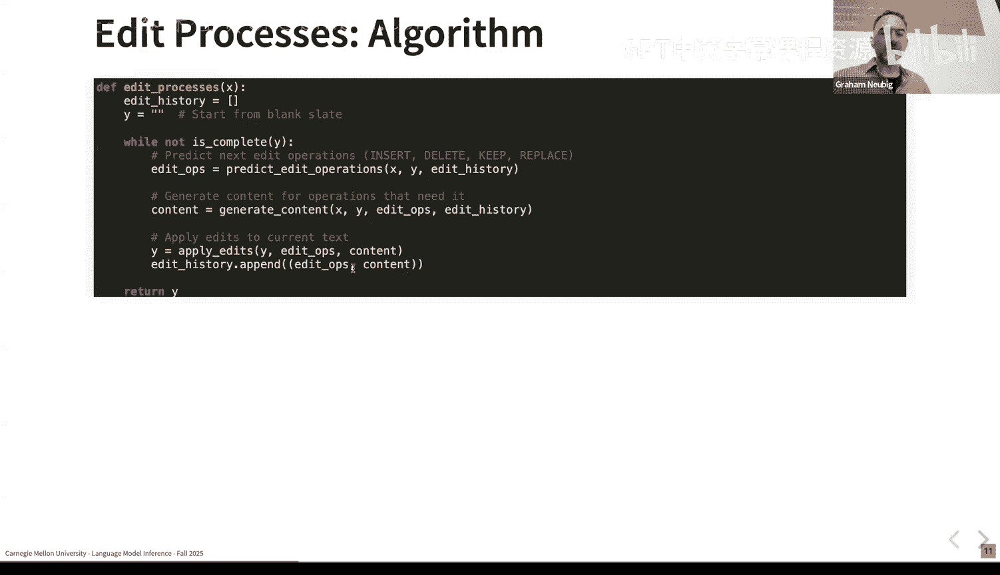

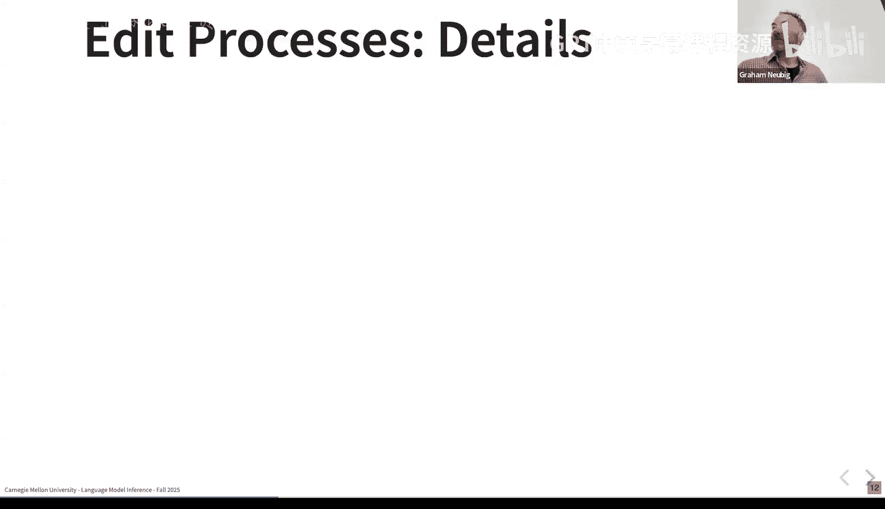

其训练目标旨在最大化最终输出 `y` 在给定初始输入 `x` 和中间输出 `y'` 下的对数概率，公式表示为：
`max_θ Σ log P_θ(y | x, y')`
其中 `θ` 代表模型参数。

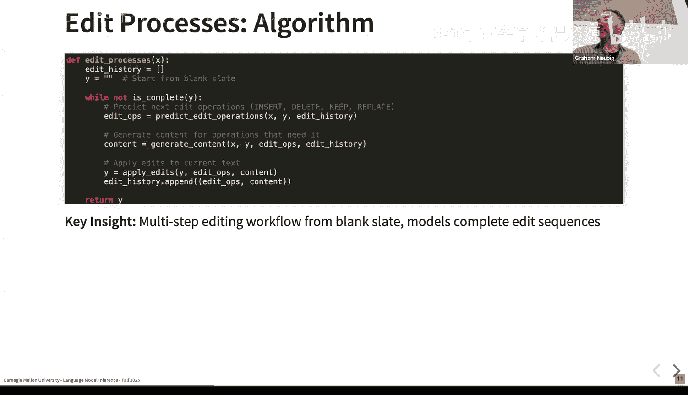

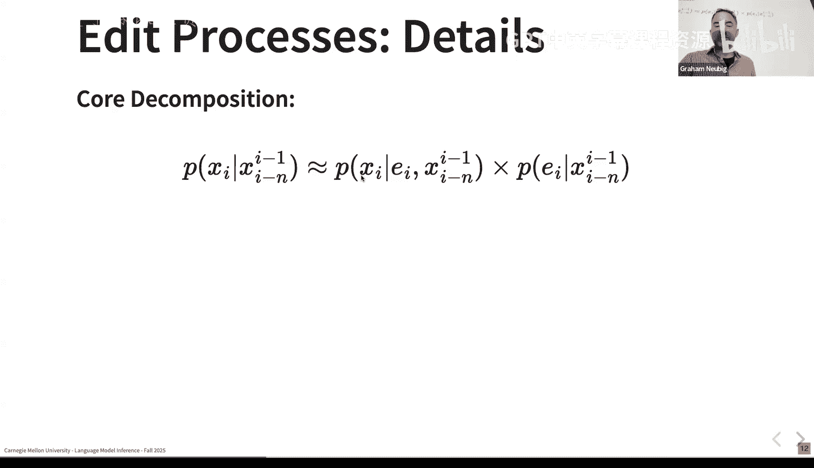

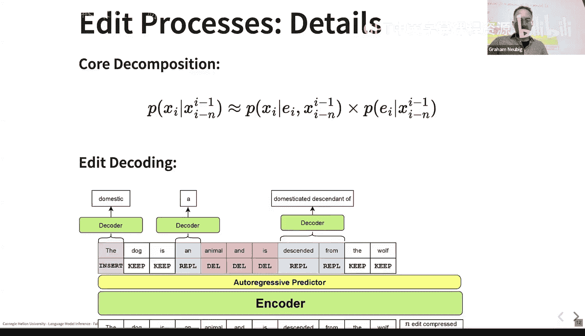

然而，直接优化这个目标不可行，因为中间输出 `y'` 的搜索空间是离散且巨大的（所有可能的序列）。解决方案是采用**采样**来近似梯度，即采样多个中间输出序列，然后计算它们各自产生最终目标输出的概率，并以此更新模型参数。这项工作首次证明了可以训练模型进行有效的自我优化。

## 学习编辑过程：结构化编辑操作

除了简单的两阶段模型，我们还可以构建更结构化的、多步骤的编辑模型。相关研究尝试从自然发生的编辑历史（如维基百科修订记录或GitHub代码提交）中学习编辑过程。

该方法的算法更接近通用的自校正循环，但有两个主要区别：

以下是其核心步骤：

1.  **预测编辑操作**：模型首先预测一系列编辑操作（如**插入**、**删除**、**保留**、**替换**），这些操作以序列标注的形式应用于当前文本的每个位置。
2.  **生成新内容**：对于需要插入或替换的位置，模型基于编辑操作和已进行的编辑历史，并行生成新的文本内容。
3.  **应用编辑**：根据预测的编辑操作和生成的新内容，确定性地生成编辑后的新文本。
4.  **更新历史**：将本次编辑加入历史记录，为后续步骤提供参考。

这种方法的好处在于，对于长文档的编辑，它不需要重新生成整个文本，只需预测编辑位置和局部的新内容，效率更高。实验表明，参考过去的编辑历史有助于预测未来的编辑。

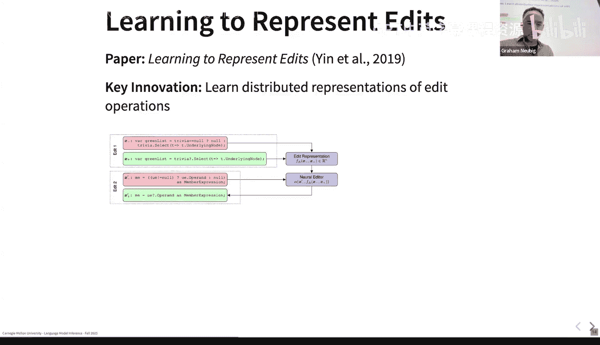

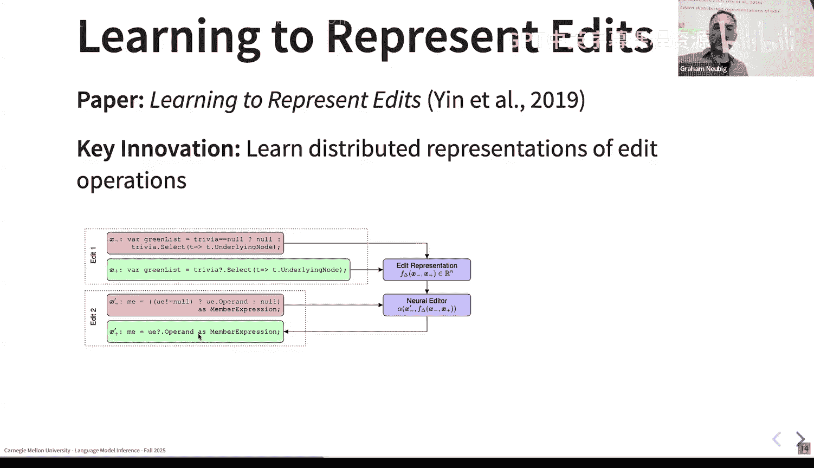

## 学习编辑表示：将编辑编码为向量

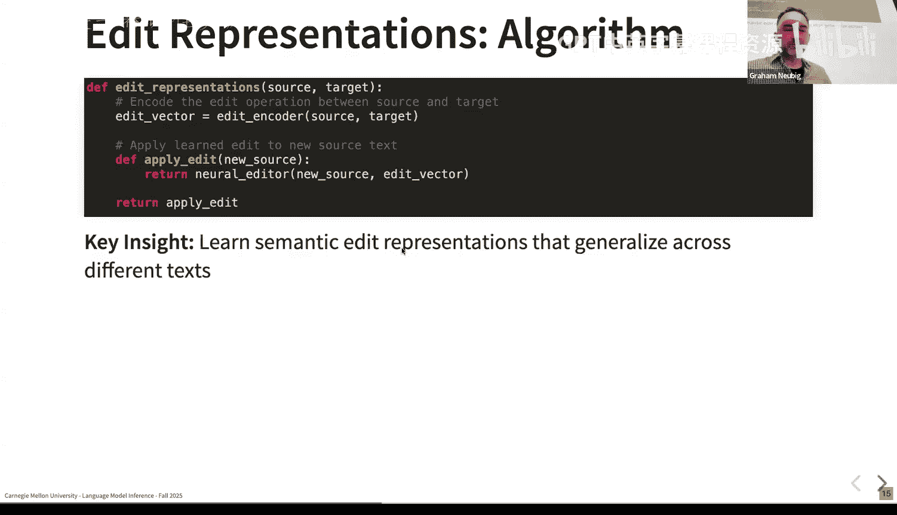

另一种思路是将“编辑”本身抽象并学习其表示。相关研究旨在学习一个能够捕捉从源序列到目标序列所做更改类型的紧凑向量表示。

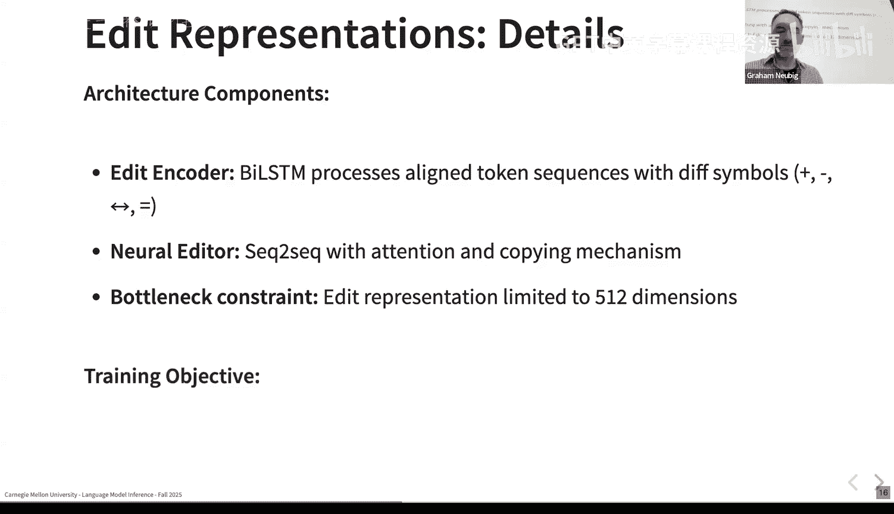

其核心思想是训练一个编码器-解码器架构：
1.  **编辑编码器**：接收“编辑前”和“编辑后”的文本对，将其编码成一个固定维度（如512维）的**编辑向量**。这个向量旨在捕捉编辑的类型和语义。
2.  **编辑应用解码器**：给定一个新的“编辑前”文本和上述编辑向量，解码器尝试生成应用了该类型编辑后的文本。

训练目标是自编码器式的：通过编辑向量重建“编辑后”的文本，公式可简化为最大化 `log P(编辑后文本 | 编辑前文本, 编辑向量)`。通过限制编辑向量的维度，模型被迫学习编辑的本质特征，而非记忆具体内容。这种方法可用于分析相似的编辑模式，例如识别代码中同一类安全漏洞的修复。

## 提示工程下的自优化

随着大语言模型能力的提升，研究者发现无需额外训练，仅通过巧妙的提示工程也能实现自优化。Self-Refine 是这方面的一篇代表性论文。

其算法完全遵循我们开始时介绍的基本自校正循环框架，全部通过提示完成：

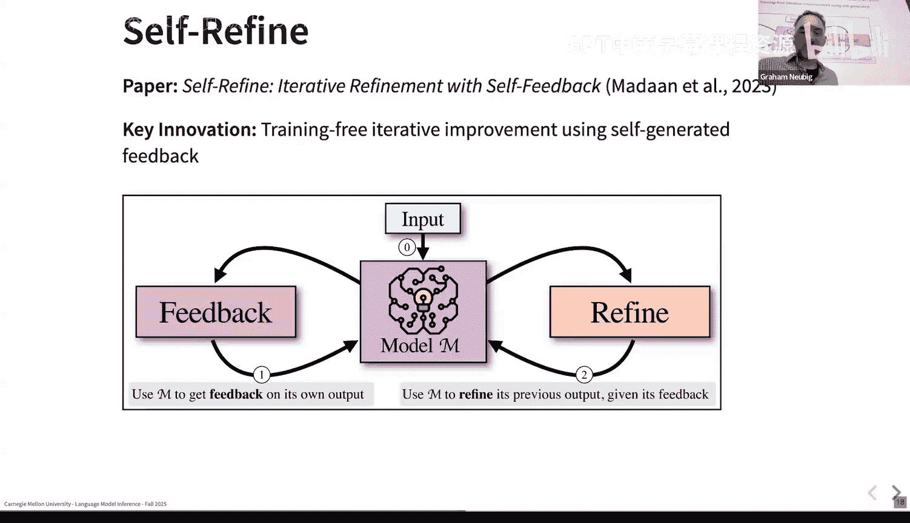

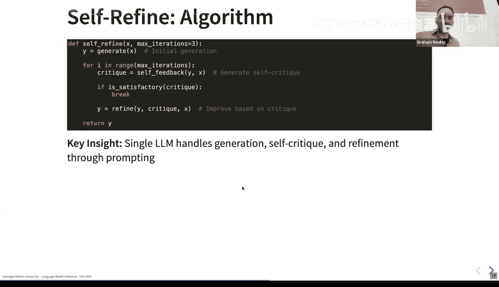

以下是其三步提示流程：

1.  **生成**：使用标准少样本提示生成初始输出。
2.  **评判**：提示模型对当前输出进行评判，例如询问“这个输出在[某个质量维度，如流畅性、正确性]上为什么不够好？”，以获取具体的改进反馈。
3.  **精炼**：将原始输入、当前输出和评判反馈组合成一个新的提示，要求模型根据反馈改进输出。

停止标准可以是简单的启发式规则（如反馈是否积极）或固定迭代次数。实验发现，这种方法在改进代码可读性、调整对话情感等任务上效果显著，但在数学推理等复杂任务上帮助有限。同时，更强的基座模型（如GPT-4）从自优化中获益更大。

## 引入外部工具：自我调试

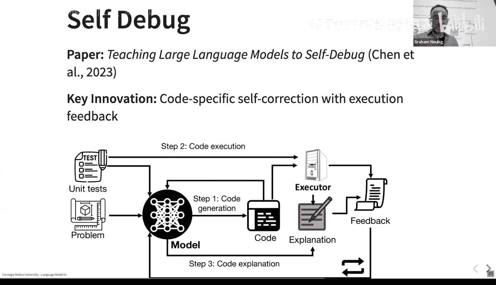

当任务涉及可验证的领域时，引入外部工具能极大提升自校正的可靠性。Self-Debugging 这篇论文将代码执行作为外部反馈引入循环。

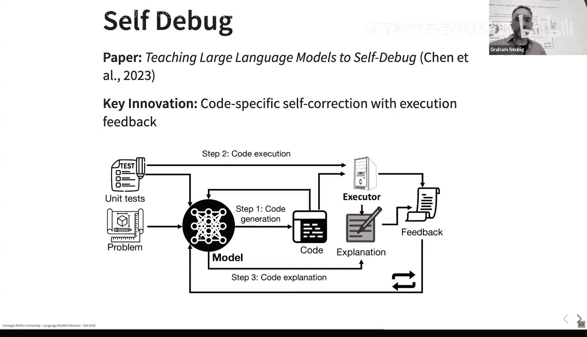

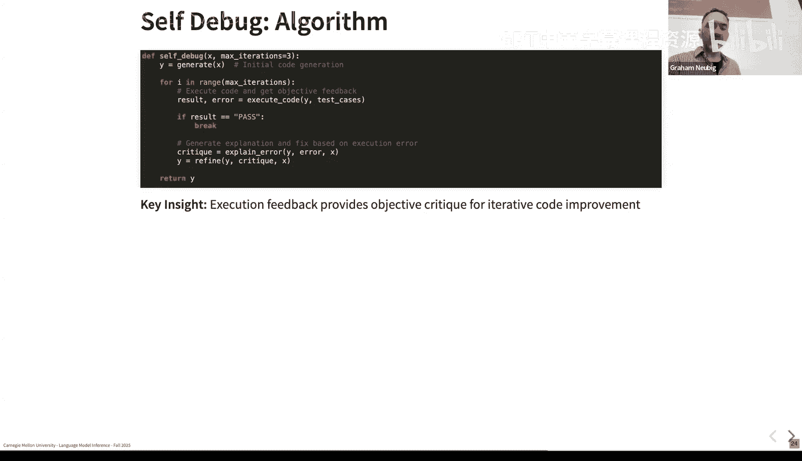

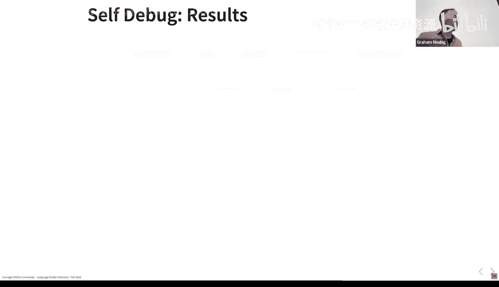

该方法在自校正循环中嵌入了代码执行和测试验证的步骤：


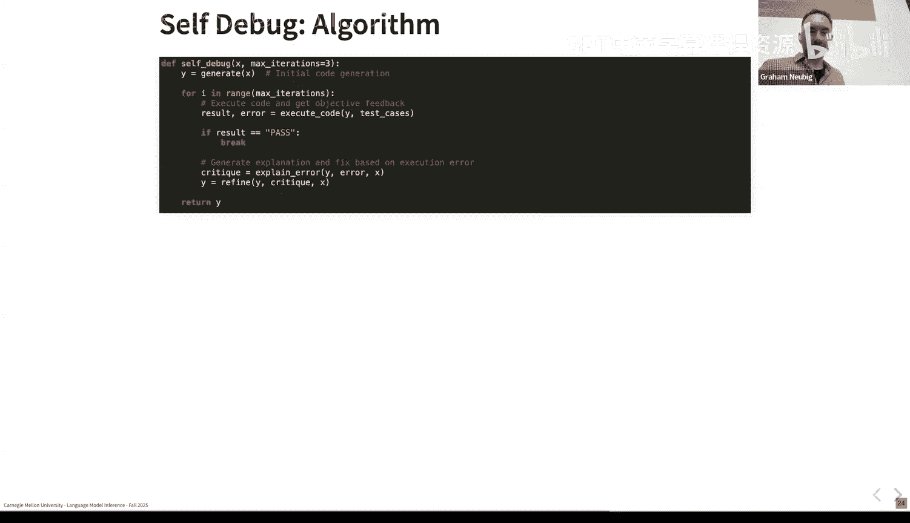

其工作流程如下：

1.  **生成代码**：模型生成代码。
2.  **执行与测试**：在安全环境中执行生成的代码，并运行预定义的单元测试。
3.  **判断**：如果所有测试通过，则流程结束；否则，进入下一步。
4.  **解释错误**：提示模型根据执行结果（如错误堆栈跟踪）解释错误原因。
5.  **精炼代码**：基于错误解释，模型修改并重新生成代码。

这种利用外部执行反馈的方法在代码生成任务上带来了显著提升，尤其是在较难的任务上。一个有趣的发现是，这种需要多次调用模型但每次只生成一个样本的“自我调试”方法，其效果可以与一次性采样多个输出然后选取最佳（如自洽性）的“暴力”方法相竞争，为如何在推理计算成本和质量之间权衡提供了新思路。


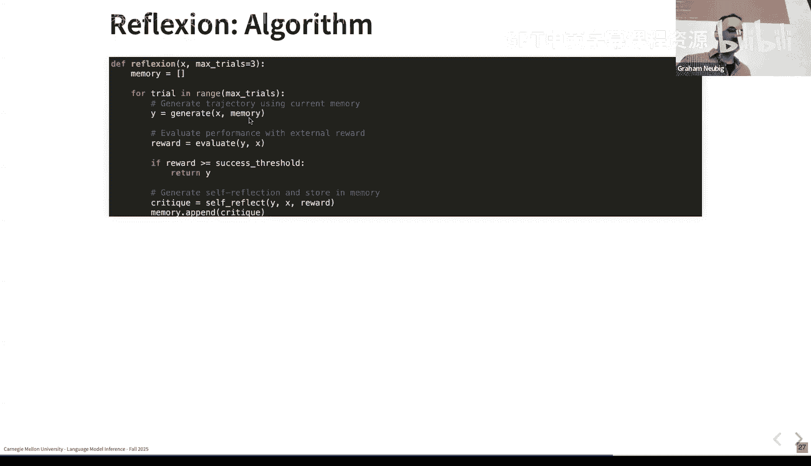

## 进阶方法：反思与工具化评判

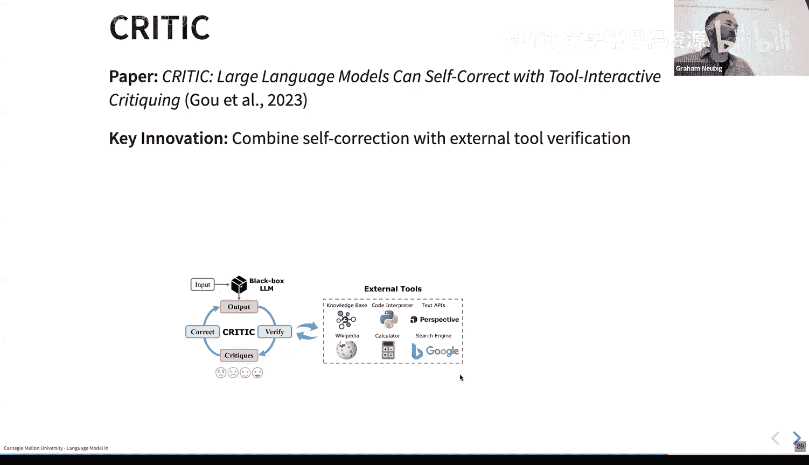

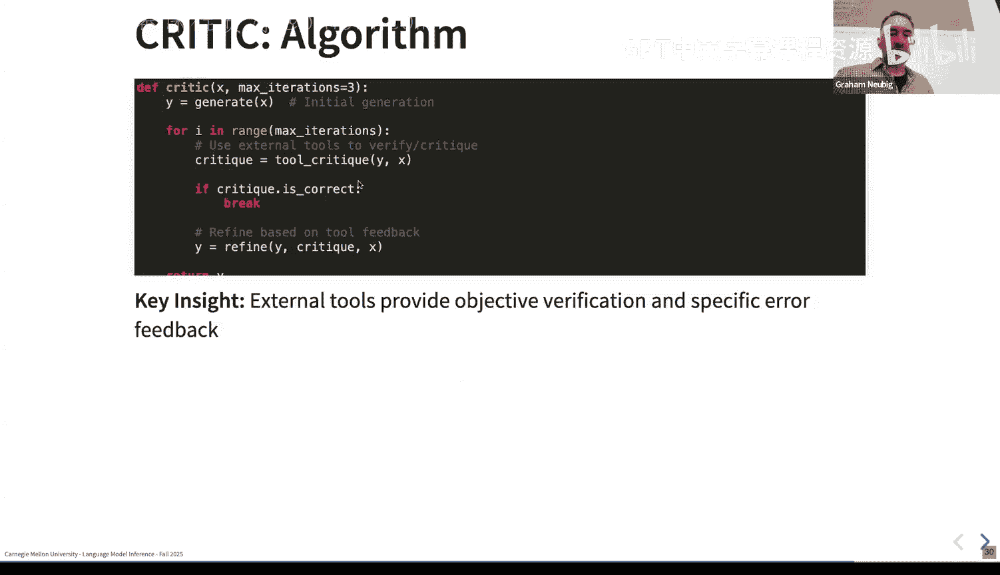

后续研究进一步扩展了这些思想。例如，Reflection 方法不仅进行单步评判，还将历史评判和精炼步骤积累为“记忆”或“经验”，在后续的迭代中加以利用，形成更连贯的优化过程。

另一项工作 Tool-integrated Critic 则专注于在**评判阶段**引入工具。评判者（可以是另一个LLM）被允许调用各种外部工具来验证输出的正确性，例如：
*   用代码解释器检查计算结果。
*   用知识图谱API验证事实。
*   用情感分析API判断语气。
*   用搜索引擎核对信息。

通过为不同任务配备相应的工具，评判的准确性大大提高，从而带动了最终输出质量的显著提升。

## 局限性：并非万能药

值得注意的是，自校正并非总是有效。有论文专门指出其局限性，标题直言“大语言模型尚无法自我校正推理”。

关键的发现包括：
*   **缺乏外部反馈时，内在的自我校正常常失败**，甚至可能因为过度修改或确认偏误（倾向于强化最初的错误推理）而导致性能下降。
*   **模型难以发现自身的错误**，尤其是在它本身就不擅长的领域（如复杂的数学证明、逻辑推理）。
*   成功场景多限于**语法、风格、格式调整**等相对浅层的任务，或者在**有代码执行、事实核查等强外部信号**的辅助下。

因此，在实际应用中，需要仔细评估任务属性和模型能力，以决定是否采用以及如何采用自校正策略。

## 总结

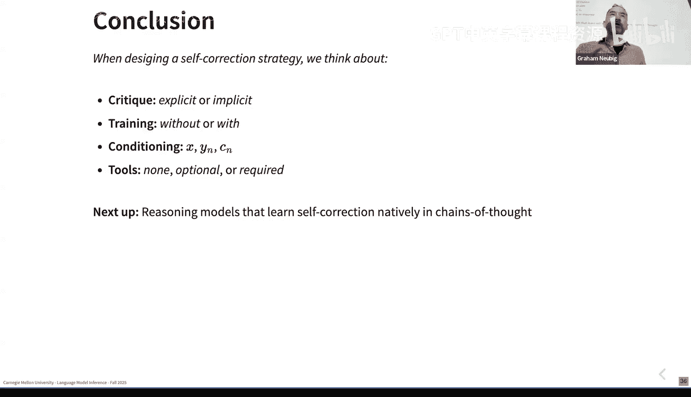

本节课中我们一起学习了语言模型自优化与自校正的各种方法。我们从基本循环框架出发，探讨了从早期需要训练的两阶段模型，到利用编辑历史和编辑向量的结构化方法，再到完全基于提示工程的自优化（Self-Refine），以及引入代码执行（Self-Debugging）和多种外部工具（Tool-integrated Critic）来增强评判可靠性的进阶技术。最后，我们也了解了这些方法的局限性。这些工作为我们设计高效的推理时算法提供了丰富的思路和工具箱，核心考量包括是否引入显式评判、是否需要训练、如何条件化生成以及是否及如何使用外部工具。