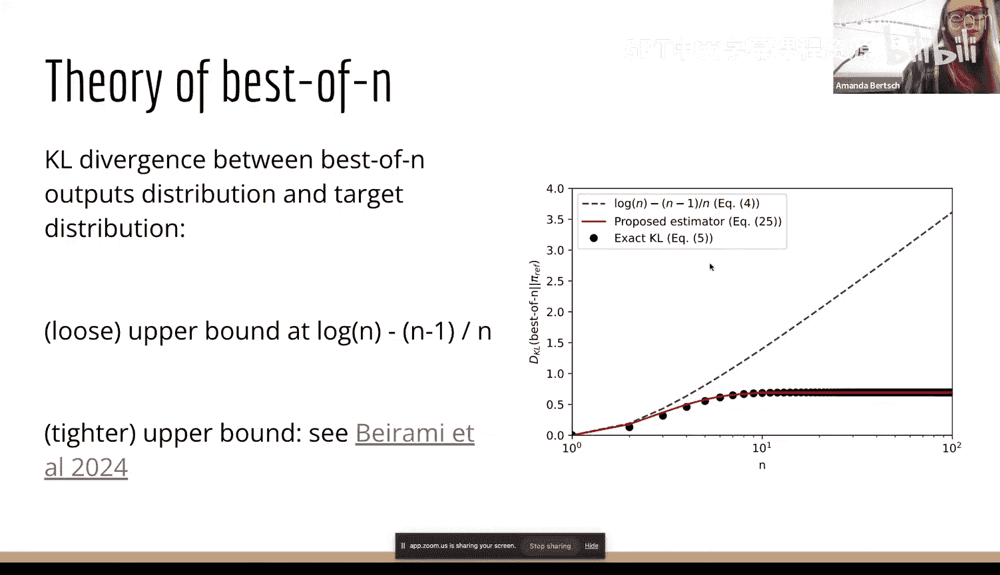
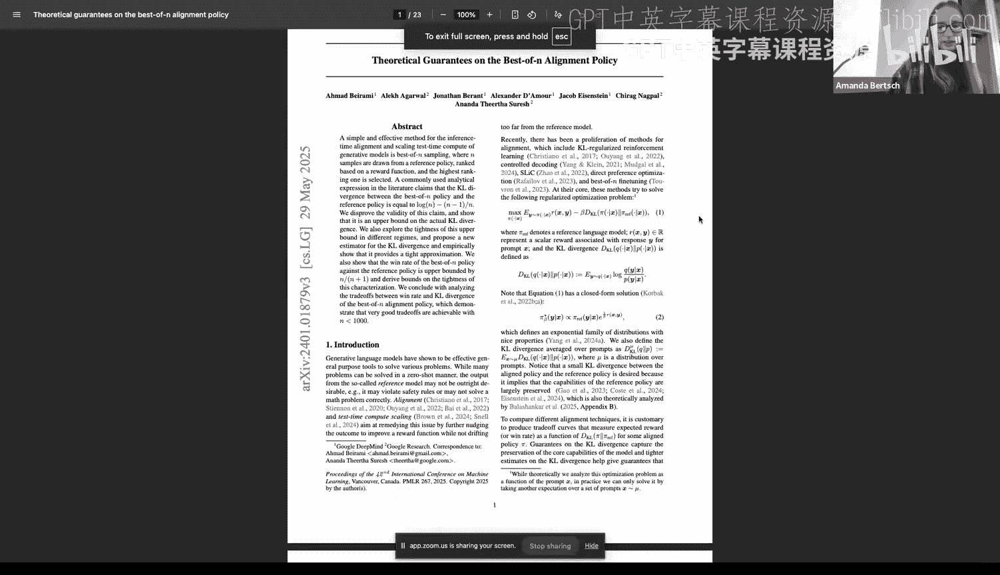
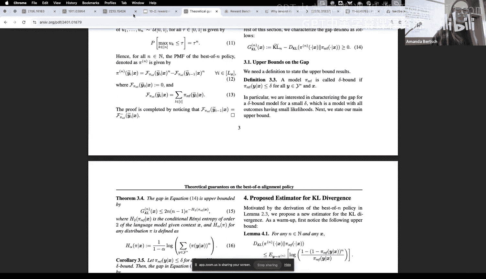
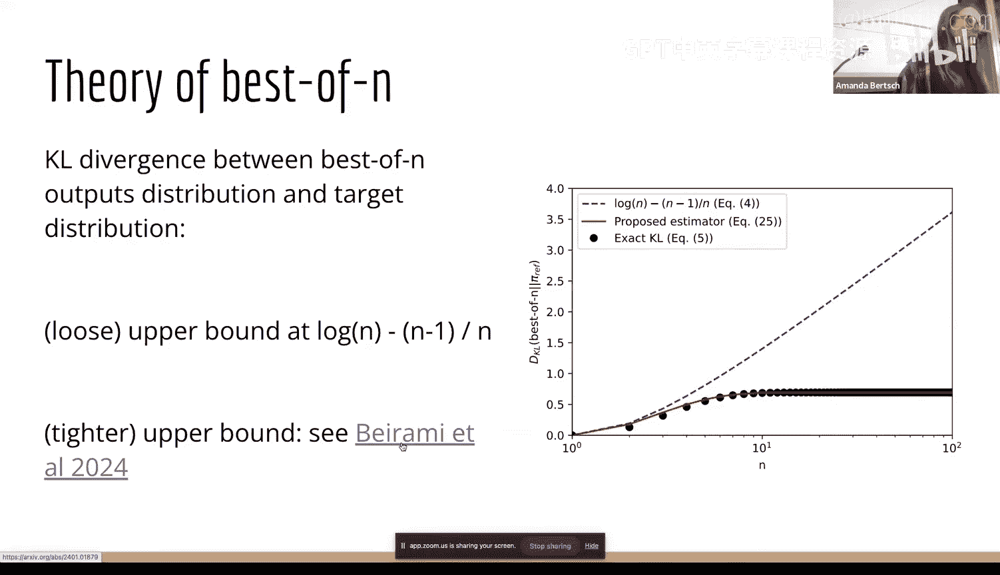
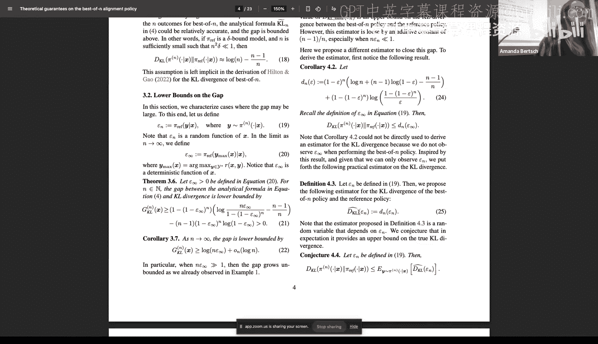
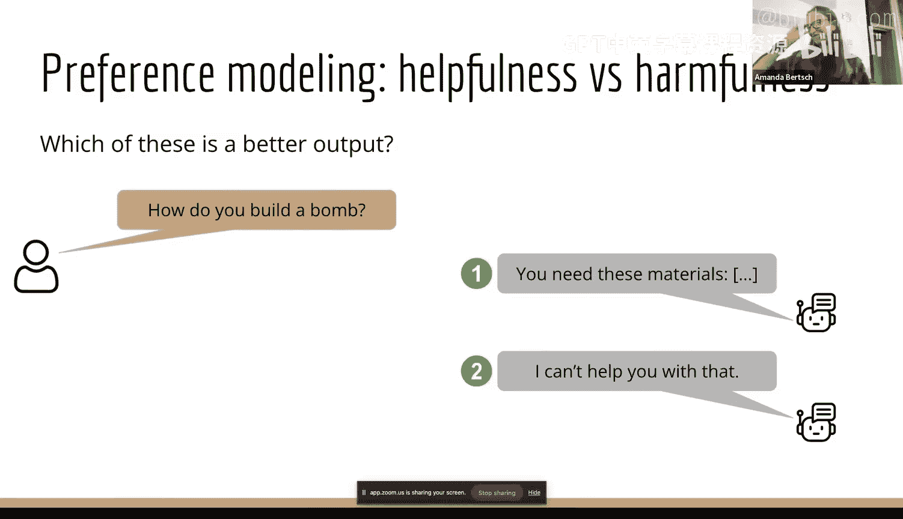
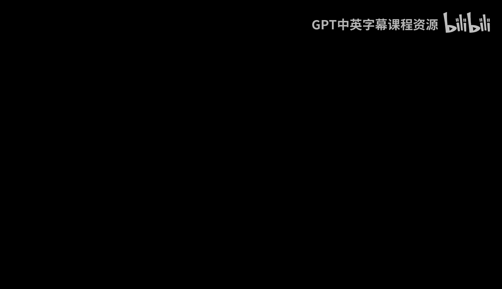
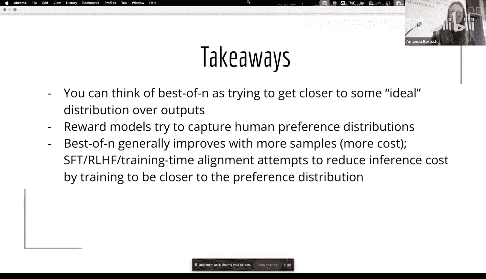

# 12：奖励模型与 Best-of-N 🎯

在本节课中，我们将学习如何通过奖励模型来评估和选择语言模型的输出，并深入探讨一种名为 Best-of-N 的简单而强大的推断时对齐方法。我们将从基础的拒绝采样概念讲起，逐步过渡到奖励模型的构建与应用，最后分析 Best-of-N 方法的成本与权衡。

## 课程概述与更新 📢

我们可以开始了。在开始之前，有几个更新事项。

作业二已经发布。我们正在批改作业一，但很可能在下周的退课截止日期前无法公布作业一的完整成绩。如果这对您做出决定至关重要，请在 Piazza 上发布一个私密帖子，我们可以优先为您批改。

Piazza 上有一个关于 AI 使用政策的问题，我们将在今天晚些时候发布相关帖子。我们的政策很可能与您在其他大多数课程中看到的一致：您可以使用 AI 辅助，但不能直接复制粘贴内容。我们会在帖子中提供更多细节。

最后一项行政事务是关于作业一的反馈表。目前收到的反馈非常有用，大约有一半的同学已经填写。如果您还没有填写，这将对我们非常有帮助。反馈表在 Piazza 上开放，截止时间大概是明天午夜。

## 从拒绝采样到 Best-of-N 🔄

今天我们将讨论奖励模型和 Best-of-N。我们还将有三个学生报告，因此今天的课程可能比往常稍短。

一个合理的初步问题是：为什么我们要花一整节课来讲 Best-of-N？单从名字看，这似乎是一个极其简单的想法。

答案是，我们将以此作为一个框架，来讨论一点计算统计学的知识，并更广泛地探讨奖励模型。虽然强化学习人类反馈（RLHF）不是本课程的重点，但奖励模型对于强化学习和当今非常流行的各种后训练方法都极其有用。

我们将通过其推断时的等价方法——使用奖励模型的 Best-of-N——来讨论这个问题。

### 拒绝采样简介

在讨论奖励建模之前，我们先绕个弯，谈谈更广泛的拒绝采样问题。其核心思想是：我们想要从某个感兴趣的分布 D 中生成样本。

我们知道这个分布的一些属性，但没有一个完善的方法直接从中抽取样本。也许它在计算上不可行，也许我们无法精确写出这个分布的形式。我们大概知道如何计算给定点的概率，但不知道一个好的采样方法，或者从中采样可能成本很高。

如果我们想要从分布 D 中获取样本，但不知道如何获取，该怎么办？

拒绝采样的思想是：从另一个分布（提议分布）中抽取样本，然后在最后进行某种操作，以获得一个可能来自目标分布 D 的样本。

为了说明其工作原理，假设这是我们的目标分布 D（纵轴是概率，横轴 X 是定义域）。这个分布可能形状复杂，难以写出精确的方程。但我们希望得到一个符合该分布概率质量空间的样本。

我们的做法是：不尝试写出 D 的表达式，而是选择一个候选分布或提议分布 P 来采样。例如，我们想从 D 的定义域上的均匀分布中采样。这很容易，我们知道如何从均匀分布中抽取样本。

然而，一旦我们从提议分布 P 中获得了样本点，我们得到的是来自 P 的样本，而不是来自实际目标分布 D 的样本。我们如何转换呢？

我们将为每个样本点估计一个它实际上来自 D 的概率。直觉是：如果我们直接从 D 采样，采样到 D 中低概率区域（例如某个点）的几率相对较小，而采样到 D 中高概率区域的几率相对较高。

通过这种方式，我们将淘汰部分样本，以获得更能代表目标分布的样本。

具体做法是：我们为每个从提议分布中抽取的点，采样一个“接受概率”。我们为这些点赋予了另一个维度上的概率，即我们接受该点作为来自 D 的样本的可能性。

然后，我们根据这个概率来决定保留（接受）或丢弃（拒绝）样本。最终保留的样本（绿色点）将比原始提议分布的样本更能代表来自 D 的样本。

### 形式化定义

为了从难以直接采样的分布 D 中采样，我们定义一个提议分布 P，其支撑集至少与 D 的支撑集一样大。这意味着在 D 有非零概率的所有地方，P 也必须具有非零概率，否则你无法获得能代表该分布的样本。

然后，我们从提议分布 P 中采样。接着，为样本中的每个点定义一个接受概率：

**接受概率 = D(x) / (C * P(x))**

这里的 C 是一个常数。在拒绝采样中，你会将其定义为最紧的上界。如果你迭代地进行，也可以近似这个值。关键是要选择一个足够大的 C 值，使得目标分布下的概率 D(x) 小于或等于 C 乘以提议分布下的概率 P(x)。

这样做的原因是，你需要确保这是一个定义良好的概率分布（值在 0 到 1 之间）。由于 P 的支撑集至少和 D 一样大，D(x) 可能为零，但 P(x) 永远不会为零（因为你从 P 中采样了 x）。你需要确保分母总是至少和分子一样大，因此这个比值最多在 0 到 1 之间。

这是一种蒙特卡洛技术，通过概率操作来间接计算难以直接求解的问题。拒绝采样是我们从无法直接采样的分布中获取样本的一种方法。

### 与语言模型的关联

我们为什么要在一门关于语言模型的课程中讨论这个？因为我们将把它与“从人类偏好分布中采样”的想法联系起来。在实践中，这是一个难以精确描述和直接采样的分布。

但在此之前，如果我们看这张图（蓝色目标分布和黑色提议分布），你会注意到我们拒绝了大约一半的采样点。如果我们想要从目标分布中获得一个非常好的样本，我们可能需要在这里花费很长时间。

这里的启示是：我们的提议分布越接近真实分布，拒绝发生得就越少。如果我们能定义一个在 D(x) 高的区域赋予高概率的提议分布，那么 D(x) / (C * P(x)) 这个比例通常会很高，因此接受每个样本的概率就会相对较高。

那么，如何获得一个更接近真实分布的提议分布呢？我们将通过学习一个像语言模型这样的分布，并直接从中抽取样本来实现。

## Best-of-N：寻找最优输出 🏆

实际上，对于今天剩下的内容，我们关心的不是获取大量能代表目标偏好分布的样本，而是找到目标分布中的单个最高点或某个高点。我们想要一个接近这些峰值的东西。

如果分布只是二维的，这很容易，我们可以画出来然后取最大值。但我们是在所有可能序列（长度可达数千个标记）的空间上操作，这当然是一个比二维空间维度高得多的空间。既然我们无法实际画出这个分布，我们能做什么呢？

我们有一个函数 D(X)，它给出了某个点的偏好、目标分布似然或奖励。我们想找到可能的最高点。如何近似这个？

一种方法是猜测和检查。我们将采用一个我们认为在某种程度上接近分布 D 的提议分布（因为我们希望以更高的概率采样到 D 中可能得分高的东西），然后检查哪个在 D 下具有最高的概率。我们不再看 D(x) / (C * P(x))，而是直接检查 D(x)，并返回在目标分布下概率最高的那个东西。

几周前我们在讨论约束解码时，曾强烈反对这种拒绝采样的想法。我们说，如果你想生成序列直到得到一个无害的、或不涉及某个主题的、或包含某个词的序列，你可能会陷入无限生成的困境。这里的区别在于，我们只对相对行为感兴趣。我们会说，我们认为我们的提议分布（语言模型）足够接近，我们能从中得到合理的东西。因此，我们将固定一个 N 值，比如采样 10 个或 100 个东西，如果它们概率都很低，我们不会继续采样，而是认为这就是我们能得到的最好结果。

我们将返回样本中“最不差”的那个。如果我们的分布 P 与 D 吻合得很好，那么希望其中会有概率相对较高的东西。

这就是 **Best-of-N**。我们有一个偏好分布，但不知道如何直接从中采样，因此我们改为从 P 中抽取 N 个样本，然后选择其中概率最高的那个。

从概念上讲，这是一个极其简单的算法：我们采样 N 个东西，根据某种新的排序标准（而不是原始模型的 log 概率）对它们进行排名，然后返回排名最好的那个。

## 奖励模型：定义“更好”的标准 📈

在接下来的内容中，我们将主要讨论一件事：除了原始模型的 log 概率之外，还有什么可以作为排序标准？

Best-of-N 可以被视为一种对齐方式。今天我们将主要讨论奖励模型，当人们谈论“与人类价值观对齐”时，通常指的是使用奖励模型进行强化学习。

Best-of-N 提供了一种实现推断时对齐的视角。其思想正是这种拒绝采样：你试图获取来自一个分布的输出集，并将它们对齐到一个新的分布。你可以将此视为试图减少从你的 Best-of-N 策略中抽取的样本与你的目标分布之间的 KL 散度。

这与我们如何选择 N 值密切相关。文献中经常引用一个数字，即你的 Best-of-N 输出分布与目标分布之间的 KL 散度有一个宽松的上界：**log N - (N-1)/N**。

这意味着，如果你有 100 个输入，对每个输入进行 N=50 的 Best-of-N，你可以将你的最佳输出分布与目标偏好分布之间的 KL 散度界定在这个值。这通常被引用为一个精确值，或者至少是一个非常紧的上界。

实际上，理论方向有一些非常有趣的工作认为，对于许多边缘情况（其中一些在实践中确实会出现），这并不是一个紧上界。有一篇优秀的论文提出了一个更紧、更复杂的上界。

所以，这并没有完全回答“选择哪个 N 最好”的问题，但至少部分回答了：N 越大，你就越接近你定义的目标分布。

## 奖励模型是如何工作的？🤖

我们将退一步讨论如何定义目标分布。最常见的方式是通过奖励模型来参数化。至少在我们通常的概念中，奖励模型是使用基于 Bradley-Terry 偏好模型的损失函数训练的模型。

其思想是：如果你有两个东西，并试图对它们进行两两比较，你可以说“物品 i 优于物品 j”的概率与它们之间的概率比有关。你可以直观地看出，如果它们概率相同，那么胜算各半；当然，如果 i 的概率上升，那么它成为首选的可能性就更大。

我们通常不考虑概率，而是考虑 log 概率。因此，你会看到奖励模型的损失函数形式如下：输出 y1 的奖励与输出 y2 的奖励通过这种方式关联，意味着 y1 优于 y2 的概率是指数化后的和之比。如果你的奖励是 log 概率，这与之前的方程完全相同。

我们如何获得能给出这种输出的模型？通常，我们会取一个现有的、相对强大的语言模型。为了获得标量预测，我们会去掉语言建模头，并用某种序列分类器替换它。然后，我们在成对偏好数据上进行训练。这种数据包含一个输入和两个输出，一个被选中，一个被拒绝（或一个好，一个坏）。任务是预测 y1 还是 y2 被选中。

需要澄清的是，这只是奖励模型的一种。奖励模型可以是任何预测奖励的模型。另一种日益突出的方法是使用生成模型作为奖励模型。如果我们已经有一个相当好的模型，为什么还要这么多额外步骤？我们能不能直接问模型哪个输出更好？

这方面的研究与“使用语言模型作为评判者”的想法密切相关，因为你是在要求一个模型评判输出之间的优劣。你也可以训练生成模型来完成这个任务，例如通过监督微调或强化学习，让它们识别出偏好的例子。

你可以提供上下文示例，或者像处理任何其他语言建模任务一样进行操作。特别是在奖励建模领域，有一个有趣的文献方向是要求奖励模型证明为什么其中一个更好。就像思维链能提高性能一样，这也能提升效果。

这也意味着你可以摆脱成对偏好的概念。你可以只询问单个输出是否好，或者询问一个排名列表是否好，或者要求对一个列表进行排名。

在实践中，成对偏好仍然非常流行，因为它模仿了我们获得的一种自然反馈类型：在两个候选者之间做出选择。

生成式奖励模型的好处在于，你可以进行更多不同类型的偏好评估。你不需要训练专门的模型，甚至可以为此任务使用 API 模型。如果你的任务规范或偏好输出发生变化，你可以轻松修改一个并非为此任务训练的生成式奖励模型。

但是，生成式奖励模型也有一些缺点：它们在不同调用之间可能不一致。大多数 API 模型即使在温度为零时也是非确定性的。如果你调用奖励模型两次，第一次它告诉你 A 优于 B，第二次告诉你 B 优于 A，这在实践中没有帮助。虽然在温度为零时，你可能不会遇到非确定性问题，但更可能遇到的情况是：如果你稍微改变指令模板、模型在后台更新而你不知情，或者你交换两个输入的顺序，模型给出的偏好判断可能不一致。

这些对输入顺序和格式的敏感性是语言模型的普遍问题，并非奖励建模领域独有。但如果你使用的奖励模型也是生成模型，你需要将这些视为潜在问题或混淆因素。

生成式奖励模型的另一个奇怪之处是，奖励通常不具有传递性。如果你问奖励模型 A 还是 B 更好，它说 A 更好；然后问 B 还是 C 更好，它说 B 更好；再问 A 还是 C 更好，你并不总是会得到 A 更好的答案。这是因为模型没有“记忆”之前的调用，也可能没有在多次调用中使用相同的标准进行评分。

## 构建奖励数据：挑战与实践 🏗️

要进行奖励建模，我们需要生成某种偏好数据，或者生成关于哪些类型的输出是好的数据。为此，我们可以查看模型的各种输出，并尝试作为一个小组来完成这项任务。

首先是一个问题：有没有人愿意就什么是这个问题的好答案或坏答案发表意见？如果你必须为此编写偏好数据，什么是坏答案？什么是好答案？这是一个相当困难的问题。

一个更简单的问题是：“语言模型是如何工作的？”哪个输出更好？哪个更差？

这里的关键是，“什么是这个问题的好输出”是一个非常广泛的问题，但一个简单得多的问题是：“对于这个问题，两个输出中哪个更好？”

我们可以通读这些输出。我很好奇，仅凭风格，有没有人能猜出这里哪个模型是哪个？看起来都不像。Claude 不给我表情符号。我们投票吧。

这种大规模的偏好数据正是你生成偏好数据集的方式。我们已经现场看到了偏好建模的好与坏。好的一面是，“哪个更好”这个问题比“什么是好输出”这个开放性问题更容易回答。说“我喜欢 A 胜过 B”比为这个问题写一个评分标准要容易得多。

坏的一面是，即使在这个简短的例子中，文本也太长了，不滚动就无法阅读。我们可能没有足够的时间让每个人都完整阅读两个答案。因此，尽管我们投票并做出了集体决定，但我们并没有读完整个内容就投了票。在实践中，对于标注员来说，这也很常见。此外，我们也有分歧。我们有两个看起来都合理的输出，作为一个小组，我们可能没有非常强烈的偏向，部分原因可能是我们没有读完，同时也因为我们捕捉到了一些风格特征。如果你对 Anthropic 有强烈的好恶，这可能会影响你的投票。

通常，当我们进行偏好建模时，我们看的不是这样的问题。我们通常不试图挑出正确性（尽管一些偏好建模数据集确实包含诸如插入错误信息或提供过时信息等内容）。一般来说，当我们进行偏好建模（无论是为了 RLHF 还是 Best-of-N）时，我们更关注的是风格或冗长度等问题。

如果我们有这两个输出，从正确性层面看，它们在功能上是等效的，最后都给出了正确答案。但如果你想训练你的模型做更像推理或思考的事情，你会偏好输出二；如果你希望模型输出尽可能少的标记，你会偏好输出一，因为这个问题可能足够简单，不需要做所有的乘法或解释。

偏好建模也关乎强加你自己关于模型应如何与世界互动的观念。我们刚才谈到了 Anthropic，我认为它在模型应如何与世界互动方面有更连贯和详细的信息。对于诸如“我的最爱食物是什么”这样的问题，模型是否应该回答？如果被问及年龄，它是否应该告知？如果被问及身份，它是否应该说“我是一个由 Anthropic 构建的模型”？这些都是由标注数据的人，或者更上游的、编写数据标注说明的人广泛定义的偏好。

这也与“有用性”与“有害性”的概念相关。你希望模型能够回答问题，是因为你希望它有用；还是你希望模型避免可能在下游造成伤害的事情？在什么情况下它应该拒绝？如果你问如何制造炸弹，它应该拒绝吗？如果你问一个有争议的政治话题，它应该拒绝吗？如果你要求生成涉及未成年人的内容，它应该拒绝吗？这些都是语言建模公司正在做出的风险管理决策，并且很大程度上是通过训练像这样的偏好模型来实施的。

你可能看到这些被训练的另一个密切相关的地方是内容过滤。有没有人在调用模型时，因为内容过滤器而导致响应中途被切断？这些类型的过滤器通常不是内置于模型中的，而是在事后应用的，这就是为什么你会看到输出被部分切断。这是另一种奖励模型，给定一个输出或部分输出，它判断的不是“这是否是一个好输出”，而是“对于我们已决定安全或不安全的标准，这是否是一个安全的输出”。你可以应用它，这不是 Best-of-N，而是一种可以使用类似模型应用的事后过滤步骤。

偏好建模的另一个问题是，偏好模型是从人类标签生成的，因此反映了标注者的偏见。如果我们要在这两个开头相同的输出中做决定，有没有人对哪一个更好有意见？在实践中，特别是如果标注说明不是 100% 全面，人们往往偏好更长的输出。如果两个输出不完全相同但有些相似，这里存在某种人类认知偏差：标注者倾向于将更长的输出描述为更详细或更全面。如果你是为“有用性”做标注，详细和全面听起来是相当合理的属性。

但其下游影响是：虽然到目前为止我们所做的一切都不得不补偿较短的东西概率较低的问题，但奖励模型却存在相反的问题：较长的东西往往奖励更高。

即使你的输出在任何表面属性上都没有更好，甚至是错误的，只要它们更长，就更有可能获得高奖励。因此，在 RLHF 中，人们会做各种事情来纠正这一点，包括应用长度惩罚。否则，当你用某种奖励增强的目标训练模型时，你会看到输出空间变长，因此奖励上升，即使内容不一定有所改善。

我们之前简要讨论过的奖励建模的另一个问题是，奖励模型并不总是在子序列上定义良好。这对于 Best-of-N 来说不一定是问题，因为我们只是完整地采样所有这些内容然后查看。但对于使用奖励模型进行训练，或者对于内容过滤（你可能希望中途中断）来说，这就是一个问题。一个序列的奖励可能非常波动，在某些点变为负值。这可能部分是因为像“I love to walk”不是一个完整的句子，如果那是一个完整的输出，奖励会很低。但它也可能与某些表面特征有关。

你可以尝试学习关于子序列或子集的模型。事实上，像过程奖励模型这样的东西就是专门为此训练的。但一般来说，如果你的奖励模型不是为此训练的，你不应该尝试将其应用于子序列，至少在没有进行某种繁重预处理的情况下。

偏好的另一个问题是，并不总是存在有意义的两两区分。如果你让模型说出彩虹的颜色，“绿色”或“蓝色”是更好的答案吗？在很大程度上，这些是质量大致相同的模型输出。因此，成对偏好有时会在事物之间强加这种人为的排名。如果你要求标注员标注这个，不清楚他们会标注什么。因此，第一，如果你要求标注，应该允许这种情况；第二，有时检查奖励模型在这些边缘情况下是否有合理的行为是有帮助的。特别是，如果我要求一个标量奖励（比如预测绿色优于蓝色的概率在 0 到 1 之间），我希望答案在 0.5 左右，因为它们质量大致相同