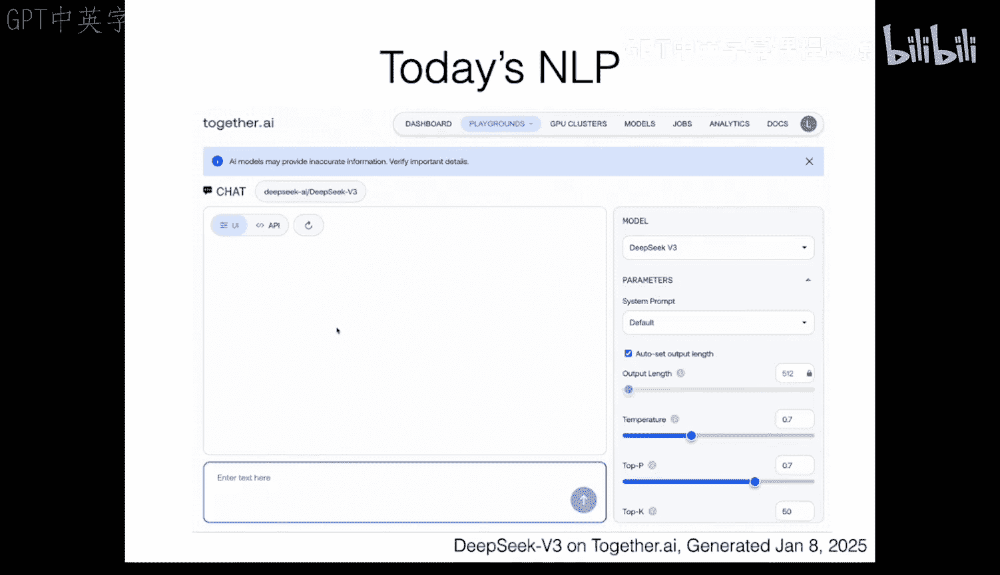
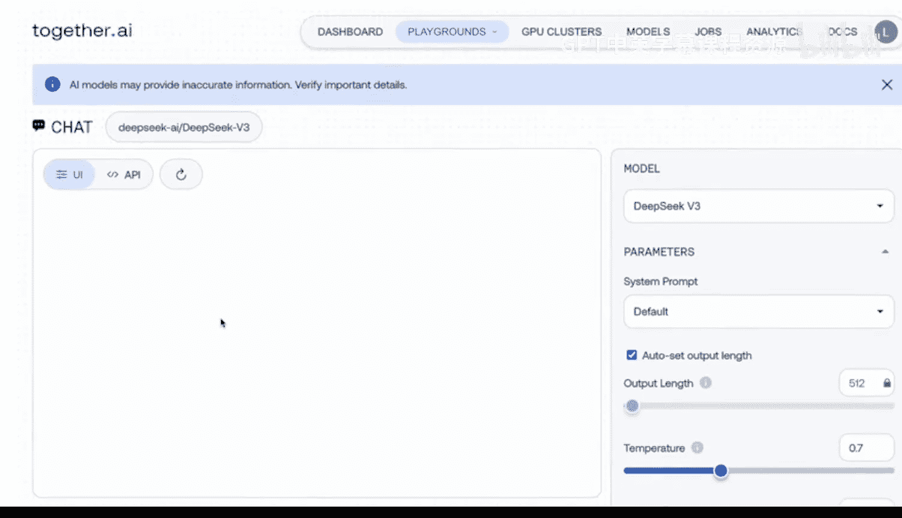
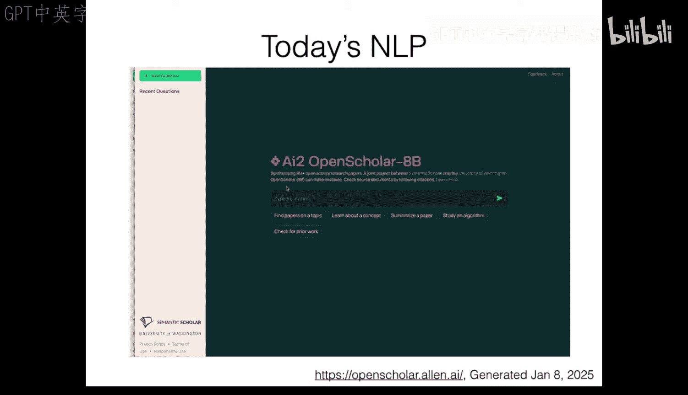
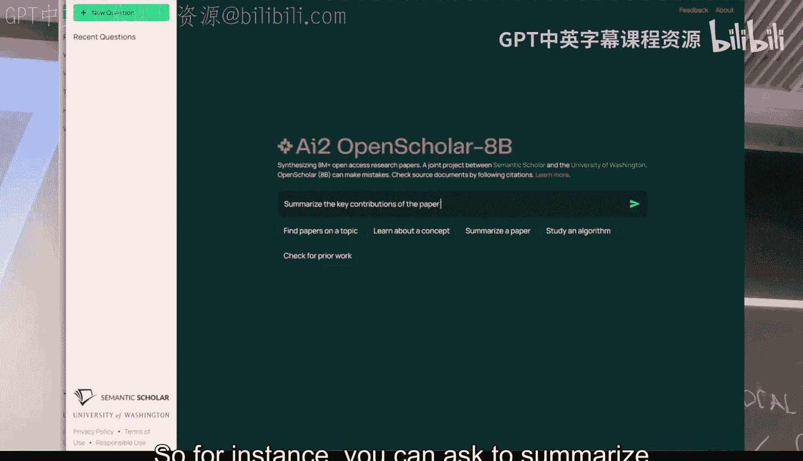
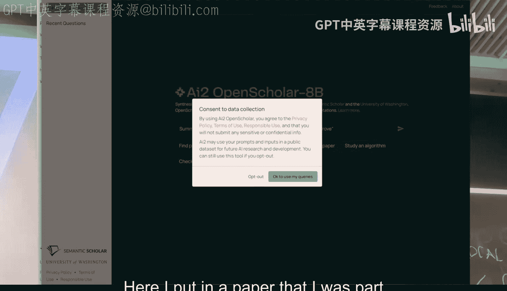
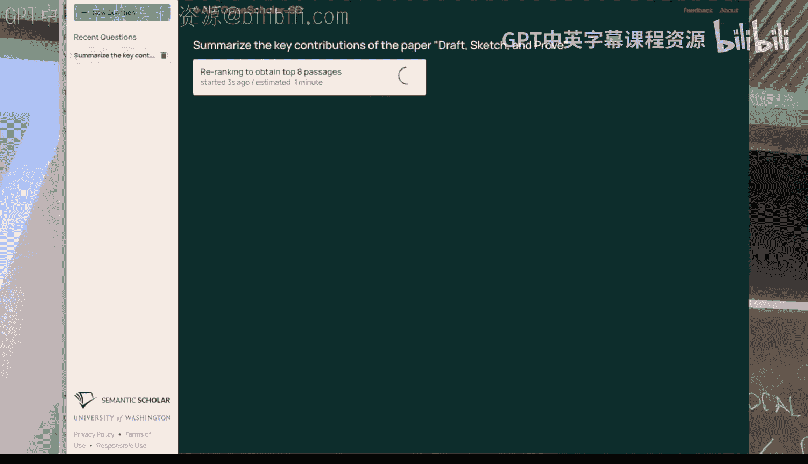
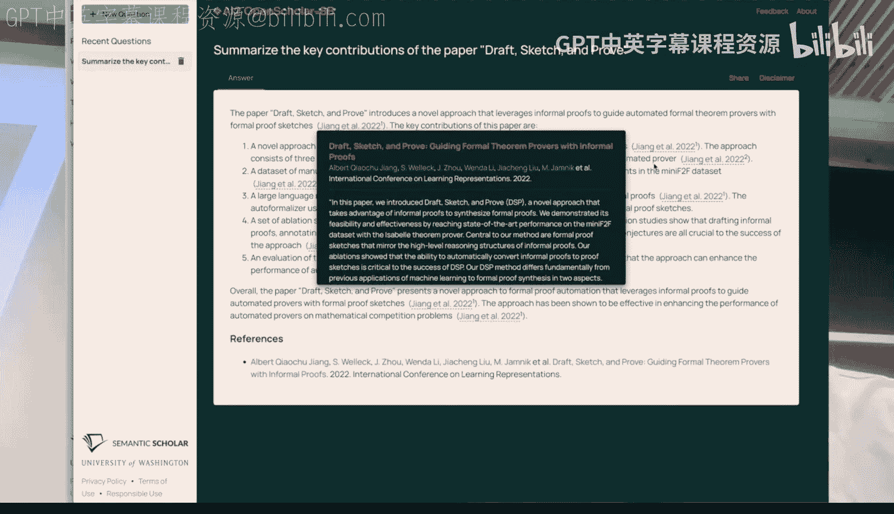
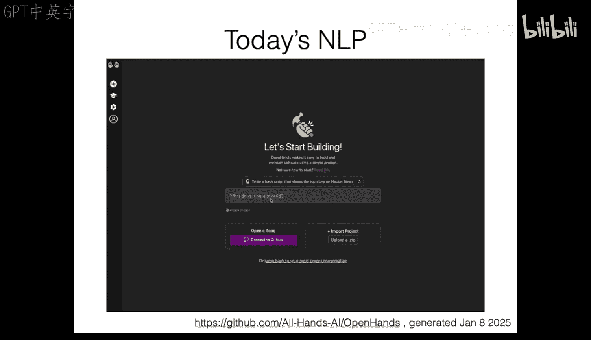
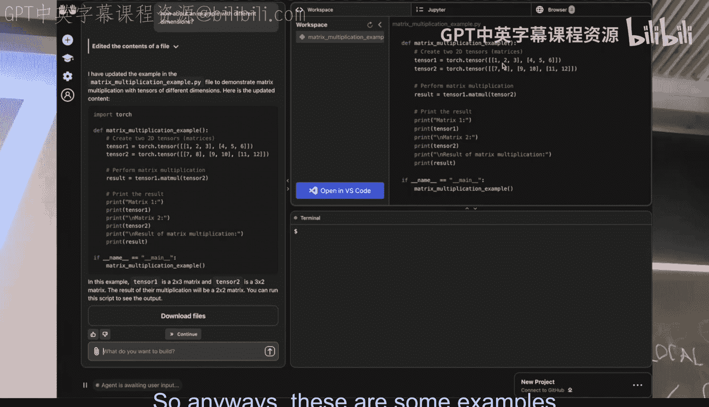
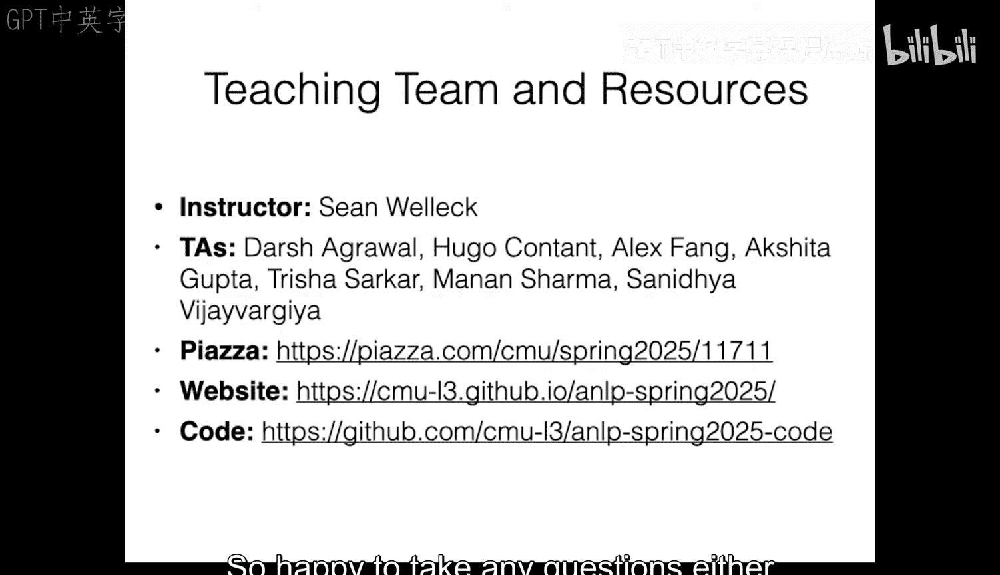

# 01：课程介绍与NLP概述 🚀

在本节课中，我们将要学习什么是自然语言处理，并了解构建NLP系统的不同方法。我们将从一个简单的基于规则的系统入手，逐步过渡到机器学习方法，为后续深入学习奠定基础。

## 什么是自然语言处理？

自然语言处理是一门技术，它使计算机能够处理、生成自然语言文本并与之交互。其核心方面包括：
*   **学习有用的语言表示**：为下游任务学习有效的语言表征。
*   **生成语言**：创建文本或代码，用于对话、翻译或问答等场景。
*   **作为更大系统的一部分**：语言可以作为与环境交互、获取视觉观察并最终采取行动的更大系统的一部分。



## 现代NLP系统示例

以下是当前NLP系统的几个示例，它们展示了该领域的强大能力。









### 示例一：大型语言模型（DeepSeek-V3）
该系统能够根据提示生成包含多种语言和代码的文本。例如，当要求生成一段展示其能力的文本，并包含英语、日语和Python代码时，模型可以快速生成相应的内容并执行代码。








### 示例二：学术文献助手（OpenScholar）
该系统能够根据科学文献内容回答问题。例如，当输入一篇论文并要求总结其关键贡献时，系统会从数据存储中检索相关信息，并使用语言模型生成高质量的摘要。

### 示例三：软件工程代理（OpenHand）
该系统能够根据自然语言指令执行软件工程任务。例如，当要求学习PyTorch中的矩阵乘法并创建示例文件时，代理会浏览文档、生成代码示例，并能根据后续请求修改代码。



这些系统背后都有学术论文支撑，本课程将涵盖构建这些系统所需的基础概念。

## 构建NLP系统的高层视角

构建NLP系统的目标是创建一个函数，将涉及语言的输入X映射到输出Y。常见的任务包括：
*   **语言建模**：给定文本，预测后续内容。
*   **翻译**：将一种语言的文本转换为另一种语言。
*   **文本分类**：为文本分配一个标签。
*   **语言分析**：从文本中提取结构。
*   **图像描述**：输入图像，输出描述性文本。

构建此类系统主要有三种方法。

### 方法一：基于规则
人类利用领域专业知识和直觉，手动定义函数规则。例如，构建一个文本分类器来判断文档是否与体育相关。

```python
# 一个简单的基于规则的体育分类器示例
sports_keywords = [“篮球”, “足球”, “比赛”]
def rule_based_classifier(text):
    for keyword in sports_keywords:
        if keyword in text:
            return “体育”
    return “其他”
```

### 方法二：提示
使用一个通用的语言模型，通过提供指令（提示）来引导其完成任务。例如，通过提示让语言模型判断句子是否与体育相关。

```
提示：如果以下句子是关于体育的，请回复“体育”，否则回复“其他”。
句子：昨晚的篮球比赛非常精彩。
```

### 方法三：基于机器学习（训练）
收集特定任务的数据集，通过调整模型参数从数据中自动学习函数。这通常需要将数据分为训练集、开发集和测试集。

这三种方法对数据的需求不同：基于规则和提示法原则上可以无需数据，但为了评估和调整，通常需要一些数据进行抽查或构建开发集；而训练方法则需要专门的训练数据来学习参数。

## 实践：构建一个基于规则的情感分析系统

为了更具体地理解构建过程，我们通过一个情感分析任务来演示基于规则的系统构建。任务目标是判断一条影评的情感是积极、消极还是中性。

构建过程分为三个步骤。

### 步骤一：特征提取
将原始文本（如影评）转换为可供处理的数据结构（如数值向量）。我们手动定义“好词”（如love, good）和“坏词”（如hate, bad）列表，并统计它们在文本中出现的次数。

### 步骤二：计算得分
为每个情感类别计算一个得分。我们手动设置权重（如好词权重为1，坏词权重为-1）和偏置项（如0.5），然后通过加权和计算最终得分。

**公式**：`score = (count_good * weight_good) + (count_bad * weight_bad) + bias`

### 步骤三：做出决策
根据得分决定情感类别。例如，得分大于0为积极，小于0为消极，等于0为中性。

在一个示例数据集上运行这个简单分类器，准确率约为43%。通过分析错误案例，我们发现了一些局限性。

## 基于规则的系统的局限性

上一节我们介绍了如何构建一个简单的基于规则的系统，本节我们来看看这种方法面临的主要挑战。

*   **低频词处理**：难以手动覆盖所有词汇，尤其是低频词。
*   **词形变化**：无法有效处理单词的不同形态（如loved, loving）。
*   **否定处理**：难以捕捉复杂的否定逻辑（如“not nearly as dreadful”）。
*   **隐喻与类比**：无法理解非字面含义的表达。
*   **多语言支持**：为每种语言重新构建系统工作量巨大。

这些局限性促使我们转向更强大的机器学习方法。

## 迈向机器学习：词袋模型

机器学习方法的核心是利用数据集（训练集、开发集、测试集）通过学习算法自动获得特征提取器和权重参数，并通过推理算法进行预测。

一个初步的尝试是**词袋模型**。其核心思想是：
1.  将每个单词（词元）表示为一个**独热编码向量**。
2.  将句子中所有词的独热向量相加，得到一个特征向量。
3.  学习一个权重向量（或矩阵，用于多分类），与特征向量做点积得到每个类别的得分。

**代码概念**：
```python
# 假设词汇表为[“I”, “love”, “this”, “movie”]
# 句子“I love movie”的特征向量为 [1, 1, 0, 1]
# 学习到的权重向量 W = [w1, w2, w3, w4]
# 得分 score = [1, 1, 0, 1] · [w1, w2, w3, w4]
```

使用一种简单的学习算法（如结构化感知机）训练后，该模型在开发集上的准确率提升至约58.8%。通过检查权重，我们可以发现模型可能学习了某些虚假特征（如“might”在训练集中与负面评价偶然关联），导致了**过拟合**现象（训练集准确率75%显著高于开发集）。

## 词袋模型的不足与改进方向

尽管词袋模型比手动规则进了一步，但它仍存在明显缺陷：
*   **忽略词序**：“词袋”之名即源于此。
*   **未解决词形变化**：“love”和“loved”被视为完全不同的词。
*   **缺乏词义相似性**：无法理解“good”和“great”的相似性。
*   **难以处理组合特征**：如“don‘t love”需要结合多个词的信息。
*   **未利用句子结构**：忽略了语法和句法信息。

为了解决这些问题，我们需要更强大的模型。

## 神经网络：更强大的表示学习

神经网络提供了更强大的解决方案。其核心思想是在流程中引入更多可学习的组件：
1.  **词嵌入**：不再使用独热编码，而是为每个词元学习一个稠密的向量表示。这个向量能够捕捉语义信息。
2.  **深度特征提取**：将这些词向量输入一个复杂的神经网络（如循环神经网络RNN或Transformer），网络可以学习到比简单求和更好的句子或文本表示。

这种“学习表示”的思想是现代NLP系统（包括大型语言模型）的核心。即使是最先进的模型，其基本流程也与此类似：输入词元 -> 计算中间表示 -> 通过输出层得到预测结果。

## 课程路线图

本课程将围绕几个核心主题展开。

### 第一部分：基础与序列建模
我们将深入探讨如何表示单词（分词）、语言建模问题（从计数模型到最先进模型），以及序列建模架构（如RNN和Transformer）。你们将在作业中动手构建一个类似LLaMA的Transformer语言模型。

### 第二部分：训练、推理与上下文学习
我们将涵盖现代系统的训练与推理方法、上下文学习/提示、预训练、微调以及强化学习。

### 第三部分：评估与研究技能
我们将学习如何评估文本生成系统、进行实验设计、处理人工标注数据，以及使用调试和可解释性技术。

### 第四部分：高级主题与应用
课程后半部分将调研当前的研究热点和工业界重要方向，包括：
*   高级预训练与后训练技术。
*   检索与检索增强生成（RAG）。
*   长序列处理策略。
*   效率优化（如量化和蒸馏）。
*   模型集成与混合专家系统。
*   复杂推理、智能体、多模态NLP、多语言NLP以及偏差与公平性等应用与社会影响。

## 课程形式与要求

*   **课前/课后阅读**：课程网站提供推荐阅读材料（用于深化理解）和参考文献列表。
*   **课堂互动**：鼓励随时提问，课程包含代码/数据讲解环节。
*   **课后测验**：每节课后有相关测验，用于巩固知识。
*   **作业安排**：
    1.  **作业1（个人）**：构建并微调自己的LLaMA风格语言模型。
    2.  **作业2（小组）**：构建一个复杂的检索增强生成系统。
    3.  **作业3（最终项目第一部分）**：文献调研与基线结果复现。
    4.  **作业4（最终项目）**：完成一个研究型项目，提交报告并进行海报展示。

## 总结



本节课我们一起学习了自然语言处理的基本定义，了解了当前强大的NLP系统实例。我们通过构建一个简单的基于规则的情感分析系统，直观感受了其构建流程与局限性。接着，我们探讨了如何通过机器学习方法（如词袋模型）进行改进，并指出了其不足。最后，我们引入了神经网络作为更强大的解决方案，并概述了本课程将涵盖的基础概念与高级主题。从下节课开始，我们将深入探讨词表示与语言建模的细节。