# 02：神经文本表示与分类 🧠

在本节课中，我们将学习如何用神经网络来表示文本并进行分类。我们将从基础的词袋模型出发，探讨其局限性，并介绍三种关键技术来克服这些局限：子词模型、连续词嵌入和神经网络模型。我们还将学习训练神经网络所需的核心概念，包括损失函数和梯度计算。

---

## 课程管理与回顾

首先，关于课程候补名单，这是一个自动化的流程，我无法进行个人干预。如果你在候补名单上，暂时无法加入 Piazza 或 Canvas。课程允许最多放弃两次测验成绩，并且总成绩计算时会自动放弃最低的三次测验成绩。因此，即使错过五次测验，理论上也能挽回所有成绩。如果你成功从候补名单中移除，请给我和助教发邮件，以便将你添加到 Piazza 和 Canvas。如需放弃测验成绩，请在 Piazza 上发帖，我们会手动处理。

上一讲我们介绍了一个非常简单的分类器，称为**词袋模型**。我们将词元表示为独热向量，然后求和得到特征向量。我们讨论了这种模型的一些缺陷，例如：
*   无法处理词形变化或复合词。
*   无法捕捉词之间的相似性（如“love”与“adore”）。
*   无法处理组合特征（如“don‘t love”和“don’t hate”）。
*   无法处理句子结构。

本节课，我们将介绍三种技术来克服部分缺陷，下一讲将介绍第四种。
1.  **子词模型**：帮助解决词形变化或复合词问题。
2.  **连续词嵌入**：捕捉词之间的相似性，并带来其他好处。
3.  **神经网络模型**：提供多种优势，其中之一是能够捕捉组合特征。

接下来的课程中，我们将介绍能够建模完整序列并捕捉句子或文档级结构的方法。

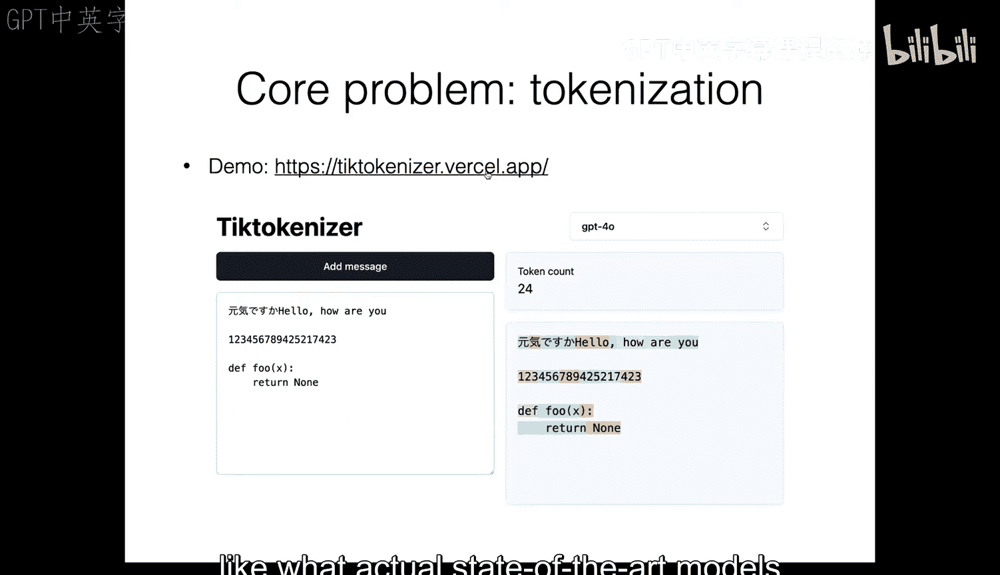

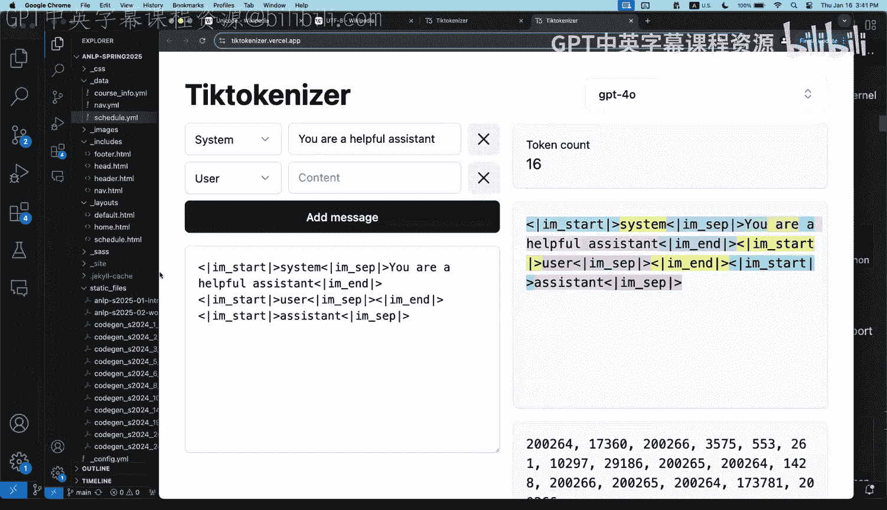

---

## 子词模型 🔤

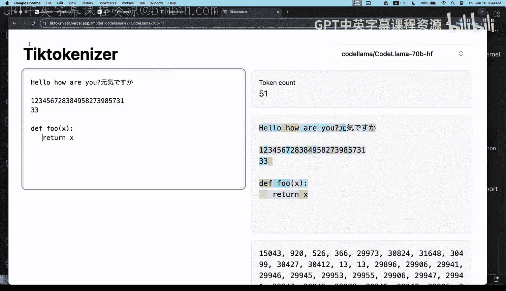

本节中，我们来看看如何将单词拆分成更小的单元，即子词。基本思想是，我们不再将句子中的每个单词视为一个整体，而是将其拆分成多个词元。

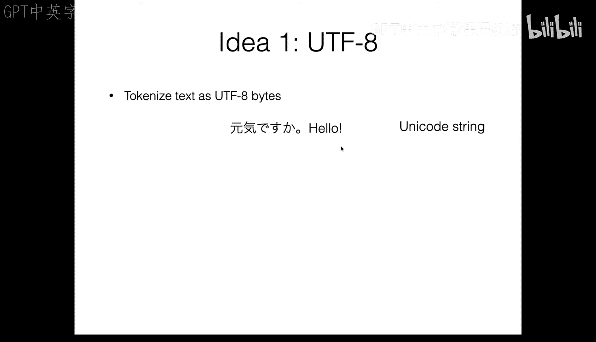

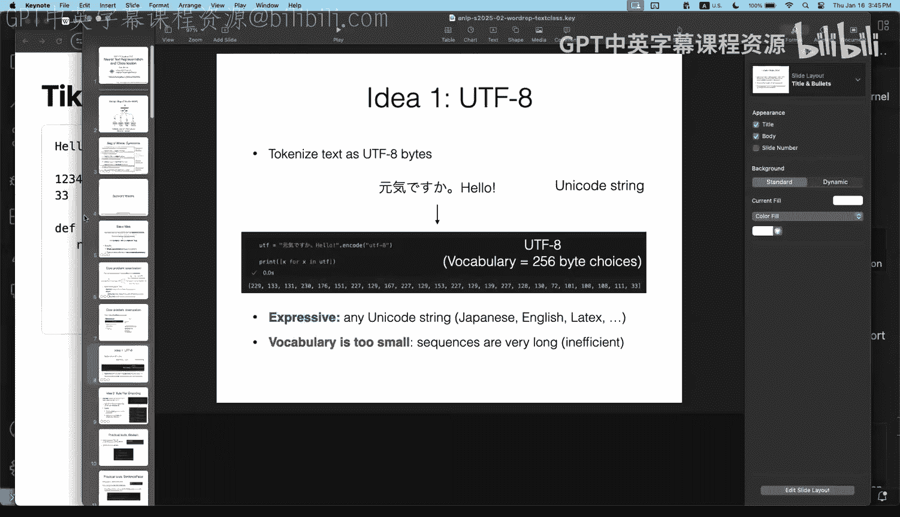

例如，句子“The companies are expanding”中的单词“companies”可以被拆分为“com”和“panies”两个词元，“expanding”可以被拆分为“exp”和“anding”。这样，不同的词形变化（如“expand”，“expands”，“expanded”）可以共享一些子词（如“exp”），从而实现参数共享。同时，这也有助于减少参数量，节省计算和内存资源。

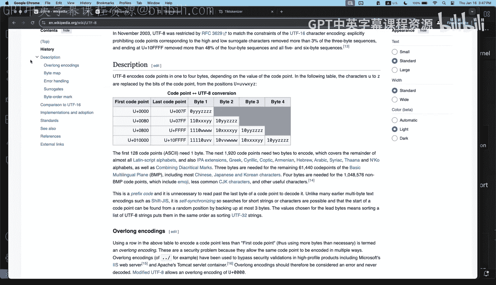

这引出了一个核心问题：**分词**。其目标是将原始文本序列转换成一个词元序列。所有可能词元的集合称为**词汇表**。

有多种分词策略：
*   **按空白字符分割**：这是我们上节课使用的方法。
*   **子词分割**：如上所述。
*   **字符级分割**：将每个字符作为一个词元。

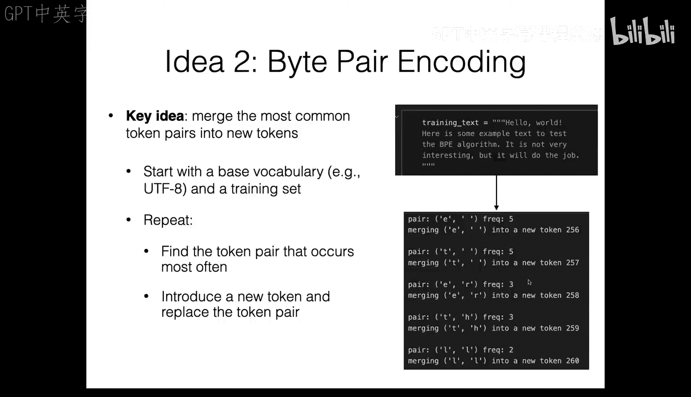

我们需要一个既**富有表现力**（能处理多种语言和代码）又**高效**（词汇表大小和序列长度适中）的分词方案。在实践中，我们通常选择介于单词级和字符级之间的方案。

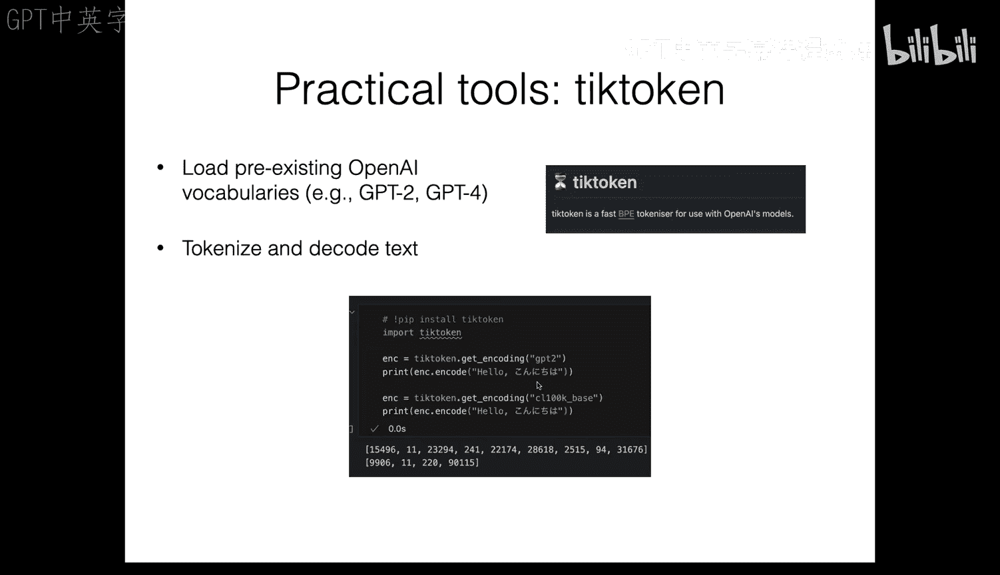

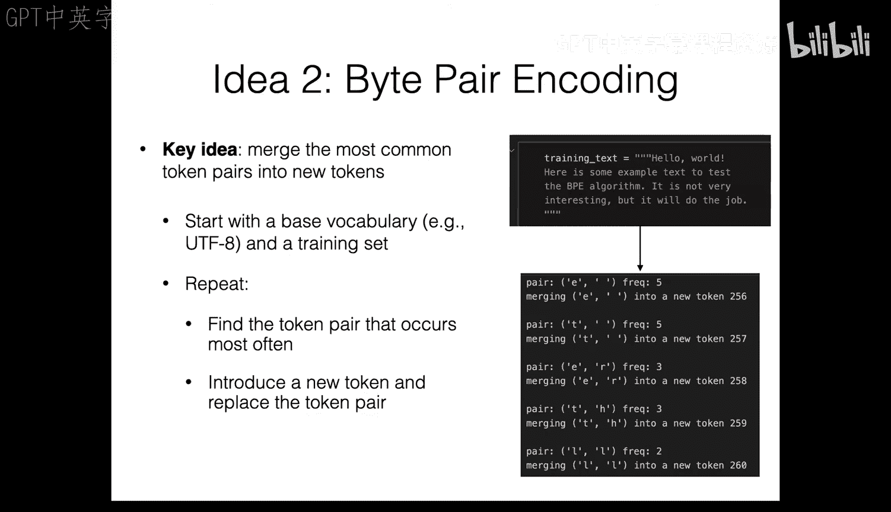

你可以访问 [tiktokenizer.vercel.app](https://tiktokenizer.vercel.app) 这个网站，查看不同语言模型（如 GPT-4、Code Llama）如何对文本进行分词。你会发现不同模型的分词方式（如对数字、日语、代码的处理）和生成的序列长度各不相同。

那么，在实践中如何实现分词呢？

第一步是选择初始词汇表。一个想法是使用 **UTF-8 编码**。Unicode 标准包含了约15万个字符，可以表达几乎所有文本。但直接使用 Unicode 字符作为词汇表，会导致词汇表巨大且序列很长。实际上，计算机使用 UTF-8 编码将 Unicode 字符存储为字节序列。UTF-8 可以用最多4个字节表示任何 Unicode 字符，因此我们只需要一个包含256种可能字节的最小词汇表。但这又会导致序列过长。

第二个关键思想是 **字节对编码**。这是许多先进系统使用的算法。其思路是：
1.  从一个基础词汇表（如256个字节）开始。
2.  准备一个训练集。
3.  迭代处理训练集，找到最常见的词元对。
4.  将最常见的词元对合并成一个新的词元，并添加到词汇表中。
5.  重复此过程，逐步合并词元。

例如，从训练集开始，第一次迭代发现“e”和空格最常见，于是创建新词元“e_”。替换文本后，继续寻找下一个最常见的词元对，如“t”和空格，依此类推，逐步构建子词词汇表。

以下是实践中可用的工具：
*   **Tiktoken**：由 OpenAI 编写，可以加载他们预训练的分词器。
*   **SentencePiece**：支持训练自己的 BPE 分词器。它通常以 Unicode 字符作为基础词汇表，并可以设置选项，当遇到未在合并词汇表中的 Unicode 字符时，回退到 UTF-8 字节。

需要注意的是，分词结果严重依赖于 BPE 训练数据。如果某些语言在训练数据中代表性不足，其词汇可能永远不会被合并，导致序列很长。因此，在实践中需要确保 BPE 训练数据的平衡性（例如，包含多种编程语言）。此外，分词结果有时具有任意性，研究人员会在训练时采用技术（如使用多种分词方式）来增强模型对不同分词的鲁棒性，有时也会手动定义规则（例如，规定数字总是按单个数字分词）。

---

## 连续词嵌入 🔢

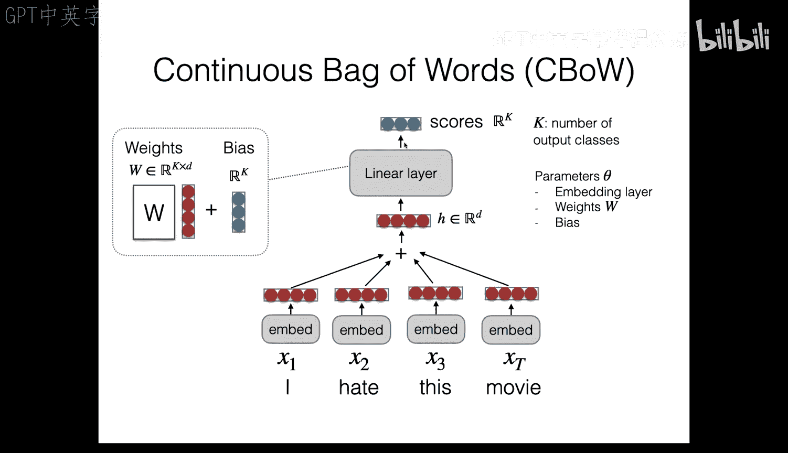

上一节我们介绍了如何将文本分割成词元。本节中，我们来看看如何为这些词元学习有意义的向量表示。

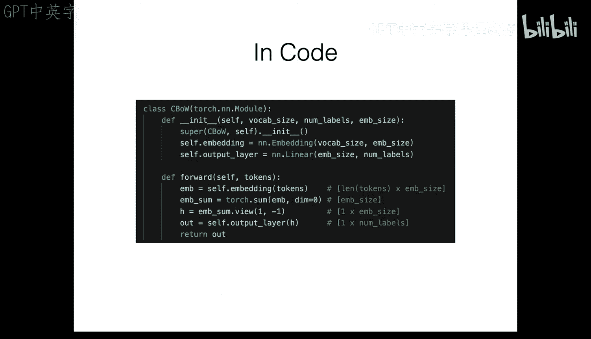

基本思想是，我们不再使用稀疏的独热向量来表示词元，而是使用**密集向量**或**连续嵌入**。对于词汇表中的每个词元，我们都有一个 D 维向量。这个过程通过一个**嵌入层**实现，该层本质上是一个矩阵，其中一维是词汇表大小，另一维是嵌入维度 D。查找操作就是选择对应词元的列向量。从概念上讲，这相当于用嵌入矩阵乘以一个独热向量。

基于此，我们可以构建一个**连续词袋模型**作为词袋模型的升级版：
1.  将句子中的每个词元通过嵌入层转换为向量。
2.  将这些向量求和，得到一个隐藏向量 **h**（维度为 D）。
3.  为了进行分类，我们将 **h** 通过一个**线性层**（即乘以一个权重矩阵并加上偏置项），得到每个类别的分数。

这个架构中需要学习的参数包括：嵌入层的向量、线性层的权重矩阵和偏置项。

在代码中，我们可以这样实现：定义嵌入层和线性输出层，然后执行以下步骤：嵌入词元、求和（或平均）、通过输出层。

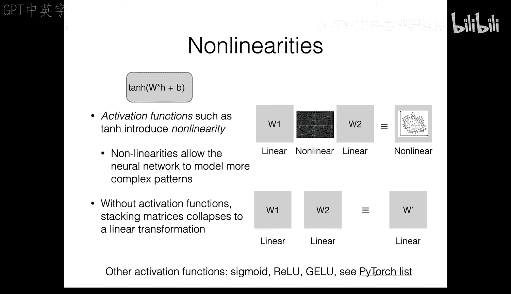

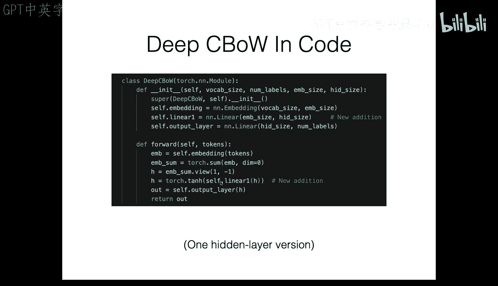

使用连续向量的好处是，我们可以在向量空间中定义相似性。如果两个词在某种意义上是相似的，那么它们的向量表示在空间中也应该接近。此外，向量的每个维度可以被解释为某种特征，由学习算法自动发现对任务有用的表示。在实践中，嵌入维度可能设置为512或1024，需要使用降维技术（如 t-SNE）将其可视化到二维平面。

---

## 神经网络模型 🧬

上一节我们介绍了连续词嵌入，但简单的求和操作仍然难以捕捉复杂的组合特征（如“don‘t love”）。本节中，我们来看看如何通过神经网络架构来解决这个问题。

下一步的复杂化是**深度连续词袋模型**。我们从词袋模型（求和）开始，然后添加多个神经网络层，最后通过一个线性层将隐藏维度映射到类别数量。

关键区别在于，我们引入了**激活函数**（如 tanh、ReLU）。在此之前的所有操作（矩阵乘法、加偏置）都是线性的。引入非线性激活函数极大地增加了网络的**表达能力**，使其能够建模更复杂的函数模式。一旦引入非线性，并通过堆叠这些非线性变换层，整个网络就能学习非常复杂的特征组合。

如果没有非线性，仅仅堆叠两个线性层等价于另一个单一的线性层（因为矩阵乘法是线性的）。因此，非线性激活是深度架构的核心。

在代码中实现时，只需在连续词袋模型的基础上添加额外的线性层和激活函数。

现在，这个网络可以学习特征组合。例如，第二层的某个神经元可以接收来自第一层隐藏向量不同维度的输入，这些维度可能分别代表“否定”和“积极/消极情感”等特征。第二层能够将这些特征进行非线性组合和变换。

---

## 训练与损失函数 📉

我们已经了解了模型架构，本节中我们来看看如何训练这些神经网络模型。训练通常使用**梯度下降**，包含三个步骤：
1.  定义**损失函数**。
2.  计算损失函数关于模型参数的**梯度**。
3.  沿着减少损失的方向**更新参数**。

我们将介绍两种在实践中非常流行的损失函数。

第一种是**二元交叉熵损失**，用于二分类任务（如情感分类为正面/负面）。模型输出一个标量，我们通过 **sigmoid** 函数将其转换为属于正类的概率 **p**（介于0和1之间）。给定真实标签 **y**（0或1），二元交叉熵损失公式为：
`L = -[y * log(p) + (1 - y) * log(1 - p)]`
其直观意义是：当模型对正确类别的预测概率很低时，施加高惩罚；预测概率很高时，惩罚趋近于零。

第二种是**交叉熵损失**，用于多分类任务。模型输出一个分数向量（称为 **logits**），通过 **softmax** 函数转换为概率分布。对于真实类别 **y**（通常表示为独热向量），交叉熵损失是正确类别预测概率的负对数：
`L = -log(p_y)`
这等价于最小化模型预测分布与真实分布（独热向量）之间的 **KL 散度**。通过最小化交叉熵，我们试图使这两个分布相互接近。

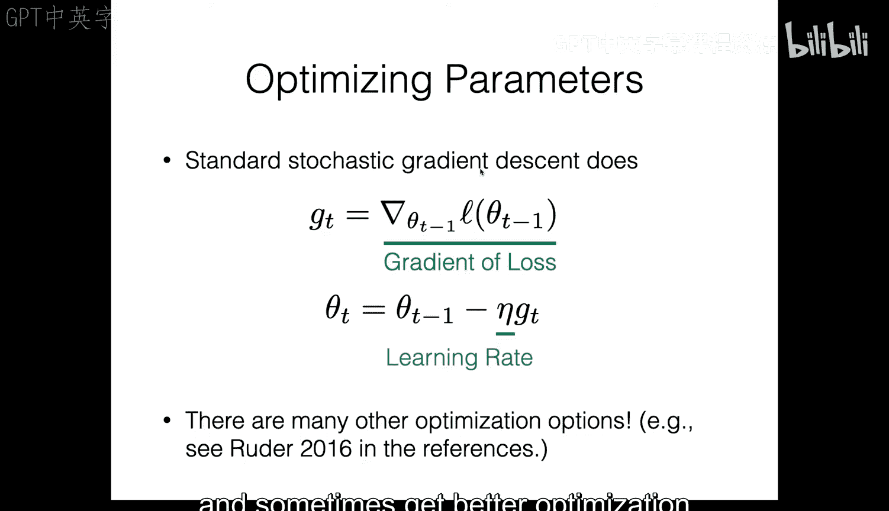

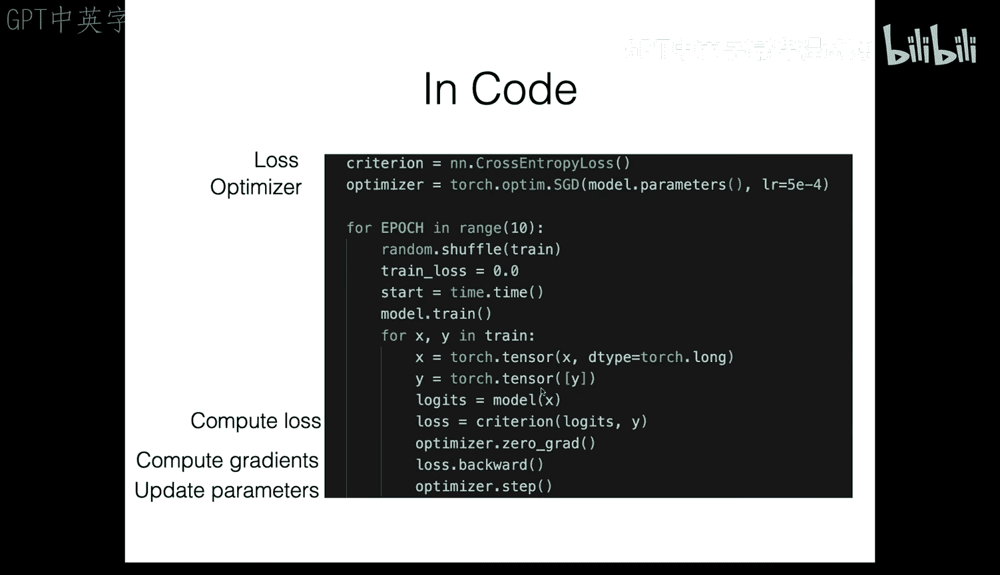

在代码中，这些损失函数在 PyTorch 等库中已有高效实现。

---

## 梯度计算与自动微分 ⚙️

定义了损失函数后，我们需要计算其关于参数的梯度。虽然可以手动推导（例如对简单模型使用链式法则），但这非常繁琐。现代深度学习框架的核心功能是**自动微分**。

关键思想是将计算表示为**计算图**。图中的节点是张量（数据）或操作（函数），边表示函数的输入。每个操作节点都知道如何执行**前向传播**（计算函数值）和**反向传播**（计算函数关于其输入的局部梯度）。

在反向传播过程中，我们利用**链式法则**，从最终损失开始，沿着图反向传播梯度。每个节点接收来自上游的梯度，将其与自己的局部梯度相乘，然后将结果传递给下游节点。这样，我们可以高效地计算出损失关于图中任何参数的梯度。

自动微分使得研究人员能够轻松尝试不同的神经架构，而无需手动推导梯度，极大地推动了深度学习的发展。

如今，主要的深度学习框架有：
*   **PyTorch**：由 Meta 开发，采用**动态计算图**（命令式编程），在 NLP 领域应用广泛，易于调试。
*   **TensorFlow/JAX**：由 Google 开发。TensorFlow 早期采用**静态计算图**。JAX 采用**函数式编程**范式，更易于并行化和计算高阶导数，在科学计算和大规模模型训练中常见。

---

## 总结 🎯

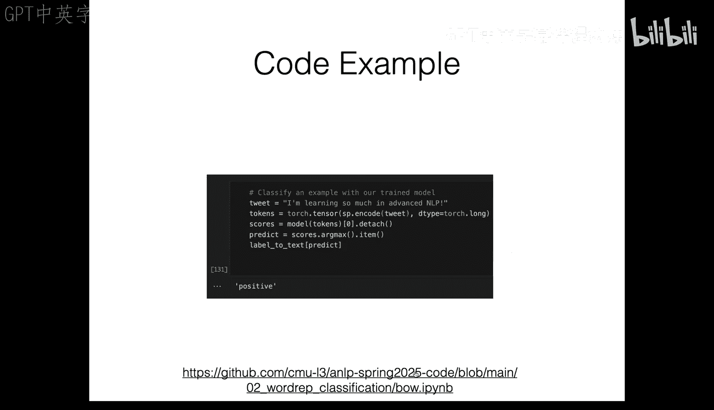

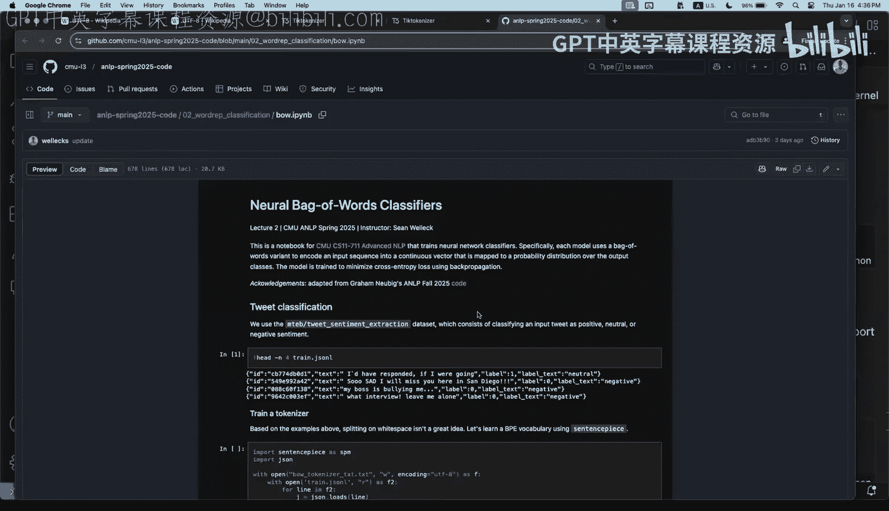

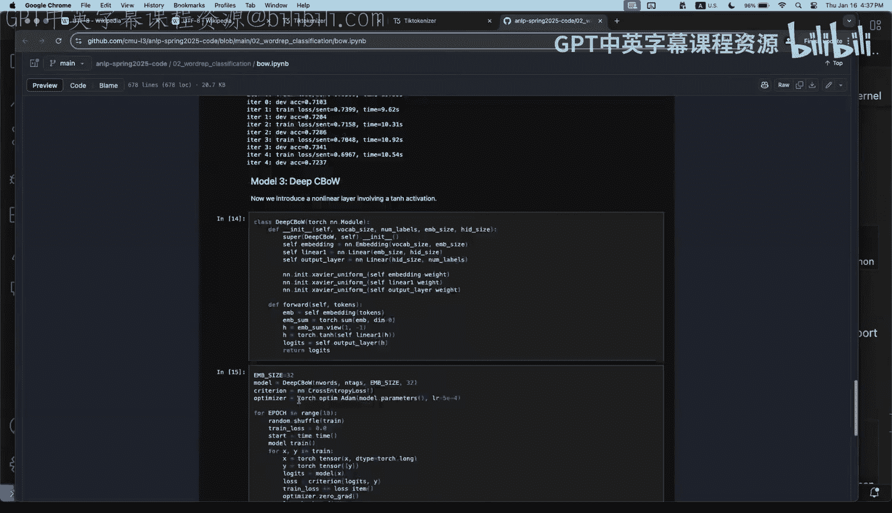

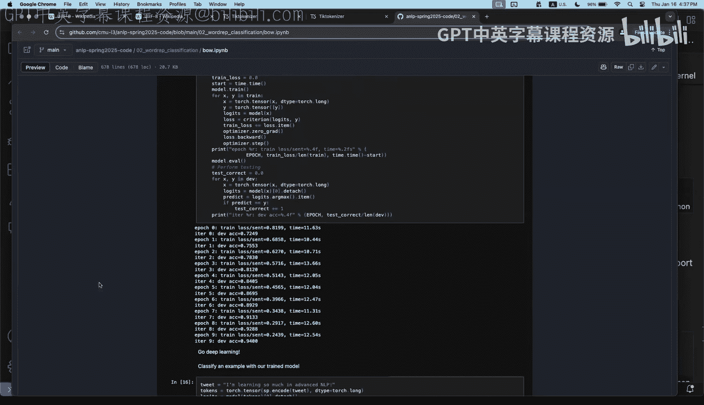

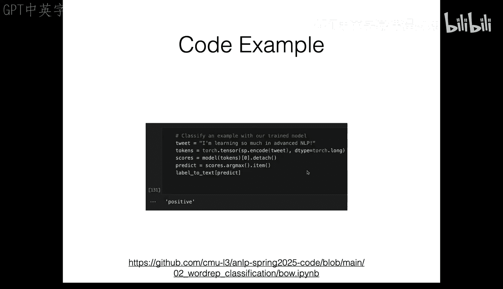

本节课我们一起学习了神经文本表示与分类的基础知识。我们回顾了词袋模型的局限性，并介绍了三种改进技术：子词模型（通过 BPE 分词解决词形变化问题）、连续词嵌入（学习词的有意义向量表示）以及神经网络模型（通过非线性激活捕捉复杂特征组合）。我们还深入探讨了训练神经网络的核心组件：二元交叉熵和交叉熵损失函数，以及通过计算图和自动微分进行梯度计算的原理。最后，我们简要介绍了主流的深度学习框架。这些概念为后续学习语言建模等更高级的主题奠定了基础。